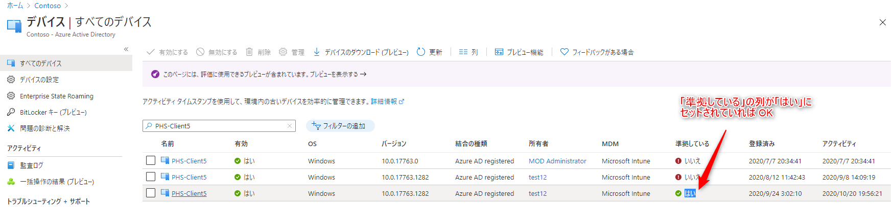
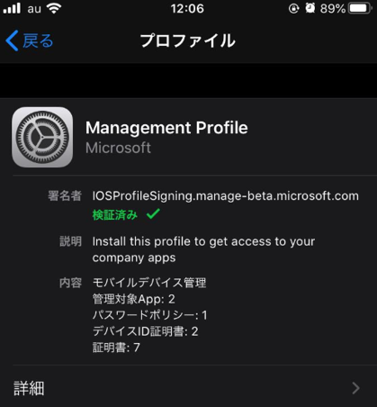
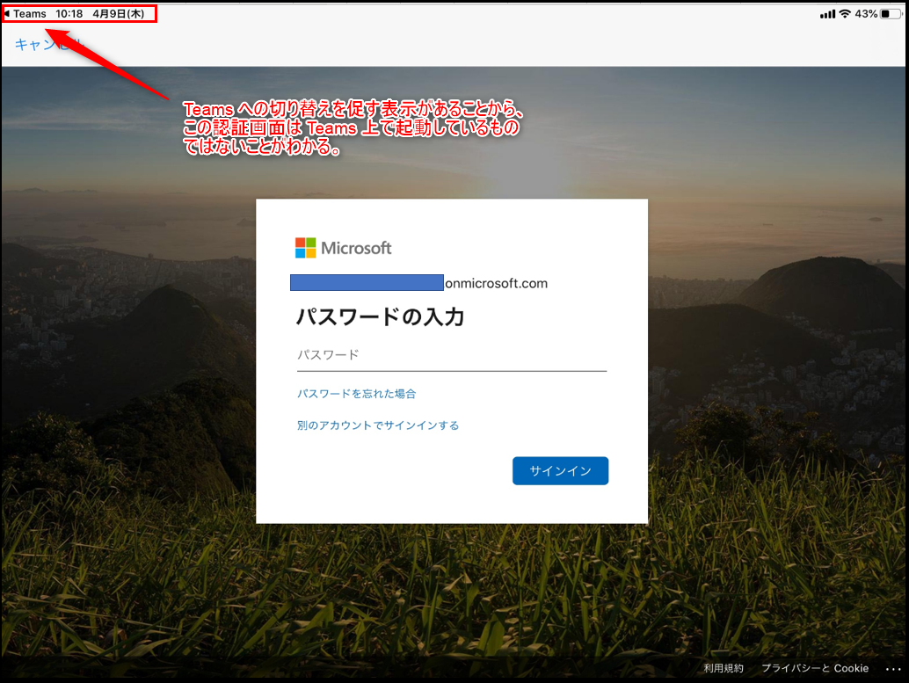
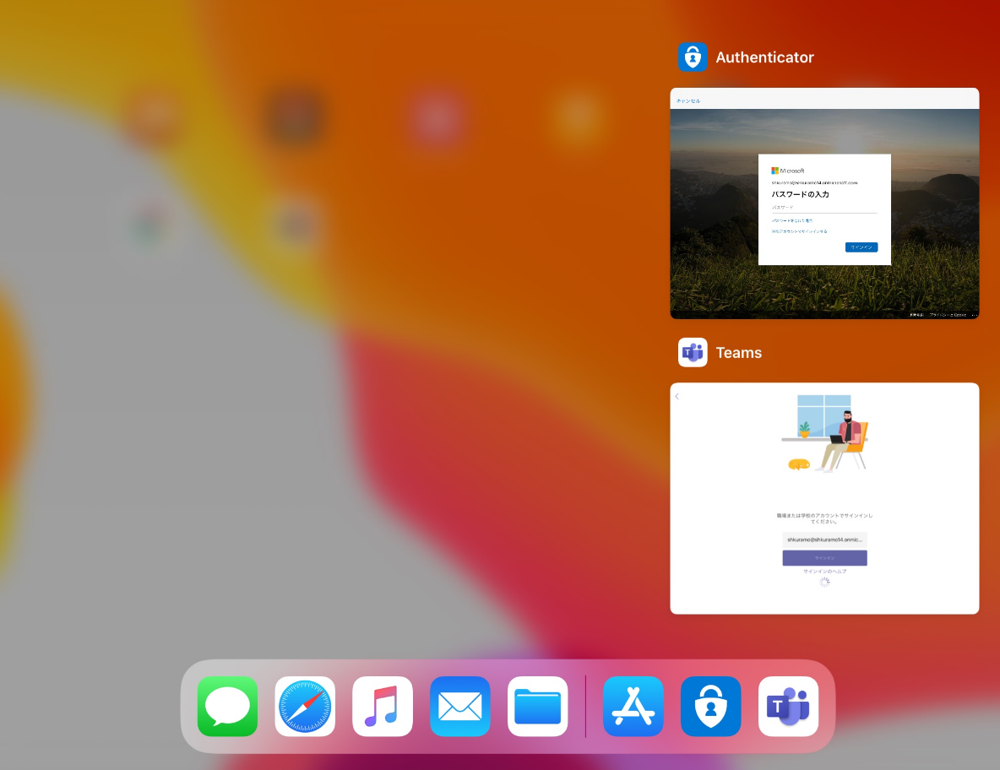

# 条件付きアクセスで 「準拠済み」 でブロックされる場合の対処法 (iOS / Android 編)

こんにちは。Azure & Identity サポート チームの関口です。

今回は、ご利用の端末が 「準拠済み」にもかかわらず、条件付きアクセスの「準拠済み」の設定でブロックされてしまった場合の原因と対処方法をご紹介します。

<エラー コード例>
>"errorCode": 53000, "failureReason": "Device is not in required device state: {state}. Conditional Access policy requires a compliant device, and the device is not compliant. The user must enroll their device with an approved MDM provider like Intune.", "additionalDetails": "Your administrator might have configured a conditional access policy that allows access to your organization's resources only from compliant devices. To be compliant, your device must be either joined to your on-premises Active Directory or joined to your Azure Active Directory.            More details available at https://docs.microsoft.com/azure/active-directory/active-directory-conditional-access-device-remediation"

>"errorCode": 530003, "failureReason": "Your device is required to be managed to access this resource."
"additionalDetails": "The requested resource can only be accessed using a compliant device. The user is either using a device not managed by a Mobile-Device-Management (MDM) agent like Intune, or it's using an application that doesn't support device authentication. The user could enroll their devices with an approved MDM provider, or use a different app to sign in, or find the app vendor and ask them to update their app. More details available at https://docs.microsoft.com/azure/active-directory/active-directory-conditional-access-device-remediation"

 

## <なぜブロックされるのか？>

条件付きアクセスの「準拠済み」の設定は、デバイス ベースのアクセス制御となるため、”どの端末からのアクセスか？” を Azure AD が判断する必要があります。この判断のために、ご利用のデバイスは Azure AD に対して ”デバイス情報” を提示する必要があります。

ご利用の端末がデバイス情報を Azure AD に提示できない場合、Azure AD は ”どの端末からのアクセスか？” を判断することができません。つまり「準拠済み」であるかも判断することができず、ブロックされてしまいます。

ブロックされたアクセスをサインイン ログで確認すると、以下のようにデバイス ID の情報が表示されていないことがわかります。

 

ご利用の端末の状況に応じて、以下の二つの観点で確認を行うのがスムーズです。

**”デバイス情報を提示できているかどうか”**

**”デバイス情報を提示できていない場合は、なぜ提示できていないのか”**

 

## <対処方法>

iOS / Android でデバイス情報が提示できない原因としては、以下が挙げられます。

それぞれの項目ごとに解説します。

| No.                      | 確認ポイント                                                                                                                                      |
| ------------------------- | ----------------------------------------------------------------------------------------------------------------------------------------- |
| A                       | 準拠済み？                                                                                                         |
| B                       | サポートされたブラウザーを使用している？                                                                                                                 |
| C                       | Edge Chromium を使用している場合、ブラウザーにサインインできている？                                                                               |
| D                        | 旧 Edge を利用している場合                                                         |
| E                      | 証明書を提示できていない |
| F | Microsoft Authenticator をインストールしていない                                               |
| G       | アプリの実装によりデバイス情報を提示できないこともある  
| H       | その他                             |

 
 
 

## A. 準拠済み？

利用している端末が準拠済みとなっているかを確認します。
Azure Portal のデバイス一覧で、対象の端末の「準拠している」の列が「はい」にセットされていれば OK です。

対象の端末が準拠していない場合は、Microsoft Endpoint Manager (Intune) の観点で、なぜ準拠済みとならないのかを調査する必要があります。

 
 

## B. サポートされたブラウザーを使用している？

以下の表は OS に対応したサポート ブラウザーの一覧です。(情報がアップデートされる可能性があるため、正確な情報は公開情報をご確認ください)

OS によってサポートされるブラウザーは異なるため、ご利用の端末の OS でサポートされているブラウザーを利用されているかご確認をお願いします。

[サポートされているブラウザー - Azure Active Directory | Microsoft Docs]((https://docs.microsoft.com/ja-jp/azure/active-directory/conditional-access/concept-conditional-access-conditions#supported-browsers))

 
 

## C. Edge Chromium を使用している場合、ブラウザーにサインインしている？

Microsoft Edge Chromium を利用してデバイス情報を提示するためには、ブラウザーにサインインしている必要があります。

[Microsoft Edge と条件付きアクセス - Azure Active Directory | Microsoft Docs]((https://docs.microsoft.com/ja-jp/deployedge/ms-edge-security-conditional-access))

>エンタープライズ Azure AD 資格情報を使用して Microsoft Edge プロファイルにサインインすると、条件付きアクセスを使用して保護されたエンタープライズ クラウド リソースへのシームレスなアクセスが、Microsoft Edge によって許可されます。

なお、旧 Edge (Microsoft Edge HTML) の場合は、プロファイルにサインインを行う機能はありません。あくまで Microsoft Edge Chromium をご利用の場合の確認となります。

 
 

## D. 旧 Edge を利用している場合

旧 Edge (Microsoft Edge HTML) を使用している場合、デバイス情報を Azure AD に適切に提示できない場合があることを確認しています。残念ながら、Microsoft Edge HTML は既に開発が終了しており、2021 年 3 月 9 日 にサポートが終了することが予定されているため、Microsoft Edge Chromium を利用いただくことを推奨しています。

 
 

## E. 証明書を提示できていない

iOS / Android がデバイス情報を提示する仕組みは、ブラウザー アクセスの場合と、クライアント アプリの場合で異なります。

ブラウザー アクセスの場合は、iOS も Android も Azure AD に証明書を提示することでデバイス情報を渡します。

 

Android の場合、以下のように端末内に保持している証明書一覧が表示されて、どの証明書を使用するのか促されます。(既に使用する証明書が決まっていると判断されれば促されない場合もあります)

ここで適切な証明書を選択すれば、証明書の中に保存されているデバイス情報を提示し、Azure AD でデバイス ベースの条件付きアクセスの制御が可能となります。

なお、ここで使用する証明書 (上記画面の証明書) は、Microsoft Endpoint Manager (Intune) ポータル サイトからインストール可能です。以下の公開情報をご参照の上、記載された画面と同様のメッセージが表示されている状況であれば、本公開情報の「ブラウザー アクセスを有効にする」手順をお試しください。

[不足している必要な証明書をインストールする | Microsoft Docs]((https://docs.microsoft.com/ja-jp/mem/intune/user-help/your-device-is-missing-an-it-required-certificate-android))

 

iOS の場合、Intune によるプロファイル設定が行われる際に証明書もあわせてインストールされるはずです。

iOS の [プロファイルとデバイス管理] から、Intune 用のプロファイルが既に設定されているかご確認ください。

iOS / Android を使用したブラウザー アクセスは、上記のように証明書を使用したデバイス情報の提示が可能となります。

一方で、モバイル アプリ (クライアント アプリ) の場合は、Microsoft Authenticator を使用して PRT を Azure AD に提示する必要があります。詳細は 「F. Microsoft Authenticator をインストールしていない」で説明します。

 
 

## F. Microsoft Authenticator をインストールしていない

iOS / Android を使用してモバイル アプリ (ネイティブ アプリ) にアクセスする際は、基本的に Microsoft Authenticator を使用して PRT を Azure AD に提示する必要があります。アプリの実装によっては、ブラウザーを経由してデバイス情報を提示する場合もあるため、その場合は Microsoft Authenticator  を用いずにデバイス情報を提示可能です。

以下は iPad を使用した動作サンプルとなりますが、こちらを見ていただくと Microsoft Authenticator を使用してデバイス情報を提示するシナリオのイメージが湧くかと思います。

Microsoft Teams のモバイル アプリにサインインするために資格情報を入力すると、パスワード入力画面に遷移しています。画面左上に Teams の表示がありますが、これは Microsoft Teams が呼び出した画面ではないことがわかります。なぜなら、このパスワード入力画面が Microsoft Teams が呼び出した画面であれば、画面左側に Teams への切り替えを促す表示は出ないからです。

実際に、起動アプリを確認すると Microsoft Authenticator がパスワード入力画面を呼び出していることが確認できます。

このことから、Microsoft Teams から Microsoft Authenticator にリダイレクトされ、この動作でパスワード入力、および PRT を Azure AD に渡しているように思われます。

※ なお、Android の場合は、このような画面遷移が行われていることを明示的に確認できませんが、同様の動作が行われているとお考えください。

 
 

## G. アプリの実装によりデバイス情報を提示できないこともある

3rd Party 製のアプリケーションの場合、デバイス情報を直接 Azure AD に提示できるような実装か、Microsoft Authenticator 経由で提示できるように実装されている必要があります。3rd Party 製のアプリケーションでこのような実装が行われているかどうかは、アプリケーション ベンダーに直接ご確認いただく必要があります。

基本的に、Microsoft 製のアプリケーションは Microsoft Authenticator を使用してデバイス情報を提示するとお考え下さい。(Outlook などは Microsoft Authenticator を使用しなくてもデバイス情報を提示できるシナリオがあることを確認していますが、基本的には Microsoft Authenticator が使用されるとお考えください)

なお、モバイル デバイスに Microsoft Authenticator をインストールするだけでは不十分で、アプリケーション側が Microsoft Authenticator を使用するように実装がされている必要があります。上記の動作については、以下のアプリケーション開発者用の公開情報に記載がありますのでご参照ください。

[ブローカーを使用するようにアプリケーションを構成する - Azure Active Directory | Microsoft Docs]((https://docs.microsoft.com/ja-jp/azure/active-directory/develop/scenario-mobile-app-configuration#configure-the-application-to-use-the-broker))

こちらは iOS / Android 端末を利用時の場合の説明となりますが、Windows 端末を使用する場合も類似の動作があります。Windows 10 端末上のデスクトップ アプリ (ネイティブ アプリ) を使用してアプリケーションにアクセスする場合、Microsoft Authenticator ではなく、Web Account Manager (WAM) と呼ばれる Windows 10 に既定で実装されているトークン ブローカーを使用して PRT を Azure AD に提示します。

Microsoft のアプリケーションは基本的に WAM に対応しているため問題ありませんが、3rd Party 製のアプリケーションは WAM に対応した実装となっていないことが考えられ、PRT を提示できないことが想定されます。こちらも正確な実装はアプリケーション ベンダーに確認いただく必要がありますが、このような動作処理が行われるために、Azure AD 側でデバイスを判断できない結果になることがあります。

 
 

## H. その他

その他サポート チームで確認できている事象や仕様についてです。

・ 3rd Party 製品によってデバイス情報が提示できない

クライアント端末から Azure AD にデバイス情報を提示する経路上に、プロキシなど一部 3rd Party 製品の動作 (仕様) によって、デバイス情報が提示できない場合があることを確認しております。
もし切り分けの結果、ご利用の 3rd Party 製品を経由する場合のみ事象が発生するということであれば、該当のベンダーに確認のお問い合わせをいただければと思います。

 
 

## 関連ブログ

[Japan Azure Identity Support Blog: 条件付きアクセスで 「準拠済み」 や 「Hybrid Azure AD 参加が必要」 でブロックされる場合の対処法 (Windows 編)]((../azure-active-directory/conditional-access-compliant-windows.md))

上記内容が少しでも参考となれば幸いです。製品動作に関する正式な見解や回答については、お客様環境などを十分に把握したうえでサポート部門より提供させていただきますので、ぜひサポートサービスまでお問い合わせください。
