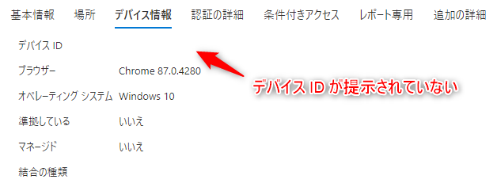

# 条件付きアクセスで 「準拠済み」 や 「Hybrid Azure AD 参加が必要」 でブロックされる場合の対処法 (Windows 編)

こんにちは。Azure & Identity サポート チームの関口です。

今回は、ご利用の端末が 「準拠済み」もしくは「Hybrid Azure AD 参加を構成済み」にもかかわらず、条件付きアクセスの「準拠済み」や「Hybrid Azure AD 参加が必要」の設定でブロックされてしまった場合の原因と対処方法をご紹介します。

<エラー コード例>
>"errorCode": 53000, "failureReason": "Device is not in required device state: {state}. Conditional Access policy requires a compliant device, and the device is not compliant. The user must enroll their device with an approved MDM provider like Intune.", "additionalDetails": "Your administrator might have configured a conditional access policy that allows access to your organization's resources only from compliant devices. To be compliant, your device must be either joined to your on-premises Active Directory or joined to your Azure Active Directory.            More details available at https://docs.microsoft.com/azure/active-directory/active-directory-conditional-access-device-remediation

>"errorCode": 530003, "failureReason": "Your device is required to be managed to access this resource."
"additionalDetails": "The requested resource can only be accessed using a compliant device. The user is either using a device not managed by a Mobile-Device-Management (MDM) agent like Intune, or it's using an application that doesn't support device authentication. The user could enroll their devices with an approved MDM provider, or use a different app to sign in, or find the app vendor and ask them to update their app. More details available at https://docs.microsoft.com/azure/active-directory/active-directory-conditional-access-device-remediation

 

## <なぜブロックされるのか？>

条件付きアクセスの「準拠済み」と「Hybrid Azure AD 参加が必要」の設定は、デバイス ベースのアクセス制御となるため、”どの端末からのアクセスか？” を Azure AD が判断する必要があります。この判断のために、ご利用のデバイスは Azure AD に対して ”デバイス情報” を提示する必要があります。

ご利用の端末がデバイス情報を Azure AD に提示できない場合、Azure AD は ”どの端末からのアクセスか？” を判断することができません。つまり「準拠済み」であるかも「Hybrid Azure AD 参加を構成済み」であるかも判断することができず、ブロックされてしまいます。
ブロックされたアクセスをサインイン ログで確認すると、以下のようにデバイス ID の情報が表示されていないことがわかります。

 

ご利用の端末の状況に応じて、以下の二つの観点で確認を行うのがスムーズです。

**”デバイス情報を提示できているかどうか”**
**”デバイス情報を提示できていない場合は、なぜ提示できていないのか”**

 

## <対処方法>

Windows でデバイス情報が提示できない原因としては、以下が挙げられます。
それぞれの項目ごとに解説します。

| No.                      | 確認ポイント                                                                                                                                      |
| ------------------------- | ----------------------------------------------------------------------------------------------------------------------------------------- |
| A                       | Hybrid Azure AD 参加が構成済み？                                                                                                         |
| B                       | 準拠済み？                                                                                                                 |
| C                       | PRT 取得済み？                                                                               |
| D                        | サポートされたブラウザーを使用している？                                                         |
| E                      | Chrome を使用している場合、Windows 10 Accounts 拡張機能をインストールしている？ |
| F | Edge Chromium を使用している場合、ブラウザーにサインインできている？                                               |
| G       | 旧 Edge を利用している場合  
| H       | アプリの実装によりデバイス情報を提示できないこともある 
| I       | その他                             |

 

## A. Hybrid Azure AD 参加が構成済み？

利用している端末が Hybrid Azure AD 参加構成済みとなっているかを確認します。
Azure Portal のデバイス一覧で、対象の端末の「登録済み」の列に登録日時がセットされていれば OK です。

構成が完了していない場合は、「登録済み」の列に「保留中」と表示がされることになります。この場合は、まずは Hybrid Azure AD 参加の構成を完了させることから始めてください。
(ここでは、Hybrid Azure AD 参加の構成方法は割愛します)

 

## B. 準拠済み？

利用している端末が準拠済みとなっているかを確認します。
Azure Portal のデバイス一覧で、対象の端末の「準拠している」の列が「はい」にセットされていれば OK です。

対象の端末が準拠していない場合は、Microsoft Endpoint Manager (Intune) の観点で、なぜ準拠済みとならないのかを調査する必要があります。

 

## C. PRT 取得済み？

[A. Hybrid Azure AD 参加が構成済み？] で Hybrid Azure AD 参加が構成済み、もしくは [B. 準拠済み？] で 準拠済み となっていても、Primary Refresh Token (PRT) を取得できていないと Azure AD にデバイス情報を提示することができません。

PRT の中にはデバイス情報が含まれており、Azure AD 側が、どの端末からのアクセスなのかを判断するために使用されます。そのため、ご利用の端末で正常に PRT を取得できているか確認してください。
以下のコマンドの実行結果で [AzureAdPrt : NO] となっている場合は、PRT が取得できていないことになります。

dsregcmd /status

    +------- SSO State -------+
                AzureAdPrt : NO
       AzureAdPrtAuthority : NO
             EnterprisePrt : NO
    EnterprisePrtAuthority : NO

この場合は、なぜ PRT が取得できていないのか？という観点で調査を行う必要があります。
PRT が取得できない場合の対処方法としては、以下の記事をご参考ください。また、サポートによる支援も可能ですので、ご希望の場合はお問い合わせください。

[Hybrid Azure AD Join 失敗時の初動調査方法について (マネージド編) | Japan Azure Identity Support Blog]((../azure-active-directory/troubleshoot-hybrid-azure-ad-join-managed.md))
[Hybrid Azure AD Join 失敗の初動調査方法について (フェデレーション編) | Japan Azure Identity Support Blog]((../azure-active-directory/troubleshoot-hybrid-azure-ad-join-federated.md))

 

## D. サポートされたブラウザーを使用している？

OS によってサポートされるブラウザーは異なるため、以下の公開情報を元にご利用のブラウザーがサポートされているかご確認をお願いします。

[サポートされているブラウザー - Azure Active Directory | Microsoft Docs](https://docs.microsoft.com/ja-jp/azure/active-directory/conditional-access/concept-conditional-access-conditions#supported-browsers)

 

## E. Chrome を使用している場合、Windows 10 Accounts 拡張機能をインストールしている？

Windows 10 バージョン 1703 以降で Chrome を利用してデバイス情報を提示するためには、Windows 10 Accounts 拡張機能をインストールする必要があります。Chrome をご利用の場合は、以下の公開情報の案内に沿ってインストールが可能です。

[Chrome のサポート - Azure Active Directory | Microsoft Docs](https://docs.microsoft.com/ja-jp/azure/active-directory/conditional-access/concept-conditional-access-conditions#chrome-support)

>Windows 10 Creators Update (バージョン 1703) 以降で Chrome をサポートするには、Windows 10 Accounts 拡張機能をインストールしてください。 条件付きアクセス ポリシーでデバイス固有の詳細が必要な場合は、この拡張機能が必要です。

 

## F. Edge Chromium を使用している場合、ブラウザーにサインインしている？

Microsoft Edge Chromium を利用してデバイス情報を提示するためには、ブラウザーにサインインしている必要があります。

[Microsoft Edge と条件付きアクセス - Azure Active Directory | Microsoft Docs](https://docs.microsoft.com/ja-jp/deployedge/ms-edge-security-conditional-access)

>エンタープライズ Azure AD 資格情報を使用して Microsoft Edge プロファイルにサインインすると、条件付きアクセスを使用して保護されたエンタープライズ クラウド リソースへのシームレスなアクセスが、Microsoft Edge によって許可されます。

なお、旧 Edge (Microsoft Edge HTML) の場合は、プロファイルにサインインを行う機能はありません。あくまで Microsoft Edge Chromium をご利用の場合の確認となります。

 

## G. 旧 Edge を利用している場合

旧 Edge (Microsoft Edge HTML) を使用している場合、デバイス情報を Azure AD に適切に提示できない場合があることを確認しています。残念ながら、Microsoft Edge HTML は既に開発が終了しており、2021 年 3 月 9 日 にサポートが終了することが予定されているため、Microsoft Edge Chromium を利用いただくことを推奨しています。

 

## H. アプリの実装によりデバイス情報を提示できないこともある

3rd Party 製のアプリケーションの場合、デバイス情報を直接 Azure AD に提示できるような実装か、Microsoft Authenticator 経由で提示できるように実装されている必要があります。3rd Party 製のアプリケーションでこのような実装が行われているかどうかは、アプリケーション ベンダーに直接ご確認いただく必要があります。

基本的に、Microsoft 製のアプリケーションは Microsoft Authenticator を使用してデバイス情報を提示するとお考え下さい。(Outlook などは Microsoft Authenticator を使用しなくてもデバイス情報を提示できるシナリオがあることを確認していますが、基本的には Microsoft Authenticator が使用されるとお考えください)

なお、モバイル デバイスに Microsoft Authenticator をインストールするだけでは不十分で、アプリケーション側が Microsoft Authenticator を使用するように実装がされている必要があります。上記の動作については、以下のアプリケーション開発者用の公開情報に記載がありますのでご参照ください。

[ブローカーを使用するようにアプリケーションを構成する - Azure Active Directory | Microsoft Docs](https://docs.microsoft.com/ja-jp/azure/active-directory/develop/scenario-mobile-app-configuration#configure-the-application-to-use-the-broker)

こちらは iOS / Android 端末を利用時の場合の説明となりますが、Windows 端末を使用する場合も類似の動作があります。Windows 10 端末上のデスクトップ アプリ (ネイティブ アプリ) を使用してアプリケーションにアクセスする場合、Microsoft Authenticator ではなく、Web Account Manager (WAM) と呼ばれる Windows 10 に既定で実装されているトークン ブローカーを使用して PRT を Azure AD に提示します。

Microsoft のアプリケーションは基本的に WAM に対応しているため問題ありませんが、3rd Party 製のアプリケーションは WAM に対応した実装となっていないことが考えられ、PRT を提示できないことが想定されます。こちらも正確な実装はアプリケーション ベンダーに確認いただく必要がありますが、このような動作処理が行われるために、Azure AD 側でデバイスを判断できない結果になることがあります。

 

## I. その他

その他サポート チームで確認できている事象や仕様についてです。

・ 3rd Party 製品によってデバイス情報が提示できない

クライアント端末から Azure AD にデバイス情報を提示する経路上に、プロキシなど一部 3rd Party 製品の動作 (仕様) によって、デバイス情報が提示できない場合があることを確認しております。
もし切り分けの結果、ご利用の 3rd Party 製品を経由する場合のみ事象が発生するということであれば、該当のベンダーに確認のお問い合わせをいただければと思います。

 

## 関連ブログ

[Japan Azure Identity Support Blog: 条件付きアクセスで「準拠済み」でブロックされる場合の対処法 (iOS / Android 編)](https://jpazureid.github.io/blog/azure-active-directory/conditional-access-compliant-ios-android)

上記内容が少しでも参考となれば幸いです。製品動作に関する正式な見解や回答については、お客様環境などを十分に把握したうえでサポート部門より提供させていただきますので、ぜひサポートサービスまでお問い合わせください。
