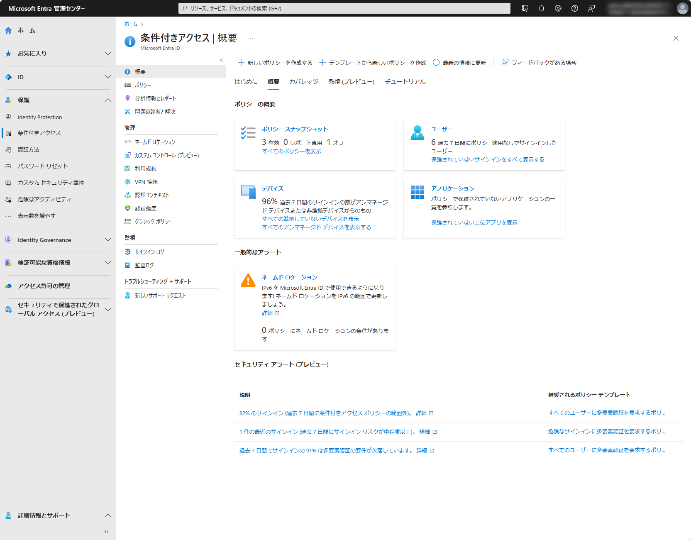
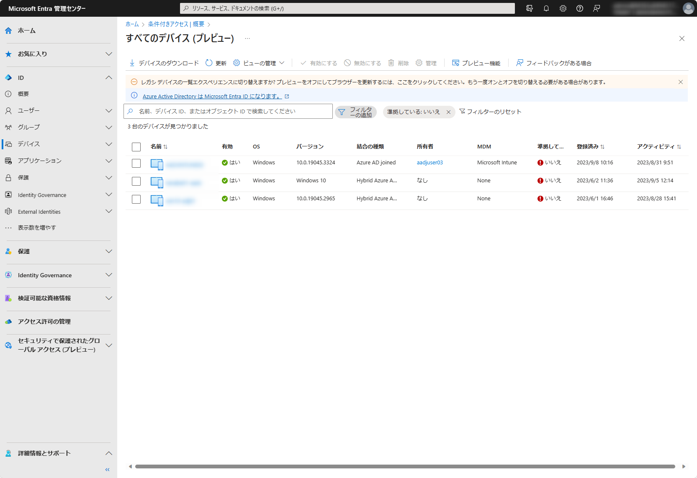
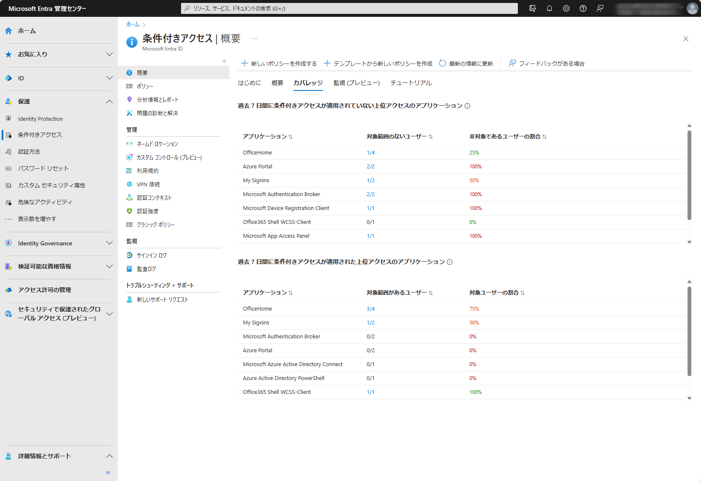
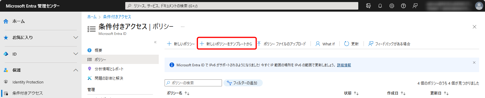

# 条件付きアクセスの概要とテンプレートが一般提供 (GA) されました

こんにちは、Azure Identity  サポート チームの 田辺 です。

本記事は、2023 年 9 月 6 日に米国の Microsoft Entra (Azure AD) Blog で公開された [Conditional Access Overview and Templates are now Generally Available! - Microsoft Community Hub](https://techcommunity.microsoft.com/t5/microsoft-entra-azure-ad-blog/conditional-access-overview-and-templates-are-now-generally/ba-p/3888722) を意訳したものになります。ご不明点等ございましたらサポート チームまでお問い合わせください。

---

本日、[**条件付きアクセスの概要ダッシュボード**](https://learn.microsoft.com/ja-jp/azure/active-directory/conditional-access/overview) と [**テンプレート**](https://learn.microsoft.com/ja-jp/azure/active-directory/conditional-access/concept-conditional-access-policy-common?tabs=secure-foundation) の一般提供を発表できることを嬉しく思います。 条件付きアクセスは世界中の何千もの組織を日々保護しており、ベスト プラクティスやセキュリティ カバレッジ (保護範囲) を改善する方法についてお客様からよくご質問をいただきます。条件付きアクセスの概要ダッシュボードとテンプレートは、Microsoft Entra ID をご利用のお客様が、組織のセキュリティ態勢に関する分析情報を取得し、個々のポリシーの影響を評価し、さらにはよりシンプルに Microsoft の推奨事項を導入する際に役立つ機能です。

Nitika Gupta  
Group Product Manager, Identity Security  
Microsoft Identity Division

---

**条件付きアクセスの [概要] ブレード** は、条件付きアクセスの状態を包括的に表示するダッシュボードです。管理者向けに、ダッシュボードは組織のポリシーやポリシーのカバレッジの差分を明確にまとめ、テナント内のサインイン アクティビティに基づいた重要な分析情報を提供します。この機能により、ゼロ トラストの原則の適用を強化できる領域を迅速に特定し、最終的に保護の機能を向上させることができます。
 

このダッシュボードが条件付きアクセスの設定を開いた際に最初に表示されるページになりました。条件付きアクセスの設定の入り口として、概要ページでは、よく利用されるポリシーやベスト プラクティスとを含んだ条件付きアクセス テンプレートを使用して、新しいポリシーをすばやく作成できます。
 
ダッシュボードには、次の分析情報とレポート機能も用意されています。
 
- [ユーザー] タイルの下にある [保護されていないサインインをすべて表示する] のリンクを使用すると、条件付きアクセス ポリシーが適用されずにサインインしているユーザーをすばやく特定できます。
 

- [デバイス] タイルの下にある [すべての準拠していないデバイスを表示] リンクと [すべてのアンマネージド デバイスを表示する] リンクを選ぶと、デバイスの準拠状態を確認できます。
 
 

- [カバレッジ] タブを使用して、過去 7 日間に条件付きアクセス ポリシーが適用されていないアプリケーションのアクセス数上位 10 個を検出できます。さらに、[対象範囲のないユーザー] 列の数値をクリックすることで、そのアプリにて条件付きアクセスの対象範囲でなかったユーザーを特定できます。
 

テナントでのサインイン アクティビティに基づいて注意すべきセキュリティ情報を得ると共に、条件付きアクセス テンプレートを使用して推奨されるゼロ トラストな条件付きアクセス ポリシーを展開することで、その情報に対して迅速なアクションを実行できます。ここで、条件付きアクセス テンプレートの簡単なチュートリアルを見てみましょう。
 
条件付きアクセス テンプレートは、Microsoft の推奨事項に沿った新しいポリシーを展開する便利な方法であり、これには定義済みの条件とコントロールの組み合わせが含まれています。これを使うことで、企業資産を保護し、ハイブリッドな働き方をしている従業員の安全で最適なアクセスを促進するための最新のベストプラクティスがポリシーに反映されていることが保証されます。
 
条件付きアクセス テンプレートは、次の 5 つのシナリオに編成されています。
 
- 安全な基盤
- ゼロ トラスト
- リモート ワーク
- 管理者の保護
- 新しい脅威
 
組織は、特定のニーズに基づいて、16 種類の定義済み条件付きアクセス テンプレートからご要望のポリシーを選択できます。
以下にて、条件付きアクセス テンプレートの一例を見ていきましょう。

**"フィッシングに強い多要素認証を管理者に要求する"** 条件付きアクセス テンプレートを使用すると、特権ユーザーに対する侵害やフィッシング攻撃のリスクを軽減できます。この強力なテンプレートでは、 [条件付きアクセスの認証強度](https://jpazureid.github.io/blog/azure-active-directory/ca-authentication-strength-ga/) を使用して、特定のシナリオに適した認証方法の要件を選択できるため、組織はこれまでになく簡単に、グローバル管理者等の最も重要なユーザーに対し、より安全で強力な認証方法を利用させることができます。

条件付きアクセスの概要ダッシュボードの詳細については、こちらを参照ください: <https://aka.ms/CAOverviewDashboard>
 
条件付きアクセス テンプレートの詳細については、こちらを参照ください: <https://aka.ms/ConditionalAccessTemplateDocs>

## お客様の声をお聞かせください

機能をお試しいただき、フィードバックや質問がありましたら <https://aka.ms/AzureADFeedback> に投稿ください。

Krishna Venkit  
Product Manager  
Microsoft Identity Division

Lisa Huang-North ([@lisaychuang](https://techcommunity.microsoft.com/t5/user/viewprofilepage/user-id/1747198)),  
Senior Product Manager  
Microsoft Identity Division
