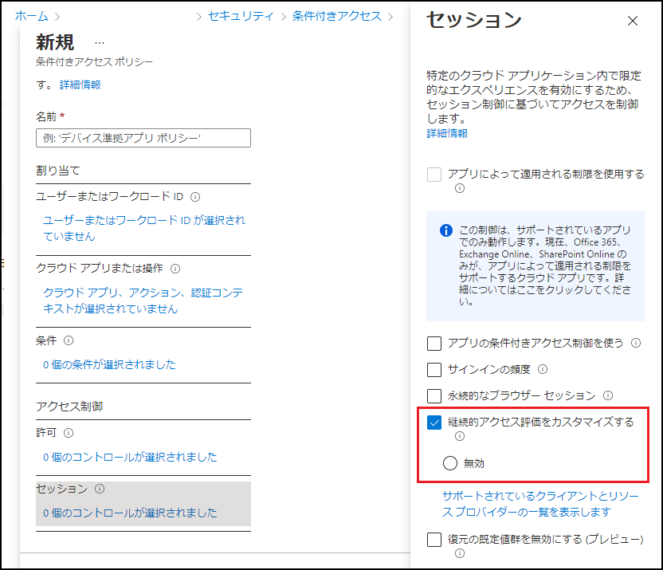

---
title: Azure AD における継続的なアクセス評価の一般提供を開始しました
date: 2022-01-24 09:00
tags:
  - Azure AD
  - US Identity Blog
---

# Azure AD における継続的なアクセス評価の一般提供を開始しました

こんにちは、Azure Identity サポート チームの 村上 です。

本記事は、2022 年 1 月 10 日に米国の Azure Active Directory Identity Blog で公開された [Continuous Access Evaluation in Azure AD is now generally available!](https://techcommunity.microsoft.com/t5/azure-active-directory-identity/continuous-access-evaluation-in-azure-ad-is-now-generally/ba-p/2464398) を意訳したものになります。ご不明点等ございましたらサポート チームまでお問い合わせください。

---

皆さん、こんにちは。

Azure AD のゼロ トラスト セッション管理ポートフォリオの一部として、継続的アクセス評価 (Continuous Access Evaluation、以下 CAE) の一般提供 (GA) を発表できることを嬉しく思います。

CAE は、以下を含めたアカウントのライフサイクルにおいて発生するイベントとポリシーにリアルタイムに対応します。 

- アカウントの取り消し
- アカウントの無効化/削除
- パスワードの変更
- ユーザーの場所の変更
- ユーザー リスクの増大

上記のようなイベントを受け取ると、アプリのセッションは直ちに中断され、ユーザーは Azure AD にリダイレクトされ、再認証やポリシーの再評価が行われます。CAE では、ゼロ トラストの原則 (Verify Explicitly: 明示的な確認と Assume Breach：攻撃者が既に自社の IT 環境に潜伏していると想定) を基盤に、ゼロ トラスト認証セッション管理という新しい概念を導入しました。ゼロ トラストのアプローチでは、認証セッションの寿命は、事前に定義された期間ではなく、セッションの完全性に依存します。この仕組みは、[Shared Signals and Events](https://openid.net/wg/sse/) と呼ばれる業界の取り組みと一致しており、私たちはこのグループの中で、一般公開に耐える継続的アクセスの実装を行った最初の企業であることを誇りに思います。

CAE の一般公開に伴い、すべてのテナントにおいて本機能を自動で有効にしました。Azure AD Premium 1 ライセンスをご利用のお客様は、[条件付きアクセスのセッション ブレード](https://docs.microsoft.com/ja-jp/azure/active-directory/conditional-access/concept-conditional-access-session#customize-continuous-access-evaluation) で設定を変更したり、CAE を無効にすることができます。

この一般提供により、ポリシーのリアルタイムな適用が可能となり、これによりセッションの持続時間を安全に延長できるため、より安全で耐障害性の高い運用が可能になります。万が一、Azure AD が停止した場合でも、CAE セッションを使用しているユーザーは、影響を受けることなく継続して使用できます。

> CAE のおかげで、Exchange Online や SharePoint Online のような重要なサービスで、セッションの取り消しやユーザーの再認証を待つ必要がなくなりました。ユーザー ID でセキュリティ事故が発生しても、トークンを即座に失効させることができるので安心感があります。さらに、CAE のデフォルトのセッション持続期間が長いことも、特に障害の可能性に対する耐性を高めるという観点で、歓迎すべき利点です。
> -- BRIDGEWATER 社

CAE は最も人気のあるプレビュー機能の 1 つで、すでに数千のお客様によって数百万人のユーザーに対して導入され、成功を収めています。CAE の詳細については、現在 CAE をサポートしている [アプリのリスト](https://docs.microsoft.com/ja-jp/azure/active-directory/conditional-access/concept-continuous-access-evaluation#critical-event-evaluation) も含め、[こちら](https://docs.microsoft.com/ja-jp/azure/active-directory/conditional-access/concept-continuous-access-evaluation) でご覧いただけます。

いつものように、皆様のご意見や提案をお聞かせください。コメントをお寄せいただくか、[AzureADFeedback](https://feedback.azure.com/d365community/forum/22920db1-ad25-ec11-b6e6-000d3a4f0789) までお気軽にご連絡ください。

Alex Simons (Twitter: [@alex_a_simons](https://twitter.com/Alex_A_Simons))  
Corporate Vice President Program Management  
Microsoft Identity Division
