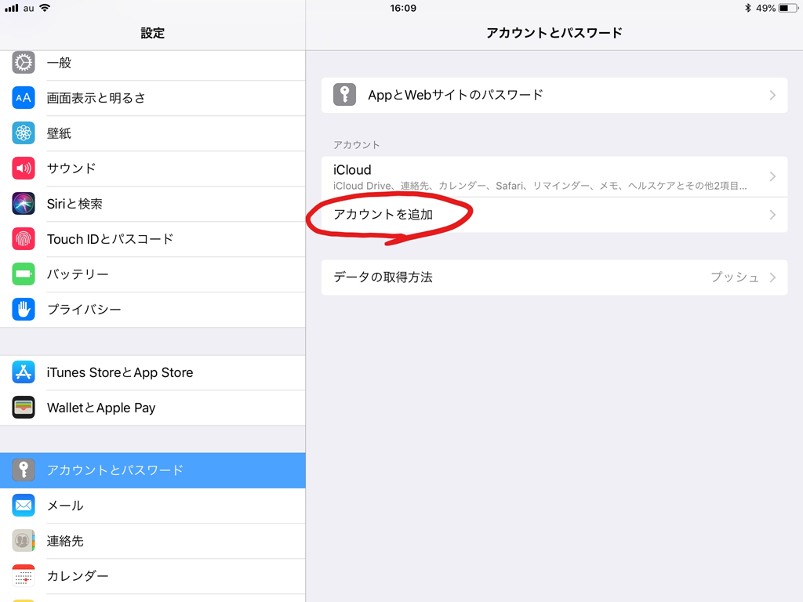
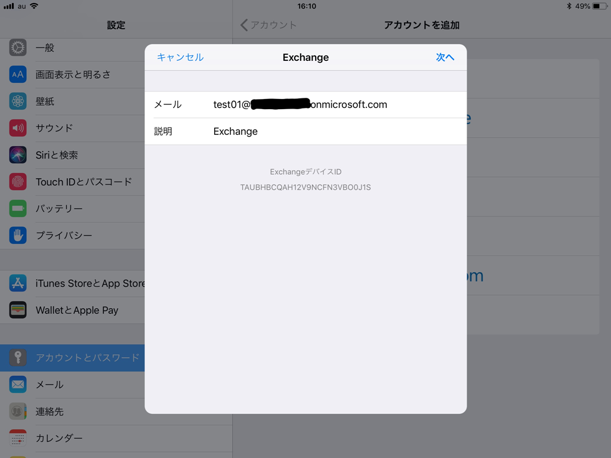
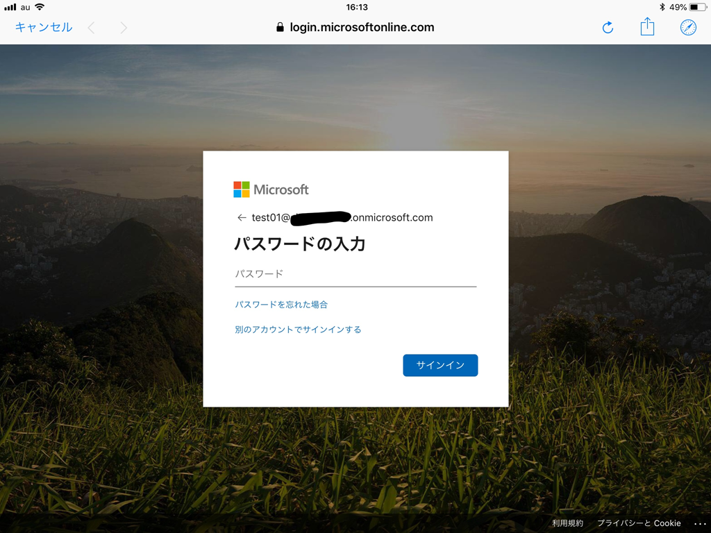
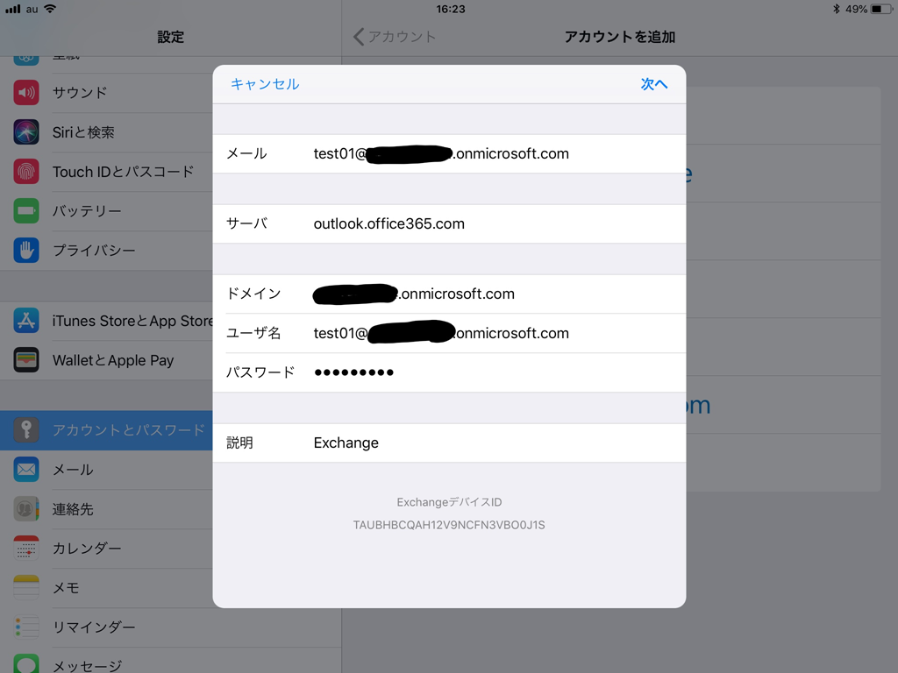

# 条件付きアクセスによる iOS 標準メール アプリの制御

こんにちは、Azure & Identity サポート チームの倉本です。

 

今回は、Azure AD ユーザーの iOS 標準メール アプリへサインイン時の条件付きアクセスを利用した制御方法について紹介します。 

条件付きアクセスではアクセス元のクライアント アプリケーションを条件として設定することができますが、
このとき [先進認証クライアント] [Exchange ActiveSync クライアント] [他のクライアント] の 3 種の認証方式毎にアクセス制御を設定することができます。 

iOS 標準メール アプリでは iOS 11 から先進認証に対応していますが、アカウントの設定手順によって、記 3 つのどの認証方式で Exchange Online に接続するか変わります。 

設定手順により、どの認証方式を利用するか、説明します。 
 
## <先進認証クライアント> 
1. [設定] - [アカウントとパスワード] - [アカウントを追加] を選択します。 

2. Exchange を選択します。 

3. Azure AD ユーザーの UPN を入力して [次へ] を選択します。 

4. ポップアップが表示されるため [サインイン] を選択します。 ※こちらの手順が Exchange ActiveSync クライアント接続との分岐点になります。 

5. ブラウザベースの先進認証クライアントの認証画面が表示されるため、ユーザー認証を実施し、サインインを完了させます。 

 

## <Exchange ActiveSync クライアント> 
1. [設定] - [アカウントとパスワード] - [アカウントを追加] を選択します。 
2. Exchange を選択します。 
3. Azure AD ユーザーの UPN を入力して [次へ] を選択します。 
4. ポップアップが表示されるため [手動構成] を選択します。  

5. パスワードの入力を要求されるため、パスワードを入力して [次へ] を選択します。 

6. サーバー、ユーザー情報を再度入力して [次へ] を選択すると、ユーザー認証が実施され、サインインが完了します。 

 

## <他のクライアント> 
1. [設定] - [アカウントとパスワード] - [アカウントを追加] を選択します。 
2. [その他] を選択します。 

3. [メールアカウントの追加] を選択します。 

4. アカウント情報を入力して [次へ] を選択します。 

5. 受信メール サーバー、送信メール サーバーの情報を入力して [次へ] を選択すると、ユーザー認証が実施され、サインインが完了します。 

 

  
上記の 3 種類の方法で Exchange Online に接続した際の Azure AD のサインインログを確認してみましょう。 

 

クライアント アプリの項目を確認すると [モバイル アプリとデスクトップ クライアント] [Exchnage ActiveSync (サポート)] [その他のクライアント、IMAP] と 3 種類が出力されていることが確認できます。

この 3 種類の項目は条件付きアクセスの [クライアント アプリ (プレビュー)] の項目に以下のように対応しています。 

[先進認証クライアント] -  [モバイル アプリとデスクトップ クライアント] 

[Exchange ActiveSync クライアント] - [Exchnage ActiveSync (サポート)] 

[他のクライアント] - [その他のクライアント、IMAP]  
 

 

※ iOS 標準メール アプリを使用して、"先進認証クライアント" により Exchange Online に接続した場合でも、その後の接続プロトコルとしては Exchange ActiveSync が利用されます。

条件付きアクセスの [クライアント アプリ (プレビュー)] は既定では未構成となっており、未構成状態ではブラウザーと先進認証クライアントのみにアクセス制御が適用されます。

[クライアント アプリ (プレビュー)] が未構成の状態では、仮に Exchange Online に対してアクセスを制限するようなポリシーを構成していても、 
[Exchange ActiveSync クライアント]、[他のクライアント] で認証を行うと Exchange Online へのアクセスが可能です。 

そのため、「iOS 標準メール アプリを利用させたくない」という要件の場合 [クライアント アプリ (プレビュー)] を構成し、[Exchange ActiveSync クライアント]、[他のクライアント] についても明示的にアクセス制御の適用対象に設定します。 
 

MFA やデバイス ベースなどの条件付きアクセスによるアクセス コントロールは、先進認証のみに対応しているものであるため、Exchange ActiveSync、他のクライアントに適用したとしても条件の判定を行うことができず、コントロール通りの動作は実現されません。 ([Exchange ActiveSync クライアント]、[他のクライアント] に MFA やデバイス ベースのコントロールを設定することで アクセスをブロックする動作となります) 
 

以上、iOS 標準メール アプリからの Exchange Online への 3 つの接続方法と条件付きアクセスを利用したアクセス制御方法でした。 

条件付きアクセスについてご不明な点がございましたら弊社サポートまでお気軽にお問い合わせください。 

上記の内容が少しでも皆様の参考となりますと幸いです。 
※本情報の内容（添付文書、リンク先などを含む）は、作成日時点でのものであり、予告なく変更される場合があります。 
