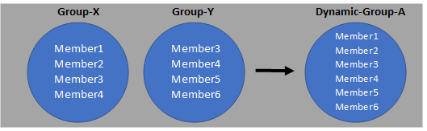

#  Azure AD 動的グループで "入れ子 (ネスト)" のグループを作成する

こんにちは、Azure Identity サポート チームの 竜 です。

本記事は、2022 年 6 月 6 日に米国の Azure Active Directory Identity Blog で公開された [Create "nested" groups with Azure AD Dynamic Groups](https://techcommunity.microsoft.com/t5/azure-active-directory-identity/create-quot-nested-quot-groups-with-azure-ad-dynamic-groups/ba-p/3118024) を意訳したものになります。

----

"memberOf" 属性に基づいて動的なグループを作成する機能が、パブリック プレビューで利用可能になったことをお知らせいたします。

本機能により、他のグループをもとに、動的な Azure AD セキュリティグループや M365 グループを作成することで、グループのメンバーシップをよりよく管理できるようになり、より簡単に階層的なグループを作成できるようになります。例えば、Group-X と Group-Y のメンバーを併せ持つ Dynamic-Group-A を作成することができるようになりました。 

  

動的グループのメンバー定義に使用するグループは、ユーザーやデバイスのセキュリティ グループ、Microsoft 365 のグループ、オンプレミスから同期したグループ、または複数のグループ タイプが混在するグループなど、Azure Active Directory のあらゆるグループ タイプがご利用いただけます。また、既存の入れ子のセキュリティ グループとは異なり、memberOf 属性に基づいた動的グループは、メンバーのフラットな (階層構造のない) リストを返すため、ライセンスの割り当てやアプリケーションの割り当てにご利用いただけます。 

memberOf 属性の詳細と、この新しい機能を利用する方法につきましては、弊社の[公開資料](https://docs.microsoft.com/ja-jp/azure/active-directory/enterprise-users/groups-dynamic-rule-member-of)をご覧ください。
