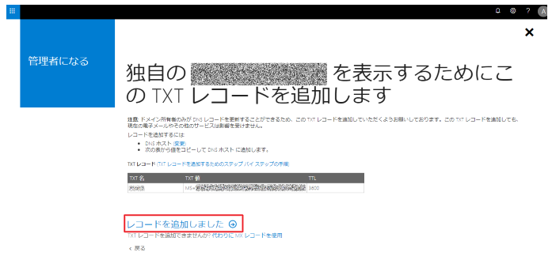

> 本記事は Technet Blog の更新停止に伴い https://blogs.technet.microsoft.com/jpazureid/2018/11/01/create-subscription-error/ の内容を移行したものです。
> 元の記事の最新の更新情報については、本内容をご参照ください。

# サブスクリプション作成時のエラー「アカウントが Azure サブスクリプションに関連付けられないディレクトリに属しています。別のアカウントでサインインしてください」

こんにちは、Azure & Identity サポート チームの小野です。

今回は、Azure におけるサブスクリプション作成時に表示される「アカウントが Azure サブスクリプションに関連付けられないディレクトリに属しています。別のアカウントでサインインしてください」というエラーの発生原因と対処策についてご紹介します。

 

本エラーは、サブスクリプション作成を試みたユーザー (のメールアドレス) が ”セルフサービス サインアップ テナント” に紐づいている場合に発生します。

## セルフサービス サインアップ テナントとは

セルフサービス サインアップ テナントとは、管理者により作成されたテナントではなく、ユーザーが Azure Active Directory(以下、Azure AD ) による認証を必須とするサービスにサインアップした (利用を試みた) 場合に自動で作成されるテナントです。具体的には Power BI などのサービスになりますが、サービスを利用するためにサインアップを試みた際に指定したユーザーのメール アドレスに含まれるドメイン名が Azure AD にまだ登録されていない場合には、自動で Azure AD テナントが作成され、これがセルフサービス サインアップ テナントになります。通常 Azure AD テナントには必ず管理者が存在しますが、このセルフサービス サインアップ テナントには管理者が存在しません。この管理者が存在しないテナントではサブスクリプションを紐づけることができないため、発生しているエラーが今回ご紹介しているエラーメッセージになります。

対処策としては、以下の手順にてテナントの管理者への昇格をする必要があります。

## エラーの対処法

以下手順にて管理者に昇格します。

1. 該当のユーザーで、https://www.office.com へログインし、管理を選択します。

    

2. 以下画面が表示されますので、”はい、私が管理者になります”を選択します。

    

3. ドメインを認証するために、TXT レコードの更新が求められます。

    ドメインに指定された TXT レコードを追加し、”レコードを追加しました” を選択します。なお、この TXT レコードは、管理者への昇格が終わりましたら削除いただいて構いません。

    

4. TXT レコードの確認が完了すると、以下が表示されます。

    この画面が表示されますと、無事サブスクリプションを作成することができます。

    

ご不明な点がございましたら弊社サポートまでお気軽にお問い合わせください。上記内容が少しでも皆様の参考となりますと幸いです。

※本情報の内容（添付文書、リンク先などを含む）は、作成日時点でのものであり、予告なく変更される場合があります。
