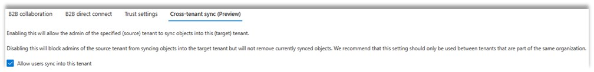
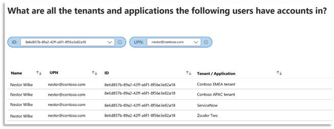

---
title: マルチテナントの Azure AD 組織におけるシームレスなアプリケーション アクセスおよびライフ サイクル管理
date: 2023-02-06
tags:
  - Cross-Tenat Synchronization
  - Azure AD B2B
  - B2B
---

> [!NOTE]
> 本記事は、2023 年 1 月 31 日に米国の Microsoft Entra (Azure AD) Blog で公開された [Seamless Application Access and Lifecycle Management for Multi-tenant Azure AD Organizations](https://techcommunity.microsoft.com/t5/microsoft-entra-azure-ad-blog/seamless-application-access-and-lifecycle-management-for-multi/ba-p/3728752) を意訳したものになります。
> ご不明点等ございましたらサポート チームまでお問い合わせください。

# マルチテナントの Azure AD 組織におけるシームレスなアプリケーション アクセスおよびライフ サイクル管理

こんにちは。
今日は、**テナント間同期**が**パブリック プレビュー**になったことをお知らせします。 

組織によっては、最近、新しい会社を買収したり、他の会社と合併したり、新しく設立された事業単位に基づき再編成されたりということがあるかと思います。組織が発展するにつれて、IT 部門は変化するニーズに対応するために適応が求められます。これには、既存の Azure Active Directory（Azure AD）テナントとの統合や、新しいテナントの作成も含まれるはずです。ID 基盤の管理方法にかかわらず、エンドユーザーがテナント間でリソースへのアクセスやコラボレーションをシームレスに体験できることがいかに重要であるかを弊社では認識しています。
テナント間同期の機能により、マルチテナント環境においてシームレスなアクセスおよびコラボレーション体験を提供することができます。

現在では、カスタム スクリプトやオンプレミスのソリューションを使用してテナントをつなぎ合わせ、テナント間でシームレスなユーザー体験を提供しているかもしれません。あるお客様からは、組織内でコラボレーションを行う場合、次のようなことを望んでいるとお聞きしました。

1. アプリケーションを組織内の異なるテナントでホストしている場合でも、ユーザーがアプリケーションにシームレスにアクセスできるようにしたい。

2. 管理者がユーザーに代わって組織内のテナント間でデータを共有することに同意することで、ユーザーの目的を妨げるアクションを最小限に抑えたい。

3. カスタム スクリプトや自社開発ソリューションを使用せずに、テナント間で自動的にアカウントの同期を維持し、ユーザーが組織を離れた場合は、自動的にアカウントの削除をしたい。

このようなシナリオを、Azure AD に組み込まれた機能で実現できるようになりました。テナント間同期を有効にすることで、組織内のテナント間でユーザー アカウントの作成を自動化できます。同期プロセスによって作成されたユーザーは、プライマリ テナントと同じように認証でき、各アプリケーションには、必要に応じて条件付きアクセス ポリシーを割り当てることもできます。これにより、組織全体のユーザーは、Microsoft アプリケーションや ServiceNow、Adobe などの Microsoft 以外のアプリケーション、その他何百もの SaaS アプリケーションなど、それらがホストされているテナントに関係なくアプリケーションにアクセスできるようになりました。 

この同期プロセスは、堅牢な Azure AD B2B 機能を活用し、条件付きアクセス、クロステナント アクセス設定、エンタイトルメント管理などの Azure AD のセキュリティおよびガバナンス機能と完全に統合されており、裏側でユーザーに対して透過的に実行されます。

## 簡単な 3 ステップでテナント間同期を開始する

組織内でのテナントをまたがるアプリケーションへのアクセスをユーザーに提供するために、テナント間同期をどのように使用しているか、Contoso 社の例を挙げて説明します。

Contoso 社は、米国に拠点を置く製造業の会社です。最近、グローバル展開を図るため、ヨーロッパとアジアの企業を買収しました。それぞれの会社は、既存の Azure AD テナントを持っています。
Contoso US のユーザーは、新しく買収した Contoso EMEA とContoso APAC のテナントと統合されたアプリケーションにアクセスする必要があります。そのため、Contoso の IT 管理者は、コラボレーションを促進するために、テナント間の B2B ユーザーの作成を自動化するカスタム スクリプトを手作業で作成していました。しかし、残念ながら、このスクリプトはエラーが発生しやすく、Contoso の担当者一人だけがその仕組みを知っていました。 
Contoso の IT 管理者は、テナント間同期の機能を知り、午後には同期を有効にし、カスタム スクリプトを廃止することができました。

以下は、その方法です。

### ステップ1 - ターゲットテナントにおけるテナント間同期の有効化
Contoso APAC と Contoso EMEA の管理者は、すでにクロステナントのアクセス ポリシーを作成し、Contoso US のテナントからの多要素認証 (MFA) を信頼しています。管理者は、クロステナント アクセス ポリシーの画面に移動し、チェックボックスをクリックするだけで、テナント間同期を有効にすることができます。チェックボックスをクリックするだけで、ターゲット テナントの管理者は完了です。 

これまでカスタム スクリプトで行っていたアプリの認証情報やシークレットのローテーション管理は、もう必要ありません。

### ステップ2 - ソーステナントでテナント間同期を有効化する
Contoso US の管理者は、テナント間同期を有効にし、以下を指定します。 

- 同期するユーザー (グループ メンバーシップに基づく)。
- 同期する属性 (名前、部署、ディレクトリの拡張属性など)。
- 表示名の末尾にドメインを追加するなど、必要な変換を行う。
 
新規ユーザーは、テナント間で自動的にプロビジョニングされ、必要なアプリケーションにアクセスできるようになり、新しいテナントのリソースに初めてアクセスする際に同意のプロンプトが表示されることはありません。古いスクリプトで作成された既存の B2B ユーザーは、上記で指定されたルールに従って更新されます。 

### ステップ3 - テナント間同期を監視する
Contoso US の管理者は、プロビジョニング ログを使用して、組織内のテナント間で作成されたすべてのユーザーを監視できます。さらに Azure Monitor を使用してデータを視覚化するためのカスタム ダッシュボードを作成することも可能です。以下のダッシュボードでは、Contoso US の管理者は、Contoso US テナントのユーザー Nestor がアクセス可能なすべてのテナントを確認できます。Nestorは、2 つのテナント (Contoso EMEA と Contoso APAC) と、彼が以前にプロビジョニングされたいくつかのアプリケーション (ServiceNow と Zscaler Two) へのアクセス権を持っています。Contoso の管理者は、テナント間同期が機能していることを確認できたので、カスタム スクリプトを廃止することができます。

  

## お客様の声 
DB Systel は、ドイツ国鉄の IT 子会社であり、デジタル パートナーとして、DB AG の全企業のデジタル化を推進しています。同社は、最高の IT 標準と革新的なトピックに基づいて、最適なソリューションとコンサルティング サービスを開発しています。これを実現するために、DB Systel は鉄道と IT に関する豊富な専門知識を活用しています。

**“テナント間同期により、当社のさまざまなテナントを接続し、すべてのマイクロソフト製品で従業員がよりシームレスに対話できるようになりました。また、オンプレミスでの専用アカウントが不要なため、運用コストの削減やテナントのセキュリティの向上にもつながります。弊社は、Azure AD のマルチテナント コラボレーション機能に全面的に信頼を寄せています。”**

組織内のテナント間でユーザー アカウントの作成を自動化することで、組織を改善するための他の方法の検討に時間を費やせることになります。パブリック プレビュー版では、テナント間の同期をさらに向上させるためのフィードバックをお待ちしています。
ぜひ今すぐテナント間同期をお試しください。これらの新機能に関するご意見は、Azure フォーラムまたは Twitter で @AzureAD のタグを付けてお寄せください。  
 
Joseph Dadzie, Partner Director of Product Management
Linkedin: @joedadzie
Twitter: @joe_dadzie

Learn more about Microsoft identity: 
- Related Articles: [Cross-tenant synchronization](https://learn.microsoft.com/ja-jp/azure/active-directory/multi-tenant-organizations/cross-tenant-synchronization-overview)
- Return to the [Azure Active Directory Identity blog home](https://techcommunity.microsoft.com/t5/microsoft-entra-azure-ad-blog/bg-p/Identity)
- Join the conversation on [Twitter](https://twitter.com/azuread/status/1278418103903363074){:target="_blank"} and [Linkedin](https://www.linkedin.com/showcase/microsoft-security/)
- Share product suggestions on the [Azure Feedback Forum](https://feedback.azure.com/d365community/forum/22920db1-ad25-ec11-b6e6-000d3a4f0789)