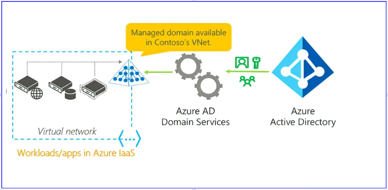
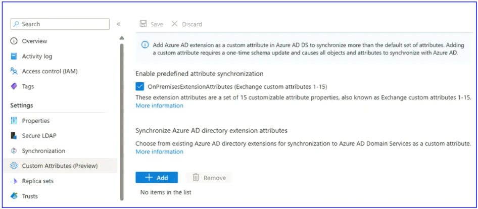

# Azure AD DS におけるカスタム属性がパブリック プレビューになりました

こんにちは。 Azure ID チームの小出です。

本記事は、2023 年 3 月 30 日に公開されました [Custom attributes for Azure Active Directory Domain Services now in Public Preview](https://techcommunity.microsoft.com/t5/microsoft-entra-azure-ad-blog/custom-attributes-for-azure-active-directory-domain-services-now/ba-p/3778049) の記事を日本語に意訳した内容になります。ご不明点などございましたらお気軽にサポートまでお問い合わせください。

-----

皆さん、こんにちは！

今日は、Azure Active Directory Domain Services (Azure AD DS) インスタンスの新しい機能拡張をご紹介します。 

この新機能により、Azure AD DS マネージド ドメインで、カスタム属性を使用することができるようになります。 

## カスタム属性 (パブリック プレビュー) 

様々な理由から、企業はレガシー アプリのコードを修正しない、または修正できないことがよくあります。これらのレガシー アプリでは、ディレクトリのカスタム従業員 ID などのカスタム属性を利用し、アプリの LDAP 呼び出しでこれらの属性を活用している場合もあると思います。Azure Active Directory (Azure AD) は、これらの拡張ユーザー属性を onPremisesExtensionAttributes という属性セットに格納し (Azure AD Connect 経由で構成した場合)、拡張アプリ属性を Directory Extensions という機能に格納しています。しかしながら、これら 2 つの拡張セットはどちらも、以前は Azure AD Domain Services に同期されていませんでした。  

Azure AD DS で Azure AD からカスタム属性/拡張機能を同期できるようにすることで、これまで移行できなかったカスタム属性/拡張機能に依存するアプリをすべて移行できるようになり、より多くのお客様に Azure AD DS をご利用いただけるようになりました。

カスタム属性の詳細については、こちらのドキュメントを参照ください: [Azure AD Domain Services のカスタム属性の作成と管理](https://learn.microsoft.com/ja-jp/azure/active-directory-domain-services/concepts-custom-attributes)

Azure AD DS は、今後も多くの発表を控えています！Azure ADですべてのアプリをよりシンプルに管理できるようにするため、最新のアップデートにご注目ください。

いつもどおり、皆様からのフィードバックや提案をお待ちしております。ご意見がございましたら、Twitter ([@AzureAD](https://twitter.com/azuread)) までお寄せください。
