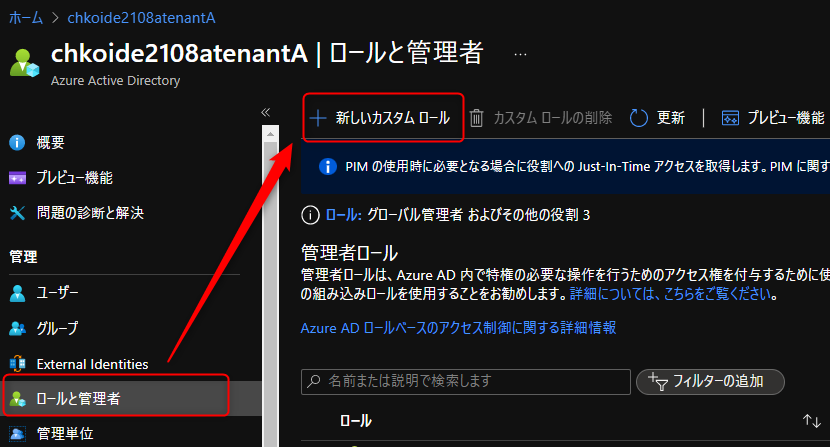
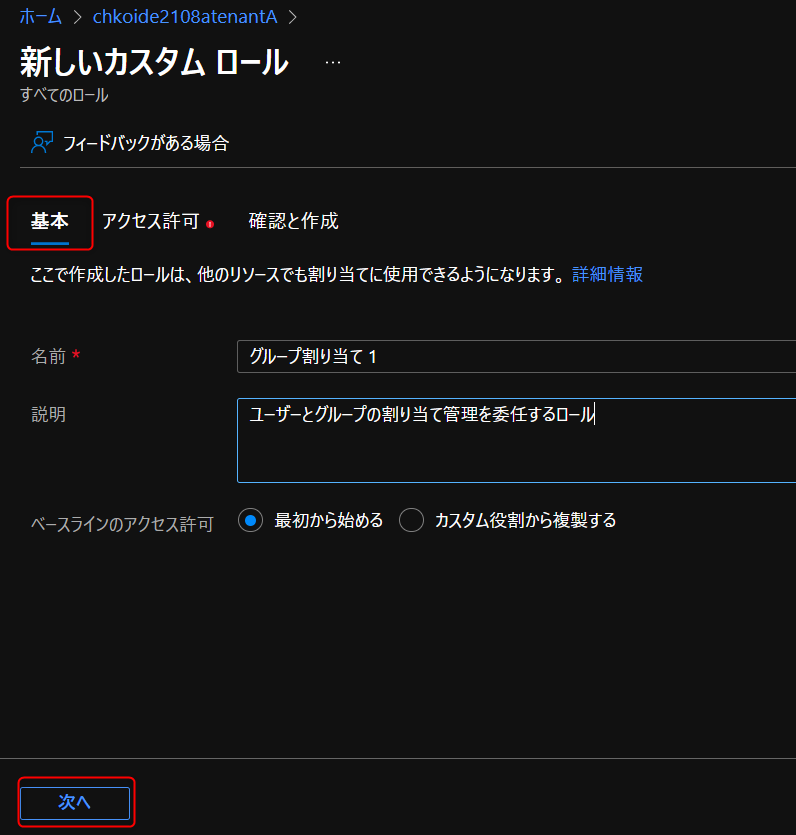
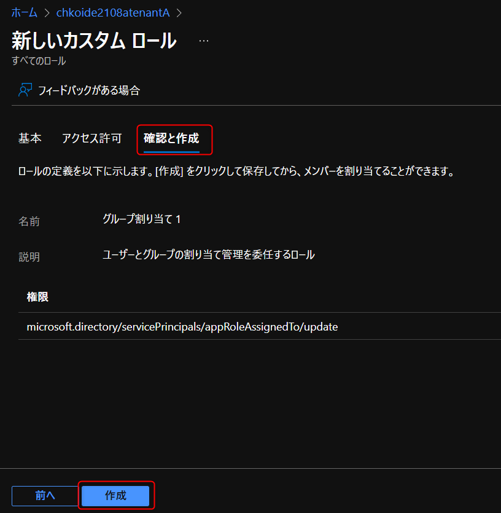
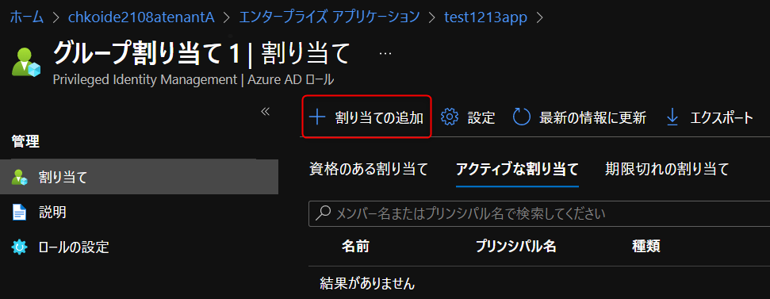

こんにちは、 Azure Identity サポート チームの小出です。

本記事は、 2022 年 3 月 2 日に米国の Azure Active Directory Identity Blog で公開された [Azure AD RBAC: Custom roles for app management now available](https://techcommunity.microsoft.com/t5/azure-active-directory-identity/azure-ad-rbac-custom-roles-for-app-management-now-available/ba-p/3185206) を意訳したものになります。ご不明点などございましたら、サポート チームまでお問い合わせください。

---

# Azure AD RBACでアプリ管理用のカスタム ロールが利用可能になりました

皆さん、こんにちは。
  
Azure Active Directory (Azure AD) のロールベースのアクセス制御 (RBAC) に関連する機能について、一連の発表ができることをとても嬉しく思っています。これらの機能は、Azure AD と Microsoft 365 の RBAC において、きめ細かな権限付与の実現をサポートし、大規模環境での管理をよりシンプルにするものです。

このシリーズではまず、アプリ管理を委任するためのカスタム ロールの一般提供 (GA) について紹介したいと思います。  
 
[アプリの登録](https://docs.microsoft.com/ja-jp/azure/active-directory/roles/custom-enterprise-app-permissions) と [エンタープライズ アプリ](https://docs.microsoft.com/ja-jp/azure/active-directory/roles/custom-available-permissions) のカスタム ロールを合わせて使用することで、管理者がアプリ管理のために持つアクセス権をきめ細かく制御することができます。なお、Azure AD のカスタム ロールを利用するには、Azure AD Premium P1 ライセンスが必要です。  
 
ここでは、架空の会社 Woodgrove の IT 管理者である Alice が、どのように効果的かつ安全にアプリの管理を委任できるか見てみましょう。

## Woodgrove 社ではアプリ管理用のカスタム ロールを使用して安全なアプリ管理の委譲を実現

地理的に分散した組織である Woodgrove は、小規模な IT チームが Azure AD のロールの委任を集中的に管理しています。シニア IT 管理者の Alice は、IT システムを安全に保つために、最小限の権限を行使して Azure AD のロールを委任する責任を負っています。

Charlie は、Woodgrove が持つ多くの LOB (Line of Business) アプリケーションの 1 つである 「Woodgrove Portal アプリ」の所有者です。Alice は、LOB アプリケーションのアクセス管理を所有者に委任したいと考えています。具体的には、Charlie にロールを付与し、Charlie が Woodgrove Portal アプリへのアクセスを管理できるようにしたいのです。  

Alice がこのシナリオのために新しいカスタム ロールを作成し、そのロールを Chalie に割り当てる方法を見てみましょう。   

## カスタム ロールの作成と割り当て

次の例では、Alice はアプリケーションへのユーザーとグループの割り当てを管理する権限だけを持つカスタム ロールを作成します。カスタム ロールを作成したら、Alice はこのロールを Woodgrove Portal アプリのスコープで Charlie に割り当てることができます。これにより Charlie には、Woodgrove Portal アプリのユーザーとグループの割り当てを管理する権限が付与されます。  
 
### カスタム ロールの作成

1. ロールと管理者タブで、**新しいカスタムロール** を選択します。    

  

2. ロールの名前と説明を入力し、**次へ** を選択します。  

  

3. ロールにアクセス許可を割り当てます。**servicePrincipal** と入力して検索し、 **microsoft.directory/servicePrincipals/appRoleAssignedTo/update** 権限を選択します。  

  

4. 新しいロールを確認します。問題がなければ、**作成** を選択して新しいロールを作成します。  

  

### カスタム ロールを割り当てる

組み込みロールと同様に、カスタム ロールもディレクトリ レベルで割り当てて、すべてのエンタープライズ アプリケーションに対するアクセスを許可することができます。さらに、上の例で示すように、1 つのアプリケーションに対してのみ、カスタム ロールを割り当てることもできます。これにより、2 つ目のカスタム ロールを作成することなく、単一のアプリケーションのユーザとグループの割り当てを管理する権限をユーザーに与えることができます。

1. **エンタープライズ アプリケーション** タブを選択し、ユーザーとグループの割り当てを管理するためのアクセス権を与えたいアプリケーションを選択します。

2. 新しい **ロールと管理者** タブに移動します。上で作成したカスタムロールが表示されます。

3. ロールを選択して、割り当てブレードを開きます。 **割り当ての追加** を選択し、ロールに追加するユーザーを選択します。

4. 割り当てを受けたユーザーは、アプリケーションのユーザーとグループ ブレードに移動すると、ユーザーの追加オプションが有効になっていることを確認できます。
 
これで完了です。 Charlie は、Woodgrove Portal アプリへのアクセスを管理できるようになりました。その他に作成できる役割については、[こちら](https://docs.microsoft.com/ja-jp/azure/active-directory/roles/custom-enterprise-app-permissions) を参照してください。
 
## 今後の予定

私たちは、カスタム ロールや管理単位に関する追加機能、その他の最小特権を実現する仕組みなど、Azure AD RBAC のさらなる素晴らしい機能の開発に取り組んでいます。今後のアナウンスにご期待ください。

いつもどおり、皆様のご意見、ご感想、ご提案をお聞かせください。[Azure AD 管理者ロール フォーラム](https://feedback.azure.com/forums/169401-azure-active-directory?category_id=166032) で共有するか、以下にコメントを残してください。ご連絡をお待ちしております。

Alex Simons ([@Alex_A_Simons](https://twitter.com/Alex_A_Simons))  
Corporate VP of Program Management  
Microsoft Identity Division
