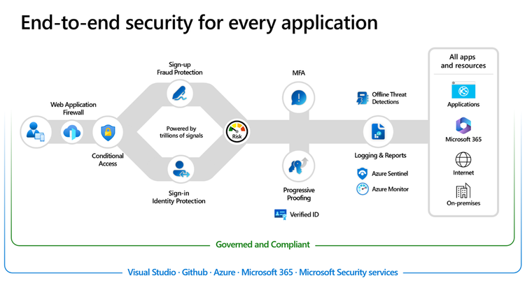

こんにちは、Azure Identity サポートチームの 張替 です。

本記事は、2025 年 1 月 24 日に米国の Azure Active Directory Identity Blog で公開された [Customize authentication experiences and URL domains for external apps | Microsoft Community Hub](https://techcommunity.microsoft.com/blog/microsoft-entra-blog/customize-authentication-experiences-and-url-domains-for-external-apps/3627347) を意訳したものになります。ご不明点等ございましたらサポート チームまでお問い合わせください。

---

## 外部向けアプリケーションでの OIDC 認証と URL カスタマイズの方法についてのお知らせ

顧客の ID とアクセス管理 (CIAM) など外部向けアプリケーションにおいて、セキュアでシームレスかつブランド化されたユーザー体験を提供することは、ビジネスの成長にとって重要です。しかし、[Verizon によると](https://www.verizon.com/business/resources/reports/dbir/)、サイバー攻撃はオンラインで運営するビジネスにとって重大な脅威であり、一般的な攻撃にはサービス拒否 (DDoS) 攻撃、パスワード スプレー攻撃、スロー ロリス攻撃、ブルートフォース攻撃などが挙げられます。全体のうち 24% では、盗まれた認証情報が問題の主な原因であり、強力なパスワードと多要素認証 (MFA) の使用の重要性がここからわかります。次に多いのはマルウェア (23%)、人的エラー (21%)、フィッシング (17%) です。CIAM アプリケーションに対する強力なエンド ツー エンドのセキュリティ戦略を持つことは、これらの脅威から守り、運営の整合性を確保するために不可欠です。

以前のブログで [セキュリティ既定値群](https://jpazureid.github.io/blog/azure-active-directory/built-in-security-controls-for-external-facing-apps/) と [ブランド強化](https://jpazureid.github.io/blog/azure-active-directory/enhance-end-user-experiences-with-custom-otp-email-provider-support/) についてお伝えしましたが、今回はシームレスな IAM 体験を提供すとともに侵害の可能性を減らし、セキュリティ レベルを大幅に向上させる方法についてお話しします。このブログでは、Microsoft Entra 製品チームのプリンシパル プロダクト マネージャーである Mihai Popa より、[Microsoft Entra External ID](https://www.microsoft.com/en-us/security/business/identity-access/microsoft-entra-external-id?msockid=1da3b11f9fdc65802aeaa21c9e906454) で利用可能になった OpenID Connect とカスタム URL ドメインのリリースについて説明してもらいます。

---

こんにちは、皆さん！Microsoft の Authentication Product チームの Mihai です。今日は、[Microsoft Entra External ID](https://www.microsoft.com/en-us/security/business/identity-access/microsoft-entra-external-id?msockid=1da3b11f9fdc65802aeaa21c9e906454) に新たに追加された重要な機能についてお知らせいたします。

本日、**OpenID Connect External ID プロバイダー サポート** のパブリック プレビューと、**カスタム URL ドメイン機能の一般提供** を発表します。どちらの機能も External ID のお客様が非常に待ち望まれていたものです。任意の ID プロバイダーを ID 体験に追加することで、ユーザーのサインアップおよびサインイン体験がシンプルになり、同時に OIDC をサポートするすべてのプロバイダーに対応します。ID に関わるフローのドメイン URL をカスタマイズすることで、ブランドの認識を高め、エンド ユーザーとの信頼を築くことができます。さらにセキュリティを高めることにもつながります。

ここでは、2 つの機能のプレビューを紹介しますので、ぜひご覧ください！

## Microsoft Entra External ID の OpenID Connect IdP サポート

お客様からのフィードバックでは、Amazon、Auth0、Okta、そして本製品の前身である Azure AD B2C などの外部 IdP とのフェデレーション サポートが求められていました。これにより、お客様は Azure AD B2C プラットフォームとフェデレーションすることで、新しい External ID 体験をより良いものにできます。([Announcing the Public Preview of OpenID Connect external identity provider support for Microsoft Entra External ID | Microsoft Entra Identity Platform](https://devblogs.microsoft.com/identity/openid-connect-external-identity-provider-support-public-preview/))。
外部の ID プロバイダーの既存のアカウントを使用してアプリケーションにアクセスできるようにすることで、パートナー統合を通じた ID フェデレーションが可能になり、新しい認証情報を作成する代わりに既存の ID を使用してサインインできます。

## OIDC 外部 ID プロバイダーの主要なシナリオ 

Microsoft Entra External ID の OIDC 外部 ID プロバイダーのサポートにより、いくつかの主要なシナリオが実現可能になります。

- **クラウド ID プロバイダーとの統合**: クラウド ID プロバイダーとのサインインおよびサインアップフローを統合できるようになります。 
- **Azure AD B2C とのフェデレーション**: 既存の Azure AD B2C テナントとフェデレーションしながら、新しい IAM 体験を構築可能になります。 
- **パートナー ID プロバイダーでのサインイン**: 例えばパートナー従業員割引プログラムなどのパートナーシップ シナリオにおいてフェデレーション認証を利用可能になります。
- **政府および地方自治体が提供する ID プロバイダーとのフェデレーション**: 政府および地方自治体の ID プロバイダーとの安全な認証を確立できるようになります。 

## OIDC フェデレーションを構成してみる

OIDC フェデレーションにより、外部の ID プロバイダーの既存のアカウントを使用してアプリケーションにサインアップおよびサインインできます。OpenID Connect プロトコルをサポートする外部 ID プロバイダーをユーザー フローに追加することで、そのユーザー フローで定義されたアプリケーションに対して、OIDC の ID プロバイダーの認証情報を使用して認証できます。

OpenID Connect の ID プロバイダーの設定、ユーザー フローへの追加、およびサインインおよびサインアップ体験のアプリケーションへの統合に関するガイダンスについては、以下のリソースを参照ください:

- [OpenID Connect を外部 ID プロバイダーとして追加する](https://learn.microsoft.com/en-us/entra/external-id/customers/how-to-custom-oidc-federation-customers)
- [OpenID Connect クレーム マッピング](https://learn.microsoft.com/en-us/entra/external-id/customers/reference-oidc-claims-mapping-customers)
- [Azure AD B2C テナントを OpenID Connect ID プロバイダーとして追加する](https://learn.microsoft.com/en-us/entra/external-id/customers/how-to-b2c-federation-customers)

## Microsoft Entra External ID カスタム URL ドメイン

### カスタム URLドメインとは何か？

[カスタム URL ドメイン](https://devblogs.microsoft.com/identity/custom-url-domains-ga/)は、組織が独自のドメイン名を使用して認証体験をカスタマイズできるようにするためのものです。既定の Microsoft のテナント URL の代わりに、ユーザーにはブランド化された URL が提示されます。これにより、ブランドとしての ID をユーザーに印象付けることが可能となり、アプリケーションがよりプロフェッショナルでセキュアに感じられるという、一貫した体験が提供されます。

### 主な機能

1. **カスタマイズとブランド化**: 認証ページで使用する独自のドメイン名を登録することで、ログイン体験を他のユーザー フローと統一できます。ユーザーには、既定の Microsoft テナント URL の代わりに、login.contoso.com のようなブランド化された URL が提示されます。 
2. **複数のドメインが利用可能**: 1 つのテナントに複数のカスタム URL ドメインを設定できます。 
### 追加のセキュリティ強化: 

1. **標準の URL ドメイン保護**: カスタム URL ドメインがアクティブな場合、既定のエンドポイントへのアクセスをブロックすることで、ボット攻撃や DDoS 攻撃などのさまざまなセキュリティ攻撃からテナントを保護できます。この機能はお客様から弊社に要望いただければ利用可能です。この機能の有効化をご要望の場合は、[Microsoft Forms](https://forms.office.com/pages/responsepage.aspx?id=v4j5cvGGr0GRqy180BHbR8p84R3AsLtAjEb1gFOJGX5URVFVNFJQUEtXUUxBRldRVlRFTEJFOUE2Qy4u&route=shorturl) よりテナントを登録ください。 
2. **サードパーティの Web アプリケーション ファイア ウォール (WAF) との統合**: カスタム URL ドメインは Azure Front Door (AFD) で構成する必要がありますが、さらに AFD に上乗せする形で [Cloudflare](https://learn.microsoft.com/en-us/entra/external-id/customers/tutorial-configure-cloudflare-integration) や Akamai などのサードパーティ WAF 統合を追加することで、テナントに追加の WAF ルールを追加可能です。

## カスタム URL ドメインを設定する際の重要な考慮事項

- **メタデータ エンドポイントへの影響**: カスタム URL ドメインを変更すると、メタデータ エンドポイントにも影響します。例えば、既定のエンドポイントが https://\<tenantID\>.ciamlogin.com/\<tenantID\>/.well-known/openid-configuration/v2.0 の場合、メタデータ エンドポイントは https://login.contoso.com/.well-known/openid-configuration/v2.0 に変更されます。
- **単一ドメインでのみ利用可能**: 一度 1 つのテナントに追加され検証されたカスタム URL ドメインは、他のテナントに追加することはできません。 
- **トークン発行者**: トークン発行者は既定のエンドポイントのままとなります。例えば、"iss": "https://\<tenantID\>.ciamlogin.com/\<tenantID\>/v2.0" のようになります。 
- **トップ レベル ドメイン**: トップ レベル ドメインの使用は避けてください。カスタム URL ドメインにルート ドメインを使用すると、ユーザー体験や設定プロセスが複雑になる可能性があります。これらの問題を避けるため、カスタム URL ドメインにはサブ ドメインを使用することが一般的に推奨されます。
    - 正しいドメインの例: 'login.contoso.com'
    - 間違ったドメインの例: 'contoso.com'

## 最新情報にご注目ください

Microsoft Entra の全体の機能について詳しく知りたい場合やテストしたい場合は、[開発者センター](https://developer.microsoft.com/en-us/identity/external-id) をご確認ください。最新の ID に関する情報を得るためには、[ID 開発者ブログ](https://devblogs.microsoft.com/identity/tag/external-id/) を購読ください。また、[YouTube](https://www.youtube.com/@MicrosoftSecurity/playlists) でビデオの概要、チュートリアル、詳細な解説も視聴ください。

フィードバックを共有し、[意見](https://forms.office.com/pages/responsepage.aspx?id=v4j5cvGGr0GRqy180BHbR5AJ67oBBC9Oj7nqW72Oc7FUOUgySkExNThYVUZOTlZSNjhET1E1MERDMy4u&route=shorturl) をぜひお聞かせください。また、外部 ID フェデレーション機能をさらに向上させるために新機能の提案もぜひ歓迎いたします。さらに、[リサーチ パネルに参加](https://ux.microsoft.com/Panel/MicrosoftEntraExternalID?utm_campaign=ExternalID&utm_source=AppService&utm_medium=Blog) いただけましたら、顧客調査に参加するための招待を受け取ることも可能です。
次回のブログでは、外部向けアプリケーションにおける Web アプリケーション ファイアウォールの詳細な解説を行い、ベストプラクティス、実装戦略などについて探りますので、お楽しみに。

Mihai Popa  
Principal Product Manager
