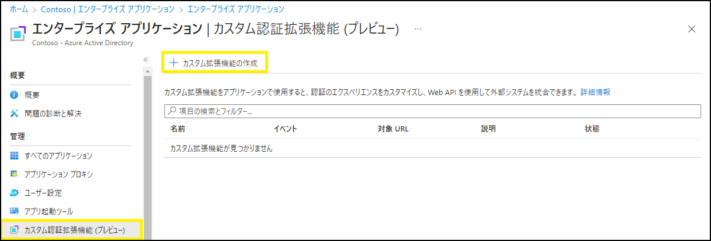
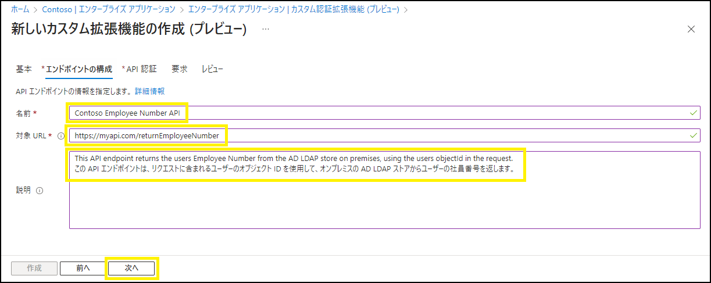
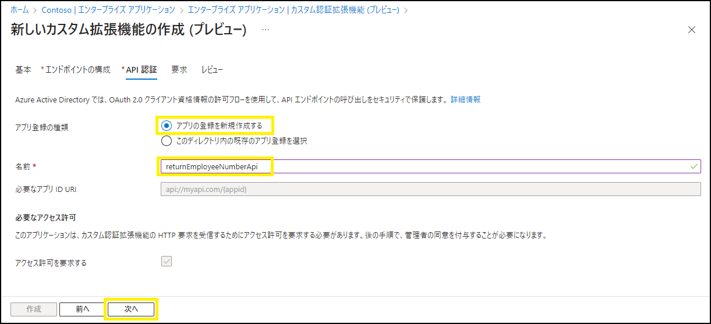
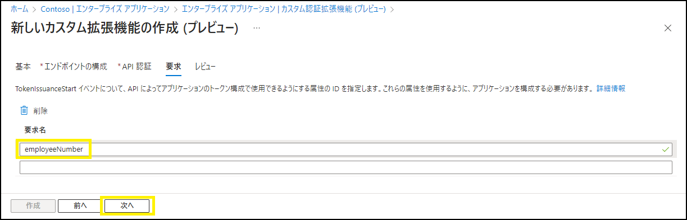
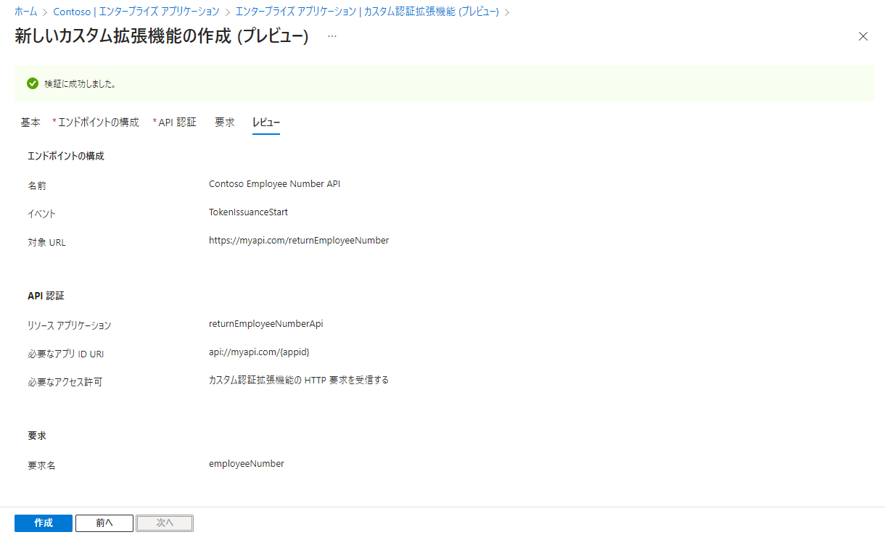
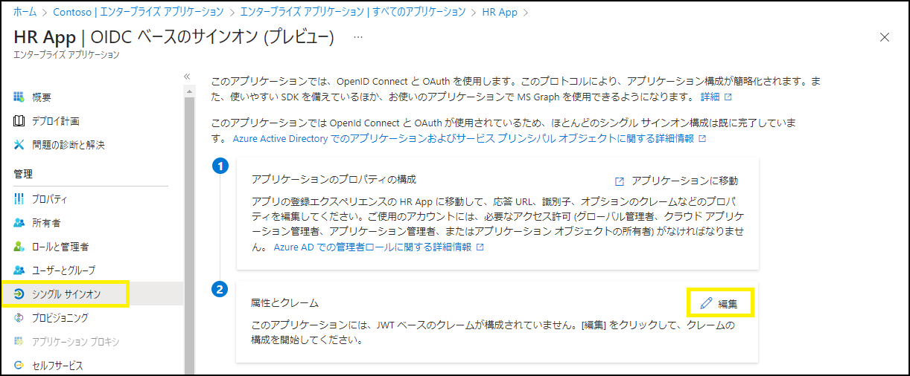
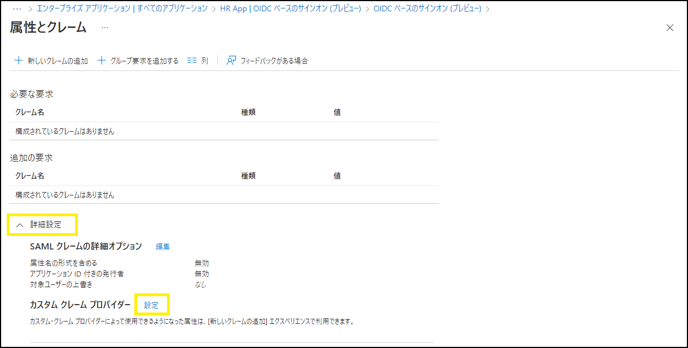
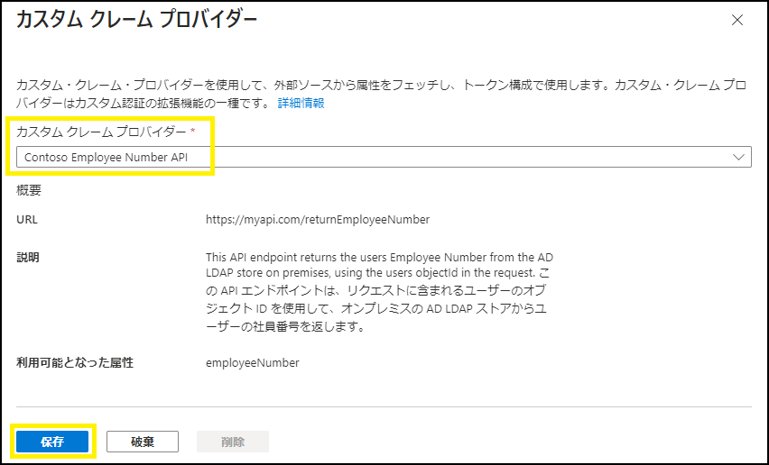
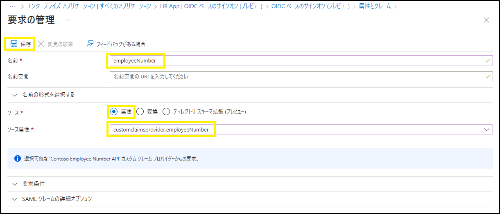

# カスタム クレーム プロバイダーで認証フローをカスタマイズ！

こんにちは、Azure Identity サポート チームの 五十嵐 です。

本記事は、2023 年 3 月 20 日に米国の Azure Active Directory Identity Blog で公開された [Customize your authentication flows with custom claims providers!](https://techcommunity.microsoft.com/t5/microsoft-entra-azure-ad-blog/customize-your-authentication-flows-with-custom-claims-providers/ba-p/2464388) を意訳したものになります。ご不明点等ございましたらサポート チームまでお問い合わせください。

---

皆さん、こんにちは。

Microsoft Entra の一部である Azure Active Directory (Azure AD) においてカスタム クレーム プロバイダーのパブリック プレビューを発表できることを大変うれしく思います。

カスタム クレーム プロバイダーを使うと、認証フローの最中に API を呼び出してカスタム クレームをトークンにマッピングすることができます。API の呼び出しは、ユーザーがすべての認証要求を完了した後で、トークンがアプリへ発行される直前に実行されます。アプリが想定どおり機能するために、アプリに送信されるトークンに追加のクレームを返す必要があるというシナリオを多くのお客様から伺いました。これらのクレームを外部のシステムから取得するのは、以下のような理由が挙げられます:

- 機密性の高い属性をオンプレミスで管理しており、Active Directory Federation Services やその他のフェデレーション サービスを使用して Azure AD にクレームを渡す必要がある。
- 規制上、これら機密性の高い属性を Azure AD に同期させることができない。
- 属性が外部データベースに格納されており、複雑な RBAC モデルを保有している。
- アプリを所有していない、または認証後にこれらの属性を取得するようにアプリを変更することができない。

カスタム クレーム プロバイダーを使用すると、外部システムからクレームを取得し、トークンに直接発行することができます。LDAP や SQL など、あらゆるデータ ストアと連携することもできます。カスタム クレーム プロバイダーは、OpenID および SAML アプリに設定でき、従業員や外部の ID を認証するシナリオで機能します。

Contoso 社の人事アプリを使って設定方法を紹介したいと思います。このシナリオでは、Contoso 社は人事アプリを Active Directory Federation Services から切り離し、Azure AD で直接認証することを検討しています。人事アプリは、オンプレミスの Active Directory に保存されているトークンに、ユーザーの社員番号が返されることを想定しています。 

Contoso 社はカスタム クレーム プロバイダーを構成し、このデータを取得して認証時にトークンに挿入することがで切るようになります。Contoso 社の Azure AD 側の設定を始めてみましょう。 

まず、[**エンタープライズ アプリケーション**] メニューで、Contoso の管理者は [**カスタム認証拡張機能**] を選択後、[**カスタム拡張機能の作成**] を選択します。

そして [**TokenIssuanceStart**] を選択し、[**次へ**] を選択します。 

管理者は、Contoso 社の API の [**名前**] [**対象 URL**] [**説明**] を入力し、[**次へ**] を選択します。API エンドポイントは、LDAP 検索を使用して Active Directory と通信し、ユーザーの社員番号を取得することになります。

次に、Contoso 社の管理者は、カスタム拡張機能がどのようにして自社の API に認証するかを設定できます。[**アプリの登録を新規作成する**] を選択し、[**名前**] を入力し、[**次へ**] を選択します。Contoso 社の API を認証するために、クライアント資格情報を使用します。Contoso 社は Azure Functions アプリを使用して API をホストしているため、このアプリ登録が自動的に API を保護するために使用されます。

そして、API から返される属性名をカスタム拡張機能に設定します。Contoso 社の API は、**employeeNumber** という属性を返します。管理者は [**要求名**] に **employeeNumber** を入力し、[**次へ**] を選択します。

次に、カスタム クレーム プロバイダーを使用して、人事アプリ登録のクレームをマッピングしてみましょう。Contoso 社の管理者は、[**エンタープライズ アプリケーション**] メニューに移動して 人事アプリを選択し、[**シングル サインオン**] > [**属性とクレーム**] で [**編集**] を選択します。

Contoso 社の管理者は、カスタム クレーム プロバイダーを構成して、カスタム拡張機能から社員番号を取得するためのクレーム マッピングを作成する必要があります。
 
[**詳細設定**] メニューを展開し、［**設定**］を選択します。

管理者は、[**カスタム クレーム プロバイダー**] を選択し、先に作成したカスタム拡張機能を選択し、[**保存**] します。

最後に、管理者は [**新しいクレームの追加**] を選択し、トークンに発行されるクレームの [**名前**] を入力します。次に [**ソース**] にて [**属性**] を選択し、[**ソース属性**] をプルダウンから選択します (**customClaimsProvider.attributeName** という形式)。そして [**保存**] します。

これですべての設定が完了しました。ユーザーが Contoso 人事アプリへのサインインを完了すると、カスタム拡張機能がトリガーされます。カスタム クレーム プロバイダーはカスタム拡張機能を使用して、トークンに社員番号を追加します。
 
以下はそのフローを示す図です。

より詳細なビデオ チュートリアルは以下からご覧いただけます: https://youtu.be/BYOMshjlwbc

カスタム クレーム プロバイダーは、カスタム拡張機能のまだ最初の利用シナリオの一つでしかありません。今後もカスタム拡張機能のイベントを追加でリリースしていきますので、認証フローをさらにカスタマイズすることができるようにます。

カスタム拡張機能については [こちら](https://learn.microsoft.com/ja-jp/azure/active-directory/develop/custom-extension-overview)、カスタム クレーム プロバイダーについては [こちら](https://learn.microsoft.com/ja-jp/azure/active-directory/develop/custom-claims-provider-overview) で詳しく説明しています。カスタム クレーム プロバイダーのセットアップを開始するには、[こちら](https://learn.microsoft.com/ja-jp/azure/active-directory/develop/custom-extension-get-started?tabs=azure-portal) をご覧ください。

いつものとおり、皆様のご意見、ご感想、ご提案をお聞かせください。[Azure AD フォーラム](https://feedback.azure.com/d365community/forum/22920db1-ad25-ec11-b6e6-000d3a4f0789) で共有するか、以下にコメントください。皆様からのご連絡をお待ちしております。

よろしくお願いします、 

Alex Simons (@Alex_A_Simons)  
Corporate VP of Program Management  
Microsoft Identity Division
