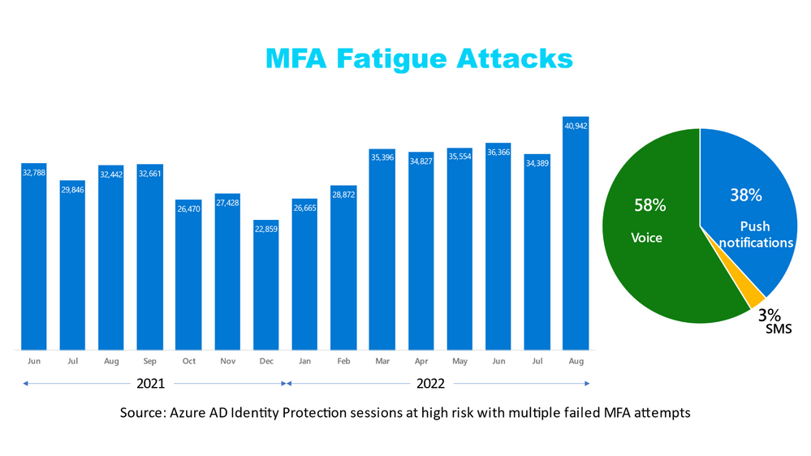
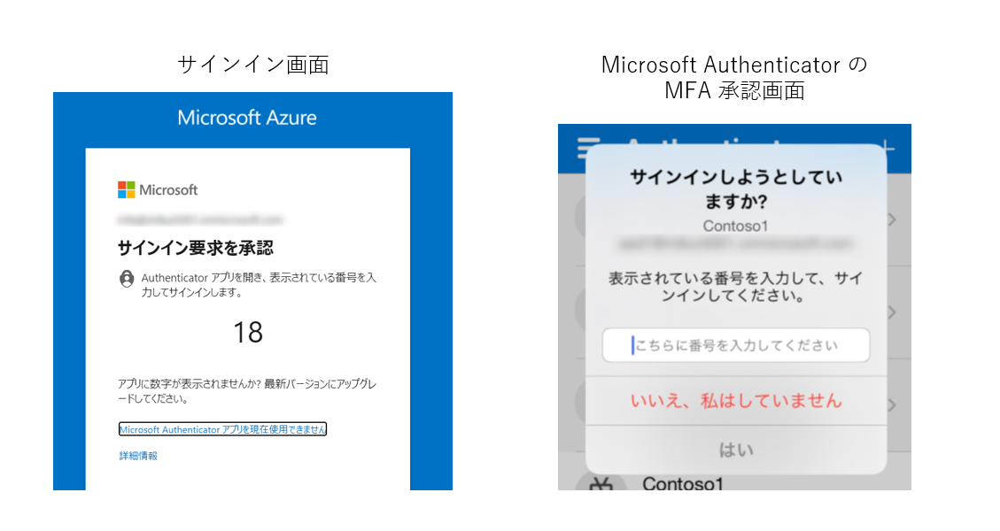
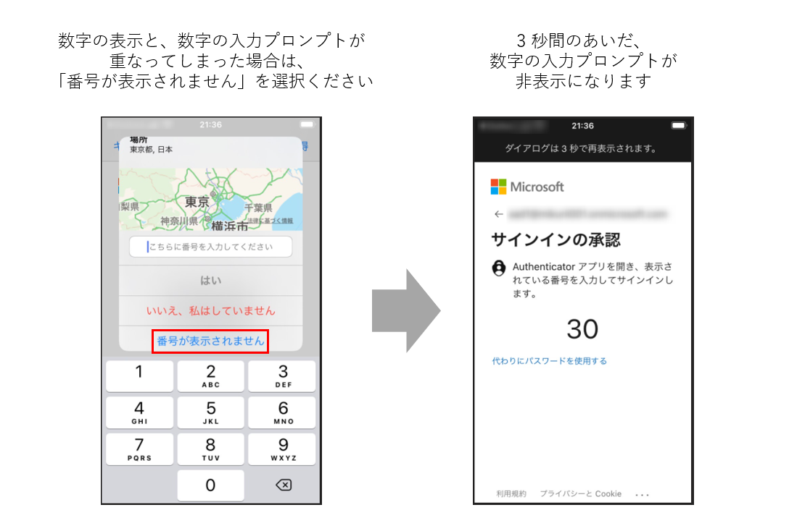

# Microsoft Authenticator の MFA 疲労攻撃対策

> [!NOTE]
> 2022 年 12 月 04 日更新: 「プッシュ通知に番号の一致が必要」の機能が、2023 年 02 月 27 日以降に、すべてのユーザーに対して自動で有効化されることについて情報を更新しました。

こんにちは。Azure Identity サポート チームの栗井です。

Microsoft Identity Security のディレクター Alex Weinert によって、昨今脅威が指摘されている MFA 疲労攻撃と、対策としての Microsoft Authenticator の強化機能についての下記ブログ記事が公開されました。

[Defend your users from MFA fatigue attacks - Microsoft Tech Community](https://techcommunity.microsoft.com/t5/microsoft-entra-azure-ad-blog/defend-your-users-from-mfa-fatigue-attacks/ba-p/2365677)

上記記事に記載の一部内容と、私共日本側のサポート チーム宛にお客様からお問い合わせいただく内容等をふまえ、本記事を執筆しました。

## 背景

昨今は多くのお客様の環境において、パスワード "のみ" による認証は十分にセキュアではないという認識が高まり、多要素認証 (MFA) などの導入による認証の強化が行われています。この動向に伴って、**MFA の疲労攻撃 (別名、MFA スパム)** の報告が増えています。

MFA 疲労攻撃とは、攻撃者が繰り返し何度も MFA 要求を発生させ、その要求を受け取ったユーザーが誤って MFA 要求を承認することを狙った手口です。

なぜこのような手口が通用するのかというと、音声通話への応答やプッシュ通知の承諾といった単純な MFA 承認方法では、ユーザーが一連の認証の流れ (コンテキスト) の中にいなくても、承諾を完了できてしまえるからです。突然、何の脈絡もなくスマートフォンにプッシュ通知が来たとして、ユーザーが承諾ボタンを押してしまうと攻撃者に侵入を許してしまうことになります。

例えば私の Microsoft Authenticator に、突然 MFA のプッシュ通知が発生したと仮定します。アプリには「サインインを承認しますか ? (拒否 / 承認)」という選択肢が表示されます。私はこのサインインに身に覚えがないので「拒否」を押下しますが、まだ IT リテラシーの高くない利用者や、たまたまそのタイミングでクラウド アプリにサインインを試行している人であれば、誤って「承認」を選択してしまう可能性もあります。また、攻撃者が繰り返しサインインを試行してプッシュ通知を行うと、ユーザーには複数の通知が届き、どれが自身の意図したプッシュ通知か判断できなくなります。MFA 疲労攻撃は、このような「ユーザーの誤操作」を狙った攻撃です。

この攻撃が成り立つのは、一連の認証操作において、認証の流れ (コンテキスト) が考慮されていないためです。実際に画面の前でサインインをしていなくても、Microsoft Authenticator 上で「承認」を押すことが "できてしまう" という点が問題です。音声通話 MFA も仕組みは同様です (自身が認証操作をしているか否かにかかわらず、認証要求の電話に対して、シャープ "#" ボタンを押下してしまえば承認できてしまう)。

本記事ではこのような「MFA の誤承認」からユーザーを保護するための、Microsoft Authenticator における MFA 強化の機能についてご紹介します。

## 1. 「プッシュ通知に番号の一致が必要」機能によって MFA の誤承認発生を防止

Microsoft Authenticator の「プッシュ通知に番号の一致が必要」を有効化すると、MFA の際に、「サインイン画面に表示される 2 桁の数字を、Microsoft Authenticator の画面に入力する」という操作が要求されます。

仮にユーザーの手元の Microsoft Authenticator に、見知らぬ MFA 要求が通知された場合であっても、ユーザーはこれを許可することができません。なぜならユーザーは画面の前におらず、Microsoft Authenticator に入力するための正しい数字を知りようがないからです。この仕組みによって、ユーザーが MFA 要求を誤承認するリスクを大幅に抑えることができます。

  

「プッシュ通知に番号の一致が必要」の機能は、当ブログ公開時 (2022/10/19) 時点でプレビュー機能でしたが、現在は一般機能として公開済みです。

[公開情報 : Advanced Microsoft Authenticator security features are now generally available!](https://techcommunity.microsoft.com/t5/microsoft-entra-azure-ad-blog/advanced-microsoft-authenticator-security-features-are-now/ba-p/2365673)

本機能は 2023 年の 2 月 27 日以降、すべてのユーザーに自動で有効化することを予定しています。

本機能は 2021 年 11 月にリリースされ、すでに 1 万近くの組織に導入されています。また「番号の一致」は、Microsoft Authenticator を利用したパスワードレス サインインの手段としてもご利用いただくことができます。

[公開情報: 多要素認証 (MFA) 通知で数値の一致を使用する方法 - 認証方法ポリシー](https://learn.microsoft.com/ja-jp/azure/active-directory/authentication/how-to-mfa-number-match)

## 2. ユーザーが不正アクセスを判断できるように、MFA 要求にサインイン情報を表示

「プッシュ通知とパスワードレス通知に地理的な場所を表示する」の機能を有効化すると、サインインの発生元の IP アドレスに基づいた位置情報が Microsoft Authenticator の画面に表示されます。また「プッシュ通知とパスワードレス通知にアプリケーション名を表示する」の機能を有効化すると、サインイン先のアプリケーションの名前も表示されます。

例えば、ユーザー自身が名古屋にいるのに、サインイン元の位置情報が「ブラジル / リオデジャネイロ」と表示された場合、ユーザーは「この MFA 要求はおかしいかも？」と、一瞬手を止めて不正アクセスを疑うきっかけになることが期待されます。

[公開情報: Microsoft Authenticator 通知で追加のコンテキストを使用する方法 - 認証方法ポリシー](https://learn.microsoft.com/ja-jp/azure/active-directory/authentication/how-to-mfa-additional-context)

なお、上記の機能がすべて有効化の対象となっているユーザーでは、Authenticator 宛の MFA 要求は、下記画像のようになります。
	 
- アクセス先のアプリケーションが表示されます。下記例では "App: Azure Portal" と表示されています。
- アクセス元の位置情報が "Location : Tokyo Japan" と、地図と合わせて表示されます。
- MFA 要求の承認のため、数字の入力が要求されます。

  

## 3. Azure AD Identity Protection の機能もぜひご活用を

上記の各種 Microsoft Authenticator の強化機能をすぐに導入することが難しい場合は、Azure AD Identity Protection の機能もぜひご活用ください。Azure AD Identity Protection の導入によって、リスクのあるサインイン パターンや侵害された可能性のあるユーザーが検知され、不正アクセスを防止することができます。

例えば攻撃者が、馴染みのない場所からのサインインを試み、MFA の実施に失敗した場合、攻撃対象のユーザーのアカウントは「ユーザー リスク有り」と判定されます。不正な MFA 要求を繰り返し発生させる攻撃者は、すでにユーザーのパスワードを把握しています。漏洩したパスワードを継続的に利用することは望ましくないので、まずはパスワードの変更が必要です。

管理者はユーザー リスクの検知を Azure ポータルから確認し、ユーザーにパスワード変更を要求することができます。パスワードをリセットすることで、攻撃者は古いパスワードを利用した攻撃ができなくなります。また、ユーザー リスクの評価値は自動で低減されます。

管理者によるリスクの確認およびパスワード変更の手間を省略したい場合、Azure AD Identity Protection の「ユーザー リスク ポリシー」を構成いただくことで、リスクのあるユーザーを自動でセルフサービス パスワード リセット (SSPR) に遷移させることもできます。

- [公開情報: リスク ポリシーを構成して有効にする - Azure Active Directory Identity Protection](https://learn.microsoft.com/ja-jp/azure/active-directory/identity-protection/howto-identity-protection-configure-risk-policies)
- [公開情報: 条件付きアクセス - 危険なユーザーに対してパスワード変更を必須にする](https://learn.microsoft.com/ja-jp/azure/active-directory/conditional-access/howto-conditional-access-policy-risk-user)

## 強化された Microsoft Authenticator の機能を試してみよう

以下では、Azure ポータルで強化された Microsoft Authenticator の機能を有効化 + 検証する手順をご紹介します。

1. セキュリティ グループを作成
   - 管理者のアカウントで Azure ポータルにアクセスし、[Azure Active Directory] > [グループ] から、新しいグループを作成します。グループの種類は "セキュリティ" を選択ください。
   - 「数字の一致」機能を構成する対象のユーザーをグループのメンバーとして追加します。検証段階では、検証用ユーザーのみをグループに追加ください。
   本説明内では "Number matching test" という表示名のセキュリティ グループを仮定します。
 
2. Microsoft Authenticator の認証方法ポリシーを構成
    
    - 管理者のアカウントで Azure ポータルにアクセスし、下記に進みます。
    
    	[Azure Active Directory] > [セキュリティ] > [認証方法] > [ポリシー]
 
    - 認証メソッド一覧から "Microsoft Authenticator" を選択します。[基本] タブの "有効にする" の現在の設定値が "いいえ" となっていることをご確認の上、以降の手順にお進みください。
 
    - [基本] タブの "有効にする" の設定値を "はい" にします。
    
    	"ターゲット" では "ユーザーの選択" を選択し、"ユーザーとグループの追加" から "Number matching test" を選択します。
 
    - [構成] タブを開きます。
 
    - [プッシュ通知に番号の一致が必要] と [プッシュ通知とパスワードレス通知にアプリケーション名を表示する] と [プッシュ通知とパスワードレス通知に地理的な場所を表示する] それぞれの設定項目で、下記のように構成します。
	
    	- 状態 : 有効
		- ターゲット - 含める : "Number matching test" グループを追加

3. 該当のユーザーに対して MFA を有効化

    上記の Microsoft Authenticator の認証方法ポリシー設定は、MFA が要求された際のアプリ上での動作をカスタマイズする項目です。ユーザーに対しての MFA 要求の有効化は、別途構成する必要があります。MFA の有効化方法は複数ありますが、本記事では条件付きアクセス ポリシーによる有効化の手順を記載します。

    -  [Azure Active Directory] > [セキュリティ] に進みます 

    -  [条件付きアクセス] > [ポリシー] に進みます

    -  [+ 新しいポリシー] を押下し、以下の内容でポリシーを構成します
    		
		- [名前] : 任意のポリシーの名前をご入力ください
		
		- [割り当て] : 
			
			- [ユーザーまたはワークロード ID] : "Number matching test" グループを指定
			
			- [クラウド アプリまたは操作] : "すべてのクラウド アプリ" もしくは何らかの特定のアプリケーションを指定
	
		- [アクセス制御] :
			
			- [許可] : アクセス権の付与 – "多要素認証を要求する" を選択
		
	- [ポリシーの有効化] を [オン] にし、[保存] を押して設定を反映します

	上記を設定後、 "Number matching test" に所属するユーザーによって何らかのアプリケーションにアクセスいただくことで、強化された Microsoft Authenticator の MFA 機能が動作することをご確認ください。設定にあたってのご不明点やご相談事項などございましたら、弊社サポート チームまでお問い合わせください。
	

## Q & A (随時追記予定)

Q1. Microsoft Authenticator のアプリ上で発生したサインインで「数字の一致」による MFA を実施する際に、数字の表示画面 / 数字の入力プロンプト が重なってしまい、サインインの完了ができません。

A1. 一番下の "番号が表示されません" を選択ください。3 秒間のみ数字の入力プロンプトが非表示となり、MFA 認証用の数字が表示されます。
  

## おわりに

Microsoft Authenticator の優れた点の 1 つは、今後もさらなる進化および多様化が懸念されるセキュリティ攻撃に対して、いち早く対応できるよう継続的に開発および投資を行っていることです。 Microsoft Authenticator が企業にとって、最も安全かつ便利で費用対効果の高い認証方法であり続けるために、今後もさらに多くの機能強化を続けて参ります。

各種 MFA 強化の機能の一般公開 (GA) にあたって、利用者の皆様の生のご意見やフィードバックはとても重要です。MFA 疲労攻撃に関する英語記事 (後述)、もしくは [Azure フィードバック サイト](https://feedback.azure.com/d365community/forum/22920db1-ad25-ec11-b6e6-000d3a4f0789) まで、ぜひご意見をお寄せいただけますと幸いです。

## 参考
Microsoft Tech Community の記事は、新 -> 古 の順で記載しております。
- [(再掲) Advanced Microsoft Authenticator security features are now generally available! - Microsoft Tech Community | Published Oct 25 2022](https://techcommunity.microsoft.com/t5/microsoft-entra-azure-ad-blog/advanced-microsoft-authenticator-security-features-are-now/ba-p/2365673)
- [(再掲) Defend your users from MFA fatigue attacks - Microsoft Tech Community | Published Sep 28 2022](https://techcommunity.microsoft.com/t5/microsoft-entra-azure-ad-blog/defend-your-users-from-mfa-fatigue-attacks/ba-p/2365677)
- [New Microsoft Authenticator security features are now available! - Microsoft Tech Community | Published Nov 18 2021](https://techcommunity.microsoft.com/t5/microsoft-entra-azure-ad-blog/new-microsoft-authenticator-security-features-are-now-available/ba-p/2464386)

- [Microsoft Azure  |  Share your Ideas - Azure Active Directory](https://feedback.azure.com/d365community/forum/22920db1-ad25-ec11-b6e6-000d3a4f0789)
