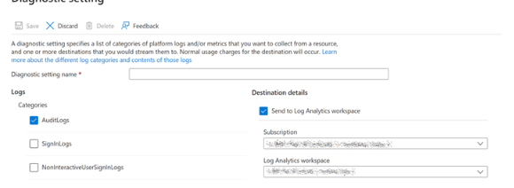

# 監査ログを使用した特権ロール割り当ての管理

こんにちは！ Azure ID チームの小出です。

本記事は、2024 年 1 月 8 日に公開された [Easily Manage Privileged Role Assignments in Microsoft Entra ID Using Audit Logs](https://techcommunity.microsoft.com/t5/microsoft-entra-blog/easily-manage-privileged-role-assignments-in-microsoft-entra-id/ba-p/4013854) の記事を日本語に分かりやすくおまとめしなおした記事となります。ご不明点などございましたら、お気軽にサポートまでお問い合わせをいただけますと幸いです。

---

Microsoft Entra ID をご利用いただくなかで、必ずどのお客様も利用いただくのが「Microsoft Entra ロール (Azure AD ロール)」です。例えば、どのテナントにも「グローバル管理者」ロールを持つユーザーがおり、テナント内のすべての構成に変更を加えることができます。他にも、「ユーザー管理者」ロールや「ヘルプデスク管理者」ロールなど様々なロールが用意されています。

管理者がユーザー A に対して「xx の操作をユーザー A にも実施させたいな」と考えた時には、その操作に対応するロールをユーザー A に付与することで管理権限を委任することができます。既定で用意された組み込みロール以外にも、カスタム ロールを自身で作成してユーザーやグループに割り当てることも可能です。また、不要になったロールを削除したり、適切ではないロールの割り当てを見直して削除したりすることも可能です。

一方で、このように管理権限を委任するときには、最小権限の原則に従い「委任したい操作内容を含む、最小特権のロールを付与する」よう注意を払う必要があります。

特権ロールを持つユーザーに、「本当にそのロール必要です？」と確認すると、ほとんどの場合は「はい、必要です！」と答えると思います。例えば、グローバル管理者ロールを保持しているユーザー A が、他のユーザーのパスワードをリセットする業務を行っている場合、確かにグローバル管理者ロールであればパスワードのリセットが可能なので、ユーザー A はそのロールを取り上げられては困ると主張すると思います。

しかし、パスワードをリセットする業務にグローバル管理者ロールの権限は強すぎます。より低い権限を持つロールが利用できるにもかかわらず、このようにユーザーは無意識のうちに特定のタスクを実行するために高い権限が必要だと考えてしまうのです。例えばこのシナリオの場合、確かにグローバル管理者ロールを使えば他のユーザーのパスワードをリセットできますが、このユーザーが誰のパスワードをリセットする予定なのかをヒアリングし、[Microsoft Entra ID の特権を持つロールとアクセス許可 (プレビュー)](https://learn.microsoft.com/ja-jp/entra/identity/role-based-access-control/privileged-roles-permissions?tabs=admin-center#who-can-reset-passwords) の表を確認すれば、「ユーザー管理者」や「ヘルプデスク管理者」などより小さい権限を持つロールに置き換えることができるかもしれません。

このように、管理者ロールを持つユーザーの活動が注意深く監視および監査されないと、本来必要でないロールを割り当て続けてしまうことになります。ロール割り当ての定期的なチェックと新しい役割割り当てに関するアラートの発報は、特権ロールの割り当てを追跡し管理するにあたり非常に重要です。

## 特権とは

Microsoft Entra ID における特権とは、ディレクトリ上のリソースの管理を何らかの主体に委任し、資格情報や認証/認可のポリシーの変更、制限付きのデータへのアクセスを行えるようにするアクセス許可のことを指します。Microsoft Entra ロールには、それぞれロールごとに、このアクセス許可の内容が定義されています。ロールを割り当てられたユーザーには、このアクセス許可が付与され、様々な管理操作が可能となります。

まずは、割り当てられているロールにどのような管理権限があるのかを確認することが重要です。すべての組み込みロールに定義されている権限は、[こちら](https://learn.microsoft.com/ja-jp/entra/identity/role-based-access-control/permissions-reference) で確認できます。 

また、 Azure ポータル上でロールを検索し、「説明」メニューを開くことでもアクセス許可一覧を確認できます。この方法であれば、カスタム ロールに定義されているアクセス許可も確認できます。


例えば、特権認証管理者ロールと認証管理者ロールは、名前が似ていますが異なるアクセス許可がいくつかあります。特権認証管理者の方が高い権限を持っており、具体的な権限の違いは [こちら](https://learn.microsoft.com/ja-jp/entra/identity/role-based-access-control/privileged-roles-permissions?tabs=admin-center#compare-authentication-roles) にて確認できます。

同様のロール間に違いがあるもう 1 つの例は、エンドユーザーの管理を担うロールです。具体的には、パスワードのリセットができるロールや、機密性の高い属性を編集できるロールなどについてです。これらのロールの違いとニュアンスの詳細は、[ここ](https://learn.microsoft.com/ja-jp/entra/identity/role-based-access-control/privileged-roles-permissions?tabs=admin-center#who-can-reset-passwords) に概説されています。

## アクティビティの監査 

ユーザーに本当にロールが必要かどうかを判断するには、ユーザーのアクティビティを監視し、業務を遂行できる最小権限のロールを見つけることが重要です。そのためには Entra ID の監査ログをご利用いただけます。Entra ID の監査ログは、Log Analytics ワークスペースに送信するか、Sentinel のインスタンスに連携することができます。管理者アカウントによって実行された各種イベントを取得する方法としては  2 つあります。1 つ目は、Sentinel の IdentityInfo テーブルを使用する方法です。IdentityInfo テーブルは、User and Entity Behavior Analytics（UEBA）を有効にすることで、Sentinel でのみ使用できます。Sentinel で UEBA を使用していおらず、Logs Analytics ワークスペースを参照している場合は、後述の Log Analytics を利用する場合の項目をご確認ください。

## Microsoft Sentinel を利用する方法

Entra ID の監査ログを Microsoft Sentinel に取り込むには、Microsoft Entra ID データコネクタを有効にし、以下のように監査ログの設定にチェックを入れる必要があります。


 
IdentityInfo テーブルに、UEBA によって収集されたユーザー情報が格納されます。そのため、ユーザーが割り当てられた Entra ID ロールもここに含まれます。これにより、特権ロールが割り当てられたアカウントの一覧を簡単に取得できます。

以下のクエリを実行すると、アカウントが実行したアクティビティと、そのアカウントに割り当てられたロールの一意のリストが得られます: 

```
AuditLogs
| where TimeGenerated > ago(90d)
| extend ActorName = iif(
    isnotempty(tostring(InitiatedBy["user"])),
    tostring(InitiatedBy["user"]["userPrincipalName"]),
    tostring(InitiatedBy["app"]["displayName"])
)
| extend ActorID = iif(
    isnotempty(tostring(InitiatedBy["user"])),
    tostring(InitiatedBy["user"]["id"]),
    tostring(InitiatedBy["app"]["id"])
)
| where isnotempty(ActorName)
| join kind=inner (IdentityInfo
    | where TimeGenerated > ago(7d)
    | where strlen(tostring(AssignedRoles)) > 2
    | summarize arg_max(TimeGenerated, *) by AccountUPN
    | project AccountObjectId, AssignedRoles)
    on $left.ActorID == $right.AccountObjectId
| summarize Operations = make_set(OperationName) by ActorName, ActorID, Identity, tostring(AssignedRoles)
| extend OperationsCount = array_length(Operations)
| project ActorName, AssignedRoles, Operations, OperationsCount, ActorID, Identity
| sort by OperationsCount desc
```

このクエリを使用すると、Entra ID でタスクを実行したすべてのアカウントの結果が返されますので、着目したい特権操作以外の情報も大量に含まれている可能性があります。特定の Entra ID ロールに絞ってフィルタリングするには、以下のクエリを実行します。例として 3 つのロールの結果を出すようにしていますが、追加で複数のロールを含めていただいて構いません。

```
let PrivilegedRoles = dynamic(["Global Administrator",
                               "Security Administrator",
                               "Compliance Administrator"
                              ]);
AuditLogs
| where TimeGenerated > ago(90d)
| extend ActorName = iif(
    isnotempty(tostring(InitiatedBy["user"])),
    tostring(InitiatedBy["user"]["userPrincipalName"]),
    tostring(InitiatedBy["app"]["displayName"])
)
| extend ActorID = iif(
    isnotempty(tostring(InitiatedBy["user"])),
    tostring(InitiatedBy["user"]["id"]),
    tostring(InitiatedBy["app"]["id"])
)
| where isnotempty(ActorName)
| join kind=inner (IdentityInfo
    | where TimeGenerated > ago(7d)
    | where strlen(tostring(AssignedRoles)) > 2
    | summarize arg_max(TimeGenerated, *) by AccountUPN
    | project AccountObjectId, AssignedRoles)
    on $left.ActorID == $right.AccountObjectId
| where AssignedRoles has_any (PrivilegedRoles)
| summarize Operations = make_set(OperationName) by ActorName, ActorID, Identity, tostring(AssignedRoles)
| extend OperationsCount = array_length(Operations)
| project ActorName, AssignedRoles, Operations, OperationsCount, ActorID, Identity
| sort by OperationsCount desc
```

クエリを実行すると、その結果から、Entra ID テナントで実行されたアクティビティと、それらのアカウントにどのようなロールが割り当てられているかがわかります。以下の例では、上 2 つの結果には何の問題もありません。しかし、3 行目を見ると、グローバル管理者ロールを持つユーザーが、サービス プリンシパルを作成したことがわかります。

サービス プリンシパルを作成する場合、グローバル管理者ロールよりも低い権限で実施できます。したがって、このユーザーにはより低い権限のロールを付与すべきです。付与可能なロールを確認するには、Entra ID で特定のタスクを実行するために必要な最も権限の低いロールが記載されている [このリスト](https://learn.microsoft.com/ja-jp/entra/identity/role-based-access-control/delegate-by-task) を確認ください。


## Log Analytics を利用する方法



Entra ID の監査ログを Log Analytics ワークスペースに取り込むには、[こちら](https://learn.microsoft.com/ja-jp/entra/identity/monitoring-health/howto-integrate-activity-logs-with-azure-monitor-logs) の手順を参照ください。
 
付与されたロールを含むテーブルはないため、クエリにユーザーの一覧を追加してフィルタリングする必要があります。特定の Entra ID ロールが割り当てられているユーザーの一覧を取得するには、いくつかの方法があります。

簡単な方法は、Entra ID にアクセスし、[ロールと管理者] のブレードを選択することです。そこからロールを選択し、ロールが割り当てられた ID をすべてエクスポートしておきます。特権ユーザーの UPN を取得しておくことが重要です。これはユーザーが持つロールと一緒に、これらの UPN をクエリに追加する必要があるためです。クエリ自体にいくつかロールの例を示していいます。ユーザーが複数のロールを持つ場合は、すべてのロールをクエリに追加ください。

```
datatable(UserPrincipalName:string, Roles:dynamic) [
    "admin@contoso.com", dynamic(["Global Administrator"]),
    "admin2@contoso.com", dynamic(["Global Administrator", "Security Administrator"]),
    "admin3@contoso.com", dynamic(["Compliance Administrator"])
]
| join kind=inner (AuditLogs
    | where TimeGenerated > ago(90d)
    | extend ActorName = iif(
        isnotempty(tostring(InitiatedBy["user"])),
        tostring(InitiatedBy["user"]["userPrincipalName"]),
        tostring(InitiatedBy["app"]["displayName"])
    )
    | extend ActorID = iif( 
        isnotempty(tostring(InitiatedBy["user"])),
        tostring(InitiatedBy["user"]["id"]),
        tostring(InitiatedBy["app"]["id"])
    )
    | where isnotempty(ActorName) ) on $left.UserPrincipalName == $right.ActorName
| summarize Operations = make_set(OperationName) by ActorName, ActorID, tostring(Roles)
| extend OperationsCount = array_length(Operations)
| project ActorName, Operations, OperationsCount, Roles, ActorID
| sort by OperationsCount desc
```

クエリを実行すると、フィルタリングしたユーザーによって Entra ID テナントで実行されたアクティビティ情報が得られます。以下の例では、上 2 つの結果に問題があるということがわかります。どちらもグローバル管理者ロールを持っていますが、これらの操作にはグローバル管理者ロールは必要なく、グローバル管理者以外のロールでも実施できます。したがって、これらのユーザーにはより低い権限のロールを付与しなおすべきです。どのロールを付与できるかは、[このリスト](https://learn.microsoft.com/ja-jp/entra/identity/role-based-access-control/delegate-by-task) を確認し、Entra ID で特定のタスクを実行するために必要な最も権限の低いロールを確認ください。


上記例の 1 行目に関して、このユーザーがそれでもグローバル管理者ロールを必要とする場合、グローバル管理者にはセキュリティ管理者ロールよりも多くの権限が含まれているため、セキュリティ管理者ロールは冗長になります。セキュリティ管理者ロールを外しても問題ありません。

## 結論

必要のない権限を持つアカウントをそのままにしておくと、攻撃の対象範囲を必要以上に大きくしておくことになります。Entra ID 監査ログを取り込むことで、不要で過剰なロールを持つユーザーを特定し、適切な代替ロールに割り当て直すことが可能です。
