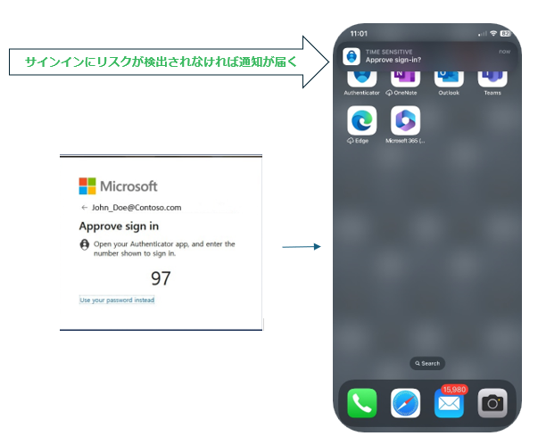
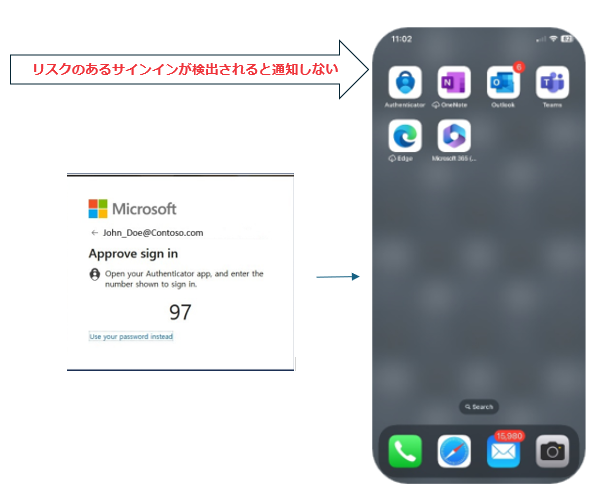
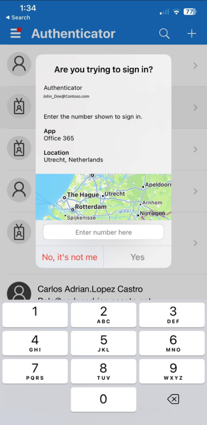

# 認証に電話網を使うのはそろそろやめよう

こんにちは、Azure Identity サポート チームの 高田 です。
 
本記事は、2023 年 11 月 6 日に米国の Microsoft Entra (Azure AD) Blog で公開された [Emphasizing Security by Default with Advanced Microsoft Authenticator Features](https://techcommunity.microsoft.com/t5/microsoft-entra-azure-ad-blog/emphasizing-security-by-default-with-advanced-microsoft/ba-p/3773130) の抄訳です。ご不明点等ございましたらサポート チームまでお問い合わせください。

---

弊社では、これまで多要素認証 (MFA) の重要性を強調し、MFA の方法によって認証の強度に違いがあること、特に Microsoft Authenticator は電話認証 (そろそろ使うのやめましょう！) よりもかなり安全性が高いことを繰り返し申し上げてきました。またこれまでの取り組みとして、Microsoft Authenticator における番号の一致機能を実装することで、MFA 疲労攻撃を行う悪意ある攻撃者の阻止に取り組んできました。

この番号の一致機能は非常に効果的であるものの、MFA 疲労攻撃を仕掛けてくる攻撃者の影響をユーザーが受けてしまう余地はまだあります。というのも、モバイル デバイス上に表示される認証のポップアップ通知が (ユーザーにとっては非常に便利な機能ではあるのですが) 攻撃者によるフィッシングの "きっかけ" を与えてしまうことがあるのです。この対応として、通常とは異なると判断された認証要求に関しては、Authenticator アプリのポップアップ通知を抑制するという追加の対応を取ることといたしました。これらの変更は 9 月末に完了し、信頼性の低いポップアップ通知の数を減らすことに成功しました。この展開が始まって以来、**600 万件以上のパスワードレスおよび MFA 通知** を防ぐことができました。これら抑制した通知の大部分は、顧客にとって価値のないハッカーによる通知でした。

## 危険な Authenticator 通知の抑制

この機能の展開後、現在では、認証要求の発信元が見知らぬ場所である場合や、その他の異常が見られる場合など、潜在的なリスクが検出された場合に Authenticator によるポップアップ通知を抑制しています。この対応により、お客お客様にとって係な認証ポップアップを排除することとなり、ユーザーの不便さを大幅に軽減しました。

認証要求に問題がなければ、以下のようにモバイル　デバイスに通知が届きます。

危険と思われる認証要求があった場合、**ポップアップ通知はユーザーに送信されません**。代わりに、Authenticator アプリを開き、表示された番号を入力してサインインするよう求められます。

ユーザーが Authenticator アプリを開けば、認証要求が表示され、ユーザーはそれを承諾もしくは拒否することが可能となります。

ユーザーが Authenticator アプリを開けば、その内容をユーザーが確認可能です。

## Authenticator の通知の取得

通知が勝手に削除されるわけではない点にご注意ください。単に通知が抑制されるだけであり、Authenticator アプリを開けばユーザーが認証要求を確認することが可能です。ユーザーが通常とは異なる場所から、実際に自身で認証要求を行った場合も、Authenticator アプリを開くことで通知を取得することができます。Authenticator アプリはすべての認証通知をまとめる箇所として機能しますので、見逃した要求があっても、簡単にそれを確認できるはずです。

## まとめ

この機能の実装により、ユーザーによりスムーズで安全な体験が提供できたと考えています。テクノロジーの進化に伴い、ユーザーの利便性を高めると同時にセキュリティを強化することは極めて重要です。この [新しいアプローチ](https://learn.microsoft.com/ja-jp/azure/active-directory/authentication/concept-authentication-authenticator-app) はその良い例といえるでしょう。

Alex Weinert  
VP Director of Identity Security, Microsoft
