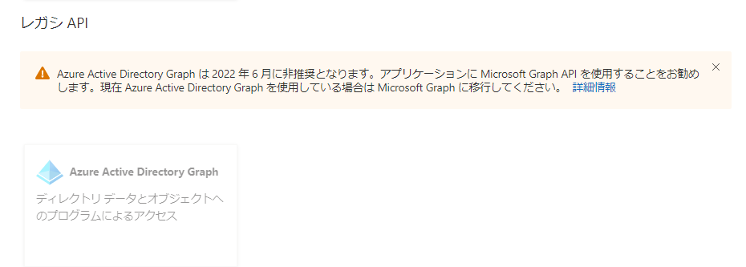

--- 
title: Azure ポータル UX における Azure AD Graph 権限のサインアップのサポート終了
date: 2021-12-26 09:00 
tags: 
  - Azure AD 
  - US Identity Blog 
--- 
 
# Azure ポータル UX における Azure AD Graph 権限のサインアップのサポート終了

こんにちは、Azure Identity サポート チームの中井です。

本記事は、2021 年 12 月 8 日に米国の Azure Active Directory Identity Blog で公開された [End of support for Azure AD Graph permission sign up through portal UX](https://techcommunity.microsoft.com/t5/azure-active-directory-identity/end-of-support-for-azure-ad-graph-permission-sign-up-through/ba-p/2464404) を意訳したものになります。ご不明点等ございましたらサポート チームまでお問い合わせください。

----

皆さん、こんにちは。
 
昨年、[Azure AD Graph API と ADAL (Azure Active Directory Authentication Library) の廃止](https://techcommunity.microsoft.com/t5/azure-active-directory-identity/update-your-applications-to-use-microsoft-authentication-library/ba-p/1257363) を発表しました。廃止プロセスの一環として、8 月に [こちら](https://twitter.com/Microsoft365Dev/status/1432810426442649603?s=20) でお知らせしたように、 Azure ポータル画面からアプリ登録する際の以下の Azure AD Graph API の権限設定を無効化しました。

この変更の目的は、Azure AD Graph を使用するよう設定される新規アプリケーションの数を減らし、新規アプリケーションを Azure AD Graph API で構成するようなレガシーなプロセスが残っていないか確認することにあります。Azure AD Graph の権限を持つ既存のアプリケーションは、API が廃止されるまで引き続き動作し、Azure AD Graph の権限の表示、同意、設定、削除は引き続き Azure ポータルを使用して行うことが可能です。

アプリケーションの移行作業中に、まだアプリケーションに Azure AD Graph 権限を追加する必要がある場合は、次のいずれかの方法をご利用ください。

- Azure ポータルを使用して、組織が使用する API を検索します。
- Azure ポータルでアプリケーション 仕様書を更新します。
- Microsoft Graph [application API](https://docs.microsoft.com/graph/api/resources/application?view=graph-rest-1.0) を使用し、[requiredResourceAccess](https://docs.microsoft.com/graph/api/resources/requiredresourceaccess?view=graph-rest-1.0) プロパティを更新します。
- Microsoft Graph PowerShell [Update-MgApplication](https://docs.microsoft.com/powershell/module/microsoft.graph.applications/update-mgapplication?view=graph-powershell-1.0) コマンドレットを使用して RequiredResourceAccess オブジェクトを更新します。

詳細なガイダンスは、[移行 FAQ](https://docs.microsoft.com/graph/migrate-azure-ad-graph-faq#i-need-to-add-new-azure-ad-graph-permissions-to-my-app-but-i-cant-select-azure-ad-graph-as-a-required-permission-for-my-app-registration-how-can-i-add-the-azure-ad-graph-permissions) を参照ください。

上記にて紹介しました権限設定の方法は、Azure AD Graph API が廃止されるまでご利用可能です。アプリケーションを移行した後は、アプリケーションから Azure AD Graph 権限を削除し、Microsoft Graph 権限のみを保持することをお勧めします。弊社ではお客様がアプリケーションを [Microsoft Graph API](https://docs.microsoft.com/graph/overview) に移行するための取り組みを支援させていただきますので、移行過程でお力になれることがございましたらお知らせください。

Alex Simons (Twitter: [@Alex_A_Simons](http://twitter.com/alex_a_simons))  
Corporate Vice President of Program Management  
Microsoft Identity Division
