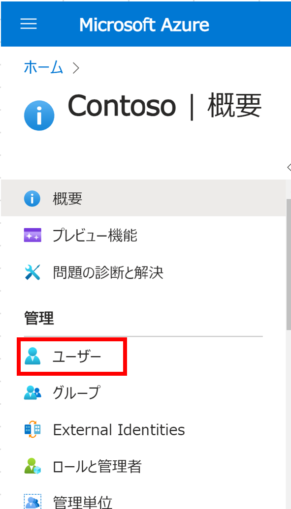
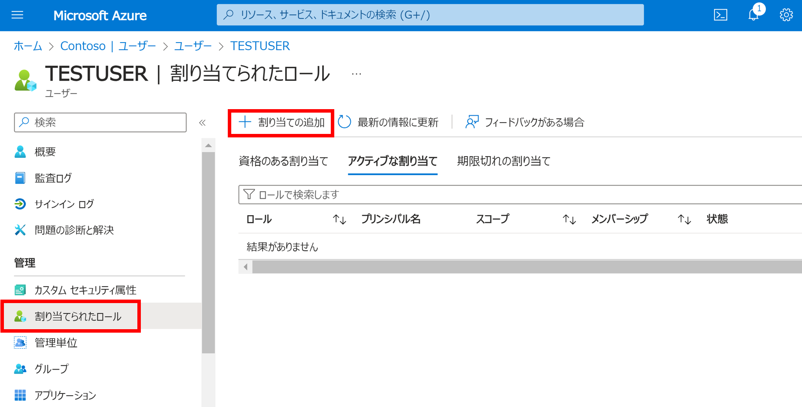
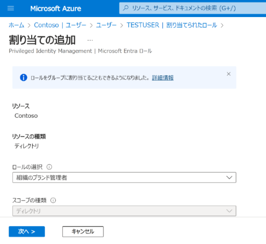

こんにちは、Azure Identity サポート チームの 名取 です。

本記事は、2024 年 4 月 18 日に米国の Microsoft Entra Blog で公開された[Enforce least privilege for Entra ID company branding with the new organizational branding role](https://techcommunity.microsoft.com/t5/microsoft-entra-blog/enforce-least-privilege-for-entra-id-company-branding-with-the/ba-p/4115772) を意訳したものになります。ご不明点等ございましたらサポート チームまでお問い合わせください。

----

みなさん、こんにちは。

Microsoft Entra ID の会社のブランド機能を管理できる新しいロールの一般提供 (GA) について発表できることを嬉しく思います。

この新しいロールは、Entra ID の会社のブランド機能を通じて認証ユーザー エクスペリエンス (UX) をカスタマイズする際に、ユーザーに最小特権のロールを適用し、ゼロ トラスト ネットワーク アクセスを実装するための継続的な取り組みの一環となります。

以前は、Entra ID の会社のブランド機能を構成したい場合には、グローバル管理者のロールが必要でした。しかし、このロールには、Entra ID の会社のブランド機能の構成に必要な権限以外の広範な権限を持っています。

会社のブランド機能のための新しいロールは、その権限を Entra ID の会社のブランド機能の構成に制限することで、セキュリティを大幅に改善させ、会社のブランド機能の構成をきっかけとした攻撃を防ぐことにつながります。

会社のブランド機能の構成のための新しいロールをユーザーに割り当てるには、以下の手順をご確認ください:

 1. Microsoft Entra ID にサインインし、ユーザー を選択します。
  

 2. 会社のブランド機能の役割を割り当てるユーザーを選択し、開きます。
  
 
 3. [**割り当てられたロール**]を選択し、[**＋割り当ての追加**]を選択します。
  
 
 4. [**組織のブランド管理者**] company ロールを選択し、ユーザーに割り当てます。
   
 
設定が適用されると、ユーザーは Entra ID の会社のブランド機能を通して認証 UX を構成できるようになります。

会社のブランド機能を設定し、ユーザーに一貫したサインインを提供する方法については、[こちら](https://learn.microsoft.com/ja-jp/entra/fundamentals/how-to-customize-branding)をご覧ください。

James Mantu 
Sr. Product Manager, Microsoft identity
