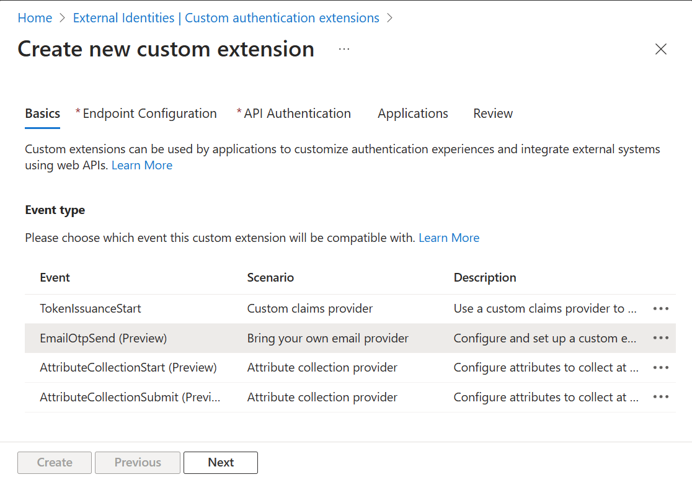

---
title: カスタム OTP E メール プロバイダーのサポートでエンドユーザー体験が向上

tags:
tags:
  - Device
---
  - Device

  - Microsoft Entra
こんにちは、Azure Identity サポート チームの 名取 です。

本記事は、2024 年 12 月 5 日に米国の Microsoft Entra Blog で公開された [Enhance end-user experiences with Custom OTP Email Provider Support](https://techcommunity.microsoft.com/blog/identity/enhance-end-user-experiences-with-custom-otp-email-provider-support/3627346) を意訳したものになります。ご不明点等ございましたらサポート チームまでお問い合わせください。

----

# カスタム OTP E メール プロバイダーのサポートでエンドユーザー体験が向上

現代のデジタル時代において、シームレスなユーザー体験を提供することは、ブランドの強化、ユーザーの信頼獲得、ビジネスの成長にとって非常に重要です。Microsoft External ID の一般提供 (GA) により、一般消費者向けに高度なセキュリティとコンプライアンスを備えたユーザー体験が構築可能となりました。弊社は管理者と開発者の両方にとってシンプルでシームレスな体験を提供することを目指しており、直近のブログでは、モバイル アプリケーション向けに完全にカスタマイズ可能な [ネイティブ認証](https://devblogs.microsoft.com/identity/native-auth-for-external-id-ga/) や [管理者向けの組み込みセキュリティ コントロール](https://www.microsoft.com/ja-jp/security/business/identity-access/microsoft-entra-external-id) を紹介しました。


----

## 外部向けアプリケーションで利用できる新しいカスタム認証拡張機能
本記事は、2024 年 12 月 5 日に米国の Microsoft Entra Blog で公開された [Enhance end-user experiences with Custom OTP Email Provider Support](https://techcommunity.microsoft.com/blog/identity/enhance-end-user-experiences-with-custom-otp-email-provider-support/3627346) を意訳したものになります。ご不明点等ございましたらサポート チームまでお問い合わせください。
こんにちは皆さん

今日は、新しくリリースされたカスタム認証拡張機能を紹介いたします 。この拡張機能により、サインアップ、サインイン、パスワード忘れの際に発生するワン タイム パスコードの利用において、マイクロソフトやマイクロソフト以外の E メール プロバイダーとの統合が可能になります。ぜひ、本日よりパブリック プレビューをお試しください。
----

## 消費者向けアプリケーションでワン タイム パスコード用にカスタム E メール プロバイダーを設定する
## 外部向けアプリケーションで利用できる新しいカスタム認証拡張機能



代わりに Azure Function App を作成することも可能です。この場合、HTTP トリガー関数を作成して、その関数の既定の設定値を更新ください。

### EmailOtpSend カスタム認証拡張機能の構成する

EmailOtpSend カスタム認証拡張機能は、Microsoft Entra 管理センターのカスタム認証拡張のブレードで設定できます。そこで新しいカスタム認証拡張機能を登録し、それをアプリケーションに接続し、カスタム E メール プロバイダーをアプリケーションに割り当てます。

ここで、管理者が実際に独自の Email プロバイダーを設定 - BYOE (Bring Your Own Email) - し、API を使用して自動化する流れを見てみましょう。
- **基本設定** - ここでは EmailOtpSend のイベントの種類を選択できます。

- **エンドポイントの設定** - API エンドポイントを設定します。
- **API の認証** - API エンドポイントへの呼び出しを安全に行うためのフローを構成します。
    
- **アプリケーション** - EmailOtpSend のイベントを割り当てるアプリケーションを指定します。

ここで、管理者が実際に独自の Email プロバイダーを設定 - BYOE (Bring Your Own Email) - し、API を使用して自動化する流れを見てみましょう。

    
Senior Product Manager, Microsoft Identity and Network Access  
LinkedIn: Sasha Mars | LinkedIn

    

- **API の認証** - API エンドポイントへの呼び出しを安全に行うためのフローを構成します。
    

- **アプリケーション** - EmailOtpSend のイベントを割り当てるアプリケーションを指定します。

    

Microsoft Entra External ID テナントをまずご用意の上、ぜひ EmailOtpSend によるカスタム認証拡張機能をお試しください。

カスタム認証拡張機能の詳細については、[こちら](https://learn.microsoft.com/ja-jp/entra/identity-platform/custom-extension-email-otp-get-started?tabs=azure-communication-services%2Cazure-portal) をご覧ください。

いつも皆様からのフィードバックをお待ちしております。以下のリンクより新機能に関するご意見をお寄せください。

Sasha Mars  

Senior Product Manager, Microsoft Identity and Network Access  

LinkedIn: Sasha Mars | LinkedIn
