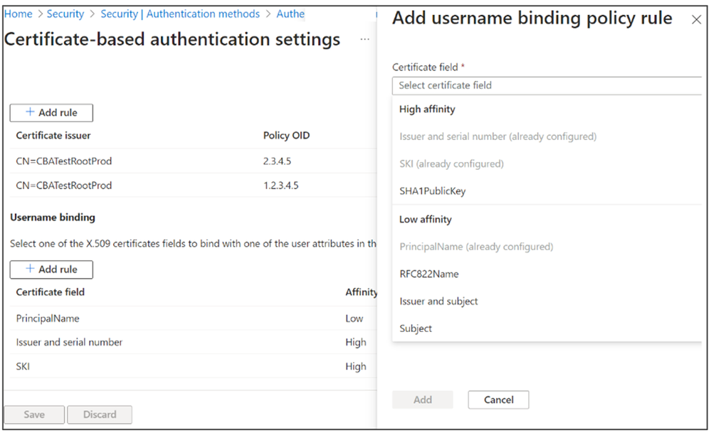
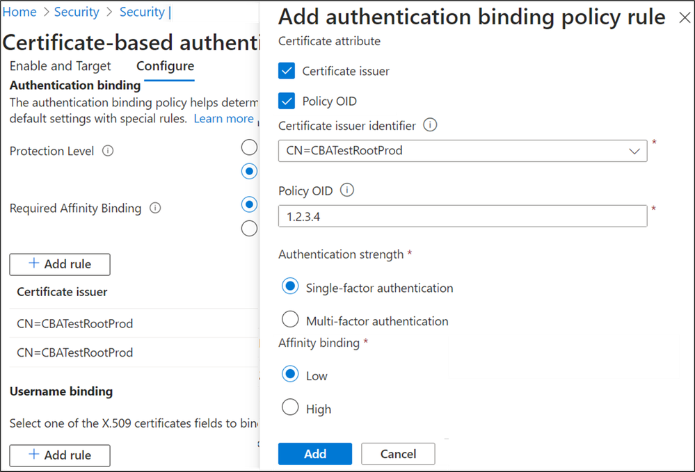

# Microsoft Entra  証明書ベース認証 (CBA) の機能強化

こんにちは、Azure Identity サポート チームの 五十嵐 です。

本記事は、2023 年 12 月 13 日に米国の Microsoft Entra (Azure AD) Blog で公開された [Enhancements to Microsoft Entra certificate-based authentication](https://techcommunity.microsoft.com/t5/microsoft-entra-blog/enhancements-to-microsoft-entra-certificate-based-authentication/ba-p/1061417) の抄訳です。ご不明点等ございましたらサポート チームまでお問い合わせください。

---

Ignite 2022 では、Microsoft Entra 証明書ベース認証 (CBA) の一般提供開始を発表しました。政府機関のお客様と協力してきた経験から、連邦政府内で使用される最も一般的な認証方法は PIV/CAC カードです。PIV/CAC カードを使用している連邦政府組織や、[大統領令 14028 「国家のサイバーセキュリティの向上」](https://www.whitehouse.gov/briefing-room/presidential-actions/2021/05/12/executive-order-on-improving-the-nations-cybersecurity/) の要件に簡単に準拠したいお客様、加えて Active Directory Federated Server のような連携サーバーから Entra ID for CBA に移行したいお客様にとって、直接 Entra ID に対して認証に X.509 証明書を使用できることは非常に重要です。

それ以来、弊社では多くの新機能を追加し、モバイルを含むすべてのプラットフォームで CBA を利用できるようにし、デバイス上の証明書だけでなく、YubiKeys のような外部セキュリティ キーもサポートしました。お客様は、証明書やリソースの種類、ユーザーのグループごとに認証ポリシーをカスタマイズしたり、ユーザーごとに証明書の強度を選択したり、多要素認証やステップアップ認証のために CBA を他の方法と併用することも可能です。加えて、テナント全体またはユーザーのグループごとに証明書バインディングを構成したりするなど、より制御性と柔軟性を向上させることができるようになりました。

Microsoft Entra のプロダクト マネージャーである Vimala Ranganathan より、これらの新機能がフィッシングに強い MFA の実現にどのように役立つかについてご説明します。

ぜひご感想をお聞かせください！
Alex Weinert

--

皆さんこんにちは、

Microsoft Entra PM チームの Vimala です。CBA の新機能と機能強化について詳しく説明させていただきます。

**CBA のユーザー名のバインド** : CBA は、追加で 3 つのユーザー名のバインドをサポートし、オンプレミスの Active Directory と同等の機能を提供するようになりました。追加された 3 つの証明書バインドは以下のとおりです:

- IssuerAndSerialNumber (発行者とシリアル番号)
- IssuerAndSubject (発行者とサブジェクト)
- サブジェクトのみ

ユーザー名のバインド ポリシーは、Entra ID がユーザから提示された証明書を、Entra ID のユーザー アカウントとどのように一致させるかを管理者がカスタマイズできるようにするものです。既定では、証明書の Subject Alternative Name (SAN) 属性の Principal Name をユーザー オブジェクトの UserPrincipalName にマッピングします。管理者は既定の設定をオーバーライドしてカスタムのマッピングを作成できます。

詳しくは [ユーザー名バインド ポリシーを構成する](https://learn.microsoft.com/ja-jp/entra/identity/authentication/how-to-certificate-based-authentication#step-4-configure-username-binding-policy) をご覧ください。

**CBA 認証ポリシー ルール** : このルールは、認証の強度を単一要素または多要素のいずれとして扱うかを定めるものです。Entra ID で利用可能な他の認証方式は常に単一要素もしくは多要素のどちらか一方での扱いですが、CBA はどちらとしても扱うことができます。管理者は、認証ポリシー ルールを構成することで、Entra ID が証明書をいつ単一要素または多要素とみなすかを選び、保護のレベルを設定できます。複数のカスタム認証バインドのルールを作成し、証明書の属性 (発行者またはポリシー OID、または発行者と OID の組み合わせ) に基づいて、証明書に関する既定の保護レベルを割り当てることができます。

詳しくは [認証バインド ポリシーを構成する](https://learn.microsoft.com/ja-jp/entra/identity/authentication/how-to-certificate-based-authentication#step-3-configure-authentication-binding-policy) をご覧ください。

**CBA アフィニティ バインド** :  この設定は、ユーザー認証において証明書を検証する際に使用される証明書の属性に関するものです。先に紹介したように、証明書をユーザー オブジェクトとバインドまたは照合させるにはいくつかの方法かあります。その中には、簡単に再利用できるユーザー証明書のプロパティを使用しているものもあります。この再利用の容易さにより、特定のユーザー バインドの方法が高アフィニティ (強い関連付け) か低アフィニティ (弱い関連付け) かが決まります。例えば、SAN Principal Name に基づくユーザー バインド利用すると、これは低アフィニティになります。Issuer+SerialNumber に基づくユーザー バインドは高アフィニティです。Entra ID では、管理者がテナント レベルでアフィニティ バインドを設定したり、カスタム ルールを作成して高アフィニティまたは低アフィニティのマッピングを使用したりすることができ、お客様の多くの潜在的なシナリオをカバーすることができます。

詳しくは [ユーザー名のバインド ポリシーについて](https://learn.microsoft.com/ja-jp/entra/identity/authentication/concept-certificate-based-authentication-technical-deep-dive#understanding-the-username-binding-policy) をご覧ください。

**第 2 要素としての CBA** : この機能により Entra リソースにアクセスするための多要素認証 (MFA) の一要素として CBA がサポートされるようになりました。詳しくは [CBA による MFA](https://learn.microsoft.com/ja-jp/entra/identity/authentication/concept-certificate-based-authentication-technical-deep-dive#mfa-with-single-factor-certificate-based-authentication) をご覧ください。

| 第 1 要素 | 第 2 要素 | MFA |
|---|---|---|
| 単一要素による CBA | パスワードレスの電話によるサインイン (PSI) | 持っているもの + 持っている/知っているもの |
| 単一要素による CBA | FIDO 2 | 持っているもの + 持っている/知っているもの |
| パスワード | CBA (単一要素または多要素) | 知っているもの + 持っているもの |

**最後に使用された方法としての CBA** : ユーザーが CBA を使用して認証に成功すると、MRU (Most Recently Used: 最後に使用された) の方法として CBA が設定されます。それ以降、サインイン画面でユーザーが自身の UPN を入力して [**次へ**] をクリックすると、直接 CBA の認証に移動するため、[証明書またはスマート カードを使用する] を選択する必要がなくなります。MRU の方法をクリアするには、証明書の選択画面をキャンセルし、[その他のサインイン方法] をクリックします。ユーザーが利用できる別のメソッドを選択し、認証に成功すれば MRU の方法がクリアされます。詳しくは [MRU 方法での CBA](https://learn.microsoft.com/ja-jp/entra/identity/authentication/concept-certificate-based-authentication-technical-deep-dive#certificate-based-authentication-in-mostrecentlyused-mru-methods) をご覧ください。

Windows 端末上で Entra ハイブリッド参加および Entra 参加済みデバイスをご利用のユーザーは、スマート カードで Windows にサインインし、プライマリ更新トークン (PRT) を取得して、Entra リソースにシングル サインオン (SSO) することも可能です。詳しくは [Windows スマート カード サインイン](https://learn.microsoft.com/ja-jp/entra/identity/authentication/concept-certificate-based-authentication-smartcard) をご覧ください。

また、Microsoft Entra CBA の詳細については、http://aka.ms/aadcba および [Executive Order 14028](https://msus-sites.azurewebsites.net/en-us/federal/cybersecurity.aspx) に対する Microsoft のコミットメントをご覧ください。

## 今後の予定

[Azure Active Directory Community](https://feedback.azure.com/d365community/forum/22920db1-ad25-ec11-b6e6-000d3a4f0789) にフィードバックをお寄せください！弊社では、証明書失効リスト (CRL) の制限の撤廃、新しい認証局のトラスト ストア、B2B 外部ゲスト ユーザー用のリソース テナントでの CBA サポート、iOS UX の強化など、さらなる機能強化を実現するために鋭意取り組んでいます。
