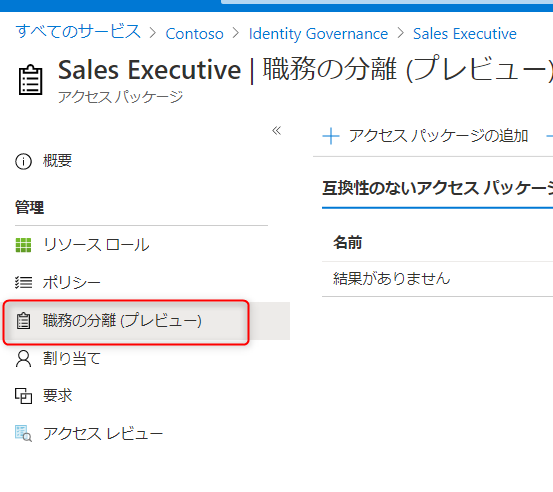
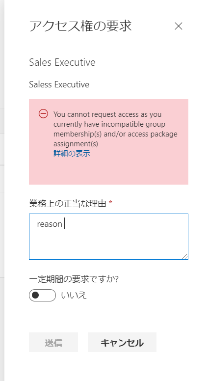

# アクセス レビューにおける職務の分離チェックによるコンプライアンスの確保

こんにちは、Azure Identity サポート チームの中井です。

本記事は、2021 年 7 月 26 日に米国の Azure Active Directory Identity Blog で公開された [Ensure compliance using separation of duties checks in access requests](https://techcommunity.microsoft.com/t5/azure-active-directory-identity/ensure-compliance-using-separation-of-duties-checks-in-access/ba-p/2466939) を意訳したものになります。ご不明点等ございましたらサポート チームまでお問い合わせください。

------

Azure Active Directory（Azure AD）の Identity Governance 機能により、一貫したプロセスや透明性を伴った従業員の生産性と、セキュリティに対する企業のニーズの間のバランスを取ることができます。
現在プレビュー中である、 Azure AD エンタイトルメント管理の新しい [職務の分離チェック機能](https://docs.microsoft.com/en-us/azure/active-directory/governance/entitlement-management-access-package-incompatible) により、ユーザーによる過剰ないしは互換性のないアクセス権の取得を防ぐことができるようになります。
 
今日、弊社のカスタマー ストーリー サイトにて紹介されているような多くの企業では、Azure AD Identity Governance のエンタイトルメント管理とアクセス レビュー機能を活用することで、アクセス期間の制限を設定し、ユーザーがビジネス上重要なアプリケーションへのアクセス権を必要以上に長期間保持しないようにしています。
 

エンタイトルメント管理では、グループ、チーム、アプリ ロール、サイト ロールなどのすべてのプロジェクト リソースを単一のアクセス パッケージに束ねることができます。例えば、ユーザーがセールス アプリケーションで Sales Executive ロールを必要としている場合、そのロールを含むアクセス パッケージをリクエストすることができます。 アクセス レビューが承認されると、ディスカッションのためのチームや、ドキュメント保存のための関連する SharePoint Online サイトへのアクセス権が付与さあれます。任務が終了すると、そのアクセス権は自動的に削除されます。

職務の分離チェック機能では、不正使用につながる恐れのある権限の組み合わせをユーザーが受け取らないようにすることで、リスクの可能性を減らすことができるため、Azure AD の Identity Governance における最も追加要望の多い機能の一つでした。

## 職務の分離チェック機能の仕組み

セールスアプリケーションに加えて、会計アプリケーションがあるとします。
管理者は、誰もセールスアプリケーションと会計アプリケーション両方のデータを変更できないようにするべきだと考えています。 そのために、すべての承認プロセスにおいて、会計へのアクセスを要求するユーザーがすでに販売へのアクセス権を持っているかかどうか、またその逆はないかどうか確認を行いたいと考えています。

職務の分離（プレビュー）チェック機能では、ユーザーがすでに別のアクセス パッケージに割り当てられていたり、他のグループのメンバーであったりする場合に、そのユーザーがアクセス パッケージを要求できないよう制限することができます。セールスと会計のアクセスパッケージの互換性を無くすよう Azure ポータルまたは [Graph API](https://docs.microsoft.com/ja-jp/graph/api/resources/accesspackage?view=graph-rest-beta) いずれかの方法にて設定することで、承認者（管理者）はユーザーの割り当てを手動で確認する必要がなくなるため、アプリケーションの管理プロセスを簡略化することができます。

## 2ステップで職務の分離チェックを設定する
会計スペシャリストのアクセス パッケージを持っている人が、マイアクセスページにアクセスしてセールス エグゼクティブのアクセス パッケージを要求すると、現在のアクセスに互換性がないことが通知されます。 通知を受けたユーザーは、現在の要求を取りやめるか、異なるロールで別のアクセス パッケージを要求することができます。

設定に必要なステップはたった２つです。

1. アプリケーションを、グループとチーム、または Share Pointサイトとともに、[エンタイトルメント管理カタログ](https://docs.microsoft.com/ja-jp/azure/active-directory/governance/entitlement-management-access-package-first)に追加し、アクセス パッケージを設定します。 Azure を使用している場合は、Azure ロールに割り当てられたセキュリティ グループを追加することもできます。

2. これらのアクセス パッケージに対し、[職務の分離（プレビュー）](https://docs.microsoft.com/en-us/azure/active-directory/governance/entitlement-management-access-package-incompatible) を設定します。 その後、Azure AD の監査ログ、あるいは、Azure Monitor における[アクセスパッケージのアクティビティやアプリケーション ロールの割り当てについての Workbook](https://docs.microsoft.com/ja-jp/azure/active-directory/governance/entitlement-management-logs-and-reporting)を利用することで、ユーザーがどのようにアクセスしたかをレポートすることができます。

本プレビュー機能をご利用いただき間もない場合であっても、エンタイトルメント管理や他のAzure AD Identity Governance 機能を既にご利用いただいている場合であっても、皆様よりフィードバックをお待ちしております。
 