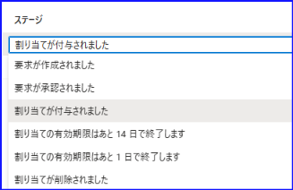
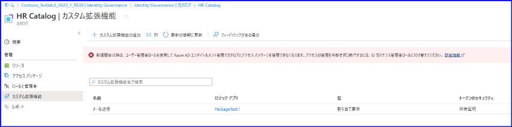
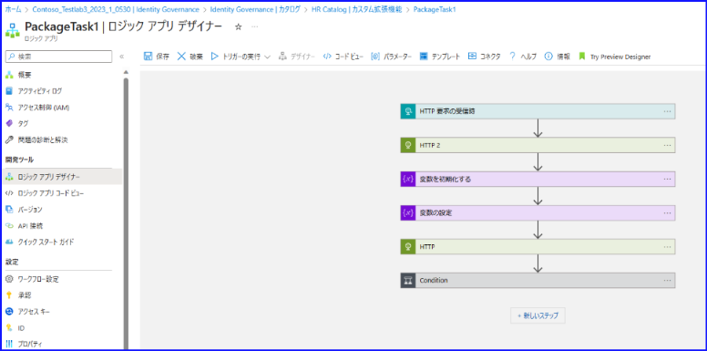
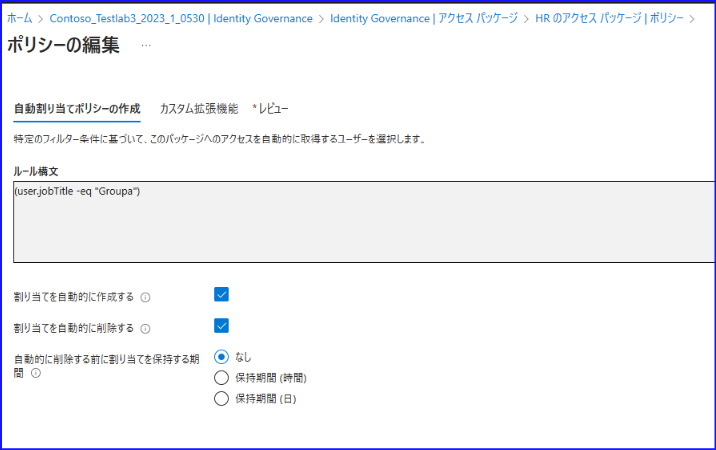
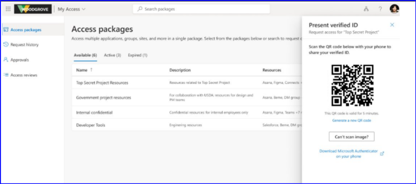
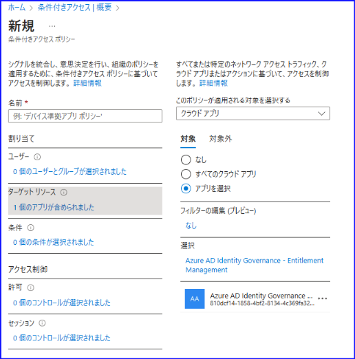
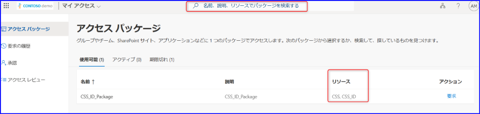

こんにちは。 Azure ID チームの小出です。

本記事は、2023 年 7 月 18 日に公開されました  [Microsoft Entra ID Governance Entitlement Management New Generally Available Capabilities](https://techcommunity.microsoft.com/t5/microsoft-entra-azure-ad-blog/microsoft-entra-id-governance-entitlement-management-new/ba-p/2466929)  の記事をもとに、分かりやすく日本語におまとめしなおした記事となります。ご不明点などございましたらお気軽にサポートまでお問い合わせください。

今回の記事では、エンタイトルメント管理にて、新しく一般公開 (GA) された機能について、それぞれ詳細をご紹介いたします。

## 1. カスタム拡張属性を利用したアクセス パッケージ

アクセス パッケージを作成するときに、任意項目なのでスキップしてしまいがちですが、下記のように「カスタム拡張機能」を指定できる機能があります。こちらが一般公開されました。

この機能を使うと、アクセス パッケージが割り当てられたときや期限が切れそうなときに、事前に指定したカスタム拡張機能を実行することができます。たとえば上記のスクリーンショットでは、アクセス パッケージの割り当てが行われたことをメール通知するような機能をカスタム拡張機能として指定しています。その他にもカスタム拡張機能の実行のタイミングとして以下を選択可能です。

カスタム拡張機能はカタログ内に項目として存在しており、下記から新しい拡張機能を作成することができます。また、以下の例では packageTask1 というロジック アプリに拡張機能を紐づけ、カスタム拡張機能が呼び出されると、このロジック アプリが実行される仕組みになっています。

プログラミング スキルがなくても、下記のようなデザイナーを使って、どのような処理を行いたいかを GUI 上で構成することが可能です。

なお、恐縮ながらスクリプトの支援と同様、ロジック アプリの具体的な記載方法などについてはサポートでは支援が難しい場合があります。[こちらの公開情報](https://learn.microsoft.com/ja-jp/azure/active-directory/governance/entitlement-management-logic-apps-integration) を参考いただき、まずはお客様側で実装いただけますと幸いです。

別途カスタム拡張機能を利用したサンプルなどをまとめしたブログを現在執筆しておりますので、公開次第こちらでもリンクをご紹介します。

## 2. アクセス パッケージの動的割り当てポリシー

これまでアクセス パッケージでは、パッケージを割り当てたいユーザーを個別に指定するか、ユーザー側から要求してもらう必要がありましたが、動的割り当てポリシーが用意されたことにより、動的グループや動的管理単位のように、事前に指定したルールをもとにアクセス パッケージをユーザーへ割り当てることができるようになりました。

作成したアクセス パッケージのポリシー メニューにて、「自動割り当てポリシーの追加」 をクリックすると、下記のように、ルール構文を指定することができます。

詳細につきましては、[こちらの公開情報](https://learn.microsoft.com/ja-jp/azure/active-directory/governance/entitlement-management-access-package-auto-assignment-policy) をご確認ください。

## 3. エンタイトルメント管理における Verified ID

2023 年の春に、Verified ID とエンタイトルメント管理の統合について、パブリック プレビューを開始し、今回機能が一般公開されました。この統合により、Verified ID チェックをアクセス要求管理ワークフローに組み込むことができるようになりました。Verified ID チェックを利用することで、人的ミスを排除して不正アクセスのリスクを低減し、セキュリティを強化することができます。

## 4. 条件付きアクセスにおけるエンタイトルメント管理のサポート

条件付きアクセス ポリシーにおいて、エンタイトルメント管理のアプリを指定することができるようになりました。エンタイトルメント管理のアプリケーションは、Azure AD Identity Governance - Entitlement Management となります。たとえば利用シナリオとしては、このエンタイトルメント管理のアプリケーションや My access を条件付きアクセス ポリシーの適用対象外のアプリとして追加することなどが挙げられます。

## 5. My Access での検索機能が改善

アクセス パッケージをより効率的に検索できるよう、パッケージの中に含まれるリソースが表示されるようになりました。また、アクセスパッケージ名、説明、リソースなどの追加条件を使用してアクセスパッケージを検索できるようになりました。

新しく一般公開されたエンタイトルメント管理の機能をぜひご利用ください。
