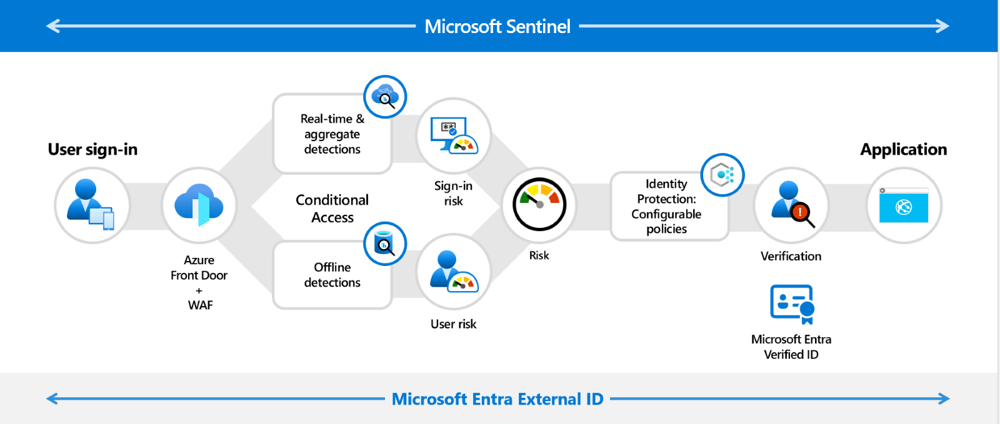

# External ID とともに CIAM 戦略を進化させましょう

こんにちは、Azure Identity サポートチームの 山下 です。

本記事は、2024 年 6 月 27 日に米国の Azure Active Directory Identity Blog で公開された [Evolve your CIAM strategy with External ID](https://techcommunity.microsoft.com/t5/microsoft-entra-blog/evolve-your-ciam-strategy-with-external-id/ba-p/3627348) を意訳したものになります。ご不明点等ございましたらサポート チームまでお問い合わせください。

----

次世代の顧客 ID アクセス管理機能を実現するソリューションである、[Microsoft Entra External ID](https://www.microsoft.com/ja-jp/security/business/identity-access/microsoft-entra-external-id) の [一般提供が先月発表されました](https://jpazureid.github.io/blog/azure-active-directory/announcing-general-availability-of-microsoft-entra-external-id/)。External ID は、以下のことを可能にし、顧客 ID アクセス管理（CIAM）を安全かつシンプルにします。

- **すべての外部 ID を保護：** 複数の異なるソリューションを管理すると、セキュリティ対策が複雑になりすぎることが想像されます。External ID を CIAM ソリューションとして採用することで、独自の条件付きアクセス エンジン、検証可能な資格情報、および組み込みの ID ガバナンスを含む、業界をリードするセキュリティを備えた Microsoft Entra の管理センター内で、すべての外部 ID を保護することができます。 

- **スムーズなユーザー体験を実現：** 詐欺や生成 AI 、ID 攻撃の台頭により、オンラインのセキュリティ リスクに対するエンド ユーザーの不安が高まっています。External ID を使用することで、スムーズな、ブランド化された、ユーザー中心のインターフェースをウェブやモバイル アプリケーションに構築し、ブランド認知度を高め、ユーザーの信頼を築き、ユーザー エンゲージメントを促進することができます。例として、[WoodGrove Groceries](https://aka.ms/ExternalIDWoodgroveDemo) のデモをご覧ください！

- **安全なコラボレーションの簡略化：** 外部ユーザーとコラボレーションし、適切なタイミングで適切なアクセス権を確保することには手間がかかります。External ID を使用してお客様を招待し、SharePoint、Teams、OneDrive 全体でアクセスできる社内リソースを定義することで、コラボレーションを簡略化することができます。 

- **セキュアなアプリケーション開発を加速：** 堅牢で広範なユーザー フローをアプリケーションに統合するために、開発者は数か月かけることがあります。External ID の豊富な API、SDK、および Visual Studio Code などの開発者ツールとの統合を活用することで、外部向け Web アプリケーションやモバイル アプリケーションに、セキュアでブランド化された ID 体験を構築し、開発時間を数分に短縮させることが可能です。

- **スケーラブルなエンド ツー エンドのセキュリティを提供：** 複数のセキュリティ スタックを管理するのはコストがかかります。External ID は、拡張性や、エンド ツー エンドのセキュリティに妥協することなく、成長する顧客にとって費用対効果の高い革新的な CIAM 機能を提供します。例えば、このアプローチにより、[Verified ID](https://www.microsoft.com/en-us/security/blog/2024/02/06/microsoft-entra-verified-id-introduces-face-check-in-preview/) を使用した Face Check のようなクラス最高の本人確認を実現し、不正行為に対抗するためのヘルプ デスクのコストを削減することができます。External ID の料金について詳しくは [こちら](https://aka.ms/ExternalIDPricing) をご覧ください。

 

*私たちの目標は、ボット攻撃、サインイン詐欺、サインアップ詐欺からクラス最高の保護を提供し、外部ユーザーの道のりをステップごとに監視できるようにすることです。*

## 7月16日の AMA（Ask Me Anything）では、External ID について深く掘り下げます！ 

一般提供（GA）の発表以来、External ID を使い始めたいというお客様から多くの関心が寄せられています。そこで、2024 年 7 月 16 日午前 9 時（米国太平洋標準時）に開催されるライブ [Ask Me Anything ウェビナー](https://aka.ms/ExternalIDAMA) をお見逃しなく！
オンラインから登録し、当社の製品エキスパートによる、External ID が外部向けアプリへのセキュアなエンド ツー エンドの ID 体験の実装を数ヶ月から数分に短縮する方法をご紹介するライブデモにご参加ください。  

AMA イベントでは、External ID、Azure AD B2C、Azure AD B2B などに関する FAQ にお答えする時間も設けています。これらに関する FAQ の多くは、公開情報やテナント上の管理ポータルでも確認することが可能です。

以下に便宜上いくつかの FAQ をおまとめしました： 

### 現在 Azure AD B2C を使用していますが、Microsoft Entra External ID のイノベーションをどのように活用できますか？ 
Microsoft Entra External ID を使用して新しいアプリケーションを構築することで、管理者や開発者は Azure AD B2C の特定のスキルを習得するオーバーヘッドを回避しながら、使い慣れた Microsoft Entra ID の経験を活用することができます。オープン スタンダードを採用した External ID は、あらゆる ID ソリューションと相互運用できるように構築されており、エンド ユーザー体験を犠牲にすることなく、エンタープライズ品質のセキュリティを提供します。詳しくは [こちら](https://learn.microsoft.com/ja-jp/entra/external-id/customers/faq-customers)。

Azure AD B2C は、柔軟なユーザー体験を可能にするソリューションとして強力です。
一方で、External ID は、Entra ID の技術スタックに統合され、Entra ID のすべてのイノベーションから有機的に恩恵を受けています。そして、Microsoft Entra の業界をリードするセキュリティとガバナンスを外部ユーザーに拡張するため、導入の容易さとイノベーションの加速を実現するために設計されています。 

### Azure AD B2C のサポートに変更はありますか？また、既存の Azure AD B2C アプリケーションを Microsoft Entra External ID に移行するにはどうすればよいですか？

Azure AD B2C を現時点でご利用中のお客様は、新しいテナントの作成を含め、サービスを中断することなく Azure AD B2C を引き続きご利用いただくことが可能です。少なくとも 2030 年 5 月まではサポートを継続しますので、既存の B2C アプリケーションを安心して運用くださいませ。

現在、エンド ユーザーの皆様にご迷惑をおかけすることがないよう、既存の Azure AD B2C アプリケーションをExternal ID に移行するためのシームレスな移行手順を開発しています。準備ができ次第、詳細な情報を公開いたしますので、早期プレビューへの参加をご希望の場合は、担当のチームが登録をお手伝いをいたします。
なお、次世代プラットフォームがお客様の機能要件を満たし、移行がお客様のビジネスに適している場合は、既存のアプリケーションを移行することも可能です。詳しくは [こちら](https://learn.microsoft.com/ja-jp/entra/external-id/customers/faq-customers)。

### 現在、Azure AD B2B コラボレーションと B2B 直接接続を使用していますが、これらのエクスペリエンスは変更されましたか？

Azure AD B2B コラボレーションと B2B 直接接続は、[External ID B2B コラボレーションと B2B 直接接続](https://learn.microsoft.com/ja-jp/entra/external-id/what-is-b2b) として Microsoft Entra External ID の一部になりました。B2B コラボレーションの機能は以前と変わらず、従業員テナント内の Microsoft Entra 管理センターの同じ場所にあり、すべてのビジネス ゲストを保護し、コラボレーションを合理化し、[外部ユーザーへ ID ガバナンス](https://learn.microsoft.com/ja-jp/entra/id-governance/manage-guest-access-with-access-reviews) を拡張することで、アクセス リスクを制限することが可能です。  

## External ID を始めましょう！
新しい External ID プラットフォームを皆様と共有し、エンド ユーザーにシームレスでセキュアな体験を提供できることを嬉しく思います。External ID の詳細と、アプリケーションのセキュリティ保護に役立つ情報についてご興味のある方は、[こちら](https://aka.ms/External_ID) をご覧ください。External ID は無料でお試しいただくことができ、使用した分だけお支払いいただくことができますので、料金についての詳細は [こちら](https://aka.ms/ExternalIDPricing) をご確認ください。 

