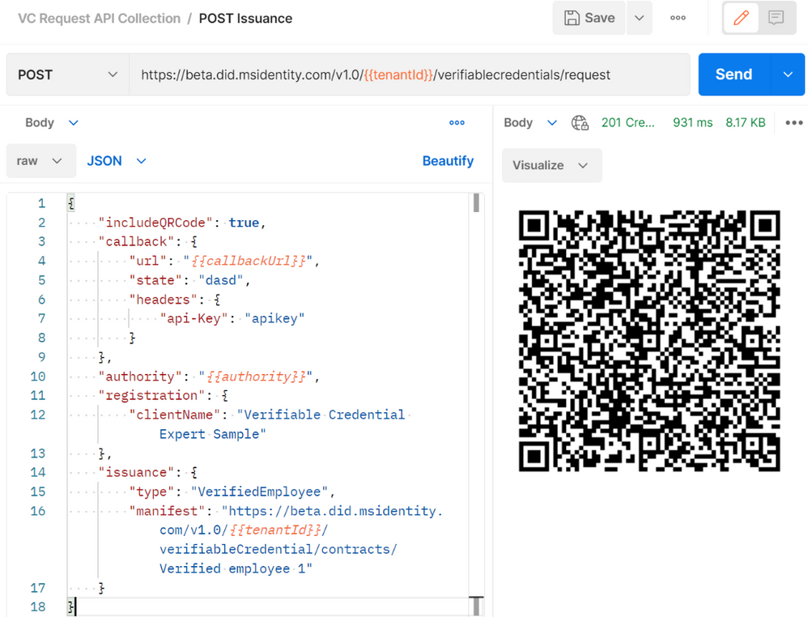

# 検証可能な資格情報のパブリック プレビューが拡大

こんにちは、Azure Identity サポート チームの 村上 です。

本記事は、2022 年 5 月 4 日に米国の Azure Active Directory Identity Blog で公開された [Expanding the public preview of verifiable credentials​](https://techcommunity.microsoft.com/t5/azure-active-directory-identity/expanding-the-public-preview-of-verifiable-credentials/ba-p/3295508) を意訳したものになります。ご不明点等ございましたらサポート チームまでお問い合わせください。

---

この数ヶ月の間に、1,000 以上の企業において [職場のリモート オンボーディング](https://go.microsoft.com/fwlink/p/?LinkID=2184957&clcid=0x409&culture=en-us&country=US) や [ビジネスの境界を越えたコラボレーション](https://customers.microsoft.com/en-us/story/1478082375112165122-avanade-partner-professional-services-verifiable-credentials)、[学外での教育](https://customers.microsoft.com/en-us/story/1481006006183422060-rmit-university-higher-education-azure-active-directory?culture=en-us&country=US) など、さまざまなシナリオで使用される何万件もの検証可能な資格情報が発行ならびに検証されました。検証可能な資格情報は新しい W3C 標準で、これによりエンド ユーザーは自身の雇用履歴や学歴、その他の認定状態を表すデジタルな資格情報を、改ざん不可能で安全かつ検証可能な方法で簡単に提示できるようになります。このたび、Azure Active Directory (Azure AD) の Free ライセンスおよび Premium ライセンスのユーザー向けに、検証可能な資格情報のパブリック プレビューを拡大し、機能拡張を発表できることを嬉しく思います。

> **「検証可能な資格情報には、すでに約 60 種類のユースケースがあると言われています。非常に柔軟性が高いため、組織全体で何百もの異なる方法で使用できる可能性があります」。- Avanade 社のカスタマー ストーリー全文は [こちら](https://customers.microsoft.com/en-us/story/1478082375112165122-avanade-partner-professional-services-verifiable-credentials) からご覧ください。**

エンド ユーザー、管理者、開発者のエクスペリエンスを向上させるために、お客様や Decentralized ID コミュニティから得たフィードバックに感謝しています。このたび、プラットフォームの新機能についてお知らせできることを光栄に思うとともに、より多くのお客様や開発者が自信を持ってより大きな規模で資格情報を発行および検証する中で、新しいシナリオが発掘されることを楽しみにしています。

## 最新機能

[Azure AD の検証可能な資格情報](https://docs.microsoft.com/ja-jp/azure/active-directory/verifiable-credentials/) は、Azure AD のすべてのお客様が利用できるようになりました。プラットフォームのアップデートに関しては [最新機能の公開情報](https://docs.microsoft.com/ja-jp/azure/active-directory/verifiable-credentials/whats-new) にまとまっていますが、以下ではそのハイライトを簡単に紹介します。

## プライバシーを尊重した状態チェック

W3C の状態リストの標準をサポートすることで、検証可能な資格情報の利用者に対しプライバシー機能をさらに拡張し、ユーザー、発行者、Relying party に対してプライバシーを維持した状態チェックを可能にしました。詳細な情報は [こちら](https://docs.microsoft.com/ja-jp/azure/active-directory/verifiable-credentials/how-to-issuer-revoke) でご覧いただけます。

## 最高の開発者体験を提供

弊社が公開する API は進化を続けています。昨年は、Node.js SDK を廃止し、よりリッチな開発者体験を提供するべく、検証可能な資格情報の発行者や検証者向けに新しい [リクエスト サービス API](https://docs.microsoft.com/ja-jp/azure/active-directory/verifiable-credentials/get-started-request-api?tabs=http) の提供を開始しました。私たちは、API ファーストの姿勢を続けるとともに、より大きな Azure API との統合も検討しており、これにより、検証可能な資格情報を扱う開発者様に最高のおもてなしを提供できると考えています。弊社で用意した [サンプル アプリケーション](https://github.com/Azure-Samples/active-directory-verifiable-credentials) を試すか、[Postman](hhttps://github.com/Azure-Samples/active-directory-verifiable-credentials/tree/main/Postman) を使用して API を直接テストすることも可能です。

## ヨーロッパでのコンプライアンス向上

Azure AD の検証可能な資格情報のデータは、EU 地域に所在するテナントに対して、EU 域内で処理されるようになりました。Azure における [データ所在地](https://azure.microsoft.com/en-us/global-infrastructure/data-residency/#select-geography) と、Microsoft EU Data Boundary プログラムの一環としての顧客データ保護へのコミットメントについては [こちら](https://techcommunity.microsoft.com/t5/security-compliance-and-identity/eu-data-boundary-for-the-microsoft-cloud-frequently-asked/ba-p/2329098) をご覧ください。
 
## 今後もご期待ください！

今後の予定では、ディレクトリ属性やカスタム データ ソースに基づいて資格情報を発行および検証するためのローコードもしくはノーコードの開発体験や、検証可能な資格情報のネットワークにおいて、検証可能な資格情報全体で信頼できる発行者を簡単に発見できるワーク フローなど管理者の体験を統合する API を含めた検討を進めています。

すべての Azure AD の利用者で、資格情報の作成、発行、検証が可能ですので、ぜひ以下のリソースを参照ください。

## 始めてみましょう

- [Azure AD の検証可能な資格情報のパブリック プレビュー](https://docs.microsoft.com/ja-jp/azure/active-directory/verifiable-credentials/)
- アップデートに関する情報の一覧 [パブリック プレビュー リリースの新機能](https://docs.microsoft.com/ja-jp/azure/active-directory/verifiable-credentials/whats-new)

いつものように、皆様からのフィードバックやご意見をお待ちしています。以下のコメント欄、Twitter ([@AzureAD](https://twitter.com/azuread))、または [Azure Feedback Forum](https://feedback.azure.com/d365community/forum/22920db1-ad25-ec11-b6e6-000d3a4f0789) でご意見をお聞かせください。

## 検証可能な資格情報と Decentralized ID についてもっと知る

検証可能な資格情報は、認証機関 (発行者) から発行された ID 情報を含む、署名されたコンテナのようなもので、個人またはエンティティ (保有者) が希望したタイミングで他のエンティティ (検証者) とその情報を共有できるという仕組みです。Azure AD が提供するサービスの一機能として、雇用状態や学歴、またはその他の要求を満たす証明として、検証可能な資格情報を簡単に発行および検証できるようにします。また、そのような資格情報の保有者が、いつ、誰と資格情報を共有するかを選べるようになります。これにより、プライバシーとセキュリティの保護に優れた新しい種類の身元確認が可能になり、さらに資格情報は再利用可能であるため、より利便性が向上します。 

さらに詳しく知りたい方は、以下のリソースもご覧ください。 

- 顧客事例と検証可能な資格情報のリソースについては[aka.ms/verifyonce](https://www.microsoft.com/en-us/security/business/identity-access-management/verifiable-credentials) で入手可能です。 

- 全 5 回にわたる [ブログ シリーズ](https://jpazureid.github.io/blog/azure-active-directory/join-us-to-build-solutions-using-decentralized-identities/) で、Decentralized ID の基本を理解いただけます。 
- Decentralized ID の動向については [aka.ms/ownyouridentity](https://www.microsoft.com/en-us/security/business/identity-access-management/decentralized-identity-solution) で詳しく説明しています。 
- Decentralized ID (DID) についての業界ワーキング グループである [http://identity.foundation](http://identity.foundation) に参加いただけます。 
- 簡単な概要: http://aka.ms/didexplained  
- 開発者向けドキュメント: http://aka.ms/didfordevs  
