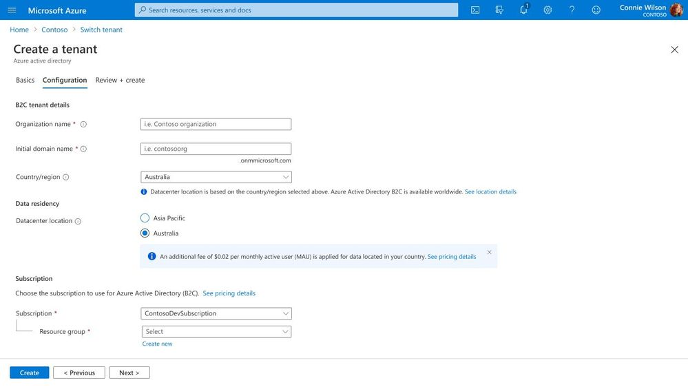

# External Identities (B2C) が Authenticator アプリに対応するとともにデータ保存場所の新しい価格が発表されました

こんにちは、Azure Identity サポート チームの 高田 です。

本記事は、2022 年 1 月 20 日に米国の Azure Active Directory Identity Blog で公開された [External Identities B2C supports Authenticator apps, and new data residency pricing](https://techcommunity.microsoft.com/t5/azure-active-directory-identity/external-identities-b2c-supports-authenticator-apps-and-new-data/ba-p/2147079) を意訳したものになります。ご不明点等ございましたらサポート チームまでお問い合わせください。

---

皆さん、こんにちは。

明けましておめでとうございます。新しい年になりましたので、新しい機能を発表したいと思います。本日は、B2C ユーザー向けの時間ベースのワン タイム パスコード (時間に基づいて生成される OTP) による多要素認証 (MFA) のパブリック プレビューと、Azure AD B2C ディレクトリのデータ保存場所のサポートに関する重要な変更など、Azure AD External Identities の 2 つのアップデートについてお知らせします。

## 時間ベースの OTP で B2C ユーザー向けの MFA を強化

詐欺やセキュリティ攻撃の増加により、消費者のアカウントをより安全な MFA の方法で保護することが重要となっています。B2C のユーザー フローに認証アプリを介した時間ベースの OTP を組み込むことで、既存の電子メールや電話の要素に比べて高いレベルのセキュリティを提供でき、電話料金の発生も抑えることが可能となります。[アプリベースの MFA がメールや電話の MFA だけよりも安全だといえる](https://techcommunity.microsoft.com/t5/azure-active-directory-identity/it-s-time-to-hang-up-on-phone-transports-for-authentication/ba-p/1751752) 理由については、Alex Weinert の説明をご覧ください。

お使いのユーザー アカウント用の時間ベースの OTP は、どの認証アプリケーションでも設定できます。弊社では Microsoft Authenticator を利用して時間ベースの OTP を設定することをお勧めしています。Microsoft Authenticator では認証状態の確認を暗号化された双方向通信にて行っており、さらに様々な利用の流れや設定に対応することで、ユーザーが自らセキュリティを高められるようにしています。

この B2C ユーザー フローでは、Contoso という会社の顧客が Microsoft Authenticator アプリケーションで時間ベースの OTP を使用して認証を完了するよう促されています。

Azure AD B2C で時間ベースの OTP を設定する方法については、[こちらのドキュメント](https://docs.microsoft.com/ja-jp/azure/active-directory-b2c/multi-factor-authentication?pivots=b2c-user-flow#verification-methods) をお読みください。

## データ保存場所に関する価格の更新

弊社では、お客様がデータを管理でき、地域のデータ保存場所の要件に準拠することが非常に重要であることを認識しております。このビジネス クリティカルな要望に対応する最初のステップとして、今年初めに [Azure AD B2C のデータをオーストラリアで保持する機能の一般提供](https://docs.microsoft.com/ja-jp/azure/active-directory-b2c/data-residency) を発表しました。この機能に対する需要の増加に対応するため、2022 年半ばより、オーストラリアやその他の特定の国/地域向けにデータ保存場所を設定した既存および新規のお客様には、月間アクティブ ユーザー (MAU) あたり 0.02 ドルの追加料金が発生するようになります。

お客様からのフィードバックに基づき、お客様がデータ保存の要件を満たすために必要な国や地域を選択できるよう、データ保存場所の提供を拡大し続けてまいります。

これらのアップデートに関するご意見は、Azure フォーラムまたは Twitter で [@AzureAD](https://twitter.com/azuread) のタグを付けてお寄せください。

Robin Goldstein  
Twitter: [@RobinGo_MS](https://twitter.com/RobinGo_MS)
