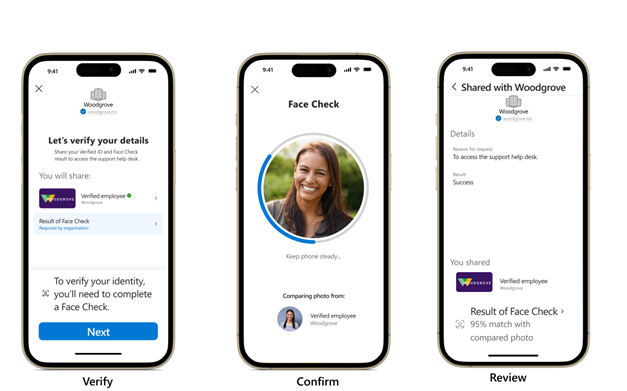

こんにちは、Azure Identity サポートチームの 張替 です。
本記事は、2024 年 8 月 12 日に米国の Azure Active Directory Identity Blog で公開された [Face Check is now generally available - Microsoft Community Hub](https://techcommunity.microsoft.com/t5/microsoft-entra-blog/face-check-is-now-generally-available/ba-p/4175880) を意訳したものになります。ご不明点等ございましたらサポート チームまでお問い合わせください。

---

今年の始めに、Microsoft Entra Verified ID による顔チェックのパブリック プレビュー ([Face Check in Microsoft Entra Verified ID is now in preview | Microsoft Security Blog](https://www.microsoft.com/en-us/security/blog/2024/02/06/microsoft-entra-verified-id-introduces-face-check-in-preview/?culture=en-us&country=us)) を発表しました。この機能は、プライバシーを尊重した信頼性の高い本人確認用顔照合機能であり、Microsoft Entra Verified ID の最初のプレミアム機能です。本日、Microsoft Entra Verified ID での顔チェック ([Face Check with Microsoft Entra Verified ID](https://aka.ms/VerifyOnce)) の一般提供を開始したことを発表できることを嬉しく思います。
この顔チェックの機能は、ネットワーク アクセス、ID 保護、ガバナンス、ID 検証機能を組み合わせてゼロ トラスト アクセスを提供する完全な ID ソリューションである Microsoft Entra Suite の一部としても、単体でも提供されます。

 
## 規模に応じて高い信頼性の検証を実現

なりすましやアカウント乗っ取りのリスクが高まっています。攻撃者は、攻撃経路の 66% で安全でない認証情報を使用しています。例えば、なりすまし犯はシステムに不正ログインするために、漏洩したパスワードを使用する可能性があります。生成 AI の進歩により、ディープ フェイクのような複雑ななりすまし ([complex impersonation tactics such as deepfakes](https://www.forrester.com/blogs/state-of-cybersecurity-innovation-rsa-conference-2024/#:~:text=Forrester%20calls%20out%20deepfakes%20as%20one%20of%20the,and%20brand%20damage%2C%20amplification%20of%20misinformation%2C%20and%20more.)) の手口も増えています。多くの組織では新入社員を定期的にリモートで雇用し、リモートでヘルプ デスクを提供しています。しかし、強力な本人確認なしに、組織はこうしたデジタルの向こう側にいる人が誰であるかをどうやって確認できるでしょうか。なりすましは、CAPTCHA で自転車の数を数えたり、生まれ育った地域の名前を尋ねたりするような一般的な検証方法を簡単に回避してしまいます。企業や消費者に対する詐欺が急増し、なりすましの手口がますます複雑になっているため、本人確認がかつてないほど重要になっています。

Microsoft Entra Verified ID は[オープン スタンダード](https://learn.microsoft.com/en-us/entra/verified-id/verifiable-credentials-standards)に基づいているため、企業はシンプルな API を使用して様々な資格情報を検証することができます。Verified ID は、業界をリードする本人確認ベンダーと統合されており、192 か国にわたり個人の ID 属性 (例えば運転免許証と実在する人との一致) を検証可能です。現在、何百もの組織が Verified ID を利用して、新規ユーザーをリモートでオンボードし、セルフ サービスによるリカバリを行う際の不正行為を減らしています。たとえば、Verified ID を使用することで、Skype は日本における Skype 電話番号の登録における不正行為を 90% 減らすことができました。([Skype has reduced fraudulent cases of registering Skype Phone Numbers in Japan by 90%.](https://customers.microsoft.com/en-us/story/1797457886423966307-skype-microsoft-entra-verified-id-telecommunications-en-united-states))

 
## Microsoft Entra Verified IDによる顔チェック

Azure AI サービスを活用した顔チェックは、ユーザーのリアルタイムの自撮り写真と、通常はパスポートや運転免許証などの信頼できる情報源から取得した Verified ID の写真を照合することで、より信頼性を提供します。顔チェックは、照合結果のみを共有し、機密性の高い ID データを共有しないため、ユーザーのプライバシーを保護しながら、組織の ID 確認を強化することができます。ディープ フェイクを含む様々ななりすまし技術を検出し、拒否することができるため、ユーザーの ID を完全に保護することが可能です。

中小企業向けのセキュリティ ソリューション プロバイダーである BEMO は、認証精度を高めるとともに認証時間を短縮し、コストを削減するために、ヘルプデスクに顔チェックを統合しました。([integrated Face Check into its help desk](https://customers.microsoft.com/en-us/story/1780443211662273433-bemo-azure-ai-professional-services-en-united-states)) 同社は顔チェックと Microsoft Entra Verified ID を併用し、CEO、CIO などの経営幹部や IT 管理者が所有する最も機密性の高いアカウントを保護ししています。

顔チェックは、BEMO の顧客セキュリティの向上とユーザー データのプライバシーの強化に役立つだけでなく、顧客の問題に対処する効率を 90 % 改善しました。BEMO のヘルプデスクは、顔チェックを導入する前は 5.5 時間かかっていた手動での本人確認を 30 分で完了できるようになりました。

「セキュリティは何層にも適用することでより高まります。今回の新しい検証機能は、当社がお客様に提供できるもう一つの層となります。これにより弊社がお客様により高い安心感を与えられるようになりました。 - BEMO、サポート＆マネージド サービス チーム リーダー、Jose Castelan 氏
 
Microsoft Entra Verified ID で顔チェックを使用する方法については、以下の[ビデオ](https://www.youtube.com/watch?v=HG6-aLnDoM0)をご覧ください：

## パートナーと連携して今すぐ利用を開始する
 
弊社のパートナーは、特定の利用シナリオや、雇用状態、学歴、政府発行 ID (LexisNexis® Risk Solutions、Au10tix、IDEMIA などのパートナー) などの特定の ID 属性の検証において Microsoft Entra Verified ID を用いた顔チェックの実装に専門的なノウハウを有しています。これらのパートナーは、Verified ID の機能を拡張し、お客様のビジネス固有のニーズに対応するさまざまな検証ソリューションを提供しています。

[パートナー ギャラリー](https://learn.microsoft.com/en-us/entra/verified-id/partner-gallery)をご覧になり、パートナーについて、またパートナーが Verified ID の利用開始をどのように支援できるかぜひご確認ください。

## Microsoft Entra Verified IDで顔チェックを使い始める

顔チェックは Verified ID のプレミアム機能です。Verified ID テナントを設定 ([set up your Verified ID tenant](https://learn.microsoft.com/en-us/entra/verified-id/verifiable-credentials-configure-tenant-quick)) した後、顔チェックを有効にして検証を開始するには、2つの購入方法があります:

1. [Entra Suite の無料トライアル](https://signup.microsoft.com/get-started/signup?products=2ebf8ffa-7de1-4d14-9b15-238f5ca77671&ali=1&bac=1&signedinuser=harrispodell%40microsoft.com) を開始する。このトライアルには、毎月 1 ユーザーにつき 8 回の顔チェックが含まれています。
2. Verified ID 内で顔チェックを有効 ([Enable Face Check within Verified ID](https://learn.microsoft.com/en-us/entra/verified-id/verified-id-pricing)) にし、検証ごとに $0.25 を支払う。
 
詳細については、[Microsoft Entra の価格ページ](https://www.microsoft.com/en-us/security/business/microsoft-entra-pricing#x19dd145549294bd29b03a3bbcfd773ed) をご覧ください。
 
## 次のステップ

Microsoft Entra Verified ID がどのように機能する ([Microsoft Entra Verified ID works](https://www.microsoft.com/en-us/security/business/identity-access/microsoft-entra-verified-id)) のか、また組織が現在どのようにこの機能を使用しているのかについて学び、さらに 8 月 14 日に開催される [Microsoft Entra Suite Tech Accelerator](https://techcommunity.microsoft.com/t5/tech-community-live/microsoft-entra-suite-tech-accelerator/ev-p/4189272) に参加して、最新の ID 管理とエンドツーエンドのセキュリティ革新について学んでいただけたらと思います。
 
Microsoft Entra Verified ID 製品責任者 Ankur Patel
