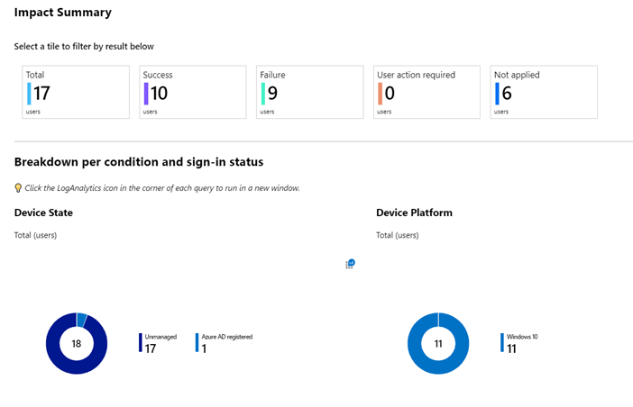
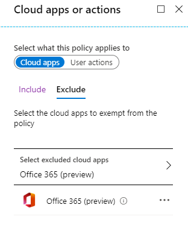

> 本記事は、 2020 年 4 月 3 日に Azure Active Directory Identity Blog に公開された記事 (Frequent questions about using Conditional Access to secure remote access) を翻訳したものです。原文は [こちら](https://techcommunity.microsoft.com/t5/azure-active-directory-identity/frequent-questions-about-using-conditional-access-to-secure/ba-p/1276932) より参照ください。

# 安全なリモート アクセスを実現するための条件付きアクセスに関するよくある質問

業界の動向や働き方の変化は通常、何年にもわたるもので、組織は各々のスピードで変化に対応しています。しかし現在我々の生活は通常ではない状態になりました。

COVID-19 の感染拡大を遅らせるため企業は従業員に在宅勤務を求めており、そのような組織では数年ではなく数週間という短い期間で組織やプロセスを大きく変更しています。組織には、会社のデータを安全に保ちながらリモート ワークを迅速に可能にするという新しい課題が突きつけられるとともに、以前からある課題がより大きくのしかかることになります。
 
このような困難な時代においてお客様と密接に協力してきた経験から、ゼロ トラストの原則に沿ったベスト プラクティスとヒントを共有したいと思います。

### 質問: 在宅勤務のユーザーが MFA を設定するためのベストな方法は何ですか？

[条件付きアクセス ポリシーを使用してすべてのユーザーに MFA を有効にする](https://docs.microsoft.com/azure/active-directory/conditional-access/howto-conditional-access-policy-all-users-mfa) ことをお勧めします。

1. まだ MFA を有効にしていない場合は、[統合されたセキュリティ情報の登録機能を有効化](https://docs.microsoft.com/azure/active-directory/authentication/concept-registration-mfa-sspr-combined) して、エンドユーザーにより良いユーザー エクスペリエンスを提供するとともに、[セルフ サービス パスワード リセット (SSPR)](https://docs.microsoft.com/azure/active-directory/authentication/tutorial-enable-sspr) の登録も実施ください。
2. [ユーザーになりすまして登録しようとする攻撃者を阻止するためにポリシーを設定ください](https://docs.microsoft.com/azure/active-directory/conditional-access/howto-conditional-access-policy-registration)。例えば、Microsoft Intune に準拠したデバイスやハイブリッド Azure AD 参加デバイスからのみ登録を許可することができます。
3. 社用デバイスだけ許可するということができない場合は、MFA 登録の締め切り日を設け、その期限を過ぎたユーザーがヘルプデスクに連絡しなければならないように、一定のタイミングで MFA 登録をブロックください。
4. MFA の主な認証方法として Microsoft Authenticator アプリを既定にします。特に米国外に拠点を置いている場合は、これによりユーザーに最高のエクスペリエンスを提供可能です。例えば、モバイル デバイス上のアプリケーションに対して MFA のプロンプトが表示されることが少なくなります。

    

5. ユーザーに https://aka.ms/mysecurityinfo で登録を依頼します。依頼しない場合、MFA を必要とするアプリケーションに最初にサインインするときに MFA の登録画面が表示されます。念のため、SMS や音声通話の MFA のための電話番号、またはハードウェア トークンなどバックアップとなる方法を登録ください。これにより誰かが新しい電話番号 (新しい電話) を取得したときにも対応可能です。

6. 変更が終わったら、新しい [MFA 認証方法アナライザー](https://docs.microsoft.com/samples/azure-samples/azure-mfa-authentication-method-analysis/azure-mfa-authentication-method-analysis) を実行して、推奨されるステップをすべて実施していることを確認ください。

### 質問: 信頼できるネットワークの外で、個人や職場のデバイスから接続するデバイスが増えています。会社のデータを管理するにはどうしたらいいですか？

いくつかの選択肢がありますが、貴社のデバイス管理の戦略と既に使用している機能に応じて、組織が信頼できるデバイスにのみファイルを保存できるようにすることが可能です。管理下にあるデバイスやアプリケーションにのみファイル アクセスを許可するか、アプリへのアクセスは許可しつつ、管理下にないデバイスからのファイル ダウンロードやファイル アクセスを制限することができます。

- Microsoft Endpoint Manager の一部である Microsoft Intune ですでに管理されているデバイスについては、条件付きアクセス ポリシーを使用してアクセスを制限することができます。アクセスには準拠したデバイスが必要であるよう構成することで、リスクを最小限に抑えつつ、デバイス管理を最大限に活用できます。

- ハイブリッド Azure AD 参加を実装すると、オンプレミスの Active Directory に既に参加しているデバイスを Azure AD に参加させることができます。そして、条件付きアクセス ポリシーを適用することで、これらの信頼できるデバイスからのみユーザーが環境にアクセス可能となるよう構成できます。

    > 参考情報: AD FS を使用している場合は、環境にハイブリッド Azure AD デバイスがすで存在する場合でも、usernamemixed エンドポイントと certificatemixed エンドポイントを必ず公開するようにしてください (見落としがちなステップ)。デバイスが 2 週間毎にサインイン処理を行う際に、問題が生じる場合があります。

- Intune モバイル デバイス管理を使用していなくても、Intune アプリ保護ポリシーを使用して、信頼済みアプリのデータを管理することができます。たとえば、条件付きアクセスを設定して、アプリ保護機能を備えたアプリのみに SharePoint や Exchange などのサービスへのアクセスを許可することができます。

- 管理されていない個人デバイスから作業しているユーザーのアクセスを完全にブロックする必要はありません。以下のオプションを使用して、ファイルへの Web アクセスを許可したり、ダウンロードをブロックしたりすることができます。このオプションは、デバイス管理をまだ展開中の場合に有用です。
    - SharePoint と Exchange は、条件付きアクセスのセッション制御の機能を使用して、管理されていないデバイスへのダウンロードをブロックする機能がネイティブでサポートされています。これらのポリシーは Microsoft Teams において SharePoint ファイルへアクセスしようとした際にも適用されます。
    - 他の Web アプリからの非管理デバイスへのダウンロードは、Microsoft Cloud App Security のプロキシ統合と条件付きアクセスのセッション制御の機能を使用することでも制限が可能です。

### 質問: 現状を考えると条件付きアクセスポリシーを早急に導入する必要があります。アドバイスいただけますか？

まず、当社の [ベスト プラクティス ガイダンス](https://docs.microsoft.com/azure/active-directory/conditional-access/best-practices) を確認することをお勧めします。ここでは、いくつかのハイライトをご紹介します。

1. サービスの [依存関係](https://docs.microsoft.com/azure/active-directory/conditional-access/service-dependencies) が生じて問題が発生することを避けるために、アプリを対象外に設定せず、各ポリシーをすべてのアプリに適用するか明示的に複数のアプリに適用します。

2. ポリシーの展開が早すぎると、誤ってユーザーのアクセスをブロックしてしまい、展開が遅れる可能性がありますので注意してお進めください。通常は、[レポート専用モード](https://docs.microsoft.com/azure/active-directory/conditional-access/concept-conditional-access-report-only) で新しいポリシーを数週間実行することをお勧めしますが、数時間しか実行できない場合でもレポート専用モードのメリットを享受できます。

    

3. [トラブルシューティング](https://docs.microsoft.com/azure/active-directory/conditional-access/troubleshoot-conditional-access) には、Azure AD のサインイン ログと条件付きアクセスの What If ツールを使用します。
4. 新しいアクセス ポリシーが導入されると、ユーザーには MFA やデバイスの登録要求のためのサインイン プロンプトが表示されることとなります。再認証や MFA のプロンプトを減らすために、次のことをお勧めします:

    - [サインイン頻度の期間を延長し、ブラウザーのセッションを永続に設定する](https://docs.microsoft.com/en-us/azure/active-directory/conditional-access/howto-conditional-access-session-lifetime#user-sign-in-frequency) ことを検討ください。
    - 条件付きアクセスを使用していない場合は、テナントの [会社のブランド](https://docs.microsoft.com/en-us/azure/active-directory/fundamentals/customize-branding) の設定で「サインインしたままにするオプションを表示する」を有効にしてください。
    - モバイル デバイスでは、MFA だけでなく、モバイル アプリ全体でシングル サインオンを可能にするよう Microsoft Authenticator モバイル アプリをインストールします。
    - ユーザーがデバイスにサインインした際にシングル サインオンを有効にするため、ハイブリッド ドメイン参加や Azure AD 参加を用いてデバイスを登録するか、Windows Hello for Business を使用します。
    - ハイブリッド Azure AD 参加したデバイスと準拠済みデバイスは MFA を求めないようにします。
    - Web Account Manager (WAM) を使用するようにユーザーの Windows 10 デバイスを設定します。お客様によってはアプリの問題を回避するために WAM を無効したものの、その後に再度有効にし忘れている場合もあると存じます。WAM は Windows 10 デスクトップ アプリケーションでシングル サインオンを有効にするコンポーネントであり、デバイス ベースの条件付きアクセス ポリシーが動作するために必要です。デバイスが正しく登録されているにもかかわらず、ユーザーが Office デスクトップ アプリからデバイス ポリシーを満たせない場合、次のキーが設定されて **いない** ことを確認ください。

        - HKEY_CURRENT_USER\SOFTWAREMicrosoft\Office\16.0\Common\Identity | DisableADALatopWAMOverride の値が 1

### 質問: 条件付きアクセスを使用して、Office 365 のような一部のアプリへのアクセスを有効にし、それ以外のすべてをブロックするにはどうすればよいですか？

ブロックすべき、またはブロックすべきでないリソースを詳細に分析する時間がない組織では、「許可リスト」の構成で条件付きアクセスを実装し、リストにない Azure AD アプリケーションとリソースへのアクセスをブロックすることができます。しかし、あなたの組織が Azure AD 内の何百ものサービスやエンドポイントを使用しており [依存関係](https://docs.microsoft.com/azure/active-directory/conditional-access/service-dependencies) がある場合、ブロック対象となっているサービスを呼び出すアプリでは予期しない動作が生じる可能性がりますのでご注意ください。リモートワークを迅速に可能にするため、[Block-all](https://docs.microsoft.com/en-us/azure/active-directory/conditional-access/howto-conditional-access-policy-block-access) (許可したもの以外全てブロックする) のアプローチを取る必要がある場合は、以下の [ベスト プラクティスのガイダンス](https://docs.microsoft.com/azure/active-directory/conditional-access/best-practices) に従うことをお勧めします。

[Office 365 スイートを対象にする](https://docs.microsoft.com/azure/active-directory/conditional-access/concept-conditional-access-cloud-apps#office-365-preview) と、ほとんどの Office 365 アプリケーションが Block-all ポリシーの下で期待どおりに実行されるようになります。下の表に記載されているポリシーでは、企業ネットワークの外部からの Office 365 サービスへのアクセスを可能にしながら、他のすべての Azure AD サービスへの外部からのアクセスをブロックします。

| ポリシーの名前                                                    | ユーザーとグループ |                        | クラウド アプリまたは操作 |                      | 条件                       |                       | Grant                                                                                                                                               |
|------------------------------------------------------------------|-------------------|-----------------------|-------------------------|----------------------|----------------------------|-----------------------|----------------------------------------------------------------------------------------------------------------------------------------------------|
|                                                                  | 対象              | 対象外                 | 対象                    | 対象外                | 対象                       | 対象外                 |                                                                                                                                                    |
| O365 を除くすべてのアプリをブロック                                 | すべてのユーザー   | 緊急アクセス用アカウント | 全てのクラウドアプリ     | Office 365 (preview) | すべての場所                | すべての信頼できる場所  | アクセスのブロック                                                                                                                                   |
| ハイブリッドもしくは準拠済みデバイス から O365 外部アクセスを許可 | すべてのユーザー   | 緊急アクセス用アカウント | Office 365              | n/a                  | (適切なものをお選びください) |                       | アクセス権の付与:  - ハイブリッド Azure AD 参加済みのデバイスが必要  - 承認されたクライアント アプリが必要  - 選択したコントロールのいずれかが必要 |

**1 つのルールですべてのユーザーとアプリケーションをターゲットにすることはお勧めしません。** 「すべてのユーザー」に適用されるポリシーは、テナントのローカル ユーザーだけでなく、テナントに招待されたゲスト ユーザーにも適用されます。このアプローチを取る場合は、[緊急アクセス用アカウント](https://docs.microsoft.com/azure/active-directory/authentication/concept-resilient-controls) を考慮にいれてください。セキュリティ要件が許せば、ポリシーをロールアウトする際に「すべてのユーザー」オプションを使用するのではなく、ユーザーが含まれる個々のグループを対象に設定ください。

ポリシーが内部ネットワークからのトラフィックをブロックしないようにするため、上記の「O365 を除くすべてのアプリをブロック」のルールのように、信頼できるネットワークの場所を除外することもできます。[Azure AD 内でネットワークの場所を適宜管理する](https://docs.microsoft.com/azure/active-directory/reports-monitoring/quickstart-configure-named-locations) ことで、内部ネットワークをすべてカバーすることができます。他のアプリを外部で利用できるようにしたい場合は、1 つ目のポリシーの対象外のリストにそのアプリを追加し、2 つ目のポリシーの対象に追加するか別のポリシーを作成して異なる [条件](https://docs.microsoft.com/azure/active-directory/conditional-access/concept-conditional-access-conditions) を適用ください。

### 質問: VPN を介して企業ネットワークに接続しているユーザーに対して、どのような手順を踏めばよいでしょうか？

すべてのアプリに加えて、VPN にも MFA を強制するのは良い対応です。条件付きアクセスが利用できるように、Azure AD への SAML または OpenID Connect でのフェデレーション認証をサポートしている VPN を利用することをお勧めします。エンタープライズ アプリケーションのアプリ ギャラリーで SAML 認証をサポートする VPN を探すか、Azure AD ポータルでカスタム SAML アプリを追加することが可能です。他の条件付きアクセス ポリシーと同様に、MFA または信頼できるデバイスを必要と構成することで、Azure AD と連携した VPN を保護できます。Azure AD ハイブリッド アクセスの詳細については、[こちら](https://azure.microsoft.com/services/active-directory/sso/secure-hybrid-access/) を参照ください。

VPN がフェデレーション認証をサポートしていない場合は、Azure MFA NPS 拡張機能を使用して Azure MFA で RADIUS 認証を保護することもできます。

企業ネットワーク外のユーザーに場所に基づく条件付きアクセス ポリシーを使用している場合は、ユーザーが VPN と自宅で IP アドレスを短時間に切り替えても「ありえない移動」や「未知の場所からのサインイン」のリスクを引き起こさないように、信頼できる場所の IP アドレス範囲を必ず更新ください。

> 参考情報: VPN トラフィックが増加し、負荷を軽減したい場合は、[Microsoft IT (マイクロソフトの社内 IT 部門) が同様の課題にどのように対処したか](https://www.microsoft.com/itshowcase/blog/running-on-vpn-how-microsoft-is-keeping-its-remote-workforce-connected/) をご覧ください。

サードパーティの SaaS アプリケーションにアクセスする際にフェデレーション サーバーが必要であるなど、現行のオンプレミスのインフラへの依存を取り除きたい場合は、[Azure AD への統合](https://docs.microsoft.com/azure/active-directory/manage-apps/what-is-application-management) を検討ください。

### 質問: VPN を使用せずにオンプレミスのアプリケーションやリソースへのアクセスを可能にするにはどうすればよいですか？

[Azure AD アプリケーション プロキシ](https://docs.microsoft.com/azure/active-directory/manage-apps/application-proxy-add-on-premises-application) を使用することで、アプリケーションやリモート デスクトップを公開することが可能です。また、Akamai、Citrix、F5、ZScaler などのパートナーとの統合により、既存のネットワークや配信コントローラーを条件付きアクセスと組み合わせて活用することができます。

- Azure AD アプリケーション プロキシを使用すると、VPN を使用せずに社内専用の SharePoint やイントラネットのサイトなどオンプレミスのウェブ アプリケーションに安全にリモート アクセスできます。SaaS アプリケーション用に設計したのと同じ条件付きアクセス ポリシーがオンプレミスのアプリケーションでも機能し、ユーザーは必要な MFA の要求を含め、同じシングル サインオンのエクスペリエンスを得ることができます。

> 参考情報: 
> - Azure AD App Proxy は、ポート 80 と 443 の **外向きの** 接続のみを使用します。
> - Kerberos 制限付き委任 (KCD) を構成することで、統合 Windows 認証を使用したアプリケーションに対してシングル サインオンを構成可能です。アプリケーション プロキシは、ヘッダーまたはボディ内の URL を変換できます。URL の変換は、ワイルド カード URL もサポートしています。
> - その他の機能や [Azure AD アプリケーション プロキシの詳細な展開計画](https://docs.microsoft.com/azure/active-directory/fundamentals/active-directory-deployment-plans) についてもご確認ください。

- Azure AD App Proxy を通じて [管理者向けに Remote Desktop を公開](https://docs.microsoft.com/azure/active-directory/manage-apps/application-proxy-integrate-with-remote-desktop-services) し、Remote Desktop Web Role と Remote Desktop Gateway Role にアクセスすることが可能です。
- Akamai Enterprise Application Access (EAA)、Citrix Application Delivery Controller (ADC)、F5 Big-IP APM、または Zscaler Private Access (ZPA) などの既存のネットワークおよび配信コントローラーを Azure AD に統合して、これらのハイブリッド リソースと条件付きアクセスポリシーを組み合わせて活用することもできます。

## まとめ

従業員のために安全なリモート ワークが実現するよう、これらの推奨事項が参考になれが幸いです。他にもご質問やアイデアがありましたら、Twitter ([@AzureAD](http://twitter.com/azuread)) でお知らせください。
