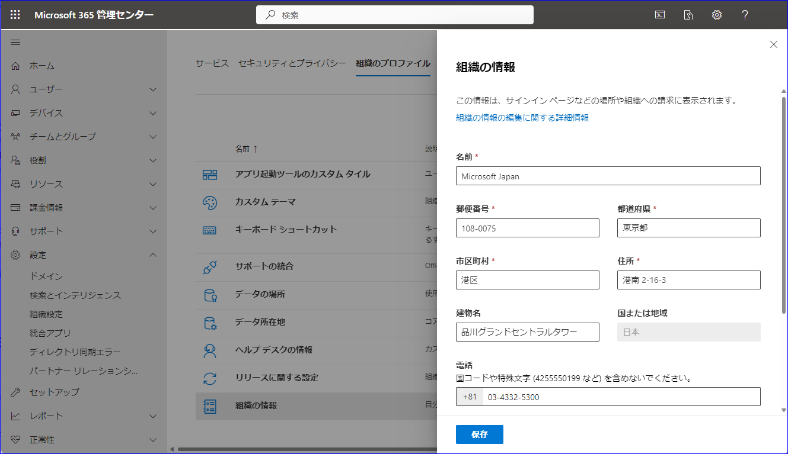
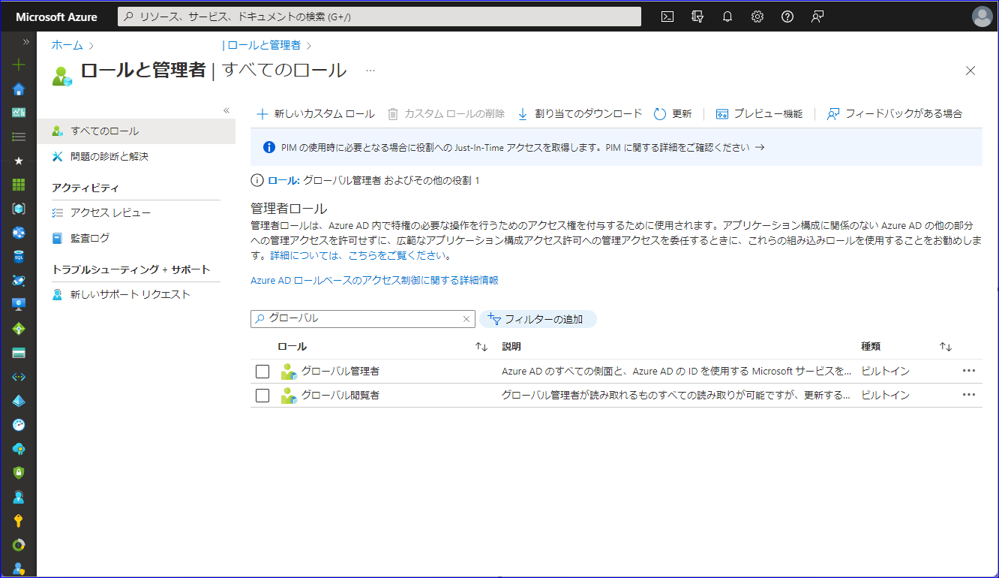

# 管理者権限を持つユーザーでサインインできない！

こんにちは、Azure Identity サポート チームの 高田 です。

本日は、よく弊社にお問い合わせいただく以下のような内容について、改めて注意喚起もかねて記事を執筆いたしました。

- テナントを作成したユーザーが退職してしまい、グローバル管理者ロールを持つユーザーが分からない。
- ゲスト ユーザーがグローバル管理者ロールを保持しているが、そのゲスト ユーザーの大元のユーザーにアクセスできない。
- グローバル管理者ロールをもつユーザーがスマホをなくした、もしくは機種変更したので MFA を突破できない。
- 条件付きアクセスでグローバル管理者ロールを持つ全てのユーザーがブロックされ Azure ポータルに入れない。
- 1 人しかいないグローバル管理者のユーザーにリスクが検出されてしまいサインインできない

弊社サポートには連日上記のようなお問い合わせを多くいただきます。このような状況に陥った場合、弊社にお問い合わせをいただいても本人確認などを含め非常に多くのやり取りが発生するため、回復にお時間を要すことが一般的です。場合によっては弊社からでもテナントの回復が行えない場合もございます。

マイクロソフト側で対処することが可能なシナリオもありますが、可能な限り未然に上記のような状況を防ぐことが重要です。

そこで本記事では、テナントへのアクセスが失われないようマイクロソフトとして推奨する Azure AD テナント運用のベスト プラクティスを紹介いたします。

## まず確認すること

まずは、このような事態を未然に防ぐために、Azure AD 管理者が確認しておくべきことを以下におまとめしました。

### 社内にグローバル管理者ロールを持つ管理者を複数名確保する

Office 365 や Azure AD の利用を開始した直後のタイミングでは、そのテナントにはグローバル管理者ロールを持つアカウントが 1 つのみ存在しています。このため、引き継ぎなくそのアカウントの管理者が退職するなどすると、だれもそのテナントを管理できなくなります。

このような事態を防ぐため、社内の IT 部門において、必ず 2-3 名の信頼できるテナント管理者を任命し、それぞれの管理者ごとに Azure AD のユーザー (ゲスト ユーザーではなくテナント内のメンバーであり xxx@contoso.onmicrosoft.com のような UPN を持つクラウド ユーザー) を発行することをお勧めします。ここで、一つの管理者アカウント (Azure AD ユーザー) を複数名で使いまわすことはお勧めしません。これは、アカウントが使いまわされることで、どの管理者がいつサインインし、どのような操作を行ったかの監査が困難となるためです。必ず異なる UPN と異なるパスワードで、管理者の数だけ、管理専用の Azure AD ユーザーを発行ください。グローバル管理者のロールを持つユーザーの数は、テナント全体で 5 人未満がおすすめです。

その他の推奨事項 (特に MFA の構成など) については、[Azure AD ロールのベスト プラクティス](https://docs.microsoft.com/ja-jp/azure/active-directory/roles/best-practices) もご覧ください。

なお、いわゆる一人情シスなど、グローバル管理者ロールを持つユーザーが一名しか確保できない場合は、後述の緊急アクセス アカウントを必ず作成ください。2-3 名のテナント管理者を任命できる場合でも、緊急アクセスアカウントの準備を極力お勧めいたします。

### 緊急アクセス用の管理アカウントを作成する

緊急アクセス用の管理アカウントは、グローバル管理者ロールを持つユーザーが誰もテナントにアクセスできなくなってしまった場合に、最後の手段として利用する緊急用アカウントのことです。緊急時にガラス窓を割って脱出するような状況に例えられるため、Break glass account とも呼ばれます。

緊急アクセス用の管理アカウントはどの管理者にも割り当てず、非常時にだけ利用します。緊急アクセス用の管理アカウントの ID とパスワードを発行したら、多要素認証の方法として FIDO2 セキュリティ キーを構成することをおすすめします。多要素認証の方法として電話を利用することはお勧めしません。電話キャリアに障害が発生したり、電話番号の契約が切れたりすると、重要な時にアカウントにサインインできなくなるためです。緊急アクセス用の管理アカウントは条件付きアクセスの対象からも除外ください。

アカウントの準備ができたら、ID とパスワード、多要素認証の構成に使用した FIDO2 セキュリティ キーを、Azure AD との複数の通信手段がある安全な場所 (社内の金庫など) に保管いただければと思います。緊急アクセス用の管理アカウントの詳細については、[こちらのページ](https://docs.microsoft.com/ja-jp/azure/active-directory/roles/security-emergency-access) もご覧ください。

### 会社や学校の住所およびその他のプロファイル情報を登録する

テナントへのアクセスができなくなり、弊社へお問い合わせいただいた際には、お客様の会社名や連絡先を確認することで、お客様がテナントの正当な保持者であるかを弊社サポートが確認します。この時に、テナントに事前に登録された住所や会社名、技術連絡先などを利用します。このため、これらの登録情報を事前に登録するとともに、既に登録済みであれば正確な情報であることをご確認ください。

情報の登録や確認については、[こちらのページ](https://docs.microsoft.com/ja-JP/microsoft-365/admin/manage/change-address-contact-and-more) をご覧ください。

なお、弊社にお問い合わせをいただいても、上記情報が登録されていない場合や正確でない場合は、テナントの回復ができなくなりますので十分ご注意ください。

## 普段の運用時に確認すること

### 認証用のスマホを変更するときは MFA の登録情報の変更を忘れない

グローバル管理者ロールを持つユーザーを含め、すべてのユーザーで MFA の登録を推奨しています。管理者に限らず、一般ユーザーにおいても、多要素認証に使用するスマホを買い替える際は、併せて MFA の登録情報の変更を忘れないようご注意ください。

詳細は、別途公開しているサポート チーム ブログの [スマホを替える時は、Microsoft Authenticator の移行を忘れないでください！](https://jpazureid.github.io/blog/azure-active-directory/move-authenticator-to-new-phone/) を参照ください。

### 条件付きアクセス ポリシーを構成するときは管理者ロールを持つユーザーを除外する

条件付きアクセス ポリシーを構成するときは、緊急アクセス用のアカウントや最低一名のグローバル管理者ロールを持つユーザーを除外することをお勧めします。条件付きアクセスポリシーを構成および変更する際には、十分ご注意ください。

条件付きアクセス ポリシーの詳細については、[こちらのページ](https://docs.microsoft.com/ja-jp/azure/active-directory/governance/conditional-access-exclusion#create-a-conditional-access-policy-that-excludes-the-group) もご覧ください。

## テナントやリソースにアクセスできなってしまった場合に確認すること

上記の対応を行っておけば、テナントやリソースにアクセスできず、ロックアウトされることはありません。しかしながら、万が一、何らかの理由により管理者がテナントやリソースにアクセスできなってしまった場合には以下の点をご確認ください。

### Azure サブスクリプションに対して Azure AD のグローバル管理者のアクセス権を昇格する

これは、何らかの理由により、Azure サブスクリプションのリソースにその所有者がアクセスできなくなってしまったが、Azure AD のグローバル管理者ロールを持つユーザーは Azure ポータルにサインインができる場合のシナリオです。

サブスクリプションの所有者が Azure AD にサインインできなくなっても、Azure AD のグローバル管理者ロールを持つユーザーをサブスクリプションの所有者に昇格させることが可能です。これにより、一時的にグローバル管理者ロールを持つユーザーでリソースを管理可能となります。

詳細については、[Azure のすべてのサブスクリプションと管理グループを管理する目的でアクセス権限を昇格させる](https://docs.microsoft.com/ja-jp/azure/role-based-access-control/elevate-access-global-admin ) のページをご覧ください。

### 他の管理者ユーザーでアクセスが可能か確認する

グローバル管理者ロールを持つユーザーでサインインができなくなってしまった場合、念のため、一般ユーザーであればサインインが可能か、サインインできる場合は、Azure ポータルの [ロールと管理者] から誰がグローバル管理者ロールを持っているか確認ください。確認できたグローバル管理者ロールを持つユーザー全員に対してサインインをお試しください。

条件付きアクセスで社外からのアクセスを制限している場合には、社内ネットワークからのサインインが可能かどうかなど、アクセス時の条件を変えてサインインが可能かも確認くださいますようお願い申し上げます。

### マイクロソフト サポートに問い合わせる

どの管理者ユーザーでもテナントにアクセスできない場合は、最後の手段として弊社サポートチームまでお問い合わせください。この時、問題はサポートにお問い合わせを行おうにも、Azure ポータルに管理者アカウントがアクセスができず、自社のテナントからサポートを上げられない状況にあるということです。

この場合、[https://aka.ms/AzurePortalHelp](https://aka.ms/AzurePortalHelp) にアクセスし、日本の窓口電話番号まで連絡してお問い合わせを発行ください。Azure ポータルにアクセスできない場合に、サポート リクエストを発行する方法については、[Azure サポート プランに関する FAQ](https://azure.microsoft.com/ja-jp/support/legal/faq/) も参考となりますのでご参照ください。
