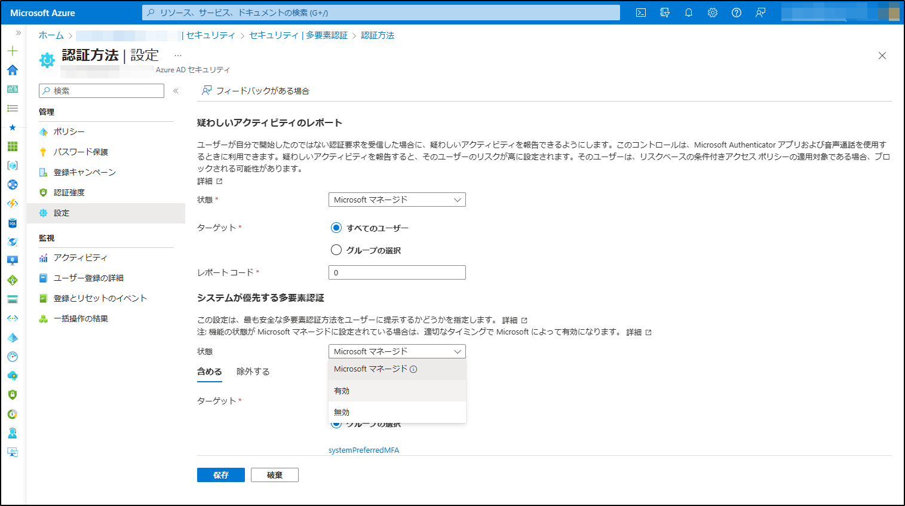

#  システムが優先する MFA 機能 一般提供の開始

こんにちは、Azure Identity サポート チームの 竜 です。

本記事は、2022 年 12 月 01 日に米国の Azure Active Directory Identity Blog で公開された [GA: System-preferred multifactor authentication](https://techcommunity.microsoft.com/t5/microsoft-entra-azure-ad-blog/ga-system-preferred-multifactor-authentication/ba-p/3773138) を意訳したものになります。ご不明点等ございましたらサポート チームまでお問い合わせください。

----

これまでのブログにて、マイクロソフトでは [多要素認証 (MFA: Multifactor Authentication) の重要性](https://techcommunity.microsoft.com/t5/microsoft-entra-azure-ad-blog/it-s-time-to-hang-up-on-phone-transports-for-authentication/ba-p/1751752) を繰り返し強調してきました。現在、組織やエンド ユーザーは、[さまざまな認証方法](https://jpazureid.github.io/blog/azure-active-directory/authentication-strength-choose-the-right-auth-method-for-your/) を利用しており、そのセキュリティ レベルもさまざまです。ユーザーは、利便性、認識不足、技術的な制約などさまざまな要因から、より安全性が高い MFA の方法を利用できるのにも関わらず、安全性の低い方法を選択することがよくあります。

こうした中、ユーザーが「利用可能な最も安全な方法で認証すること」を奨励するため、["システムが優先する MFA" の機能](https://learn.microsoft.com/ja-jp/azure/active-directory/authentication/concept-system-preferred-multifactor-authentication) を発表いたしました。この機能は、管理者が設定したポリシーで有効化されている方法ののうち、ユーザーが登録済みの MFA の方法の中から最も安全な方法を選んでサインインするよう促します。これにより、ユーザーは、最初に利用される既定の方法ではなく、利用可能な最も安全な方法を常に利用するように動作が変更されます。提示された最も安全な MFA の方法を利用できない場合は、別の方法を選択してサインインすることもできます。

管理者は、Azure ポータルの管理画面または [Graph API](https://developer.microsoft.com/en-us/graph/graph-explorer) を使用してこの機能を展開することができます。たとえば、Jone Doe というユーザーが SMS と Microsoft Authenticator の両方を登録しており、SMS がサインインに利用する既定の方法だったとします。この場合、"システムが優先する MFA" 機能を有効にすることで、システムが推奨する方法である Microsoft Authenticator がユーザーに提示されます。

以下のように、管理者は認証方法の設定から、"システムが優先する MFA" の機能を有効化できます。

ユーザーが "システムが優先する MFA" の機能を有効にしている場合、「セキュリティ情報」ページは以下のように表示されます：

この例では、ユーザーにとって最も安全な方法は Microsoft Authenticator となります：

脅威の状況が刻々と変化する中、組織は、悪意のある攻撃者の先を行くことが今まで以上に重要となります。そのことを考慮した上で、以下のように "システムが優先する MFA" 機能の展開を予定しています。
 
- 本機能は、2023 年 4 月に導入され、既定で Microsoft マネージド (無効) に設定されています。 
- 上記の初期段階の後、この機能はすべてのテナントで Microsoft マネージド (有効) として展開されます。この段階では、管理者が必要に応じてこの機能を無効化できるよう、無効化のオプションは保持されます。
- 最終的には、すべてのテナントで Microsoft マネージド (有効) に設定されます。この機能を無効化するオプションは削除されます。

組織での展開に十分な準備期間を確保するため、6 月までにさらに詳細なスケジュールをお知らせする予定です。
 
組織とそのエンド ユーザーの安全を確保するため、本機能のロールアウト機能を使用し、速やかに本新機能を導入することを強く推奨しております。本機能がお客様のテナントで利用できるようになることで、ユーザーが常に最も安全な認証方法を初めに利用するよう、促すことが可能になりました。
 
いつものように皆様からのご意見をお待ちしております。[aka.ms/AzureADFeedback](aka.ms/AzureADFeedback) までお気軽にご連絡ください。
 
Best regards,  
Alex Weinert ([@Alex_T_Weinert](https://twitter.com/Alex_T_Weinert))  
VP Director of Identity Security, Microsoft
