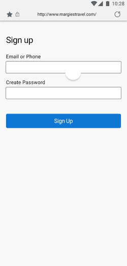
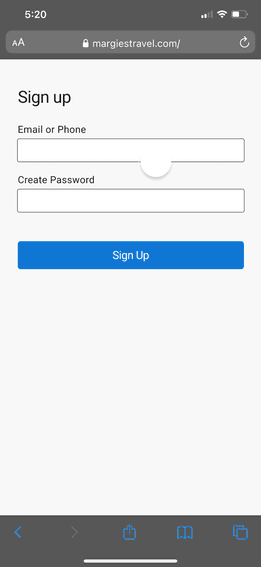

# Microsoft Authenticator による強力なパスワードの生成

こんにちは、Azure Identity サポート チームの 村上 です。

本記事は、2022 年 5 月 2 日に米国の Azure Active Directory Identity Blog で公開された [Generate strong passwords with Microsoft Authenticator​](https://techcommunity.microsoft.com/t5/azure-active-directory-identity/generate-strong-passwords-with-microsoft-authenticator/ba-p/3299050) を意訳したものになります。ご不明点等ございましたらサポート チームまでお問い合わせください。

---

[Microsoft Authenticator](https://go.microsoft.com/fwlink/?linkid=2174134) において強力なパスワード生成機能の一般提供を発表できることを、嬉しく思います。Authenticator は、現在 7,500 万人以上のアクティブ ユーザーを持ち、Azure AD を使用する企業で最も人気のある認証方法となる勢いであり、皆様から多くの素晴らしいフィードバックを頂いております。このフィードバックは、ロケーション ベースのアクセス制御、認証コンテキスト、アプリ内でのログイン履歴の確認、そしてもちろんパスワード管理機能といった素晴らしい機能の実装に直接的に繋がっています。 

このブログでは、Authenticator の最新かつ最高の機能である、**強力でランダムなパスワードを生成する機能** について Rajat Luthra が説明します。パスワードが危険にさらされる最も一般的なシナリオは、予測しやすいパスワード ("Password123!" など) を複数のアカウントに対して順に試すこと (パスワード スプレーと呼ばれる手法) です。レインボー テーブル攻撃や辞書攻撃も、パスワードに含まれる一般的な単語やフレーズに依存しています。 強力でランダムに生成されるパスワードにより、これらの攻撃を防ぐことができます。以前のご案内のとおり、そして Rajat が以下で指摘するように、パスワードレス認証が最善であり、可能であれば常に MFA を有効に設定ください。しかし、どうしてもパスワードを使用しなければならない場合は、強力でランダムに生成されるパスワードが最適です。以下、Rajat より Authenticator の新機能について説明します。
 
これからも皆様からのご意見をお待ちしております。 
Alex Weinert (Teitter: [@Alex_T_Weinert](https://twitter.com/Alex_T_Weinert))

-----

皆さん、こんにちは。Microsoft Authenticator チームのプロダクト マネージャーである Rajat Luthra です。

Microsoft Authenticator は、パスワードレス認証、プッシュ通知、時間ベースのワンタイム パスワード (TOTPs)、セキュリティ アラートにより、ユーザーの安全を確保します。また、あらゆるアプリケーションやウェブサイトで、[パスワード](https://techcommunity.microsoft.com/t5/azure-active-directory-identity/securely-manage-and-autofill-passwords-across-all-your-mobile/ba-p/1994720) や [その他の個人情報](https://jpazureid.github.io/blog/azure-active-directory/autofill-your-addresses-and-payment-info-with-microsoft/) を記憶し、自動入力することができます。すべての Microsoft アカウントがパスワードレス認証 (最も望ましい認証方法) をサポートしていますが、すべての ID プロバイダーがパスワードレス認証をサポートしているわけではありません。ユーザーをさらに保護するために、Microsoft Authenticator は、複雑でユニークなパスワードをアプリ内で直接生成できるようになりました。ソーシャル メディアやネットショッピング、仕事用のアプリ、ゲームなど、全てのオンライン アカウントのパスワードをモバイル デバイス上で生成、同期、保存、そして自動入力することが可能となります。

Android では、アプリまたはウェブサイト上でパスワードが必要な場合、Authenticator が新しい強力なパスワードを生成するよう提案します。

IOS では、アプリやウェブサイトを利用中に、キーボードを使って Authenticator を開き、新しい強力なパスワードを作成することができます。

モバイル端末のパスワードを同期していない場合は、Microsoft Authenticator を開いて [パスワード] タブを開き、[Microsoft アカウント](https://account.microsoft.com/account) を使用してデータの同期を開始ください。併せて、[Authenticator を既定の自動入力プロバイダとして選択していることも確認ください](https://go.microsoft.com/fwlink/?linkid=2172589)。

デスクトップで Google Chrome をお使いの場合は、Google Chrome ウェブ ストアにある [Microsoft Autofill Extension](https://go.microsoft.com/fwlink/?linkid=2174025) を使用して強力なパスワードを生成することができます。生成および保存されたパスワードは、Microsoft Authenticator アプリがインストールされているモバイル デバイス、[Microsoft Edge](https://go.microsoft.com/fwlink/?linkid=2172875) および [Microsoft Autofill Extension for Google Chrome](https://go.microsoft.com/fwlink/?linkid=2174025) がインストールされているデスクトップなど、同じ [Microsoft アカウント](https://go.microsoft.com/fwlink/?linkid=2144423) でログインしているすべてのデバイスで同期および自動入力が行われます。

すべての新しいパスワードは、エンタープライズ レベルのパスワード生成アルゴリズムを使用してランダムに生成されます。

**注**: 自動入力では、個人の [Microsoft アカウント](https://go.microsoft.com/fwlink/?linkid=2144423) を使用してデータが同期されます。職場や学校のアカウント (Azure Active Directory など) とデータを同期することはできません。Microsoft Authenticator に [パスワード]、[支払い]、または [アドレス] タブが表示されない場合、お客様の組織の設定で、ユーザーの個人用 Microsoft アカウントを使用した自動入力がオフになっている可能性があります。

詳しくは、[こちら](https://go.microsoft.com/fwlink/?linkid=2172589) をご覧いただければと思います。Authenticator の機能をより良くする方法について、皆様のご意見をお聞かせください。製品改善のための [簡単なアンケート](https://forms.office.com/r/KnSdMABzVM) にご協力いただければ幸いです。

Rajat Luthra (Twitter: [@_LuthraRajat](https://twitter.com/_luthrarajat))
