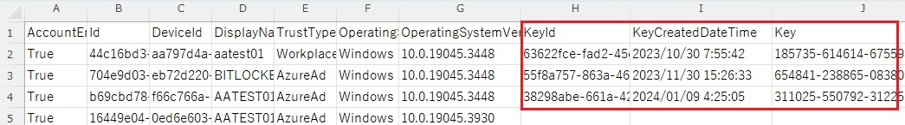

# Microsoft Entra ID に登録されている BitLocker 回復キーを一括取得する

こんにちは、Azure & Identity サポート チームの長谷川です。

Microsoft Entra ID に登録されている BitLocker 回復キーを一括取得する方法を紹介します。

現状、Microsoft Entra ID に登録されている BitLocker 回復キーは GUI から一括で取得することができません。そこで Microsoft Graph PowerShell モジュールのコマンドを使用して Microsoft Entra ID に登録されているデバイス一覧および BitLocker 回復キーを含む場合は回復キーも含めて CSV に出力する方法を紹介します。
<!-- more -->

## 出力方法
 
1. PowerShell を管理者権限で起動します。

2. 以下のコマンドを実行し、Microsoft Graph PowerShell モジュールをインストールします。(既にモジュールがインストールされている場合はスキップしてください)
~~~
Install-Module Microsoft.Graph -Force
~~~
 
3. 以下のコマンドを実行し、グローバル管理者で認証します。([要求されているアクセス許可] という画面が表示された場合は、[承諾] を押下します)
~~~
Connect-MgGraph -Scopes "Device.Read.All,BitlockerKey.Read.All" 
~~~
 
4. 以下のコマンドを順に実行して、Bitlocker 回復キーも含むデバイス オブジェクト一覧を CSV としてデスクトップに出力します。(KeyId、KeyCreatedDateTime、Key が出力されていないデバイスは BitLocker 回復キーが Microsoft Entra ID に保存されていないデバイスです。)
~~~
$outfile = "$env:USERPROFILE\Desktop\DevicelistIncludingKey.csv"
$keyList = Get-MgInformationProtectionBitlockerRecoveryKey -All
$BilockerRecoveryKeys = $keyList | %{Get-MgInformationProtectionBitlockerRecoveryKey -BitlockerRecoveryKeyId $_.Id -Property "key"}
$aadDevices = Get-MgDevice -All -Filter "OperatingSystem eq 'Windows'"
$data = @()
foreach ($BilockerRecoveryKey in $BilockerRecoveryKeys) {
    $aadDevice = $aadDevices | ?{$_.DeviceId -eq $BilockerRecoveryKey.DeviceId} 
    $data += $aadDevice | Select AccountEnabled,Id,DeviceId,DisplayName,TrustType,OperatingSystem,OperatingSystemVersion,@{Name="KeyId"; Expression={$BilockerRecoveryKey.Id}},@{Name="KeyCreatedDateTime"; Expression={$BilockerRecoveryKey.CreatedDateTime}},@{Name="Key"; Expression={$BilockerRecoveryKey.Key}}
}
foreach ($aadDevice in $aadDevices) {
    if ($aadDevice.DeviceId -notin $keyList.DeviceId) {
        $data += $aadDevice | Select AccountEnabled,Id,DeviceId,DisplayName,TrustType,OperatingSystem,OperatingSystemVersion
    }
}
$data | Export-Csv $outfile -encoding "utf8" -NoTypeInformation
~~~

5. 作業完了後、以下のコマンドでセッションを切断し作業を終了します。
~~~
Disconnect-MgGraph
~~~

## 出力された CSV のサンプル
下図の赤枠が BitLocker 関連情報で、"Key" の項目が BitLoker 回復キーです。

## おわりに

本記事では Microsoft Entra ID 上に保存された BitLocker 回復キーの一括取得方法を紹介しました。製品動作に関する正式な見解や回答については、お客様環境などを十分に把握したうえでサポート部門より提供しますので、ぜひ弊社サポート サービスをご利用ください。