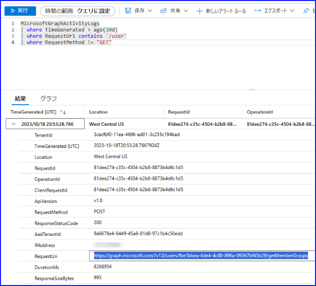
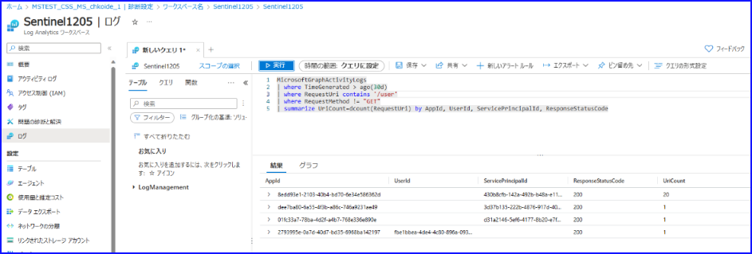

# パブリック プレビュー - Microsoft Graph アクティビティ ログが利用できるようになりました

こんにちは！ Azure ID の小出です。

本記事は、 2023 年 10 月 13 日に公開されました [Microsoft Graph Activity Log is Now Available in Public Preview](https://techcommunity.microsoft.com/t5/microsoft-entra-azure-ad-blog/microsoft-graph-activity-log-is-now-available-in-public-preview/ba-p/3848269) を分かりやすく日本語におまとめしなおした記事となります。ご不明点などございましたら、お気軽にサポートまでお問い合わせください。

---

Microsoft Graph API に対してアプリケーションが何をしているのか気になったことはありませんでしょうか。今回、その詳細を確認できる Microsoft Graph アクティビティ ログがパブリック プレビューとして今回利用可能となりました。これにより、Microsoft Graph API を通じてテナントに対して行われるすべての要求を可視化できるようになりました。

パブリック プレビューは直近開始されたばかりです。お客様によってはまだ利用できない可能性もありますが、今後 2 週間以内にすべての地域で利用できるようになりますため、展開を少々お待ちください。

## できること

現在でも、サインイン ログを収集して Microsoft Graph API に対する認証および認可アクティビティを分析したり、監査ログを収集して重要なリソースの変更を確認したりすることができます。Microsoft Graph アクティビティ ログを使用すると、サインイン ログでのトークン要求と監査ログでの最終的なリソースの変更に加えて、Microsoft Graph API 呼び出しの履歴 (読み取り、書き込み、削除) を調査できるようになります。

たとえば下記では、Microsoft Graph API に対する要求 URL (requestUrl) に /users が含まれるログを抽出したものになりますが、RequestUri を確認すると、getMemberGroups が呼び出されており、対象ユーザーが所属しているグループの情報を [directoryObject: getMemberGroups](https://learn.microsoft.com/ja-jp/graph/api/directoryobject-getmembergroups?view=graph-rest-1.0&tabs=http) を利用して取得したことが分かります。また、実行された時刻や HTTP メソッド、IP アドレスなども確認可能です。



Microsoft Graph アクティビティ ログには、リクエストとクライアントアプリケーションに関する情報が含まれます。一般的な使用例としては、次のようなものがあります:

- ユーザー アカウントが侵害された後、影響調査のためテナント内で行ったアクティビティを特定する。
- Microsoft Graph API の不審/異常な使用を特定するための分析環境を構築する (すべてのユーザーを列挙するアプリケーションや、403 エラー多く引き起こしている偵察目的のリクエストの特定など)。
- 予期しない、または不必要に特権をもつアプリケーションを調査する。
- テナントの帯域制限を使い果たすほどの極端な呼び出し量など、クライアント アプリケーションの問題または予期しない動作を特定する。

ログの検索を行うためには、 Log Analytics でのクエリの書き方を理解する必要があります。今回はいくつかサンプルを紹介します。

過去1日以内にグループの変更または削除を要求したアプリケーションをまとめる: 

```Query 
MicrosoftGraphActivityLogs
| where TimeGenerated > ago(1d)
| where RequestUri contains '/group'
| where RequestMethod != "GET"
| summarize UriCount=dcount(RequestUri) by AppId, UserId, ServicePrincipalId, ResponseStatusCode
```

認証に失敗した最近のリクエストを見る:

```Query 
MicrosoftGraphActivityLogs
| where TimeGenerated > ago(1h)
| where ResponseStatusCode == 401 or ResponseStatusCode == 403
| project AppId, UserId, ServicePrincipalId, ResponseStatusCode, RequestUri, RequestMethod
| limit 1000
```

リクエスト数が上位 20 のアプリ インスタンスを取得する:

```Query 
MicrosoftGraphActivityLogs
| where TimeGenerated > ago(1d)
| summarize RequestCount=count() by AppId, IpAddress, UserAgent
| sort by RequestCount
| limit 20
```



Microsoft Graph アクティビティ ログは、上記のとおり Log Analytics にエクスポートして解析することが一般的ですが、診断設定からその他のストレージにもログをエクスポートできます。下記の画面で Microsoft Graph Activity Logs を選択し、エクスポート先となるサービスを選択します。Log Analytics 以外にも、ストレージ アカウントなどにエクスポートすることなども可能です。なお、Log Analytics Workspace に収集されたログでは、ポータル上でのクエリ実行、アラート、クエリの保存機能、ワークブックなど、Azure Monitor Logs の全機能を使用できるため、単にログを保管するだけでなく追跡や監視を行いたい場合に便利です。


詳細につきましては、以下の公開情報も併せてご確認ください。

[Microsoft Graph アクティビティ ログにアクセスする (プレビュー)](https://learn.microsoft.com/ja-jp/graph/microsoft-graph-activity-logs-overview)
