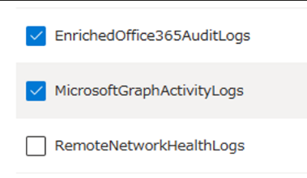

# Microsoft Graph アクティビティ ログが一般公開されました！

こんにちは！ Azure ID チームの小出です。

本記事は 2024 年 4 月 11 日に米国の Microsoft Entra (Azure AD) Blog で公開された [Microsoft Graph activity logs is now generally available](https://techcommunity.microsoft.com/t5/microsoft-entra-blog/microsoft-graph-activity-logs-is-now-generally-available/ba-p/4094535) をもとに、日本語に分かりやすくおまとめしなおしたものになります。ご不明点等ございましたらサポート チームまでお問い合わせください。

---

Microsoft Graph アクティビティ ログが **一般公開 (GA)** されました。これまではプレビューとして提供されておりましたが、プレビュー利用に制限のあるお客様などにおいては、今回の一般提供を機に初めてこのログを活用いただく方も多いかと思います。今日はこのアクティビティ ログを活用できるよう、概要と簡単な利用紹介について案内します。

## このアクティビティ ログでどんなことができますか？

Microsoft Graph のアクティビティ ログにより、テナント内の Microsoft Graph サービスに対する HTTP リクエストを可視化できるようになります。セキュリティの脅威が急速に拡大し、攻撃の数が増加している中、このログ データによって、セキュリティ分析、脅威の発見、テナント内のアプリケーション アクティビティの監視を行うことができます。 

具体的には、これまで Microsoft Entra の監視を行う場合、サインイン ログや監査ログをもとに変更ログを確認していたかと思います。これらのログの確認でも、誰がいつどのような操作を行ったかは監視できますが、「閲覧」や「情報の参照」などについては監査ログなどでは追跡することができませんでした。たとえば、攻撃者がユーザーの情報を全員分取得しようとした際、Microsoft Graph API の GET クエリを実行することになりますが、こういった GET クエリはテナントに変更をかけないため、サインイン ログや監査ログでは見ることができません。

今回一般提供された Microsoft Graph アクティビティ ログでは、いつどこからどのような Microsoft Graph のリクエストが送付され、返されたコードをもとに成功もしくは失敗したなどの情報を確認することができます。Microsoft Graph アクティビティ ログでは GET メソッドで実行された操作も追跡ができるため、これまでサインイン ログや監査ログでは確認できなかった「閲覧」についても、監視ができるようになりました。

## 一般的にはどのような場合に使用しますか？ 

下記のようなシナリオで Microsoft Graph アクティビティ ログを利用できます。

- 侵害されたユーザー アカウントがテナント内で行ったアクティビティの特定
- すべてのユーザーを列挙するアプリケーションや、多くの 403 エラーを伴うプロービング リクエストなど、Microsoft Graph API の疑わしい使用や異常な使用を特定するための検出および動作分析の構築
- 予期しない、または不必要に特権的なアプリケーション権限の割り当てを調査
- テナントのスロットリングの原因となる極端なコール量など、クライアント アプリケーションの問題または予期しない動作を特定
 
現在も、サインインログを収集して認証アクティビティを分析したり、監査ログを収集して重要なリソースの変更を確認したりすることができます。Microsoft Graph アクティビティ ログを使用すると、サインイン ログのトークン要求から、Microsoft Graph アクティビティ ログの API 要求アクティビティ (読み取り、書き込み、削除)、監査ログの最終的なリソースの変更まで、テナント内のアクティビティの全体像を調査できるようになります。


Microsoft Graph アクティビティ ログのプレビュー期間中に、多くのお客様にこのログを活用いただき、この中で Log Analytics へログを取り込む際のコストに関し、特に多くのご意見をいただきました。このため必要に応じて、ログの取り込みをより小規模なものにしコストを削減できるよう、ログの変換と基本的なログの機能を有効にしています。詳細は [こちら](https://learn.microsoft.com/ja-jp/graph/microsoft-graph-activity-logs-overview#cost-reduction-for-log-analytics) をご覧ください。
 
## 実際にどのように利用しますか？

Microsoft Graph アクティビティ ログは、診断設定を利用し Log Analytics ワークスぺースに出力したのち、クエリを使用して該当ログの検索や調査を行います。実際にどのようなクエリを使用するとどんな情報が取得できるのか、サンプルをいくつか紹介します。

過去1日以内にグループの変更または削除を要求したアプリケーションとプリンシパルをまとめる:

```kusto
MicrosoftGraphActivityLogs 
| where TimeGenerated > ago(1d) 
| where RequestUri contains '/group' 
| where RequestMethod != "GET" 
| summarize UriCount=dcount(RequestUri) by AppId, UserId, ServicePrincipalId, ResponseStatusCode 
```

認証に失敗した最近のリクエストを見る:

```kusto
MicrosoftGraphActivityLogs 
| where TimeGenerated > ago(1h) 
| where ResponseStatusCode == 401 or ResponseStatusCode == 403 
| project AppId, UserId, ServicePrincipalId, ResponseStatusCode, RequestUri, RequestMethod 
| limit 1000 
```

潜在的にリスクのあるユーザによって照会または変更されたリソースを特定する:

注: このクエリは、Entra ID Protection の [Risky User データ](https://learn.microsoft.com/ja-jp/entra/id-protection/howto-identity-protection-investigate-risk) を利用しています。

```kusto
MicrosoftGraphActivityLogs 
| where TimeGenerated > ago(30d) 
| join AADRiskyUsers on $left.UserId == $right.Id 
| extend resourcePath = replace_string(replace_string(replace_regex(tostring(parse_url(RequestUri).Path), @'(\/)+','/'),'v1.0/',''),'beta/','') 
| summarize RequestCount=dcount(RequestId) by UserId, RiskState, resourcePath,
RequestMethod, ResponseStatusCode 
```

具体的に記載したいクエリがあるものの、記載方法が分からない場合は、 Log Analytics 観点にてお問い合わせを発行いただけますと幸いです。その際、「MicrosoftGraphActivityLogs テーブルにある情報から xxx と xxx の列の情報をを取得したい」といった具体的な列名やフィルターなどの情報をお寄せいただけますとスムーズな対応が可能です。

## 利用方法

Microsoft Graph アクティビティ ログは、Microsoft Entra の Azure Monitor 統合機能で利用できます。Microsoft Entra ID P1 または P2 テナントの管理者は、Entra ポータルの診断設定から Microsoft Graph アクティビティログの収集先と保存先を設定できます。具体的には、診断設定の中で MicrosoftGraphActivityLogs にチェックを入れます。



また、「Log Analytics ワークスペースへの送信」を選択することで、Log Analytics ワークスペースに転送可能です。Azure Log Analytics ワークスペースに保存して照会したり、Azure Storage Accounts にアーカイブしたり、Azure Event Hubs を介して他のセキュリティ情報およびイベント管理 (SIEM) ツールにエクスポートしたりできます。どのサービスに保存するかはお客様のご要望次第ですが、Log Analytics Workspace に収集されたログについては、ポータル クエリ エクスペリエンス、アラート、保存されたクエリ、ワークブックなど、Azure Monitor Logs のすべての機能を使用できます。もし、長期保存のみを目的とするのではなく、アラートと組み合わせたり、上記クエリを用いて調査をしたりしたい場合には、 Log Analytics ワークスペースを指定ください。  


Microsoft Graph のアクティビティ ログを有効にする方法、サンプル クエリなどについては、[こちら](https://learn.microsoft.com/ja-jp/graph/microsoft-graph-activity-logs-overview) のドキュメントを参照ください。
