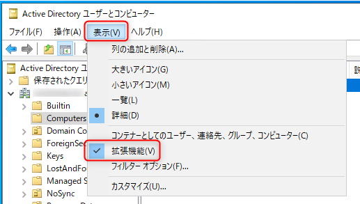
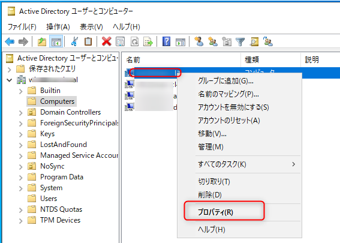
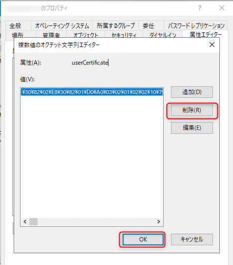
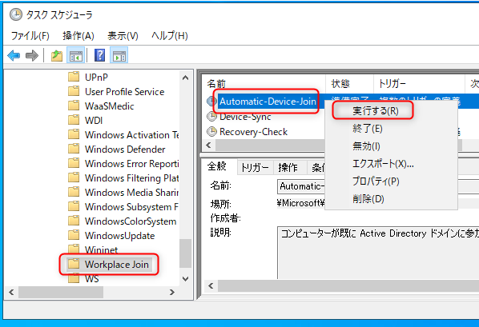
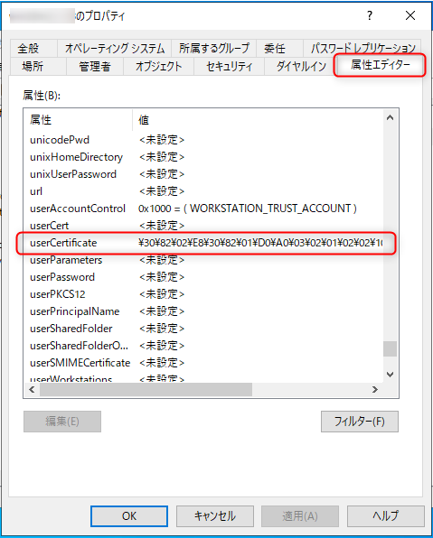
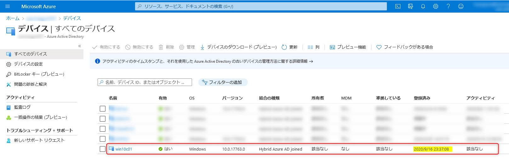

# ハイブリッド Azure AD 参加を再構成する

こんにちは、Azure & Identity サポート チームの長谷川です。

この記事では、対象デバイスのハイブリッド Azure AD 参加 (略称 HAADJ) を再構成する手順を紹介します。

<!-- more -->

HAADJ を構成完了後、たとえばなんらか Azure AD 上から誤ってデバイス オブジェクトを削除してしまう場合があるかと思います。削除後、再度 Azure AD Connect (略称 AADC) でデバイス オブジェクトが同期されると [Azure Portal (portal.azure.com)] > [Azure Active Directory] > [デバイス] > [すべてのデバイス] で対象のデバイス オブジェクトが表示されるようになりますが、[登録済み] の項目が「保留中」のまま遷移しない状態になります。「保留中」から登録日に遷移させるためにはデバイスで HAADJ を再構成する必要があるものの、実際のデバイス側は既に HAADJ の構成が完了しているため、そのままでは HAADJ を再構成する動作が生じません。こういった場合に、本ブログを参考に HAADJ を再構成いただけると幸いです。

## 目次

1. [注意事項](#anchor1)
2. [事前準備: Windows Hello for Business のリセット](#anchor2)
3. [事前準備: Intune の登録解除](#anchor3)
4. [HAADJ 再構成: 既存情報のクリア](#anchor4)
5. [HAADJ 再構成: 改めて構成](#anchor5)
6. [事後確認: Intune の登録](#anchor6)
7. [事後作業: WHfB の再プロビジョニング](#anchor7)

<h2 id="anchor1">1. 注意事項</h2>

本手順は Azure AD でデバイスを認証する「Sync Join」「マネージド」「クラウド認証」などと呼ばれる構成方法にのみ適用可能です。

この構成方法は、オンプレミスの Active Directory サーバーから AADC を介して Azure AD にデバイス オブジェクトを同期し、Azure AD でデバイスを認証して HAADJ としてデバイスを構成するものです。もしも AD FS でクレーム ルールを使用してデバイスを認証し、Azure AD にデバイスを登録して HAADJ を構成している場合はこの手順は利用できません。

なお、再度 HAADJ を構成するためにはそのデバイス上での管理者権限と、デバイスがオンプレミスの Active Directory にアクセスできる環境 (社外にデバイスがある場合は、オンプレミス AD 環境への VPN 接続) が必要です。

<h2 id="anchor2">2. 事前準備: Windows Hello for Business のリセット</h2>

**Windows Hello for Business (略称 WHfB) を利用していない場合はこの手順はスキップください。**

1. 端末にサインインします。
2. **ユーザー権限** でコマンド プロンプトを起動します (管理者として実行から起動しないようご注意ください)。
3. 以下のコマンドを実行して、WHfB の情報をリセットします。

    ```
    certutil -deletehellocontainer
    ```
    
4. 次のコマンドを実行し、`NgcSet : NO` となっていることを確認します。

    ```
    dsregcmd /status
    ```

<h2 id="anchor3">3. 事前準備: Intune の登録解除</h2>

**Intune 登録していなければスキップください。**

1. [Microsoft Intune admin center (endpoint.microsoft.com)] > [デバイス] > [すべてのデバイス] から該当デバイスを検索し、存在する場合は対象デバイスを開いて [削除] ボタンをクリックして削除します (削除完了するまでに少し時間がかかります)。
2. 対象のデバイス上で、[PowerShell] を **管理者権限** で実行します。
3. 以下のコマンドを実行し、Enrollment ID (GUID の形式となる想定) が表示されるかを確認します。( **Enrollment ID が表示されない場合は以下の 4. から 7. の手順は絶対に実施しないでください。必要なタスクなどを削除してしまう恐れがあります** )

    ```
    Get-ChildItem HKLM:\Software\Microsoft\Enrollments | ForEach-Object {Get-ItemProperty $_.pspath} | where-object {$_.DiscoveryServiceFullURL} | Foreach-Object {$_.PSChildName}
    ```

4. 以下のコマンドを実行し、Enrollment ID を変数に格納します。

    ```
    $EnrollmentGUID = Get-ChildItem HKLM:\Software\Microsoft\Enrollments | ForEach-Object {Get-ItemProperty $_.pspath} | where-object {$_.DiscoveryServiceFullURL} | Foreach-Object {$_.PSChildName}
    ```

5. 以下のコマンドを実行し削除対象のレジストリを変数に格納します。(長いですが 1 行のコマンドです)
    ```
    $RegistryKeys = "HKLM:\SOFTWARE\Microsoft\Enrollments", "HKLM:\SOFTWARE\Microsoft\Enrollments\Status","HKLM:\SOFTWARE\Microsoft\EnterpriseResourceManager\Tracked", "HKLM:\SOFTWARE\Microsoft\PolicyManager\AdmxInstalled", "HKLM:\SOFTWARE\Microsoft\PolicyManager\Providers","HKLM:\SOFTWARE\Microsoft\Provisioning\OMADM\Accounts", "HKLM:\SOFTWARE\Microsoft\Provisioning\OMADM\Logger", "HKLM:\SOFTWARE\Microsoft\Provisioning\OMADM\Sessions"
    ```
    
6. 以下のコマンドを実行し、デバイス登録情報に関するレジストリを削除します。

    ```
    foreach ($Key in $RegistryKeys) {if (Test-Path -Path $Key) {Get-ChildItem -Path $Key | Where-Object {$_.Name -match $EnrollmentGUID} | Remove-Item -Recurse -Force -Confirm:$false -ErrorAction SilentlyContinue}}
    ```

7. 以下のコマンドを実行し、デバイス登録のタスクを削除します。
    ```
    Get-ScheduledTask | Where-Object {$_.Taskpath -match $EnrollmentGUID} | Unregister-ScheduledTask -Confirm:$false
    ```

<h2 id="anchor4">4. HAADJ 再構成: 既存情報のクリア</h2>

実際に HAADJ の再登録を行うに際して既存の情報をクリアしておきます。

1. 対象のデバイスにて __管理者権限__ でコマンド プロンプトを起動し、次のコマンドで HAADJ を解除します。
    ```
    dsregcmd /leave
    ```

2. 次のコマンドで `AzureAdJoined : NO` となっていることを確認します。

    ```
    dsregcmd /status
    ```

3. オンプレミスの Active Directory にて、[Active Directory ユーザーとコンピューター] を開き、[表示(V)] > [拡張機能(V)] を有効にします。(すでに有効であればスキップしてください)

    

4. [Active Directory ユーザーとコンピューター] にて対象のコンピューター アカウントを探し、右クリックから [プロパティ] を開きます (誤ったオブジェクトを操作しないよう直接対象のコンピューター アカウントを探すことをお勧めします。)

    

5. [属性エディター] から [userCertificate] を選択し、[編集(E)] を選択します。

    

6. [削除(R)] してから [OK] を選択します。

    

7. [userCertificate] が <未設定> となっていることを確認したら [OK] を選択して閉じます。

    

8. AADC の同期 (既定では 30 分間隔) を待ち、[Azure Portal (portal.azure.com)] > [Azure Active Directory] > [デバイス] > [すべてのデバイス] にて対象のデバイス オブジェクトが削除されていることを確認します。

<h2 id="anchor5">5. HAADJ 再構成: 改めて構成</h2>

以下の手順で実際に再構成を行います。

1. 対象のデバイスを再起動したのち、対象のユーザーでサインインします。
2. 対象のデバイスがオンプレミスの Active Directory にアクセスできるネットワーク環境に接続していることを確認します (社内ネットワーク環境に接続するなど)。
3. **管理者権限** でタスク スケジューラを起動し [タスク スケジューラ ライブラリ] > [Microsoft] > [Windows] > [Workplace Join] を開きます。
4. [Automatic-Device-Join] を 右クリックし [実行する(R)] を選択します。

    

5. オンプレミスの Active Directory にて対象のコンピューター アカウントに userCertificate に値が書き込まれたことを確認します (上記「4. HAADJ 再構成: 既存情報のクリア」の 3 から 5 の手順を参考)。

    

6. AADC の同期 (既定では 30 分間隔) を経て [Azure Portal (portal.azure.com)] > [Azure Active Directory] > [デバイス] > [すべてのデバイス] に対象のデバイス オブジェクトが同期されたことを確認します。

    

7. Azure AD への同期を確認後、再度 [Automatic-Device-Join] を実行します。(3 から 4 の手順を参考)
8. コマンド プロンプトを起動し次のコマンドを実行し `AzureAdJoined : YES` となっていることを確認します。

    ```
    dsregcmd /status
    ```

9. [Azure Portal (portal.azure.com)] > [Azure Active Directory] > [デバイス] > [すべてのデバイス] で対象のデバイス オブジェクトの [登録済み] の項目が「保留中」から現在の日付に遷移したことを確認します。

    

10. 対象デバイスにて 画面のロック > アンロック をすることで プライマリ更新トークン (PRT) を取得します。(すぐにアンロックしていただいて問題ありません)
11. 対象のデバイスにて対象の **ユーザー権限** でコマンド プロンプトを起動し、次のコマンドを実行して `AzureAdPrt : YES` となっていることを確認します (管理者として実行から起動しないようご注意ください)。

    ```
    dsregcmd /status
    ```

<h2 id="anchor6">6. 事後確認: Intune の登録</h2>

**この手順は Intune 登録しなければ不要です。** また、反映に時間がかかることがあります。

1.  [Azure Portal (portal.azure.com)] > [Azure Active Directory] > [デバイス] > [すべてのデバイス] で対象のデバイス オブジェクトの [MDM] の項目に値が入り [準拠している] が「はい」となっていることを確認します。
2. [Microsoft Intune admin center (endpoint.microsoft.com)] > [デバイス] > [すべてのデバイス] から該当デバイスを検索し対象デバイスの [対応] の項目が「準拠している」となっていることを確認します。

<h2 id="anchor7">7. 事後作業: WHfB の再プロビジョニング</h2>

**WHfB を利用していなければ不要です。**

1. 端末を再起動します。
2. 対象のユーザーでサインインすると WHfB のプロビジョニングが自動的に始まりますのでウィザードに沿ってセットアップします (ウィザードの中で多要素認証が要求されます)。

## おわりに

以上、HAADJ の再構成手順が運用の助けになると嬉しく思います。製品動作に関する正式な見解や回答については、お客様環境などを十分に把握したうえでサポート部門より提供しますので、ぜひ弊社サポート サービスをご利用ください。
