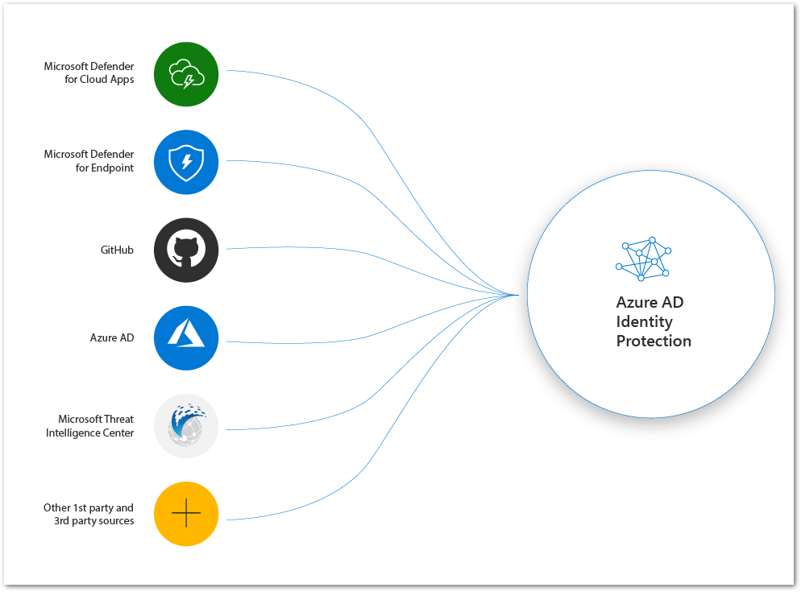
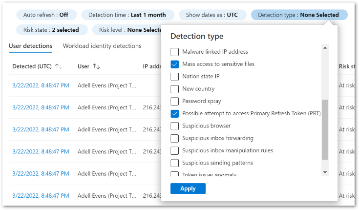
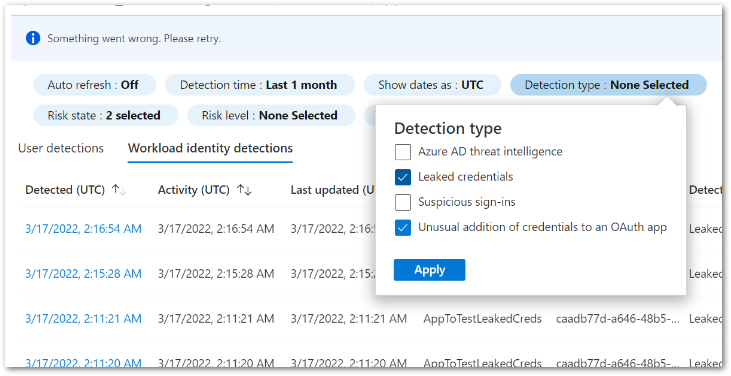
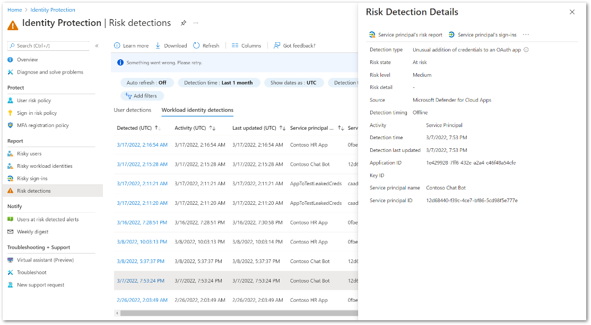
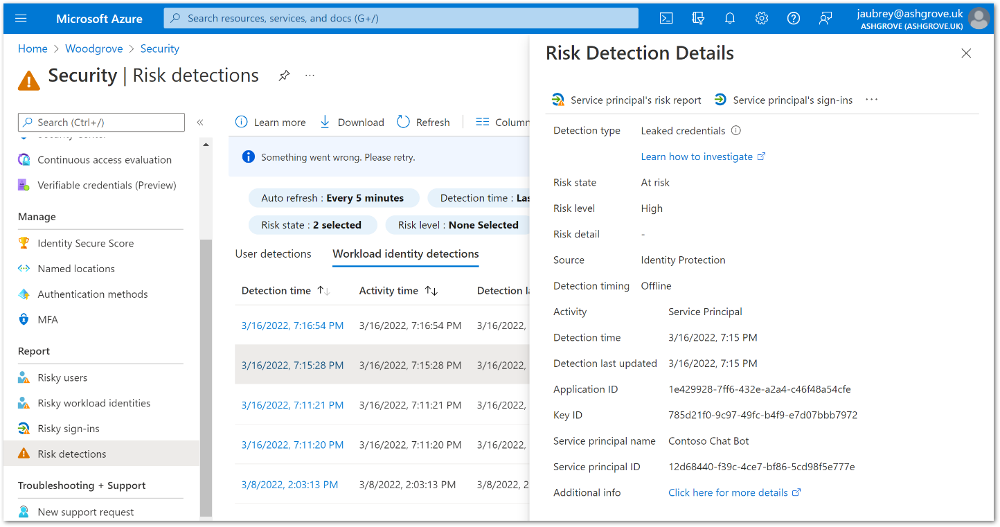

# Microsoft が提供する包括的な ID 侵害のシグナルについて

こんにちは、Azure Identity サポート チームの 竜 です。

本記事は、2022 年 04 月 05 日に米国の Azure Active Directory Identity Blog で公開された [Holistic compromised identity signals from Microsoft](https://techcommunity.microsoft.com/t5/azure-active-directory-identity/holistic-compromised-identity-signals-from-microsoft/ba-p/2365683) を意訳したものになります。

----

皆さん、こんにちは。この度、Azure Active Directory (Azure AD) Identity Protection において、クラウド アプリケーションおよびエンドポイントにおける ID に対する脅威の検出領域をさらに拡大し、包括的な ID のリスク情報を強化するよう 4 つの新しい検出機能の一般提供を発表できることを嬉しく思っています。
 
新たに 4 件の検知機能の提供を始めました:

- OAuth を利用したアプリへの異常な「資格情報の追加」
- 機密ファイルへの大量のアクセス
- プライマリ リフレッシュ トークン (PRT) へのアクセスの試行
- ワークロード ID における漏洩した資格情報

これらは、ワークロードとユーザーの ID を保護するために、Identity Protection が Microsoft Defender for Cloud Apps、Microsoft Defender for Endpoint、GitHub の脅威インテリジェンスを統合した素晴らしい例です。

これらの新しい検出機能により、Identity Protection が ID の侵害を検出し、シームレスに修復を開始できる範囲が広がりました。攻撃が持続し、その新奇性も増す中、検知と修復は一分一秒を争うものです。Azure AD 条件付きアクセスの「ユーザーまたはサービスプ リンシパルのリスク ポリシー」を利用することで、リスクが検知された際にユーザー アカウントを自動的に修復したり、サービス  プリンシパルをブロックしたりすることができます。これらの新しい検出機能により、ID の侵害を検出し、多様なシグナルを使用してシームレスに修復を開始する Identity Protection の機能が大幅に強化されます。 

## マイクロソフトの Identity Threat インテリジェンス エコシステムを理解する

マイクロソフト社内の脅威検知のエコシステム、社外の研究者、法執行機関、および外部パートナーなどから脅威のインテリジェンス情報を統合することは、Identity Protection のリスク エンジンの中核をなす要素です。マイクロソフトのセキュリティ製品が新しい攻撃手法を検出し、既存の検出機能を改良していく中で、私たちは資格情報の侵害を特定するため、お客様にとって最も効果的な検出機能を今後も統合していくつもりです。今回発表した検知機能は、ユーザーやワークロードの ID リスクに影響するリスク検知機能として、Microsoft Defender for Endpoint、Microsoft Defender for Cloud Apps、およびパブリックな GitHub リポジトリからのシグナルを Identity Protection リスク検知機能として統合します。Identity Protection の新しいレポートと修正オプションにより、ID 管理者の作業が簡素化されます。

また、より多様なシグナルを Identity Protection に統合するための作業も進めています。さらに、[riskyUsers API](https://docs.microsoft.com/ja-jp/graph/api/resources/riskyuser?view=graph-rest-1.0) を介して Identity Protection に統合される サードパーティの ISV (Independent software vendors: 独立したソフトウェア ベンダー) や脅威検知の提供元も [続々と受け入れている](https://www.sentinelone.com/press/sentinelone-unveils-new-zero-trust-integration-for-microsoft-azure-active-directory/) 状況です。これにより、Azure AD Identity Protection を利用中の顧客を持つサード パーティは、自身が保持する脅威のインテリジェンス情報に基づいて、ユーザー ID の侵害を検知する機能を構成可能となります。

## 新しい検出機能から得られる価値

これらの新しい Microsoft の検出機能の利用は非常簡単に利用いただけます。Microsoft Defender for Endpoint と Microsoft Defender for Cloud Apps をすでにご利用の場合、これらの優れた検出機能は、自動的に Identity Protection に統合されます。これらの検出機能は、[リスク検出] レポートや、危険なユーザーまたはワークロード ID のユーザー履歴から確認することができます。機密ファイルへの大量のアクセスについても、異常なアクティビティを特定の認証リクエストと照合し、サインインの詳細を表示することができるため、「リスクあるサインイン」レポートから確認することができます。

また、漏洩した資格情報に関して GitHub との連携も同様にスムーズに行われます。多くの組織では長い間、コード内に直接資格情報を埋め込む問題に悩まされてきました。この問題に対処するため、弊社では Identity Protection においてこれらの漏洩した資格情報の適用範囲を拡大し、GitHub 上の公開されたコードをその対象するとともに、[ワークロード ID 用の Identity Protection](https://jpazureid.github.io/blog/azure-active-directory/extend-the-reach-of-azure-ad-identity-protection-into-workload/) により有効なシークレットにアラートを発するようにしました。GitHub は公開されているコードの中からシークレットをスキャンし、検証のためにその情報を Azure AD に送信します (各々のテナントにて本機能の設定をする必要はありません)。もしもシークレットが有効である場合は、Identity Protection はアカウントに対して「リスク検出」を生成し、そのシークレットのキー ID にアラートを上げます。生成された「リスク検出」は、[リスク検出] レポートから確認することができます。[追加の情報] (Additional Information) プロパティにあるリンクをクリックすると、漏洩した疑いのある認証情報が含まれる GitHub ファイルに移動することができます。Identity Protection が漏洩したとマークしたシークレットを削除することで、検出されたリスクが修復されます。

Identity Protection のリスク データをプログラムから取得したり、独自の SIEM (Security Information and Event Management: セキュリティ情報およびイベント管理) にエクスポートなどされているお客様もいらっしゃると思いますので、これらのアクションを簡単に行えるようにしました。また、[サービス プリンシパルのリスクのための API](https://docs.microsoft.com/ja-jp/graph/api/resources/identityprotection-overview?view=graph-rest-beta&preserve-view=true) および [ユーザー リスク検出のための API](https://docs.microsoft.com/ja-jp/graph/api/resources/identityprotection-overview?view=graph-rest-1.0&preserve-view=true) を使用して、これら 4 つのリスク検出を照会することもできます。ほんの数クリックで、[Azure AD 診断設定を構成](https://docs.microsoft.com/ja-jp/azure/active-directory/identity-protection/howto-export-risk-data) し、リスク データを Log Analytics ワークスペースやイベント ハブに転送したり、ストレージ アカウントにアーカイブしたり、あるいは SIEM ソリューションに送信したりすることが可能です。 

## 次のステップ

弊社では、皆さまの組織の安全を守るためには、最大限包括的な ID 侵害のシグナルを取得することが重要であると認識しています。これらの新しいシグナルと Identity Protection の豊富な ID 脅威インテリジェンスを最大限に活用するには、[リスクのあるサービス プリンシパル](https://docs.microsoft.com/ja-jp/azure/active-directory/conditional-access/workload-identity#create-a-risk-based-conditional-access-policy)、[リスクのあるユーザーおよびリスクのあるサインイン ポリシー](https://docs.microsoft.com/ja-jp/azure/active-directory/identity-protection/howto-identity-protection-configure-risk-policies) を設定して、自動修復を行うことをお勧めします。Identity Protection は、Microsoft 社内およびパートナー企業のセキュリティ製品からのシグナルを統合し、最も正確で関連性の高い ID リスク エンジンを提供し続けていきます。

新しいシグナルと、セキュリティ製品全体の統合にご期待ください。そして、いつものように、皆さまのフィードバックをお待ちしています。(Twitter: @alex_t_weinert)
