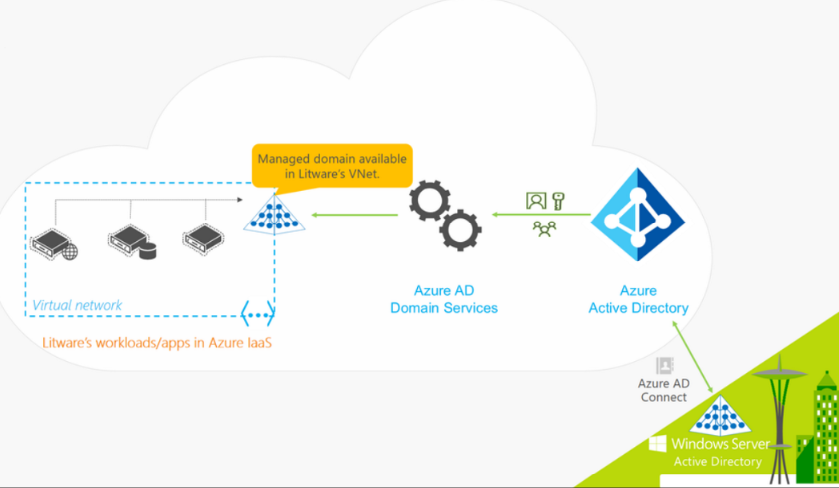
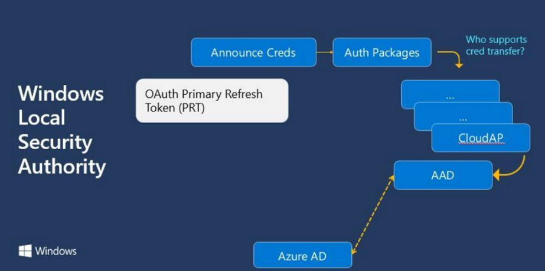
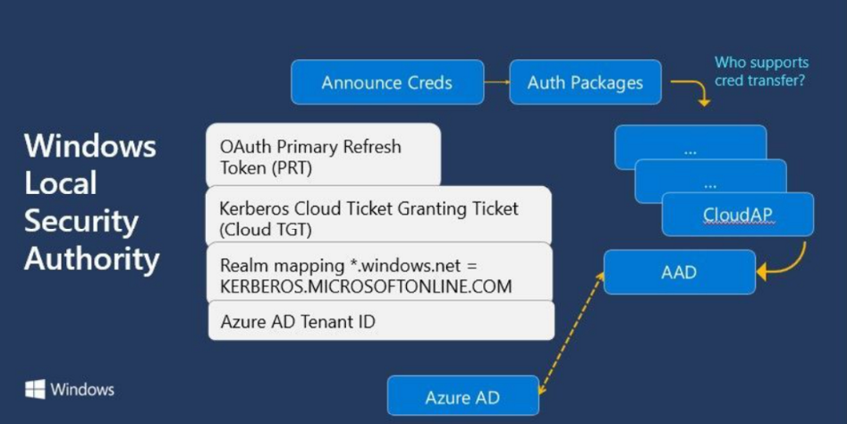
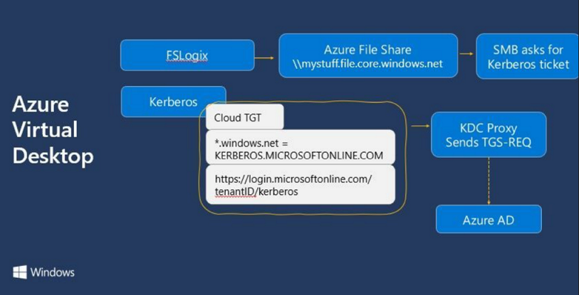
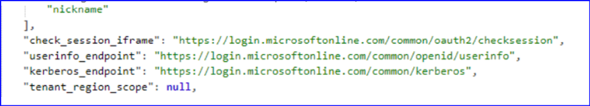
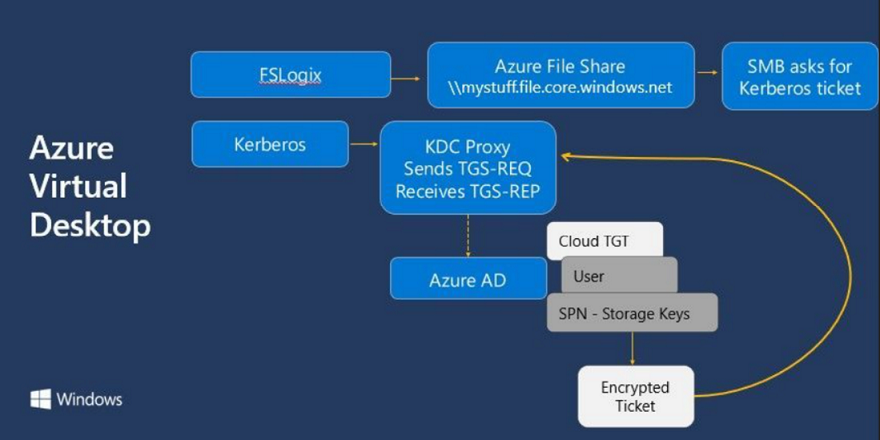
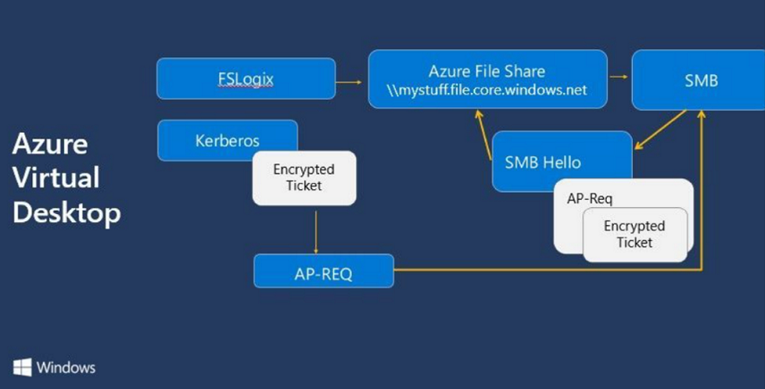
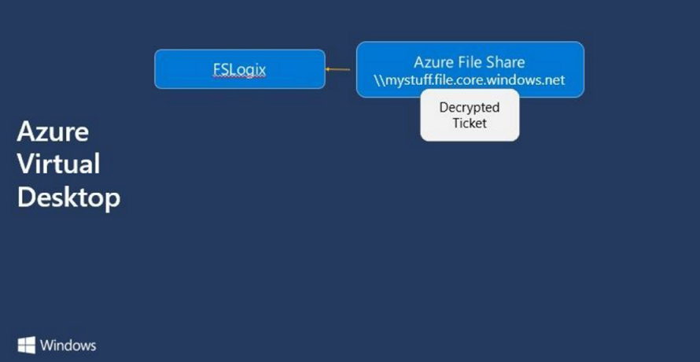

こんにちは、 Azure Identity サポート チームの小出です。

本記事は、 2022 年 1 月 25 日に米国の ITOps Talk Blog で公開された [Deep dive: How Azure AD Kerberos works](https://techcommunity.microsoft.com/t5/itops-talk-blog/deep-dive-how-azure-ad-kerberos-works/ba-p/3070889) を意訳したものになります。ご不明点などございましたら、サポート チームまでお問い合わせください。

---

# Deep dive: Azure AD Kerberos の仕組み

Active Directory (AD DS) と Azure Active Directory (Azure AD) の違いを調べたことがあれば、Active Directory は  Kerberos 認証プロトコルをサポートしている一方、 Azure Active Directory ではサポートしていないことに気がつくはずです。
 
Kerberos は、Active Directory ドメイン コントローラーでアカウントを認証するために使用されていました。このおかげで、SMB プロトコルにて Windows Server 上のファイル共有にアクセスすることができます。これはほんの一例で、あなたの組織が昔作成したものも含め、多くのアプリケーションが Kerberos 認証に依存しています。ローカル Windows へのログオン プロセスがどのように動作しているかや、いつ、どのように Kerberos が動作するかなどの詳細については、[Deep dive: Logging on to Windows](https://techcommunity.microsoft.com/t5/itops-talk-blog/deep-dive-logging-on-to-windows/ba-p/2420705?WT.mc_id=modinfra-54539-socuff) をご覧ください。
 
Kerberos 認証や、古いアプリケーション用に Windows Server を Azure 上でホストする場合、Azure Active Directory Domain Services (Azure AD DS) のマネージド ドメインを作成することになります。このディレクトリは、Azure AD からアカウントを同期しますが、同時に Azure AD 上のアカウントはオンプレミスの Active Directory ドメインから同期されているものの可能性もあります。これにより、Azure 上に Active Directory ドメイン コントローラーを導入することなく、Azure 仮想マシンをドメイン参加させ、グループ ポリシーを適用できるようになります。Azure AD DS にはいくつかの制限がありますが、これが Azure で Kerberos をサポートするための標準的な方法になります。

  
Active Directory、Azure Active Directory、Azure AD Domain Servicesのハイブリッド環境

[Azure AD DS についての詳細はこちらへ](https://docs.microsoft.com/ja-jp/azure/active-directory-domain-services/overview?WT.mc_id=modinfra-54539-socuff)
 
アプリケーションを刷新するために他の選択肢がない場合や、そのための時間を確保できない場合にのみ、この方法を取ることをお勧めします。[Why We Built Azure AD Kerberos](https://syfuhs.net/why-we-built-azure-ad-kerberos) の中で、Steve Syfuhs 氏は、「Active Directory で使われている Kerberos はパスワードに依存しており、FIDO や多要素認証、条件付きアクセスのような機能をサポートしていない」と述べています。オンプレミスでこれらの機能の一部をサポートするソリューションもありますが、Azure AD のチェックボックスをポチポチするのに比べると複雑な方法になります。
 
## 具体的な使用例として、Azure Virtual Desktop 用の FSLogix を使用したプロファイル コンテナについて見てみる
 
仮想デスクトップやリモート デスクトップの世界では、複数の人が 1 つのサーバーにログオンして、自分だけの一時的なリモート セッションを利用できるサービスが存在します。デフォルトのデスクトップ設定やアイコンを設定でき、PC 上で実行しているのと同じようにアプリケーションを実行できます。これは、すべてのコンピューターのローカルにインストールして実行させたくないような、ブラウザー以外の業務用アプリケーションへのアクセスを集中管理するのに非常に便利なものです。マイクロソフトは、1996 年に Windows NT 4.0 Terminal Server Edition で "リモート デスクトップ サービス" をリリースして以来、このような仮想化を提供してきました。

ユーザーが Windows デスクトップにログインするにあたり、ユーザー プロファイルという概念が生まれました。これは、デスクトップの背景色、スクリーン セーバー、オート コンプリートお項目などを含む、そのユーザー用の環境設定です。ローカル コンピューターでは、そのユーザー プロファイルはローカル ディスクに保存されます。「移動ユーザー プロファイル」を設定した場合、これらの設定は代わりにサーバーに保存され、ネットワーク ドライブのファイル共有 (通常はユーザーの「ホーム」ドライブと呼ばれます) にマッピングされますので、ドメインに参加している組織内のどのコンピューターにログオンしても、これらの設定が適用されます。

FSLogix は、特に非永続的な仮想環境 (仮想デスクトップ) のユーザー プロファイルをネットワーク共有の場所に保持し、同時にプロファイルがネットワーク共有にあることをアプリから見てわからないように設計されています。このように透過的なプロファイル構成を実現することは、ユーザープロファイルをローカルに保存する必要がある一部のアプリケーションにとって重要です。

つまり、仮想デスクトップ環境が Azure Virtual Desktop で、ユーザー プロファイルをファイル共有に置きたい場合、Azure Files のようなものを使えばよいということになります。Azure Files は SMB ファイル共有プロトコルをサポートしているので、Windows PC から Azure Files に接続することができます。少し設定するだけで、Windows クライアントが Active Directory で認証したときに受け取ったチケットを Azure Files が解読し、受け入れてくれるからです。

Azure Virtual Desktop がドメイン参加か Azure AD 参加しており、VPN 経由で Active Directory ドメイン コントローラーにアクセスできるよう構成されているか、Azure の仮想マシンとして動作している Active Directory ドメイン コントローラに接続できるかしない限り、Azure Virtual Desktop はユーザーを認証することができません。このように、撤廃しようと取り組んでいる様々な基盤への依存や管理が増えることになります。これを解決するために、ID チームは FIDO とのハイブリッド認証に使用される Ticket-Granting Ticket (TGT) について着目しました。
 
## 認証プロセス

認証に関してどのくらいの知識があるかにもよりますが、参考としてこの 2 つの記事を読み返してみるのがおすすめです。

[Deep dive: Logging on to Windows](https://techcommunity.microsoft.com/t5/itops-talk-blog/deep-dive-logging-on-to-windows/ba-p/2420705?WT.mc_id=modinfra-54539-socuff)  
[Deep dive: Windows hybrid join single-sign on to Active Directory](https://techcommunity.microsoft.com/t5/itops-talk-blog/deep-dive-windows-hybrid-join-single-sign-on-to-azure-active/ba-p/2602107)  
 
 下の図は、Windows Local Security Authority が認証情報を持っていることを通知し、どの認証パッケージが Azure AD に対応しているかを確認し、さらに Cloud Authentication Provider パッケージ (CloudAP) が応答して、AAD プラグインを使用し、OAuth プロトコルを使って Azure AD と通信しているところを示しています。  

ユーザーの認証情報が検証されると、Oauth Primary Refresh Token (PRT) が発行されます。この PRT は、特定のデバイス上の特定のユーザーに対して発行され、デバイス ID とセッション キーが含まれています。

  
Azure Active Directory から OAuth PRT を取得する Windows ローカルセキュリティ権限

## Titkcet Granting Ticket と Realm

Kerberos は PRT を使用せず、TGT (Ticket Granting Tickets - 特に krbtgt) を使用します。  

Microsoft は、[FIDO セキュリティ キーの認証プロセスに、クラウドが発行した特別な Kerberos TGT](https://techcommunity.microsoft.com/t5/itops-talk-blog/deep-dive-windows-hybrid-join-single-sign-on-to-azure-active/ba-p/2602107) を使用する機能を追加しました。しかし、この機能では以前としてオンプレミスのサーバーを参照して、クラウドから発行された kerberos TGT を完全なオンプレミス TGT と交換する必要があります。必要とするすべてのコンポーネントが用意されているわけではないため、チームはクラウド TGT を開発したというわけです。
 
## Azure AD の Kerberos 認証プロセス

Windows は Azure AD と認証し、PRT と クラウド TGT（FIDO キーでログオンした場合は、さらに Patrtial TGT）を取得します。 ここでの課題は、プライマリ TGT は、1 つのレルム (オンプレミス AD) に対して 1 つだけ持つことになっていることです。そこでこのプロセスでは、クライアントに対し、クラウドのリソースについては別のレルムにマッピングするよう指示し、Azure AD のテナントの詳細についても併せて取得します。  

*.windows.net = KERBEROS.MICROSOFTONLINE.COM  

  
Azure AD から Kerberos のクラウド TGT、レルム マッピング、Azure テナント情報を取得している Windows LSASS

Azure Virtual Desktop にログインし、認証して PRT と クラウド TGT を取得すると、Azure Virtual Desktop は FSLogix を呼び出して Azure Files 共有 (例: \mystuff.file.core.windows.net) からユーザー プロファイルを読み込もうとします。これは実体として SMB ファイル共有として参照されるので、SMB は cifs/mystuff.file.core.windows.net の Kerberos チケットを探しに行くのです。

Azure AD 認証プロセスで、Windows にマッピング情報を与えているので、Windows は *.windows.net リソースのために Active Directory ドメインコントローラーに問い合わせるということはしません。その代わり、Kerberos スタックはクラウド TGT を realm マッピングと一緒にキャッシュに配置し、realm マッピングと Azure AD テナントの詳細情報の間で「KDC Proxy」マップを構成します。

  
Azure AD に TGS-REQ を送信する Kerberos

これにより、チケット要求に対して、Kerberos は cifs/mystuff.file.core.windows.net を参照し、*.windows.net は KERBEROS.MICROSOFTONLINE.COM にマッピングされ、その realm から https://login.microsoftonline.com/tenantid/kerberos にマッピングする KDC Proxy が出来上がることになります。
  
[KDC Proxy protocol](https://docs.microsoft.com/ja-jp/openspecs/windows_protocols/ms-kkdcp/5bcebb8d-b747-4ee5-9453-428aec1c5c38?WT.mc_id=modinfra-54539-socuff) は、インターネット上で Kerberos をやり取りする仕組みです。  そして、Azure AD は Ticket Granting Service-Request (TGS-REQ) を受け取ることになります。  

  
Ticket Granting Service - 要求

次に Azure AD は:

1. クラウド TGT と Azure AD のテナント ID が一致するか確認します。  
2. ユーザーが存在するかどうかを問い合わせます。  
3. 要求されたサービス プリンシパル名 (Azure AD にアプリケーションとして登録された Azure Files リソース) を検索します。  
4. チケットを生成します。  
5. チケットを、そのサービス プリンシパル名に格納されている Azure Files ストレージ キーで暗号化します。  
6. そして、それをすべて TGS-REP にまとめて返します。 

  
TGT 要求の送信と受信を行う際の Kerberos の動作

Kerberos スタックが TGT 応答 (TGS-REP) を取り戻すと、Kerberos スタックは:

1. チケットを開封します。
2. アプリケーション リクエスト (AP-REQ) を生成し、SMB にそれを渡します。  
3. そして、SMB プロトコルは AP-REQ をヘッダーに詰め込み、SMB Hello を Azure Files に送信します。  
 
  
AP-REQ と暗号化されたチケットを受信する際の SMB の動作

Azure Files は hello を受け取り、チケットを復号化 (ストレージ キーを使用) して完了です。FSLogix は、Azure File Share のユーザー プロファイルを読み込んで、Azure Virtual Desktop セッションをロードします。

  
SMB 経由で Azure File Share にアクセスする FSLogix の動作

SMB、Azure Files、AVD からすると、Kerberos チケットが実際に Active Directory を参照していないということは全くわかりません。

注: このサービスの現在のパブリック プレビューでは、オンプレミスの Active Directory にユーザーが存在し、Azure AD connectを使用してAzure ADに同期されていることが必要です。Azure AD で個別に作成されたクラウド ユーザーの利用は、まだサポートされていません… が、今後サポートされる予定です。

## Azure Files for FSLogix と Azure Virtual Desktop を導入する方法

Azure Files などの設定方法について、ステップごとに知りたい場合は、Dean Cefola のビデオをご覧ください。

(https://www.youtube.com/watch?v=suvDH-yNL88)

必要な PowerShell コマンドは、[Azure Files および Azure AD DS を使用してプロファイル コンテナーを作成する](https://docs.microsoft.com/ja-jp/azure/virtual-desktop/create-profile-container-adds?WT.mc_id=modinfra-54539-socuff) をご覧ください。

図を追加し、素晴らしい技術的解説をさらに発展させる機会を与えてくれた Steve Syfus 氏に感謝します。

