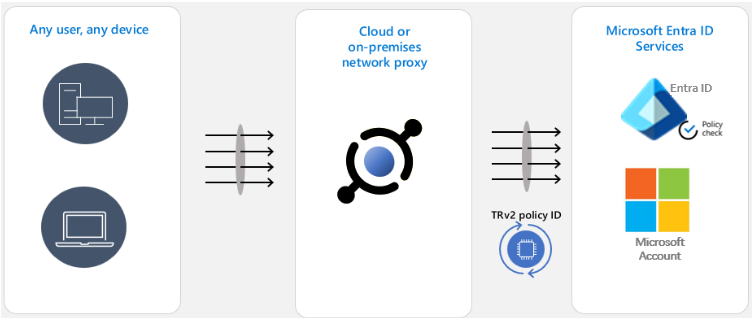

# テナント制限 v2 を利用してデータ流出を防止する

こんにちは、Azure Identity サポート チームの 高田 です。

本記事は、2023 年 9 月 13 日に米国の Azure Active Directory Identity Blog で公開された [How Tenant Restrictions v2 Can be Used to Prevent Data Exfiltration](https://techcommunity.microsoft.com/t5/microsoft-entra-azure-ad-blog/how-tenant-restrictions-v2-can-be-used-to-prevent-data/ba-p/3915339) を意訳したものになります。

----

前回の [ブログ](https://techcommunity.microsoft.com/t5/security-compliance-and-identity/apply-zero-trust-principles-to-authentication-session-management/ba-p/3615343) では、ゼロ トラストの原則をセッション管理に導入する機能として [Continuous Access Evaluation](https://docs.microsoft.com/en-us/azure/active-directory/conditional-access/concept-continuous-access-evaluation) (CAE) を紹介しました。本日は、データ流出の防止に焦点を当て、クロステナントアクセスの保護について説明したいと思います。

現在、成功を収めている組織は、いずれも組織の垣根を越えてパートナーと協業しているはずです。企業間のコラボレーションにより従業員はより多くのことができるようになり、パートナーシップの形成を可能にする一方で、偶発的なデータ流出と悪意のあるデータ流出の両方も起こりやすくなります。[Microsoft のクロステナントアクセス設定](https://learn.microsoft.com/ja-jp/azure/active-directory/external-identities/cross-tenant-access-overview) は、企業間のやり取りで生じるセキュリティ上の問題に対応するよう設計されています。

アウトバウンド (外向き) およびインバウンド (内向き) のクロステナント アクセス設定により、ユーザーが所属する自組織の ID を使用して企業間コラボレーションのためのきめ細かなセキュリティ制御ができるようになり、さらに、テナント制限 v2（TRv2）を使用して外部 ID を使用した際のデータ流出を防止することができます。

データ漏えいを防ぐのが最も難しいのは、組織内のユーザーが外部 ID を使用して外部のテナントに接続する場合です。そのような攻撃の 1 つをここで考えてみよう。悪意のある内部関係者が Microsoft Entra のテナントを作成します。そして、あなたの組織のデバイスから攻撃者のテナントに認証します。そうなると攻撃者は、攻撃者のテナントの Exchange Online アカウントを使用して、電子メール経由でファイルを流出させることが可能となります。この種の攻撃は、クラウド上に USB メモリを作るようなものと言えます。このような攻撃に対しては、通常のセキュリティ手法は機能しません。自テナントのポリシーは外部組織の ID には適用されないからです。Microsoft Entra ID や Exchange Online の URL そのものをファイアーウォールでブロックしてしまうと、攻撃者だけでなく本来の正規ユーザーもブロックしてしまうことになります。このような種類の攻撃に対しては、TRv2 の提供する特別な対応が必要です。

TRv2 は、Entra ID、Microsoft Account、およびその他の Microsoft リソースに特別な信号を送信することで機能します。これらの信号は、作成したクロステナント アクセス設定の TRv2 ポリシーと紐づいています。Microsoft リソースはポリシーを評価し、許可されていないアクセスをブロックします。TRv2 には、大きく分けて 2 つの種類があります。

**Auth Plane TRv2** は、ポリシーに基づいて外部 ID によるログインをブロックします。これを設定するには、組織内にネットワーク プロキシを導入し、そのプロキシが Entra ID と Microsoft Account へのすべてのトラフィックに [TRv2 シグナルを設定するように構成](https://learn.microsoft.com/ja-jp/azure/active-directory/external-identities/tenant-restrictions-v2#step-4-set-up-tenant-restrictions-v2-on-your-corporate-proxy) する必要があります。上記の例のように、悪意のある内部関係者が外部の電子メールでデータを漏えいする場合、攻撃者は悪意のあるテナントにログインできないため、電子メールを送信することができません。Auth Plane TRv2 は現在、一般提供中です。

**Universal TRv2** は Microsoft [Entra Global Secure Access](https://learn.microsoft.com/ja-jp/azure/global-secure-access/overview-what-is-global-secure-access) の一部であり、さらに一歩進んで、攻撃者が悪意のあるテナントのアプリへの匿名アクセス (Teams の匿名会議への参加など) を行うことで認証を回避するという、より高度な攻撃から保護します。また、攻撃者は悪意のあるテナントのデバイスから取得したアクセス トークンを組織のデバイスにインポートして利用させることもできます。これらの攻撃手段はすべて、Entra ID へのログインを回避する手法です。Universal TRv2 は、認証プレーン (Entra ID および Microsoft アカウント) とデータ プレーン (Microsoft クラウド アプリケーション) で TRv2 の信号を送信するため、これらの攻撃も防ぐことができます。Universal TRv2 は現在パブリック プレビュー中です。

弊社では、TRv2 の別の種類もパブリック プレビューとして提供しており、これは TRv2 on Windows と呼ばれています。これは、まだ特定のシナリオに限られますが、認証とデータ プレーンを保護するソリューションです。組織で管理している Windows デバイス上でのみ動作し、.NET の仕組みや、Chrome、Firefox は保護されません。お客様からは、この機能については導入が難しく、十分なセキュリティが得られないというフィードバックを受けております。この Windows ソリューションは、Universal TRv2 がリリースされるまでの一時的な保護を提供するためのものであり、Universal TRv2 が一般的に利用可能になった後に提供を終了する予定です。

Anna Barhudarian  
Principal Product Manager, Identity Division
