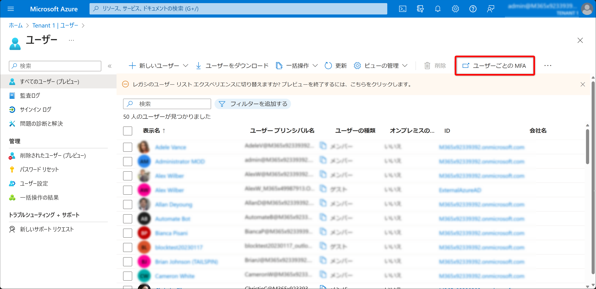
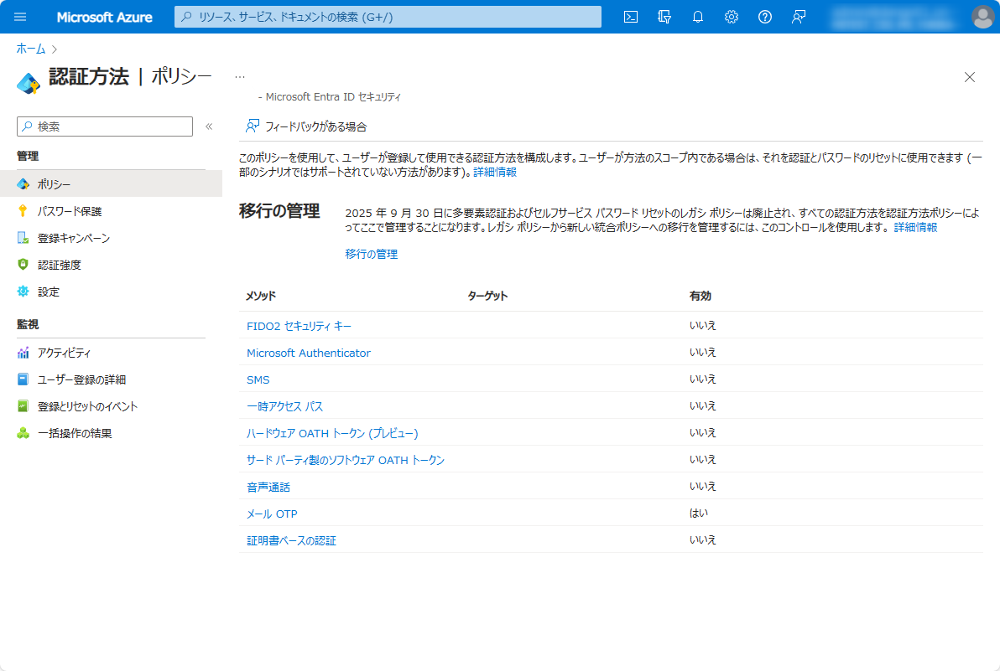
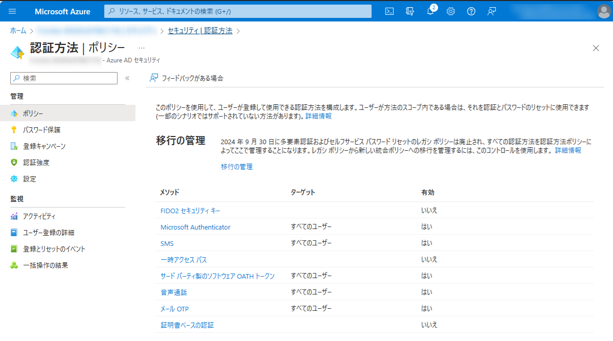
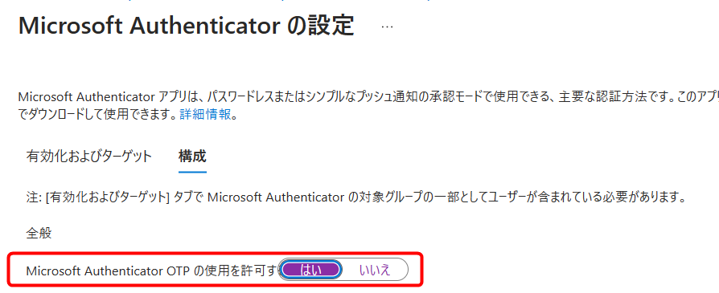
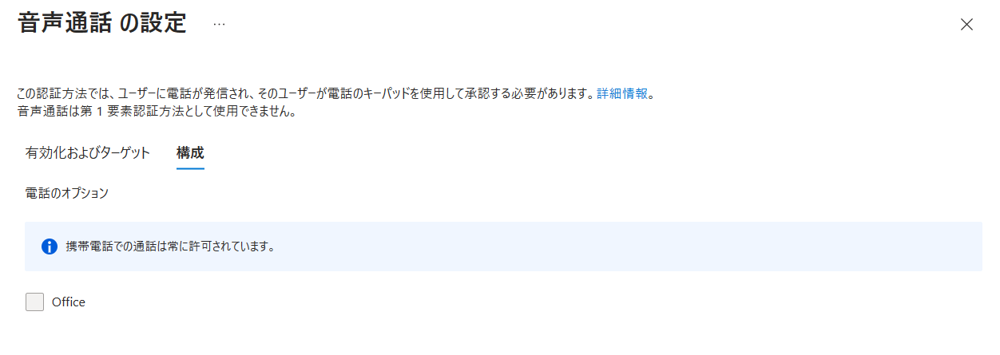

# MFA と SSPR を新しい認証方法ポリシーに移行する方法

> [!NOTE]
> 2023 年 9 月 29 日更新: レガシーポリシーが非推奨となる期日について情報を更新しました。
> 2024 年 1 月 23 日更新: Azure AD から Microsoft Entra ID への名称変更を反映し、一部画像を更新しました。
> 今後も情報が更新される可能性があります。情報の更新がありましたら本ブログの内容も更新します。

こんにちは、Azure & Identity サポート チームの田辺です。

今回は、Microsoft Entra ID (Azure AD) における認証方法ポリシーの移行方法についてご紹介します。これまで MFA (Multi-Factor Authentication) と SSPR (Self Service Password Reset) で利用可能な認証方法はそれぞれ個別の画面で別々に管理されていました。現在これら別々の管理画面はレガシーな管理方法として扱われており、今後、この 2 種類のレガシー ポリシーを統一した、新しい認証方法ポリシーにて一元管理することが必要となっています。

レガシーな MFA と SSPR 用のポリシーは **2025 年 9 月 30 日** に非推奨となり、この期日までに新しい認証方法ポリシーに移行いただく必要がございます。適切に移行いただければ、現在と動作に変わりはなく、また今後よりきめ細かい制御も可能となります。

レガシー MFA と SSPR のポリシーの確認方法および新しい認証方法ポリシーへの移行方法につきましては、[MFA と SSPR のポリシー設定を Microsoft Entra ID の認証方法ポリシーに移行する方法](https://learn.microsoft.com/ja-jp/entra/identity/authentication/how-to-authentication-methods-manage) の公開情報にまとめられておりますのでご覧ください。

本ブログ記事では、上記の公開情報で案内されている認証方法ポリシーの移行方法と、よくあるご質問について情報をおまとめいたしました。2025 年 9 月が近づきますと、移行が差し迫り混乱が予想されますので、可能な限り速やかに下記対応を実施することをお勧めいたします。

なお、移行作業は 3 段階に分かれており、それぞれの段階は数十分から 1 時間程度で完了可能と思われます。移行中にダウンタイムが生じることはありませんし、適切に構成いただければ、基本的にユーザー影響が生じることもありません。万が一、予期せぬ動作が生じた際には設定を切り戻すことも可能です。

## 1. 開始する前の確認事項

はじめに、お客様のテナントにおける各レガシー ポリシーの設定をご確認ください。

### レガシー MFA ポリシーの設定の確認

MFA で利用可能な認証方法の設定について確認します。

1. [Azure Portal] > [Microsoft Entra ID] > [ユーザー] > [ユーザーごとの MFA] に移動します。
   
   

2. [サービス設定] に移動します。
   
   

3. [検証オプション] 項目からどの項目にチェックが入っているかを控えます。これがレガシー MFA ポリシーの設定です。
   
   

上記のスクリーンショットでは、ユーザーが利用可能な MFA の方法として、3 つがチェックされていることがわかります。これは、ユーザーが MFA を要求された際に、これらいずれかの方法を利用して (登録済みであれば) 認証を行えるということを意味します。

なお、Microsoft Entra ID Premium ライセンスを保有されている場合は、 [Microsoft Entra ID] > [セキュリティ] > [多要素認証] > [クラウドベースの多要素認証の追加設定] でも上記画面に遷移可能です。

### レガシー SSPR ポリシーの設定の確認

次に、SSPR で利用可能な認証方法の設定について確認します。

1. [Microsoft Entra ID] > [パスワード リセット] > [認証方法] に移動します。
2. 以下の [ユーザーが使用できる方法] でどの項目にチェックが入っているかを確認します。これがレガシー SSPR ポリシーの設定です。
   
   

例えば、上記のスクリーンショットでは、ユーザーが利用可能な SSPR の方法として、[電子メール] または [携帯電話] にチェックされていることがわかります。これは、レガシー MFA ポリシーと同様に、ユーザーが上記のいずれかの方法を利用して SSPR を行うことができるということを意味しています。

### 新しい認証方法ポリシーの確認

新しい認証方法ポリシーについては、[Microsoft Entra ID] > [セキュリティ] > [認証方法] > [ポリシー] から確認します。

   

既定ではほとんどの設定の有効状態が [いいえ] となっているはずです。

## 2. 移行の開始

[上記手順](#1-開始する前の確認事項)で、現在のポリシーの設定を確認したら、次に現在の認証方法ポリシーの移行状態を確認します。

### 現在の移行状態の確認

1. [Microsoft Entra ID] > [セキュリティ] > [認証方法] > [ポリシー] に移動します。

2. [移行の管理] を選択します。
      
   

3. 画面右に表示される項目から、現在は [移行前] または [移行が進行中] の状態にあることを確認します。

併せて、移行ステップである [移行前] [移行が進行中] [移行が完了済み] のそれぞれの意味を確認ください。移行の各ステップでどのポリシーの設定が参照されるかついては、[移行の管理] の項目の設定状況に依存します。各ステップで参照されるポリシーについて以下にまとめましたのでご覧ください。

|移行の管理の各オプション | 種類 | 参照されるポリシー|
|---|---|---|
|移行前 | MFA | 認証方法ポリシーとレガシー MFA ポリシー|
| 〃 | SSPR | レガシー SSPR ポリシーのみ|
|移行が進行中 | MFA | 認証方法ポリシーとレガシー MFA ポリシー|
| 〃 | SSPR | 認証方法ポリシーとレガシー SSPR ポリシー|
|移行が完了済み | MFA | 認証方法ポリシーのみ|
| 〃 | SSPR | 認証方法ポリシーのみ|

例えば、移行前の状態では、MFA においては「認証方法ポリシーとレガシー MFA ポリシー」が両方参照されます。これは認証方法の有効状態は、認証方法ポリシーとレガシー MFA/SSPR ポリシーの有効状態の **和 (OR)** で行われるという意味です。つまり、あるユーザーに対しいずれかのポリシーで認証方法が有効になっている場合、ユーザーはその認証方法が使用可能な状態となります。これまでの例ですと、認証方法ポリシーはほぼすべてが [いいえ] であり、レガシー MFA ポリシーは以下の 3 つにチェックが入っていた状況でした。この場合、認証方法ポリシーがすべてが [いいえ] であっても、レガシー MFA ポリシーで有効な認証方法が 3 つありますので、引き続きこれら 3 つのポリシーが有効になるという結果になります。

- 電話へのテキスト メッセージ
- モバイル アプによる通知
- モバイル アプリからの確認コードまたはハードウェア トークンからの確認コード

### 移行状態の [移行が進行中] への変更

まずは移行の管理画面から移行のステップを一つ進めます。既定の状態が [移行前] の場合、[移行が進行中] を選択し、[保存] を選択します。
(既定の状態が [移行が進行中] の場合、本手順は省略してください。)

上記のように移行の状態を [移行が進行中] に保存しても、認証方法ポリシーとレガシー ポリシーの両方が評価されるため、これまで利用できていた認証方法が使えなくなるということはありません。

> [!NOTE]
> この変更により、MFA で利用を許可していた認証方法が SSPR においても追加で利用可能となります。通常は MFA で使用している認証方法をそのまま SSPR でも利用することが一般的であるため、ほとんどのお客様でユーザー影響はないと想定されますが、SSPR への影響を懸念されるお客様はこの時点では移行のステップを [移行が進行中] に変更せず、一旦以降の手順を確認されることをお勧めします。

### レガシー MFA ポリシーの認証方法ポリシーへの移行

それでは、まずレガシー MFA ポリシーの設定内容を認証方法ポリシーに設定する作業を開始しましょう。下表を参照し、[1. 開始する前の確認事項](#1-開始する前の確認事項) で確認した レガシー MFA ポリシーの設定内容に対応する認証方法ポリシーを有効にします。

|レガシー MFA ポリシー | 対応する認証方法ポリシー |
|---|---|
|電話への連絡 | [音声通話](#音声通話) |
|電話へのテキスト メッセージ | [SMS](#sms) |
|モバイル アプによる通知 | [Microsoft Authenticator](#microsoft-authenticator) |
|モバイル アプリからの確認コードまたはハードウェア トークンからの確認コード | [サード パーティ製のソフトウェア OATH トークン](#サード-パーティ製のソフトウェア-OATH-トークン)   [ハードウェア OATH トークン (近日公開予定)](#ハードウェア-OATH-トークン-近日公開予定)   [Microsoft Authenticator](#microsoft-authenticator) |

本記事の例ですと、レガシー MFA ポリシーの設定画面では、以下の 3 つの認証方法が有効でした。この場合は、上記表でそれぞれレガシー MFA ポリシーに対応する認証方法を認証方法ポリシーの画面で有効にします。

- 電話へのテキスト メッセージ
- モバイル アプリによる通知
- モバイル アプリからの確認コードまたはハードウェア トークンからの確認コード

設定の実施後の認証方法ポリシーの画面 (本記事での例) は以下のようになります。お客様でも、事前に控えておいたレガシー MFA ポリシーの設定状況を用いて認証方法ポリシーを同じように変更ください。

### レガシー SSPR ポリシーの認証方法ポリシーへの移行

レガシー MFA ポリシーの認証方法ポリシーへの移行が完了したら、次にレガシー SSPR ポリシーの内容を認証方法ポリシーに移行します。レガシー MFA ポリシーの移行時と同様に、下表を参照し、[1. 開始する前の確認事項](#1-開始する前の確認事項) で確認したレガシー SSPR ポリシーの設定内容を、対応する認証方法ポリシーで有効にします。

|レガシー SSPR ポリシー | 対応する認証方法ポリシー|
|---|---|
| モバイル アプリの通知 | [Microsoft Authenticator](#microsoft-authenticator)|
| モバイル アプリ コード | [Microsoft Authenticator](#microsoft-authenticator)   [サード パーティ製のソフトウェア OATH トークン](#サード-パーティ製のソフトウェア-OATH-トークン) |
| 電子メール | [メール OTP](#メール-OTP) |
| 携帯電話 | [音声通話](#音声通話)   [SMS](#sms) |
| 会社電話 |  [音声通話](#音声通話) |
| 秘密の質問 |  [秘密の質問 (近日公開予定)](#秘密の質問-近日公開予定) |

本記事の例では、レガシー SSPR ポリシーにおいては上述のとおり [電子メール] と [携帯電話] がチェックされている状況でした。このため、上記表でそれぞれ [電子メール] と [携帯電話] に対応する認証方法ポリシーの設定を有効にします。

設定の実施後の認証方法ポリシーの画面 (本記事での例) は以下のようになります。お客様でも、事前に控えておいたレガシー SSPR ポリシーの設定状況を用いて認証方法ポリシーを同じように変更ください。

## 3. 移行が進行中での状態の確認

以上の手順が完了したら、まずはユーザー影響が生じていないかなどを念のためご確認ください。特段影響がなければ、しばらくそのまま運用いただいてもかまいません。しばらく上記状態で運用いただき、移行を完了する準備が整ったら、以下の作業を進めます。

## 4. 移行の完了

[移行が進行中] の状態にてご要望の認証方法が使用可能となるよう新しい認証方法ポリシーを設定できたら、次のステップとして、レガシー MFA および SSPR ポリシーのチェックをすべて外して無効にします (全て一度に外すのが不安な場合は、一つずつ時間をかけてチェックを外していただいてもかまいません)。

上述のとおり、各認証方法の有効状態は、認証方法ポリシーとレガシー MFA/SSPR ポリシーの有効状態の和 (OR) で評価されます。このため、認証方法ポリシーにおいて各認証方法が適切に有効になっていれば、レガシー MFA/SSPR ポリシーのチェックをすべて外しても、引き続き認証方法ポリシーの設定が評価され各認証方法は有効状態となります。

レガシー MFA および SSPR ポリシーのチェックをすべて外して無効にした後、念のため、テナントにてご要望の認証方法が MFA と SSPR の双方で利用可能かご確認ください。ユーザー影響を確認するため、しばらくその状態で運用いただいてもかまいません。

動作確認が完了したら、移行のステップを [移行が進行中] から [移行が完了済み] に変更します。

なお、テナントにてレガシー ポリシーが有効な場合には [移行が完了済み] に変更することは出来ません。

[移行が完了済み] に変更すると、レガシー ポリシーについては以下のような表示となり、新しい認証方法ポリシーによって管理されていることが明記されます。

![\[移行が完了済み\] に移行後のレガシー MFA ポリシー (\[検証オプション\])](./how-to-authentication-methods-manage/mfa-finish.png)

![\[移行が完了済み\] に移行後のレガシー SSPR ポリシー (\[パスワード リセット\] > \[認証方法\])](how-to-authentication-methods-manage/sspr-after.png)
[移行が完了済み] になりましたら、一連の移行作業はすべて完了です。今後はレガシー ポリシーではなく、新しい認証ポリシーの画面にて認証方法の構成を実施ください。

## 参考: 各認証方法の設定の詳細

各認証方法ごとに、設定内容の詳細と設定の変更手順をおまとめいたします。大まかな手順を上記内容で把握した後で下記詳細をご確認ください。認証方法ポリシーについては、[Microsoft Entra ID の認証方法を管理する](https://learn.microsoft.com/ja-jp/entra/identity/authentication/concept-authentication-methods-manage) の公開情報でもご案内しておりますので、ご参照ください。

### Microsoft Authenticator

#### 移行の条件

- レガシー MFA ポリシーで [モバイル アプリによる通知] が有効または、レガシー SSPR ポリシーで [モバイル アプリの通知] が有効な場合、認証方法ポリシーで [Microsoft Authenticator] を有効にします。
- レガシー MFA ポリシーで [モバイル アプリまたはハードウェア トークンからの確認コード] が有効または、レガシー SSPR ポリシーで [モバイル アプリ コード] が有効な場合、[構成] タブで [Microsoft Authenticator OTP の使用を許可する] を [はい] に設定します。
- プッシュ通知またはパスワードレス認証を許可するには、認証モードを [すべて] に設定します。どちらかを指定したい場合は、[パスワードレス] または [プッシュ] に変更します。

#### 手順

1. [Microsoft Entra ID] > [セキュリティ] > [認証方法] > [ポリシー] > [Microsoft Authenticator] に移動します。
2. [有効化およびターゲット] タブにて [有効にする] および、 [含める] > [すべてのユーザー] を選択します。
   必要に応じて、認証モードを変更します。
   
   

3. [構成] タブの内容を確認します (既定のままで OK ですが、必要に応じて [Microsoft Authenticator OTP の使用を許可する] の設定などを変更します。
   
   

1. [保存] をクリックします。

### SMS

#### 移行の条件

- レガシー MFA ポリシーで [電話へのテキスト メッセージ] が有効または、レガシー SSPR ポリシーで [携帯電話] が有効な場合、認証方法ポリシーで [SMS] を有効にします。

#### 手順

1. [Microsoft Entra ID] > [セキュリティ] > [認証方法] > [ポリシー] > [SMS] に移動します。
2. [有効化およびターゲット] タブにて [有効にする] および、 [含める] > [すべてのユーザー] を選択します。
3. [保存] をクリックします。

### サード パーティ製のソフトウェア OATH トークン

#### 移行の条件

- レガシー MFA ポリシーで [モバイル アプリまたはハードウェア トークンからの確認コード] が有効または Microsoft Authenticator 以外のサードパーティー製のソフトウェア OATH トークンを許可したい場合、認証方法ポリシーで [サード パーティ製のソフトウェア OATH トークン] を有効にします。 

#### 手順

1. [Microsoft Entra ID] > [セキュリティ] > [認証方法] > [ポリシー] > [サード パーティ製のソフトウェア OATH トークン] に移動します。
2. [有効化およびターゲット] タブにて [有効にする] および、 [含める] > [すべてのユーザー] を選択します。
3. [保存] をクリックします。

### 音声通話

#### 移行の条件

- レガシー MFA ポリシーで [電話の呼び出し] が有効または レガシー SSPR ポリシーで [携帯電話] が有効な場合、認証方法ポリシーで [音声通話] を有効にします。 
- レガシー SSPR ポリシーで [会社電話] を有効にしている等、会社電話を利用したい場合は、[構成] タブで [Office] オプションを選択します。

#### 手順

1. [Microsoft Entra ID] > [セキュリティ] > [認証方法] > [ポリシー] > [Microsoft Authenticator] に移動します。
2. [有効化およびターゲット] タブにて [有効にする] および、 [含める] > [すべてのユーザー] を選択します。
3. 必要に応じて、[構成] タブにて [Office] を有効にします。
   
   

4. [保存] をクリックします。

### メール OTP

#### 移行の条件

- レガシー SSPR ポリシーで [メール] を有効にしている場合、認証方法ポリシーで [メール OTP] を有効にします。 

#### 手順

1. [Microsoft Entra ID] > [セキュリティ] > [認証方法] > [ポリシー] > [メール OTP] に移動します。
2. [有効化およびターゲット] タブにて [有効にする] および、 [含める] > [すべてのユーザー] を選択します。
3. [保存] をクリックします。

認証方法ポリシーの [メール OTP] の設定はゲストのメール ワンタイム パスコード (OTP) の設定にも影響します。[構成] タブの [外部ユーザーに電子メールの OTP の使用を許可する] コントロールが有効な場合、認証方法ポリシーの [メール OTP] を無効にすることはできません。

### ハードウェア OATH トークン

#### 移行の条件

- レガシー MFA ポリシーで [モバイル アプリまたはハードウェア トークンからの確認コード] が有効にしているか、ハードウェア OATH トークンの利用を許可したい場合、認証方法ポリシーで [サード パーティ製のソフトウェア OATH トークン] を有効にします。 

#### 手順

1. [Microsoft Entra ID] > [セキュリティ] > [認証方法] > [ポリシー] > [ハードウェア OATH トークン] に移動します。
2. [有効化およびターゲット] タブにて [有効にする] および、 [含める] > [すべてのユーザー] を選択します。
3. [保存] をクリックします。

### 秘密の質問 (近日公開予定)

認証方法ポリシーでは、[秘密の質問] は現在利用できません。秘密の質問をご利用いただいている場合は、レガシー SSPR ポリシーで [秘密の質問] を有効なままにしておいてください。レガシ SSPR ポリシーで [秘密の質問] が有効なままでも、移行のステップを [移行を完了済み] に変更できます。

## FAQ

**Q1.** もし、2025 年 9 月 30 日 まで何もしなかった場合、どうなりますか。

**A1.** 認証方法ポリシーへの移行を実施しなかった場合、これまでユーザーが利用していた認証方法が利用できなくなる可能性がございます。例えば、各ポリシーで以下のように設定していた場合、2025 年 9 月 30 日以降にレガシー MFA ポリシーが廃止されると、ユーザーは SMS による認証方法を利用できなくなることが予想されます。

|ポリシー | 設定|
|---|---|
|レガシー MFA ポリシー | SMS による認証方法を有効に設定|
|認証方法ポリシー | SMS による認証方法を無効に設定|

このため、期日以降も想定どおりの認証方法を利用したい場合は、期日までに認証方法ポリシーに設定を移行する必要がございます。

**Q2.** レガシー ポリシーへの切り戻しはできないでしょうか。

**A2.** 万が一、何らか予期しない動作が生じた場合、レガシー ポリシーへ切り戻すことは可能です。この場合、一度「移行が完了済み」のステータスを以前のステータスに戻すこととなります。加えて、レガシー ポリシー側に以前の状態を手動で復元 (チェックボックスをつけなおす) する作業が必要です。一般的に、レガシー ポリシーへの切り戻しを行うよりも、発生している問題に応じて、新しいポリシー側の設定を見直す方がより効果的です。弊社サポート部門でも支援が可能ですので、その際はぜひお問い合わせください。

**Q3.** 秘密の質問については近日公開予定ですが、それまでは、[移行が進行中] のままにしなければいけないのでしょうか。

**A3.** いいえ、秘密の質問については、レガシー SSPR ポリシーで有効にしたままの状態で移行を完了できます。だたし、秘密の質問を使用していて、それらを無効にしたくない場合は、新しい認証方法ポリシーにて秘密の質問が使用可能になるまで、レガシー SSPR ポリシーで有効なままにしておいてください。

なお、現状では秘密の質問を認証方法の一つとして提供し続ける予定です。しかし、米国政府が発行している ID 標準 (NIST Special Publication 800-63B) では、ユーザー認証の方法として秘密の質問の利用が非推奨であることが挙げられます。弊社ではお客様に選択肢を提供するという意味で秘密の質問を認証方法の一つとして提供を続けますが、秘密の質問はパスワードと同様に記憶に基づく認証方法であり、認証強度の低い方法です。このため、秘密の質問ではなく、他の認証方法の利用も是非ご検討ください。

上記内容が皆様の参考となりますと幸いです。ご不明な点等がありましたら、ぜひ弊社サポート サービスをご利用ください。
