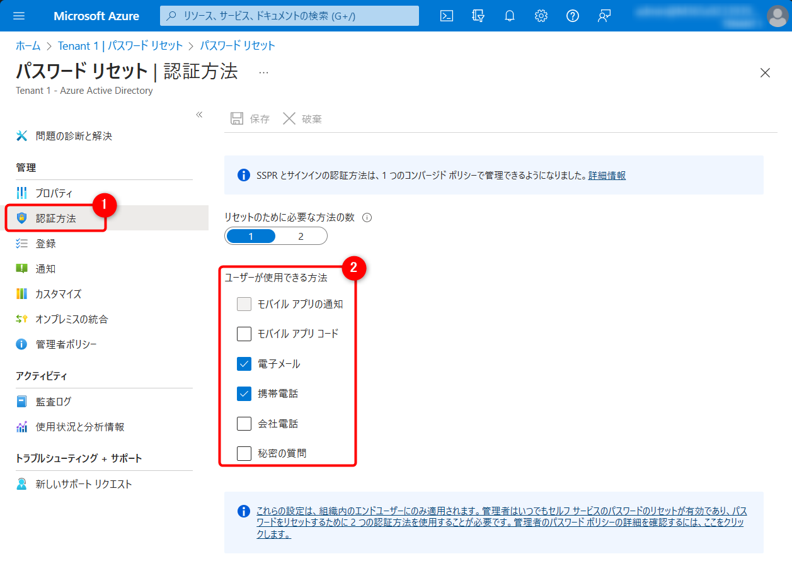
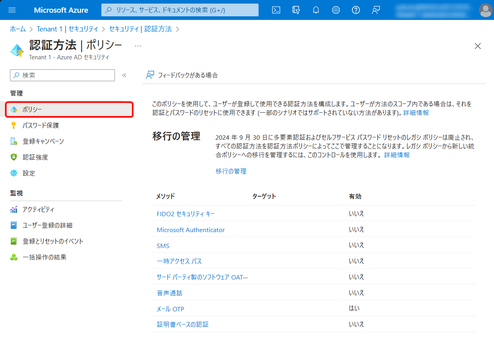
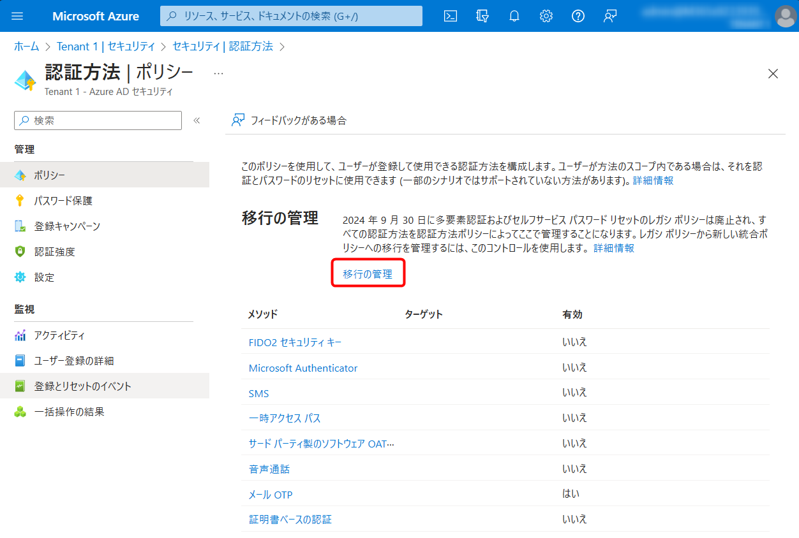
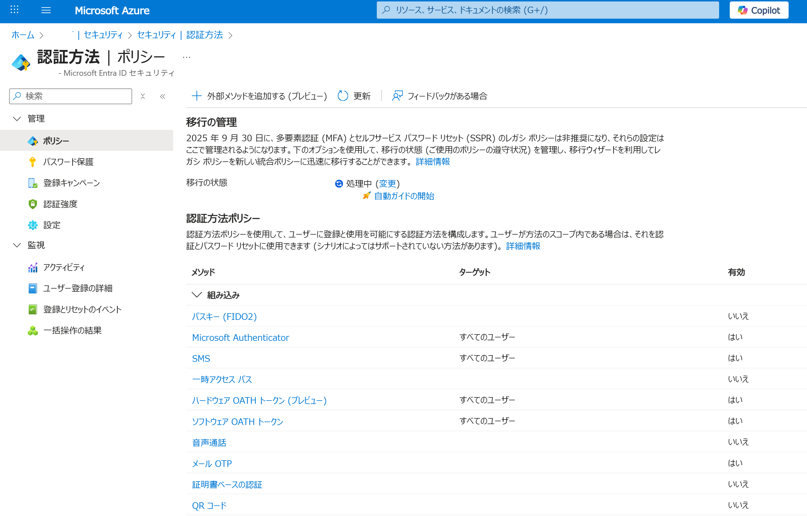
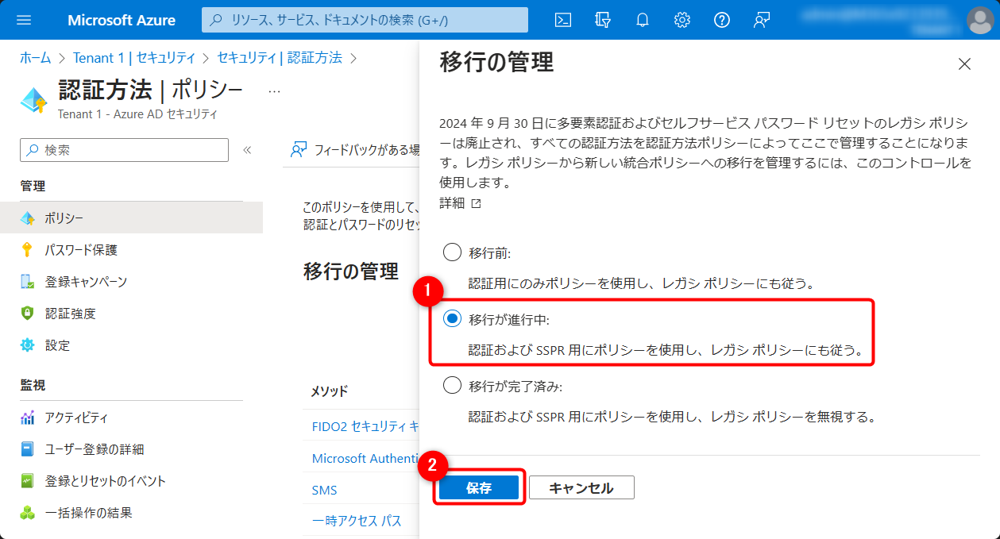
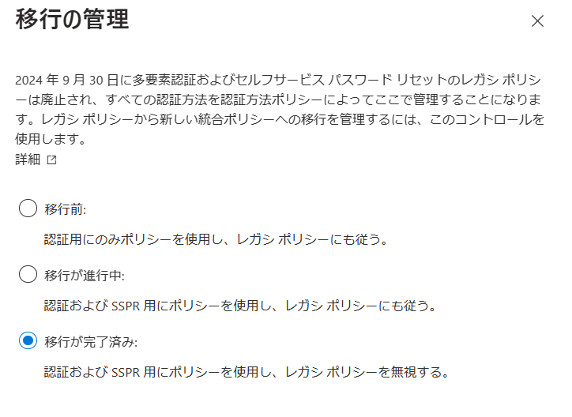

# MFA と SSPR を新しい認証方法ポリシーに移行する方法

## はじめに

こんにちは、Azure & Identity サポート チームの田辺です。

今回は、Azure AD における認証方法ポリシーの移行方法についてご紹介します。
これまで MFA (Multi-Factor Authentication) と SSPR (Self Service Password Reset) で利用可能な認証方法はそれぞれ別の画面で別々に管理されていました。
現在これら別々の管理画面はレガシーな管理方法として扱われており、今後、この 2 種類のレガシー ポリシーを統一した、新しい認証方法ポリシーにて一元管理することが必要となっています。

レガシーな MFA と SSPR 用のポリシーは **2024 年 9 月 30 日** に非推奨となり、この期日までに新しい認証方法ポリシーに移行いただく必要がございます。
適切に移行いただければ、現在と動作に変わりはなく、また今後よりきめ細かい制御も可能となります。

レガシー MFA と SSPR のポリシーの確認方法および新しい認証方法ポリシーへの移行方法につきましては、以下の公開情報にまとめられておりますのでご覧ください。

> MFA と SSPR のポリシー設定を Azure AD の認証方法ポリシーに移行する方法
<https://learn.microsoft.com/ja-jp/azure/active-directory/authentication/how-to-authentication-methods-manage>

本ブログ記事では、上記の公開情報で案内されている認証方法ポリシーの移行方法と、よくあるご質問について情報をおまとめいたしました。
2024 年 9 月が近づきますと、移行が差し迫り混乱が予想されますので、可能な限り速やかに下記対応を実施することをお勧めいたします。

なお、移行作業自体は数十分から 1 時間程度で完了することが一般的です。
移行中にダウンタイムが生じることはありませんし、適切に構成いただければ、基本的にユーザー影響が生じることもありません。
万が一、予期せぬ動作が生じた際には設定を切り戻すことも可能です。

## 1. 開始する前の確認事項

はじめに、お客様のテナントにおける各レガシー ポリシーの設定をご確認ください。

### レガシー MFA ポリシーの設定の確認

MFA で利用可能な認証方法の設定について確認します。

1. [Azure Portal] > [Azure Active Directory] > [ユーザー] > [ユーザーごとの MFA] に移動します。
   
   

2. [サービス設定] に移動します。
   
   

3. [検証オプション] 項目からどの項目にチェックが入っているかを確認します。これがレガシー MFA ポリシーの設定です。
   
   

上記のスクリーンショットでは、ユーザーが利用可能な MFA の方法として、3 つがチェックされていることがわかります。
これは、ユーザーが MFA を要求された際に、これらいずれかの方法を利用して (登録済みであれば) 認証を行えるということを意味します。

※ Azure AD Premium ライセンスを保有されている場合は、 [Azure Active Directory] > [セキュリティ] > [多要素認証] > [クラウドベースの多要素認証の追加設定] でも遷移可能です。

### レガシー SSPR ポリシーの設定の確認

SSPR で利用可能な認証方法の設定について確認します。

1. [Azure Active Directory] > [パスワード リセット] > [認証方法] に移動します。
1. 以下の [ユーザーが使用できる方法] でどの項目にチェックが入っているかを確認します。これがレガシー SSPR ポリシーの設定です。
   
   

例えば、上記のスクリーンショットでは、ユーザーが利用可能な SSPR の方法として、[電子メール] または [携帯電話] にチェックされていることがわかります。
これは、レガシー MFA ポリシーと同様に、ユーザーが上記のいずれかの方法を利用して SSPR を行うことができるということを意味しています。

### 新しい認証方法ポリシーの確認

新しい認証方法ポリシーについては、以下の手順にてご確認いただけます。

1. [Azure Active Directory] > [セキュリティ] > [認証方法] > [ポリシー] に移動します。

1. 本項目が、新しい認証方法ポリシーの設定です。
   
   

## 2. 移行を開始する

[上記手順](#1-開始する前の確認事項)で、現在のポリシーの設定を確認したら、認証方法ポリシーへの移行を開始します。
まずは、移行の管理の設定を行います。

### 移行の管理

1. [Azure Active Directory] > [セキュリティ] > [認証方法] > [ポリシー] に移動します。

1. [移行の管理] を選択します。
   
   

1. 画面右に表示される本項目が、[移行の管理] の設定です。

   

1. [移行が進行中] を選択し、[保存] を選択します。
   
   

なお、移行中にどのポリシーの設定が参照されるかついては、[移行の管理] 項目の設定状況に依存します。
各オプションで参照されるポリシーについて、ご案内いたします。

|移行の管理の各オプション | 種類 | 参照されるポリシー|
|---|---|---|
|移行前 | MFA | 認証方法ポリシーとレガシー MFA ポリシー|
| 〃 | SSPR | レガシー SSPR ポリシーのみ|
|移行が進行中 | MFA | 認証方法ポリシーとレガシー MFA ポリシー|
| 〃 | SSPR | 認証方法ポリシーとレガシー SSPR ポリシー|
|移行が完了済み | MFA | 認証方法ポリシーのみ|
| 〃 | SSPR | 認証方法ポリシーのみ|

それでは、レガシー ポリシーの設定内容を認証方法ポリシーにも設定する作業を開始しましょう。
下表を参照し、[1. 開始する前の確認事項](#1-開始する前の確認事項) で確認したレガシー ポリシーの設定内容に対応する認証方法ポリシーを有効にします。

### レガシー MFA ポリシーに対応する認証方法ポリシー

|レガシー MFA ポリシー | 認証方法ポリシー|
|---|---|
|電話の呼び出し | [音声通話](#音声通話) |
|電話へのテキスト メッセージ | [SMS](#SMS) |
|モバイル アプリでの通知 | [Microsoft Authenticator](#Microsoft-Authenticator) |
|モバイル アプリからの確認コードまたはハードウェア トークン | [サード パーティ製のソフトウェア OATH トークン](#サード-パーティ製のソフトウェア-OATH-トークン)   [ハードウェア OATH トークン (近日公開予定)](#ハードウェア-OATH-トークン-近日公開予定)   [Microsoft Authenticator](#Microsoft-Authenticator) |

### レガシー SSPR ポリシーに対応する認証方法ポリシー

|レガシー SSPR ポリシー | 認証方法ポリシー|
|---|---|
|モバイル アプリの通知 | [Microsoft Authenticator](#Microsoft-Authenticator)|
|モバイル アプリ コード | [Microsoft Authenticator](#Microsoft-Authenticator)   [サード パーティ製のソフトウェア OATH トークン](#サード-パーティ製のソフトウェア-OATH-トークン) |
|Email  | [メール OTP](#メール-OTP) |
|携帯電話  | [音声通話](#音声通話)   [SMS](#SMS) |
|会社電話  |  [音声通話](#音声通話) |
|秘密の質問 |  [秘密の質問 (近日公開予定)](#秘密の質問-近日公開予定) |

それぞれの具体的な移行方法について、以下の通りご案内いたします。

### Microsoft Authenticator

#### 移行の条件

- レガシー MFA ポリシーで [モバイル アプリによる通知] が有効または、レガシー SSPR ポリシーで [モバイル アプリの通知] が有効な場合、認証方法ポリシーで [Microsoft Authenticator] を有効にします。
- レガシー MFA ポリシーで [モバイル アプリまたはハードウェア トークンからの確認コード] が有効または、レガシー SSPR ポリシーで [モバイル アプリ コード] が有効な場合、[構成] タブで [Microsoft Authenticator OTP の使用を許可する] を [はい] に設定します。
- プッシュ通知またはパスワードレス認証を許可するには、認証モードを [すべて] に設定します。どちらかを指定したい場合は、[パスワードレス] または [プッシュ] に変更します。

#### 手順

1. [Azure Active Directory] > [セキュリティ] > [認証方法] > [ポリシー] > [Microsoft Authenticator] に移動します。
1. [有効化およびターゲット] タブにて [有効にする] および、 [含める] > [すべてのユーザー] を選択します。
   必要に応じて、認証モードを変更します。
   
   

1. 必要に応じて、[構成] タブにて [Microsoft Authenticator OTP の使用を許可する] を有効にします。
   
   

1. [保存] をクリックします。

### SMS

#### 移行の条件

- レガシー MFA ポリシーで [電話へのテキスト メッセージ] が有効または、レガシー SSPR ポリシーで [携帯電話] が有効な場合、認証方法ポリシーで [SMS] を有効にします。

#### 手順

1. [Azure Active Directory] > [セキュリティ] > [認証方法] > [ポリシー] > [SMS] に移動します。
1. [有効化およびターゲット] タブにて [有効にする] および、 [含める] > [すべてのユーザー] を選択します。
1. [保存] をクリックします。

### サード パーティ製のソフトウェア OATH トークン

#### 移行の条件

- レガシー MFA ポリシーで [モバイル アプリまたはハードウェア トークンからの確認コード] が有効または Microsoft Authenticator 以外のサードパーティー製のソフトウェア OATH トークンを許可したい場合、認証方法ポリシーで [サード パーティ製のソフトウェア OATH トークン] を有効にします。 

#### 手順

1. [Azure Active Directory] > [セキュリティ] > [認証方法] > [ポリシー] > [サード パーティ製のソフトウェア OATH トークン] に移動します。
1. [有効化およびターゲット] タブにて [有効にする] および、 [含める] > [すべてのユーザー] を選択します。
1. [保存] をクリックします。

### 音声通話

#### 移行の条件

- レガシー MFA ポリシーで [電話の呼び出し] が有効または レガシー SSPR ポリシーで [携帯電話] が有効な場合、認証方法ポリシーで [音声通話] を有効にします。 
- レガシー SSPR ポリシーで [会社電話] を有効にしている等、会社電話を利用したい場合は、[構成] タブで [Office] オプションを選択します。

#### 手順

1. [Azure Active Directory] > [セキュリティ] > [認証方法] > [ポリシー] > [Microsoft Authenticator] に移動します。
1. [有効化およびターゲット] タブにて [有効にする] および、 [含める] > [すべてのユーザー] を選択します。
1. 必要に応じて、[構成] タブにて [Office] を有効にします。
   
   

1. [保存] をクリックします。

### メール OTP

#### 移行の条件

- レガシー SSPR ポリシーで [メール] を有効にしている場合、認証方法ポリシーで [メール OTP] を有効にします。 

#### 手順

1. [Azure Active Directory] > [セキュリティ] > [認証方法] > [ポリシー] > [メール OTP] に移動します。
1. [有効化およびターゲット] タブにて [有効にする] および、 [含める] > [すべてのユーザー] を選択します。
1. [保存] をクリックします。

補足となりますが、認証方法ポリシーの [メール OTP] の設定はゲストのメール ワンタイム パスコード (OTP) の設定が影響します。具体的には、[構成] タブの [外部ユーザーに電子メールの OTP の使用を許可する] コントロールが有効な場合、認証方法ポリシーの [メール OTP] を無効にすることができない動作となります。

### ハードウェア OATH トークン (近日公開予定)

認証方法ポリシーでは、[ハードウェア OATH トークン] は現在利用できません。
現在パブリック プレビュー段階のハードウェア OATH トークンをご利用いただいている場合は、移行プロセスを完了しないでください。

### 秘密の質問 (近日公開予定)

認証方法ポリシーでは、[秘密の質問] は現在利用できません。
秘密の質問をご利用いただいている場合は、レガシー SSPR ポリシーで [秘密の質問] を有効なままにしておいてください。
レガシ SSPR ポリシーで [秘密の質問] が有効なままでも、[移行を完了済み] に変更できます。

## 3. 移行を完了する

[移行が進行中] の状態にて、ご要望の認証方法が使用可能となるよう新しい認証方法ポリシーを設定できたら、レガシー MFA 、 SSPR ポリシーのチェックを外して無効にし、テナントにてご要望の認証方法が MFA と SSPR の双方で利用可能かご確認ください。

テストが完了したら、[移行が完了済み] に変更します。

なお、テナント上にてレガシー ポリシーが有効な場合には [移行が完了済み] に変更することは出来ません。
[移行が完了済み] に変更した場合、レガシー ポリシーについては以下のような表示となり、新しい認証方法ポリシーによって管理されていることが明記されます。

![ご参考 : [移行が完了済み] に移行後のレガシー MFA ポリシー ([検証オプション])](./how-to-authentication-methods-manage/mfa-finish.png)

![ご参考 : [移行が完了済み] に移行後のレガシー SSPR ポリシー  ([パスワード リセット] > [認証方法])](./how-to-authentication-methods-manage/finishimage.png)

## 参考情報

認証方法ポリシーについては、以下の公開情報でもご案内しておりますので、ご参照ください。

> Azure AD の認証方法を管理する
<https://learn.microsoft.com/ja-jp/azure/active-directory/authentication/concept-authentication-methods-manage>

## FAQ

***
**Q1.**
もし、2024 年 9 月 30 日 まで何もしなかった場合、どうなりますか。

**A1.**
認証方法ポリシーへの移行を実施しなかった場合、これまでユーザーが利用していた認証方法が利用できなくなる可能性がございます。
例えば、各ポリシーで以下の組み合わせの設定を行っていた場合、2024 年 9 月 30 日以降はレガシー MFA ポリシーが廃止されるため、ユーザーは SMS による認証方法を利用できなくなることが予想されます。

|ポリシー | 設定|
|---|---|
|レガシー MFA ポリシー | SMS による認証方法を有効に設定|
|認証方法ポリシー | SMS による認証方法を無効に設定|

このため、期日以降も SMS による認証方法をご利用されたい場合は、認証方法ポリシーで SMS を有効に設定いただく必要がございます。
***
**Q2.**
レガシー ポリシーへの切り戻しはできないでしょうか。

**A2.**
万が一、何らか予期しない動作が生じた場合は、レガシー ポリシーへ切り戻すことは可能です。この場合、一度「移行が完了済み」のステータスを以前のステータスに戻すこととなります。加えて、レガシーポリシー側に以前の状態を手動で復元 (チェックボックスをつけなおす) する作業が必要です。

一般的に、レガシーポリシーへの切り戻しを行うよりも、発生している問題に応じて、新しいポリシー側の設定を見直す方がより効果的です。弊社サポート部門でも支援が可能ですので、その際はぜひお問い合わせください。
***
**Q3.**
秘密の質問については近日公開予定ですが、それまでは、[移行が進行中] のままにしなければいけないのでしょうか。

**A3.**
いいえ、秘密の質問については、レガシー SSPR ポリシーで有効にしたままの状態で移行を完了できます。
だたし、秘密の質問を使用していて、それらを無効にしたくない場合は、新しい認証方法ポリシーにて秘密の質問が使用可能になるまで、レガシー SSPR ポリシーで有効なままにしておいてください。
なお、現状では、秘密の質問を認証方法の一つとして提供を続ける予定でございます。
しかし、米国政府が発行している ID 標準 (NIST Special Publication 800-63B) にて、ユーザー認証の方法として秘密の質問の利用が非推奨であることが挙げられます。
弊社ではお客様に選択肢を提供するという意味で秘密の質問を認証方法の一つとして提供を続けますが、秘密の質問はパスワードと同様に記憶に基づく認証方法であり、認証強度の低い方法です。
このため、秘密の質問ではなく、他の認証方法の利用も是非ご検討いただきたく存じます。
***

上記内容が皆様の参考となりますと幸いです。
ご不明な点等がありましたら、ぜひ弊社サポート サービスをご利用ください。
