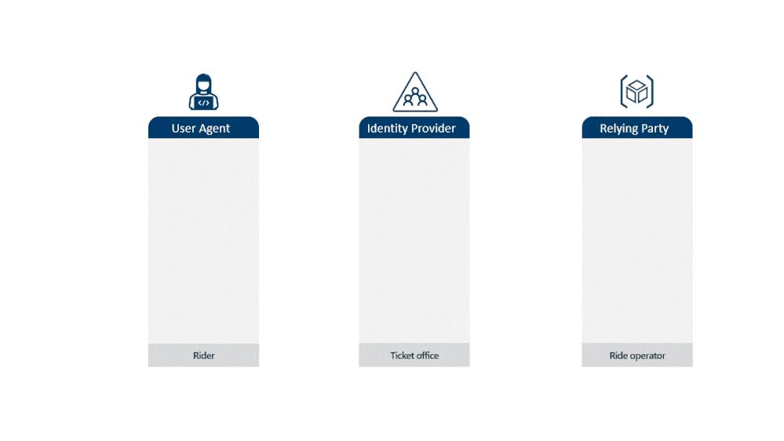

# トークン窃取によるサイバー攻撃の防止策

こんにちは、Azure Identity サポートチームの 高田 です。

本記事は、2024 年 6 月 20 日に米国の Microsoft Entra Blog で公開された [How to break the token theft cyber-attack chain](https://techcommunity.microsoft.com/t5/microsoft-entra-blog/how-to-break-the-token-theft-cyber-attack-chain/ba-p/4062700) を意訳したものになります。ご不明点等ございましたらサポート チームまでお問い合わせください。

----

これまで攻撃者がどのようにしてパスワードを突破しようとするかについていくつも記事を書いてきました。ID を危険にさらす最も一般的な攻撃手法であるパスワード攻撃への対処策として効果的なのは、[多要素認証 (MFA) を有効にすること](https://learn.microsoft.com/ja-jp/entra/identity/authentication/tutorial-enable-azure-mfa) です。

しかし、MFA を正しく実施しているお客様が増えるにつれて、攻撃者はパスワードだけでなく、さらに高度な攻撃に踏み込んできています。そのため、トークンの窃取を皮切りとして、より高度な攻撃方法について一連の記事を公開してまいります。この記事では、トークンの基本的な仕組みについての説明から、トークンの窃取攻撃の解説、トークンの窃取を防止および軽減するための対策について説明します。

## トークン 入門

トークンの窃取について深く掘り下げる前に、トークンの仕組みを簡単に見直してみましょう。

トークンは、リソースへのアクセスを許可する認証アーティファクトと呼ばれるものです。トークンは、Microsoft Entra ID などの ID プロバイダー (IDP) に対し資格情報を使用してサインインすることで取得できます。IDP はサインインが成功すると、あなたが誰であり、何を許可されているかを記述したトークンを発行します。アプリケーションやサービスにアクセスしたい場合 (以降は単純に「アプリ」と呼びます)、信頼する発行者によって正しく署名されたトークンをリソースに提示することで、そのリソースと通信する許可が得られます。使用しているクライアント デバイス上のソフトウェアが、トークンの処理をすべて裏で行ってくれます。

最初に取得するトークンは、**セッション トークン** と呼ばれ、これは IDP に正常にサインインしたこと、およびどのようにサインインしたかを示します。アプリにサインインする際、そのセッション トークンを **アクセス トークン** と交換できます。アクセス トークンは、再認証なしで一定時間特定のリソースにアクセスできるものです。例え話で説明すると、遊園地を考えてみましょう。IDP はチケットを発行する場所であり、さまざまなアトラクションで利用できる入場パスのようなものを発行します。ジェット コースターに乗りたい場合、チケットの発行所でシーズン パスを提示し、そのアトラクションに乗るチケットを受け取るようなものです。

遊園地では 1 日券、シーズンパス、または永年パスを購入できるように、各トークンにも通常 1 時間から 24 時間の有効期間があります。12 か月のシーズンパスを使って、特定のアトラクションの 1 日利用券が得られるのと同様に、セッション トークンはアクセス トークンよりも通常ははるかに長い有効期間を持つことが一般的です。さらに、アクセス トークンの寿命は状況により異なる場合があります。例えばジェット コースターのパスは 1 時間の有効期限である一方、観覧車のパスは 1 日間有効という場合もあります。

一般的に、有効期間が長い方がユーザーにとっては便利であり、潜在的な IDP の障害に対しても耐性があります (IDP との通信の往復をする必要がなくなりますし、それによる待ち時間も短縮されます) が、リスクが増します。一方で有効期間が短い場合はよりリスクが低い (IDP がリクエストの整合性をより頻繁にチェックできる) です。継続的アクセス評価 (CAE) などの技術を用いれば、トークンが継続的に評価されるため、CAE が利用できればトークンの有効期間が長くてもリスクはなくなります。トークンが期限切れになるか、継続的アクセス評価によりリスクが見つかった場合、クライアントは IDP に戻され、新規の認証が要求されます。このプロセスは通常ユーザーからは見えませんが、リスクの状況が変化した場合は、組織のポリシーに従って再認証し新しいトークンを取得する必要が生じる場合もあります。注意すべきなのは、ジェット コースターのチケットを取られてしまうと悲しいと思うのですが、シーズン パスを取られてしまう方がよっぽど大変だということです。ジェット コースターのチケットを取られても、攻撃者はジェット コースターに 1 回乗れるだけですが、シーズン パスを盗まれた場合、攻撃者は好きなだけアトラクションに乗ることができてしまいます。同じように、セッション トークンが盗まれると、攻撃者はアクセス トークンを持続的に得られるようになってしまうのです。

## トークン窃取に至る流れ

攻撃者はトークンを盗むことであなたになりすまし、その盗まれたトークンが有効な限り、あなたのデータにアクセス可能になります。このためには、攻撃者はトークンが保存されている場所 (クライアント、プロキシ サーバー、または時にはアプリケーションやネットワーク ログ）にアクセスしてトークンを取得し、別の場所からそれを再利用します。

| ID における用語 | 例えの用語 |
| ------------- | ------------- |
| ID プロバイダー | チケット売り場 |
| セッション トークン | シーズン パス |
| アクセス トークン | 乗り物用の個別の入場券 |

攻撃者があなたのセッション トークンを盗む際、これはあなたが遊園地の入場券売り場でシーズン パスを購入した後にスリにあうようなものです。トークンはデジタルなものなので、トークンの窃取はあなたのポケットからシーズン パスを盗み、それをコピーして元に戻すようなものと言えるでしょう。攻撃者は、あなたのセッション トークンのコピーを使用して無制限に新しいアクセス トークンを取得し、あなたのデータを盗み続けることができます。これは、有効な遊園地のパスのコピーを見せて、支払いなしで乗り物に乗り続けるのと同じです。

アクセス トークンを盗む攻撃者は、あなたが列に並んでいる間に、あなたがもつ乗車券を盗むのに似ています。攻撃者は同じコピーとすり替えのトリックを行い、コピーしたトークンを使用してリソースにアクセスします。まるで有効なチケットのコピーを提示して、支払いなしで個々のアトラクションに乗ることができるかのようにです。

どちらの場合も、攻撃者は元のフリーパスもしくはチケットをあなたのポケットにきちんと戻します。あなたは攻撃者があなたに成りすましてアトラクションに乗っていることにさえ気づかないでしょう。あなたのトークンは正常に見えますが、攻撃者はその不正なコピーを使用しているため、何かがおかしいと気付くには時間がかかるはずです。

ここでもう一つ例を示します。

Contoso 社は、すべてのドキュメントを安全なクラウド ストレージ サービスに保存し、従業員がアクセスする際には MFA を使用して ID を確認するようにしています。

ある日、とある従業員が Contoso 社のクラウド ストレージ サービスにサインインして仕事を始めた後、そのユーザーが誤って E メールで送られてきた悪意のある「フィッシング」のリンクをクリックしてしまい、デバイスにマルウェアがインストールされました。悪意のあるコードがユーザーのセッション トークンをコピーし、攻撃者に送信しました。

その後、攻撃者は盗んできたセッション トークン (MFA 済み) を自身のマシンにコピーして悪用することで、Contoso 社の環境に不正にアクセスしました。

そして、攻撃者はアクセス可能なドキュメントを片っ端からダウンロードし、機密性の高いレポートを含む多くのドキュメントをインターネット上に流出させました。

クライアント上に仕込んだマルウェアを使用してトークンを取得することは、攻撃者にとって一般的で簡単な方法の一つです。トークンを窃取する他の方法としては以下のようなものがあります:

- 攻撃者の支配下にあるプロキシやルーターを通過する際にネットワークからトークンをコピーする。
- リライング パーティー上で適切に保護されていないサーバー ログからトークンを抽出する。

トークンの窃取はまだ全ての ID 侵害の 5% 未満ですが、インシデント数は増加しています。マイクロソフトでは、前年比 111% 増の 147,000 件のトークン リプレイ攻撃を検出しています。

## トークンの保護

IDP とクライアントは、暗号化されたチャネルを介してのみトークンを送信し、オープンな場所にトークンを保存しないようにして、可能な限り安全にトークンを取り扱うべきです。しかし、上記の例のように攻撃者がデバイスやネットワーク チャネルに侵入すると、攻撃者はトークンを盗み、それが失効するまで使用できてしまいます。

理想的には、トークンはその発行先のデバイスから使用された場合にのみ機能するというのが望ましいです。つまり、攻撃者が制御する異なるデバイスからトークンが再利用された場合、それは拒否されるべきです。

トークン窃取に対する Microsoft の取り組みの中で重要な部分が、デバイスに暗号的に結びつけられたトークンを使用するという点です。これはしばしば **トークン バインディング** と呼ばれますが、sender constrained tokens (利用者が指定されているトークン) や token proof of possesion (トークンの所有証明) とも呼ばれることがあります。このようなトークンの保護により、トークンの発行先以外のデバイスからのトークンの使用が制限されるため、ネットワーク ベースの攻撃やデバイス上のマルウェアを使用する攻撃など、トークンを窃取しようとする主な攻撃が難しくなります。

Microsoft Entra では、トークン保護の機能を使うことで、トークンをデバイス固有の暗号鍵に結びつけ、登録されたデバイス情報に紐づけます。開発者がトークン保護の機能を利用できるようにアプリケーションを対応させれば、Entra 条件付きアクセス ポリシーを利用して、クライアント アプリケーションがサービスにアクセスする際にトークン保護の機能を強制するようできます。このポリシーが有効になると、トークンが発行された先のデバイスに暗号的に結びついていないトークンが拒否されるようになります。遊園地の例で言えば、これは入場券売り場があなたの顔写真を撮り、あなたの乗車券に印刷して、乗り物に乗る前に係員があなたの顔と写真を照合するようになるようようなものといえます。

これは、オペレーティング システムのプラットフォーム、ネイティブおよびウェブ アプリケーション、すべてのクラウド サービス、およびさまざまな利用シナリオのトークンにわたるため、大規模な取り組みとなります。このため、特定のシナリオごとに段階的にリリースされる予定です。最初の段階は現在パブリック プレビュー中ですが、Windows デバイス上のネイティブ アプリケーションが Exchange、SharePoint、Teams サービスにアクセスする際にサインイン セッション トークンを保護するというものです。

トークン保護ポリシーは、現在 Windows クライアントでのみ利用可能です。弊社は今後 Azure の管理シナリオおよび Microsoft 365 のリソースにアクセスするウェブ アプリケーションをサポートし、来年にかけてクロスプラットフォームの機能を Mac、iOS、Android、およびその他のクライアントにも拡張していく予定です。

## トークン窃取に対抗する実用的な手だて

トークン保護はトークン窃取に対して最も効果的な手段ですが、すべてのアプリケーションがトークン バインディングを使用するようになるには業界としても時間がかかります。しかし、Microsoft はトークン窃取を含む攻撃に対する有効な対策を現在提供しており、今からそれらを使用すればリスクと影響を減らすことが可能です。弊社では、複数の手だてを用いた体系的なアプローチを推奨します:

1. トークン窃取の成功リスクを減らす。
2. 窃取されたトークンの悪意のある使用を防ぐ。
3. 窃取されたトークンを使用した攻撃を検出および調査できるよう準備を整える。

### トークン窃取が成功するリスクを減らす

防御の第一線は、まず攻撃者がトークンを盗み取る機会を減らすことです。以下に、そのための確立された取り組みをいくつか紹介します。これは、遊園地にいる間に乗車券や入場券をスリから守ることに相当します。

**管理済みおよび準拠済みデバイスを必要とする:** デバイス管理を使用し、ユーザーが準拠したデバイスからリソースにアクセスすることを要求する条件付きアクセス ポリシーを定義ください。デバイスからのトークン窃取のリスクを減らすために弊社が推奨する準拠ポリシーとしては以下が挙げられます:

1. トークンを窃取するマルウェアへの偶発的な感染を防ぐために、Windows ユーザーにはデバイスの管理者ではなく標準ユーザーとして Windows を利用するよう要求し、すべてのデバイスで最新のアンチマルウェアおよびウイルス対策ツールを実行するようにします。
2. デバイス自体が盗まれた場合にトークンを含むデバイスの内容を保護するため、ストレージの暗号化機能を使用します。
3. Local Security Authority (LSA) のメモリ上にある Entra ID のトークンを保護するために、LSA 保護を有効にします。LSA 保護は新しいデバイスでは既定で有効になっており、Intune を介して他のデバイスでも有効にすることが可能です。
4. モバイル デバイスに対する脱獄またはルート化の検出機能を利用します。脱獄されたデバイスは、トークンや暗号化された機密情報が潜在的な攻撃に晒されやすくなります。

**Windows ユーザーに対してクレデンシャル ガードをオンにする:** ユーザーが Windows 10 以降を実行している場合、Active Directory の資格情報の窃取を防ぐために [クレデンシャル ガード](https://learn.microsoft.com/ja-jp/windows/security/identity-protection/credential-guard/?source=recommendations) を設定できます。これは、仮想化ベースのセキュリティ (VBS) を使用してローカルおよびキャッシュされた資格情報を隔離し、マルウェアではなく特権システム ソフトウェアのみが資格情報にアクセスできるようにするというものです。Windows 11 のバージョン 22H2 からは、要件を満たすデバイスでは既定でクレデンシャル ガードが有効になっています。これにより、Active Directory 認証を使用するハイブリッド参加デバイスがクラウド アプリケーションにアクセスしようとセッションを開始するときにも保護が適用されます。

クレデンシャル ガードを有効にするための手順については、[弊社ドキュメント](https://learn.microsoft.com/ja-jp/windows/security/identity-protection/credential-guard/configure?tabs=intune#enable-credential-guard) を確認ください。

### 窃取されたトークンの悪意のある使用を防ぐ

デバイス管理と強力な資格情報の管理により確かにトークン窃取のリスクが減りますが、それらをすべての人が利用できるわけではありません。また、これらも完全な解決策ではありません。防御の次の層は、盗まれたトークンを可能な限り拒否するポリシーを設定し、その攻撃の試行を検知して自動的に対応することにより、窃取されたトークンを攻撃者が継続的に使用するのを防ぐことです。

**条件付きアクセスでトークン保護を要求し、トークン保護を使用するアプリやサービスを可能な限り選択する:** Microsoft は、トークン保護をサポートするために、アプリ、ID プロバイダー、およびオペレーティング システムを継続的に改善しています。したがって、弊社のアプリやプラットフォームをご利用の場合は、必ず最新バージョンをご使用ください。次に、条件付きアクセスを設定して、[サインイン セッションのトークン保護](https://jpazureid.github.io/blog/azure-active-directory/public-preview-token-protection-for-sign-in-sessions/) を適用ください。これによりサインイン セッション トークンが紐づくアプリケーションとデバイスのみがトークンを利用できるようになり、トークンが盗まれて別のデバイスに移動された場合でも、そのトークンが利用できないようになります。

条件付きアクセス ポリシーを作成するための手順については、[弊社ドキュメント](https://learn.microsoft.com/ja-jp/entra/identity/conditional-access/concept-token-protection#create-a-conditional-access-policy) を確認ください。

**リスク ポリシーを作成して環境内のトークン窃取を自動的に阻止する:** ユーザーがセッションを開始したりアプリケーションにアクセスしようとしたりすると、ID Protection がユーザーとセッションのリスク要因を評価し、何らかの変化が生じたかを確認します。セッションに中リスクおよび高リスクが検出された場合は、セッションの保護のため、MFA をユーザーに求めるか、[再認証を要求する](https://jpazureid.github.io/blog/azure-active-directory/prompt-users-for-reauthentication-on-sensitive-apps-and-high-risk-actions-with-conditional-access/) 条件付きアクセス ポリシーを構成ください。これにより、盗まれたセッション トークンを使用して攻撃者がセッションを開始することが困難もしくは不可能となります。

[継続的アクセス評価 (CAE)](https://aka.ms/CAE) が利用可能な場合は、ID Protection がユーザーまたはサービス プリンシパルのリスクを検出したときにトークンが自動的に無効化されます。これにより、リスクベースの条件付きアクセス ポリシーがリアルタイムに動作して再認証が必要になり、リスクが緩和されます。

リスクベースの条件付きアクセス ポリシーを作成するためのの手順については、[ドキュメント](https://learn.microsoft.com/ja-jp/entra/id-protection/concept-identity-protection-policies) をご確認ください。

**ネットワーク境界内でのセッションの使用を制限することでトークンの再利用のリスクを減らす:** ほとんどの攻撃者は、盗まれたトークンを信頼済みの IP アドレス範囲外から使用します。ポリシーを使用してネットワーク境界を確立することで、未知の場所や既知の悪意のある場所からのアクセスを防ぐことが可能となります。

__Entra 条件付きアクセスでネットワークを制限する:__ 条件付きアクセスには、定義した準拠ネットワークの境界外部からのリクエストをブロックする機能が含まれています。これにより、攻撃者が盗まれた Entra トークンを更新できないようにし、トークンの有効期間を超えて利用できないように制限します。

準拠ネットワークの境界を定義するための手順については、[ドキュメント](https://learn.microsoft.com/ja-jp/entra/identity/conditional-access/howto-conditional-access-policy-location) を確認ください。

__[Microsoft のセキュリティ サービス エッジ (SSE) ソリューション](https://learn.microsoft.com/ja-jp/entra/global-secure-access/overview-what-is-global-secure-access) でネットワークをより強固に制御する__: 攻撃者が信頼済みネットワークの外でトークンを使用できないようにするため、Entra Internet Access と Entra Private Access は、エンドポイントにインストールされたエージェントに加え、準拠ネットワークのチェック機能 (CAE を介してリアルタイムで強制) を使用して、ユーザーが信頼できるネットワークから接続しているかどうかを確認します。条件付きアクセスで準拠ネットワークのチェックを有効にするための手順については、[ドキュメント](https://learn.microsoft.com/ja-jp/entra/global-secure-access/how-to-compliant-network) を確認ください。

Teams、Exchange Online、SharePoint Online などの CAE 対応アプリケーションおよびサービスでは、IP ベースのネームドロケーションの条件付きアクセス ポリシーと準拠ネットワーク ポリシーを継続的に強制し、信頼できるネットワークからのみトークンを使用してサービスにアクセスできるようにします。CAE は、最大限の保護を提供する「場所ポリシーを厳密に適用する」モードも提供しています。この機能を有効にするための手順については、こちらの [ドキュメント](https://learn.microsoft.com/ja-jp/entra/identity/conditional-access/concept-continuous-access-evaluation-strict-enforcement) を確認ください。

***継続的アクセス評価を使用してトークンを無効化する:*** CAE をサポートするサービスに信頼済みの場所からのみアクセスできるようにすることに加えて、CAE は、管理者 (またはユーザー自身) が何らかの操作を実行したときに、アカウントの侵害やトークン窃取を検出し、トークンを無効化することが可能です。操作には、アカウントの無効化、パスワードの変更、リフレッシュ トークンの破棄が含まれます。継続的アクセス評価の詳細については、[こちらのドキュメント](https://aka.ms/CAE) で確認ください。

### 窃取されたトークンを使用した攻撃を検出および調査できるよう準備を整える

**Entra ID Protection と Microsoft Defender を使用してトークンの窃取を監視する:** 脅威アクターがトークンを再利用すると、Entra ID Protection および Microsoft Defender for Cloud Apps が、サインイン イベントにより「異常なトークン」や「見慣れないサインイン プロパティ」などの [検出をトリガー](https://learn.microsoft.com/ja-jp/entra/id-protection/concept-identity-protection-risks#risk-types-and-detection) します。[Premium 検出](https://learn.microsoft.com/ja-jp/entra/id-protection/concept-identity-protection-risks#premium-detections) 機能により、異常なトークンの有効期間や見慣れない場所から再生されたトークン、または既知の攻撃者パターンに一致するトークン属性などの異常な特性が検出されます。Microsoft Defender for Endpoint (MDE) の生成するシグナルを用いると、プライマリ更新トークンを窃取しようとする試みを検出することも可能です。

トークンの窃取を調査するための手順については、[こちらのドキュメント](https://learn.microsoft.com/ja-jp/security/operations/token-theft-playbook#investigations) を確認ください。

**すべてのデータを Microsoft Sentinel などの Security Information and Event Management (SIEM) の仕組みに集約してトークン窃取の可能性を調査する:** トークンの窃取を示す可能性のあるアラートを受け取った場合、Microsoft Sentinel ポータルまたは他の SIEM で調査を進めます。Microsoft Sentinel では、特定のインシデントの重大度、発生時期、関与したエンティティの数、トリガーしたイベント、および MITRE ATT&CK の戦術やテクニックに当てはまるかかどうかなど、重要な詳細が提供されます。その後、調査マップを確認して、潜在的なセキュリティ脅威がどの範囲に及ぶのか、また根本原因は何かを確認していきます。

Sentinel を使用してインシデントを調査するための手順は、[こちらのドキュメント](https://learn.microsoft.com/ja-jp/azure/sentinel/investigate-incidents#investigate-your-incident-in-depth) を確認ください。

| トークン窃取が成功するリスクを減らす | 窃取されたトークンの悪意ある使用を防ぐ | 窃取されたトークンを使用した攻撃を検出および調査できるよう準備を整える |
| ------------- | ------------- | ------------- |
| [管理済みおよび準拠済みデバイスを要求する](https://learn.microsoft.com/ja-jp/mem/intune/protect/device-compliance-get-started#compliance-policy-settings)     [Windows デバイスでクレデンシャル ガードを有効にする](https://learn.microsoft.com/ja-jp/windows/security/identity-protection/credential-guard/configure?tabs=intune#enable-credential-guard) | [条件付きアクセスでトークン保護を要求し、トークン保護を使用するアプリやサービスを可能な限り選択する](https://jpazureid.github.io/blog/azure-active-directory/public-preview-token-protection-for-sign-in-sessions/)     [リスク ポリシーを作成して環境内のトークン窃取を自動的に阻止する](https://learn.microsoft.com/ja-jp/entra/id-protection/concept-identity-protection-policies)     [ネットワーク境界内でのセッションの使用を制限することでトークンの再利用のリスクを減らす](https://learn.microsoft.com/ja-jp/entra/identity/conditional-access/howto-conditional-access-policy-location)     [継続的アクセス評価を使用してトークンを無効化する](https://learn.microsoft.com/ja-jp/entra/identity/conditional-access/concept-continuous-access-evaluation) | [Entra ID Protection と Microsoft Defender を使用してトークンの窃取を監視する](https://learn.microsoft.com/ja-jp/security/operations/token-theft-playbook#investigations)     [すべてのデータを Microsoft Sentinel などの Security Information and Event Management (SIEM) の仕組みに集約してトークン窃取の可能性を調査する](https://learn.microsoft.com/ja-jp/azure/sentinel/investigate-incidents#investigate-your-incident-in-depth) |

皆様がサイバー セキュリティを強化できるようその仕組みを開発する企業として、Microsoft はトークン窃取に対して戦略的に取り組んでいます。トークンの窃取を利用した攻撃へ対抗するために、今後も何らかの進展が得られましたら弊社より随時お知らせします。その間、お客様の環境を守るために、条件付きアクセス ポリシーを構成して可能な限りトークンを保護し、ここで説明した対策を採用ください。

Alex Weinert
