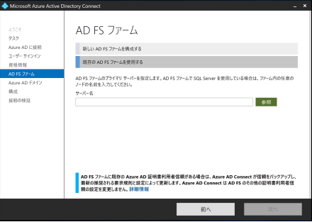
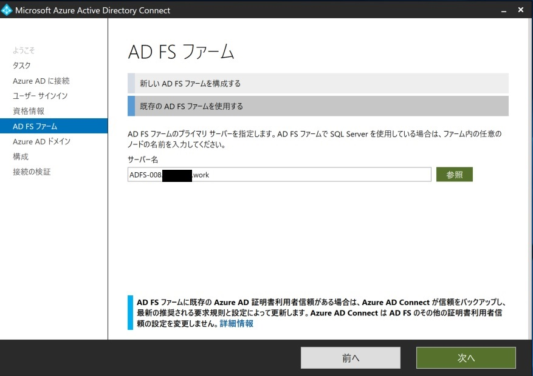
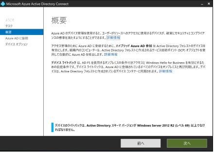
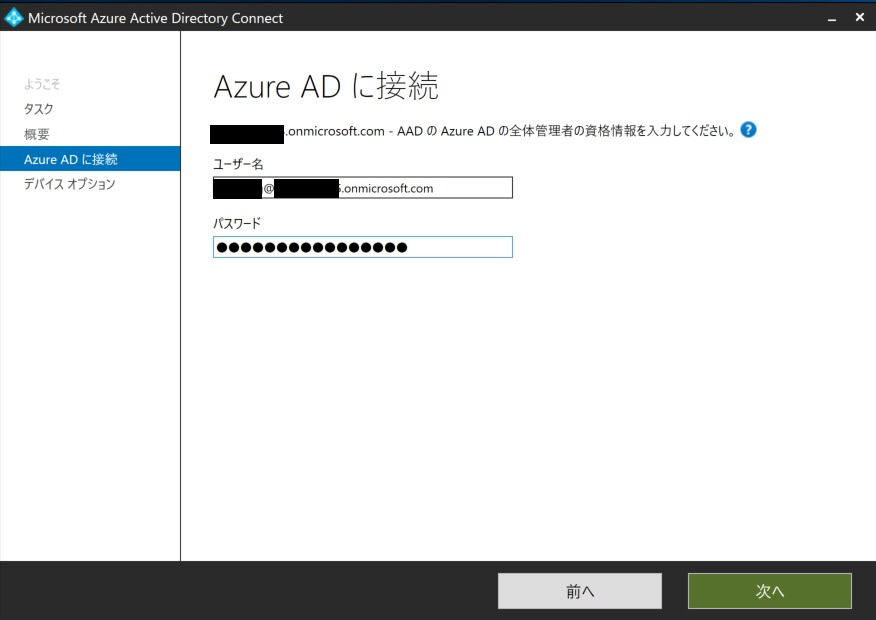
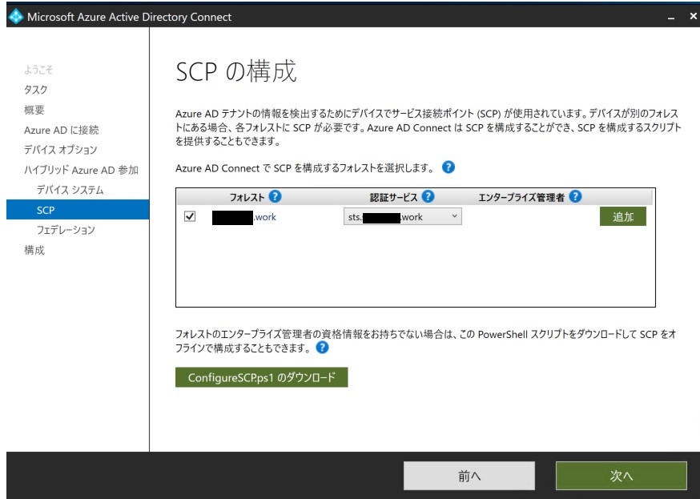
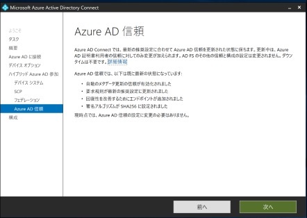
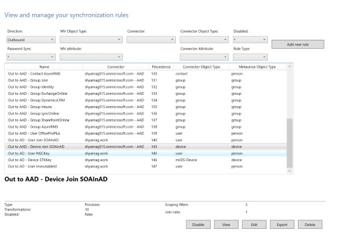
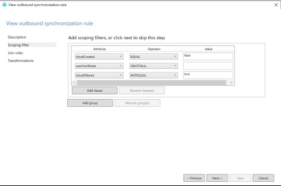
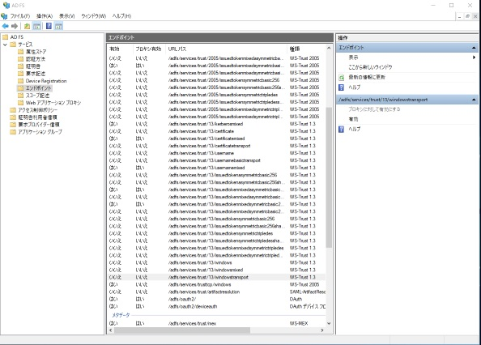

# フェデレーション ドメイン用 (AD FS あり) Hybrid Azure AD Join を一から構成する
こんにちは、 Azure Identity の山口です。
今回は AD FS を利用するフェデレーション ドメイン環境における Hybrid Azure AD Join の構成手順をご紹介します。

## はじめに

AD FS を利用する Federation Domain 環境の Hybrid Azure AD Join の環境構築は、下記 Microsoft 公開情報を参考に行えば、構成は問題なく行えます。

チュートリアル:フェデレーション ドメイン用のハイブリッド Azure Active Directory 参加の構成
URL:https://docs.microsoft.com/ja-jp/azure/active-directory/devices/hybrid-azuread-join-federated-domains

フェデレーション ドメインはマネージド ドメイン環境とは違い、前提として、Azure AD にカスタム ドメインがフェデレーションとして登録されている必要があります。
具体的には、「Azure ポータル」 → 「Azure Active Directory」 → 「カスタム ドメイン」の順にクリックし、下記画面ショットのとおり、カスタム ドメインのフェデレーションにチェックが入っていることを確認します。

もしくは、AD FS サーバーで下記コマンド レットを実行することで確認ができます。
まず、PowerShell を管理者として実行します。

Connect-MsolService コマンド レットを実行します。
フェデレーション先の Azure AD のグローバル管理者の資格情報を入力します。

PowerShell にて「get-msoldomain」と実行すると、下記のとおり、カスタム ドメインがフェデレーション ドメインであることが確認できます。

## 環境について
Azure AD テナント (カスタム ドメインがフェデレーション ドメインとして登録済)
オンプレミス AD 兼 Azure AD Connect (1.3.21.0) on Windows Server 2019 Datacenter
AD FS サーバー on Windows Server 2019 Datacenter
Windows 10 (1809)

## 目次

1. Azure AD Connect の設定
2. クレーム ルールが追加されたことを確認する
3. Hybrid Azure AD Join 構成までの流れ
4. PRT を取得する。
5. おわりに

## Azure AD Connect の設定

フェデレーション ドメイン環境においては、以下 2 つの設定が必須となります。

1. SCP (サービス接続 ポイント)
2. クレーム ルール

以前までは上記を手動で構成する必要がありましたが、現在では Azure AD Connect により容易に構成することが可能です。
マイクロソフトとしても最新の Azure AD Connect を利用して上記を構成することを推奨しています。
従って、本手順でも Azure AD Connect を利用して SCP と クレーム ルールを構成します。

Azure AD Connect へようこその画面で「構成」をクリックします。

追加のタスクの画面で「ユーザー サインインの変更」をクリックします。

Azure AD に接続の画面にて Hybrid Azure AD Join を構成する Azure AD テナントの全体管理者 (グローバル管理者) の資格情報を入力し「次へ」をクリックします。

ユーザー サインインの画面にて、サインイン方式を「AD FS とのフェデレーション」を選択し、「次へ」をクリックします。

ドメイン管理者の資格情報の画面にて、オンプレミス AD の資格情報を入力し、「次へ」をクリックします。

AD FS ファームの画面にて、「既存の AD FS ファームを使用する」を選択した状態で「参照」をクリックします。

フェデレーション サーバーの選択画面にて AD FS サーバーのホスト名を入力後、虫眼鏡マークにて検索を行い、構成済みの AD FS サーバーの情報が表示されることを確認し、「OK」をクリックします。

サーバー名に正しい値がセットされることを確認し、「次へ」をクリックします。

Azure AD ドメインにて、オンプレミス AD とフェデレーション関係にある、カスタム ドメインを選択し、「次へ」をクリックします。

Azure AD 信頼の画面にて、「次へ」をクリックします。

下記画面ショットのとおり、Azure AD の証明者利用者の信頼のバックアップ、Azure AD 証明書利用者信頼の更新、カスタム ドメインの Azure AD 信頼の構成が行われます。
「構成」をクリックします。

構成が完了しましたの画面にて、「次へ」をクリックします。

接続の検証画面にて、フェデレーションの接続性の検証を行い、接続検証を行います。
問題がなければそのまま「終了」をクリックします。

次に、Hybrid Azure AD Join の構成を行います。Azure AD Connect を再度起動し、「構成」をクリックします。

追加のタスクの画面で「デバイス オプションの構成」を選択し、「次へ」をクリックします。

概要画面より「次へ」をクリックします。

Azure AD に接続画面に Hybrid Azure AD Join としてデバイスを登録する Azure AD テナントの全体管理者 (グローバル管理者) の資格情報を入力し、「次へ」をクリックします。

デバイス オプションの画面にて「ハイブリット Azure AD 参加の構成」が選択されていることを確認し、「次へ」をクリックします。

デバイスのオペレーティング システムの画面にて、「Windows 10 以降のドメインに参加しているデバイス」にチェックを入れて「次へ」をクリックします。

SCP の構成画面について説明します。
マネージド ドメイン環境においては、認証サービスが「Azure Active Directory」になりますが、フェデレーション ドメイン環境では「フェデレーション サービス名」が認証サービスになります。具体的には、 AD FS に対してコンピューター アカウントが認証されてトークンを取得し、 Azure AD DRS に対してデバイスを登録する動作になります。つまり、認証を Azure AD で行うのか、 AD FS が行うのか、という選択をここでしています。

今回はフェデレーション ドメイン環境の Hybrid Azure AD Join 環境を構成するので、「フェデレーション サービス名 (sts.xxx.work)」を選択します。
(デバイス登録のフローについては後述します)

認証サービスをフェデレーション サービス名を選択し、「追加」をクリックします。

オンプレミス AD のエンタープライズ管理者の資格情報が要求されますので、資格情報を入力し、「OK」をクリックします。

エンタープライズ管理者の情報がセットされることを確認し、「次へ」をクリックします。

フェデレーションの構成画面にて、 AD FS サーバーの管理者の資格情報を入力し、「次へ」をクリックします。

Azure AD 信頼の画面にて、「次へ」をクリックします。

構成の準備完了の画面にて「構成」をクリックします。

構成が完了しましたの画面にて、「終了」をクリックします。

## クレーム ルールが追加されたことを確認する

Azure AD Connect のユーザー サインインの変更の Azure AD 信頼の画面にて、クレーム ルールが追加されました。
具体的には、下記手順にて確認ができます。

1. AD FS サーバーに管理者ユーザーでサインインします。
2. スタート → Windows 管理ツール → AD FS の管理の順にクリックします。
3. 証明書利用者信頼→ Microsoft Office 365 Identity Platform → 要求発行ポリシーの編集の順にクリックします。

発行変換規則に下記のとおり、1 から 19 までのクレーム ルールが追加されていることを確認します。

ちなみに以下が、クレーム ルールが追加される前の状態になります、明らかに増えていることが分かります。

Hybrid Azure AD Join として必須のクレーム ルールは下記 の 3 つになります。
これらの情報は手動で Hybrid Azure AD Join を構成する際に参照する下記ドキュメントを参考にしてください。

チュートリアル:ハイブリッド Azure Active Directory 参加済みデバイスを手動で構成する
アカウントの種類の要求を発行する
URL:https://docs.microsoft.com/ja-jp/azure/active-directory/devices/hybrid-azuread-join-manual#issue-account-type-claim

①クレーム名： Issue accounttype for domain-joined computers

オンプレミスのコンピューター アカウントの objectGUID を発行する

URL:https://docs.microsoft.com/ja-jp/azure/active-directory/devices/hybrid-azuread-join-manual#issue-objectguid-of-the-computer-account-on-premises

②クレーム名： Issue onpremobjectguid for domain-joined computers

オンプレミスのコンピューター アカウントの objectSID を発行する
URL:https://docs.microsoft.com/ja-jp/azure/active-directory/devices/hybrid-azuread-join-manual#issue-objectsid-of-the-computer-account-on-premises

③クレーム名： Pass through primary SID

## Hybrid Azure AD Join 構成までの流れ

マネージド ドメイン環境の Hybrid Azure AD Join の流れと、フェデレーション ドメイン環境の Hybrid Azure AD Join の流れは異なります。

まず、マネージド ドメイン環境の場合のフローは下記になります。

#### マネージド ドメイン環境の場合

1. Windows 10 コンピューターを、オンプレミス AD に参加します。
2. オンプレミス AD 上のコンピューター オブジェクトの userCertificate 属性に Windows 10 コンピューターを認証するための証明書が当該コンピューターにより、追加されます。
3. オンプレミス AD 上のコンピューター オブジェクトの userCertificate 属性値に証明書が追加されると、Azure AD Connect がコンピューター オブジェクトを Azure AD に同期します。 (通常は 30 分間隔)
4. 当該コンピューター上のタスク スケジューラにより証明書を使用して、 Azure Active Directory 上にデバイスが登録します。 
    (このタイミングで dsregcmd /status のコマンドレットをたたくと AzureADJoined の値が YES になります)
5. オンプレミス AD と Azure AD 間で同期しているユーザーで当該の Windows 10 コンピューターにサインインしたとき、Azure AD による認証後、サインインしたユーザーの PRT (Primary Refresh Token) が発行され、Hybrid Azure AD Join として Azure AD (Office 365) にサインインできます。  
    (このタイミングで dsregcmd /status のコマンドレットをたたくと AzureADPrt の値が YES になります)

図式化するとこんな感じです。

#### フェデレーション ドメイン環境の場合

フェデレーション ドメイン環境の場合はフローが異なります。
SCP を構成したときを思い出してください、 Azure Active Directory ではなくて、フェデレーション サービス名 (AD FS) を指定していました。
つまり、Windows 10 のコンピューター アカウントが SCP を参照した結果、認証先は Azure AD ではなくて AD FS サーバーであることがわかり、 AD FS に対してトークンを要求する動作となります。フローを箇条書きに書くと以下のとおりとなります。

1. Windows 10 コンピューターにユーザーがサインインした際に、Automatic-Device-Join のタスクが稼働します。
2. サービス接続ポイント (SCP) へ接続を行い Azure AD への接続を試行します。
3. Azure AD 側でフェデレーション ドメインであることを判定されます。
4. AD FS にコンピューター アカウントが認証され、認証トークンが発行されます。
5. クライアント端末が発行されたトークンを Azure AD に提供し、デバイス登録が実施されます。
    (このタイミングで dsregcmd /status のコマンドレットをたたくと AzureADJoined の値が YES になります)
6. デバイス認証用の証明書鍵がデバイス内にインポートされます。
7. オンプレミス AD と Azure AD 間で同期しているユーザーで当該の Windows 10 コンピューターにサインインしたとき、AD FS による認証後、サインインしたユーザーの PRT (Primary Refresh Token) が発行され、Hybrid Azure AD Join として Azure AD (Office 365) にサインインできます。  
    (このタイミングで dsregcmd /status のコマンドレットをたたくと AzureADPrt の値が YES になります)

上述のとおり、フェデレーション ドメイン環境の場合は Azure AD Connect で同期を行わなくても Hybrid Azure AD Join が構成できますが、以下の理由で Azure AD Connect によるデバイス同期を行うことを推奨しています。

例えば、オンプレミス AD 側の構成が変更されて、オンプレミス AD と Azure AD 間のデバイス構成情報に差分が発生したとします。
その場合、Azure AD Connect がないと、デバイスの差分を補ってくれません。
極端な話をすると、オンプレミス AD 側で 1000 台 Hybrid Azure AD Join を構成するフォレストから別のフォレストに移動した場合、Azure AD Connect がないと、デバイス情報を手動で削除しない限りは、Azure AD 側に残ったままになります。

上記のような運用面のコストを考えると、Azure AD Connect  によりデバイスを同期しておくことをお勧めします。

ちなみに、フェデレーション ドメイン環境の場合も Windows 10 コンピューターの userCertificate 属性に証明書がセットされる動作になります。
実際に見てみましょう。

今回、Windows10-18091 というコンピューターを Hybrid Azure AD Join させますが、下記のとおり、userCertificate 属性に証明書がセットされています。

続いて、Azure AD Connect  側の同期ポリシーを見てみます。

Azure AD Connect の同期ルールを見てみると、 userCertificate 属性が ISNOTNULL (証明書がセットされていることが必須) であることが分かります。
[Synchronization Rules Editor] から Direction を「Outbound」を選択し、[Out to AAD - Device Join SOAInAD]を選択後に「View」をクリックします。

Scoping Filter をクリックすると、 userCertificate が ISNOTNULL であることがわかります。

つまり、フェデレーション ドメイン環境にて Hybrid Azure AD Join を構成し、Azure AD Connect にてデバイス同期を行っている場合 、マネージド ドメイン環境と同じように、userCertificate 属性に証明書がセットされている場合も Azure AD にデバイスが Hybrid Azure AD Join として同期されますし、上記のフェデレーション ドメインのフローによりデバイスが Hybrid Azure AD Join として登録されるという **2 通りの方法が存在する**ということになります。
(厳密にどちらの方法でデバイスが登録されたかを都度都度追いかける必要はありません。方法が 2 通りあるということを覚えていただければと思います。)

##### エンド ポイントの注意点

上記フェデレーション ドメインのフロー図において、AD FS にトークンを取得するためにアクセスするエンド ポイントは「/adfs/services/trust/13/windowstransport」と記載されています。つまりこのエンドポイントが有効になっていないと、デバイスの登録に失敗します。
下記画面ショットにありますが、デフォルトでは「/adfs/services/trust/13/windowstransport」が無効になっているので手動で有効にする必要があります。

エンドポイント「/adfs/services/trust/13/windowstransport」を選択し、右クリックより「有効」をクリックします。

AD FS サービスの再起動を要求されるので、「OK」を押して画面を閉じます。

再度同じエンドポイントを選択し右クリックより「プロキシに対して有効にする」をクリックします。

同じように AD FS サービスの再起動を要求されるので、「OK」を押して画面を閉じます。

サービス画面より Active Directory フェデレーション サービス (AD FS) を右クリックし、「再起動」をクリックします。

この時点で Azure AD Join は完了しているので確認します。
Windows 10 コンピューターにログオンし、dsregcmd /status コマンド レットを実行すると、下記のとおり、AzureAdJoined が YES になっていることが分かります。

# PRT を取得する。

PRT を取得するためには、Azure AD に同期済みのオンプレミス AD ユーザーでログオンする必要があるのは、フェデレーション ドメインの場合でも同様です。
Azure AD に同期済みの下記「test001@xxx.work」で Windows 10 コンピューター (Windows10-18091) にログオンします。

資格情報を入力してログオンします。

コマンドプロンプトを起動し、このタイミングで dsregcmd /status のコマンドレットをたたくと AzureADPrt の値が YES になることが確認できます。

# おわりに

今回はフェデレーション ドメイン環境における Hybrid Azure AD Join の構築手順をご紹介しました。
フェデレーション ドメイン環境の場合も Azure AD Connect により、SCP およびクレーム ルールを構成することができます。

本 Blog ではマネージド ドメイン環境とフェデレーション ドメイン環境の Hybrid Azure AD Join の登録フローの違いを説明しました。
フェデレーション ドメイン環境の場合は、 Azure AD Connect は必須ではないですが、オンプレミス AD 側はデバイスの削除を行うと、同期を行えないため Azure AD 上でのデバイス情報に差分が発生する、というデメリットがあります。

確実にデバイスを管理したい、という方は Azure AD Connect によるデバイス同期をお勧めします。
(今回 Hybrid Azure AD Join も Azure AD Connect で構成してますので、 Azure AD Connect を使わない手はないと思います)

ご不明な点等ございましたら、是非弊社サポート サービスをご利用ください。

※本情報の内容 (リンク先などを含む) は、作成日時点でのものであり、予告なく変更される場合があります。