# マネージド ドメイン用 (AD FS なし) Hybrid Azure AD Join を一から構成する

こんにちは、 Azure Identity の山口です。
今回は AD FS を利用しないマネージド ドメイン環境における Hybrid Azure AD Join の構成手順をご紹介します。

## はじめに

AD FS を利用しないマネージド ドメイン環境の Hybrid Azure AD Join の環境構築手順は、下記公開情報にあります。

チュートリアル:マネージド ドメイン用のハイブリッド Azure Active Directory 参加の構成
URL:https://docs.microsoft.com/ja-jp/azure/active-directory/devices/hybrid-azuread-join-managed-domains

本 Blog では、 Azure AD にオンプレミス AD のデバイスが登録される仕組みを含め、一から Hybrid Azure AD Join を構成するまでの流れを画面ショット付きで解説します。

## 本 Blog を作成するために利用した環境について

1. Azure AD テナント
2. オンプレミス AD on Windows Server 2019 Datacenter
3. Azure AD Connect(1.3.20.0) on Windows Server 2019 Datacenter
1. 4. Windows 10 (1809)
※ Hybrid Azure AD Join を構成するためのオンプレミス AD 及び Azure AD Connect のサーバー OS は Windows Server 2012 R2 以降であれば可能です。

## 目次

1. Azure AD へのカスタム ドメイン登録
2. Azure AD Connect の設定
3. SCP とは、 SCP の構成の確認
4. Hybrid Azure AD Join 構成までの流れ
5. userCertificate 属性について
6. Azure AD へのデバイス同期の確認
7. PRT (Primary Refresh Token) の取得
8. おわりに

## Azure AD へのカスタムドメイン登録

詳細については後述しますが、 Hybrid Azure AD Join の処理では、各クライアントがオンプレミス AD に登録された SCP (サービス接続ポイント) を参照し、デバイスの登録処理を行います。SCP には、オンプレミス AD が利用しているインターネット ルーティング可能な (外部 DNS から名前が引ける) ドメインを Azure AD に登録する必要があります。もしもオンプレミス AD のドメイン名が xxxxx.local などインターネット ルーティングができない名前の場合には、オンプレミス AD で代替 UPN サフィックスの登録作業を事前に実施しておきます。

### 代替 UPN サフィックス登録の手順について

オンプレミス AD に管理者アカウントにてサインイン後、[スタート] → [Windows 管理ツール] → [Active Directory ドメインと信頼関係] の順に選択します。


Active Directory ドメインと信頼関係の画面より、[Active Directory ドメインと信頼関係] を右クリックし、「プロパティ」を選択します。

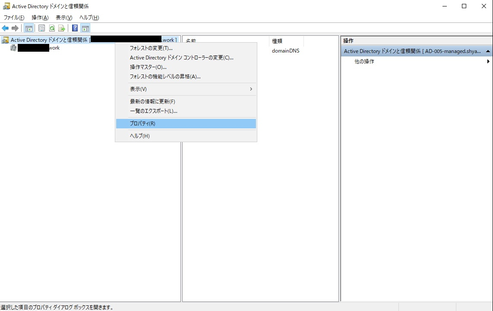

UPN サフィックス画面より、代わりの UPN サフィックスの欄に、代替 UPN サフィックス名を入力後、「追加」をクリックし、「OK」ボタンをクリックします。
「OK」ボタンをクリック後、 Active Directory ドメインと信頼関係の画面を「x」ボタンをクリックし、閉じます。

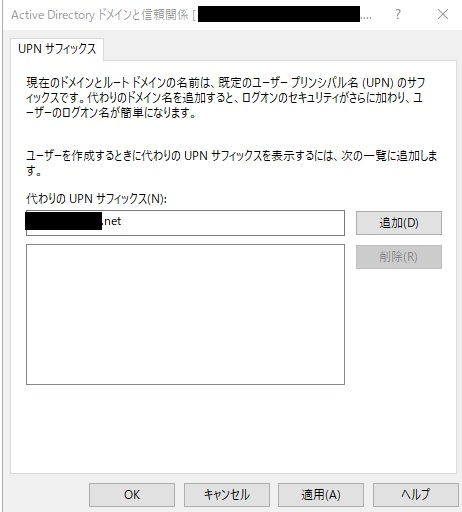

[スタート] → [Windows 管理ツール] → [Active Directory ユーザーとコンピューター] の順に選択します。


[ドメイン名] → [Users] → [代替 UPN サフィックスを設定するユーザー] の順に選択し、対象のユーザーを選択した状態で、右クリックより「プロパティ」を選択します。


選択したユーザーのプロパティ画面より、「アカウント」タブを選択後、ユーザー ログオン名のドメイン名のプルダウン メニューより、上記手順で作成した「代替 UPN サフィックス」を選択し、「OK」ボタンをクリックします。
「OK」ボタンをクリック後、 Active Directory ユーザーとコンピューターの画面を「x」ボタンをクリックし、閉じます。

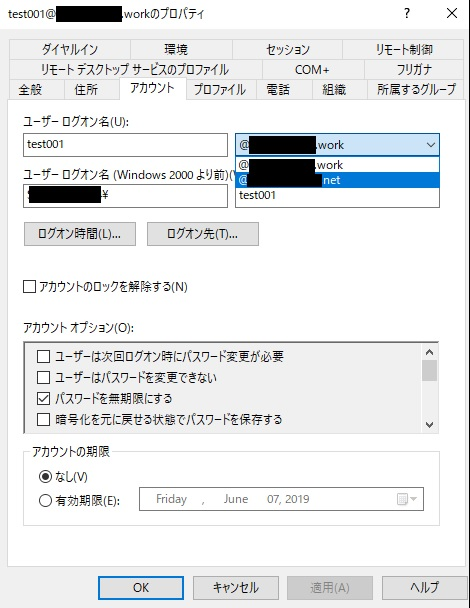

また、複数のユーザーの代替 UPN サフィックスを変更する場合は、変更対象のユーザーを複数選択した状態にて、右クリックより「プロパティ」を選択します。


複数の項目のプロパティ画面より、「アカウント」タブをクリックし、UPN サフィックスのプルダウン メニューより、上記手順で作成した「代替 UPN サフィックス」を選択し、「OK」ボタンをクリックします。
「OK」ボタンをクリック後、 Active Directory ユーザーとコンピューターの画面を「x」ボタンをクリックし、閉じます。


Azure AD へのカスタム ドメイン登録の具体的な手順は下記のとおりです。

カスタム ドメイン名より「＋カスタム ドメインの追加」をクリックします。

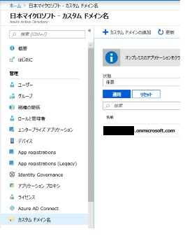

オンプレミス AD 上に登録されているドメインのうち、 Hybrid Azure AD Join を構成するドメイン名を入力し、「ドメインの追加」をクリックします。


ドメインの追加をクリックすると、 DNS サーバーに TXT レコードを登録するように指示されますので、お使いの DNS サーバーに記載されている TXT レコードを追加します。


追加後に、 DNS が浸透するまで待ち、「確認」ボタンをクリックします。
無事浸透が完了し、 Azure AD 側で対象ドメインが認識できるようになると、下記のとおり状態が「確認済み」となります。


## Azure AD Connect の設定

https://www.microsoft.com/en-us/download/details.aspx?id=47594 より Azure AD Connect をダウンロードした後のウィザード実行について画面ショット付きで手順を記載します。

Azure AD Connect を起動し、「構成」をクリックします。


追加のタスクより、「デバイス オプションの構成」を選択し「次へ」をクリックします。


Windows Server 2012 R2 以上であれば、 Hybrid Azure AD Join を構成できます。そのまま「次へ」をクリックします。


Azure AD に接続画面で、 Azure AD の対象テナントの全体管理者の資格情報を入力し、「次へ」をクリックします。


デバイス オプションより、「ハイブリッド Azure AD 参加の構成」を選択し「次へ」をクリックします。

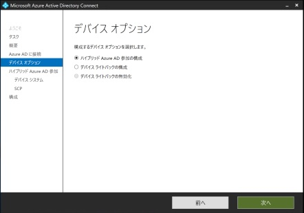

デバイスのオペレーティング システムの画面より、「Windows 10 以降のドメインに参加しているデバイス。」を選択し「次へ」をクリックします。

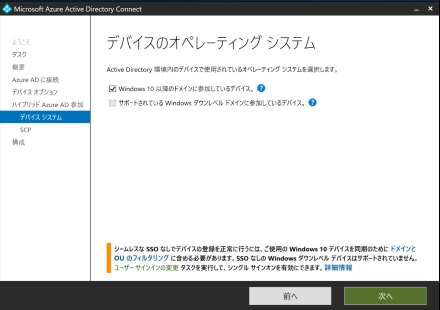

SCP の構成画面にて SCP (サービス接続ポイント) を構成します。
SCP はフォレスト単位ごとで構成する必要があります、今回は対象のオンプレミス AD のフォレストは 1 つしかないので、対象のフォレストにチェックをいれます。


認証サービスに「Azure Active Directory」を選択します。
AD FS を構成している場合はフェデレーション サービス名を指定する必要がありますが、今回は AD FS 環境がない Managed Domain 環境なので、 Azure Active Directory を選択します。


エンタープライズ管理者の横の「追加」ボタンをクリックし、対象フォレストのエンタープライズ管理者の資格情報を入力し、「OK」ボタンをクリックします。

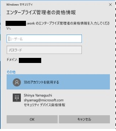

すべての情報が入力されていることを確認し、「次へ」をクリックします。


構成の準備完了の画面で「構成」をクリックし、対象フォレスト向けの SCP を構成します。

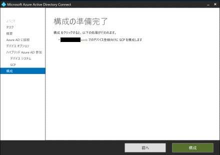

構成が完了しましたの画面にて、「終了」をクリックします。


## SCP とは (SCP の構成の確認)

そもそも SCP (サービス接続ポイント) とは何なんなのでしょうか。
端的にいうと、 SCP はオンプレミス AD に登録している Windows 10 コンピューターなどのデバイスが、 Azure AD のテナントがどこにあるのかを探すために必要な参照先になります。

今回、 構成例として、 「xxx.work」 というフォレストに関する SCP を構成しました。
そして、 Azure AD のテナント名は、「xxx.onmicrosoft.com」というテナント名になります。
オンプレミス AD 上にある xxx.work というフォレスト内にあるデバイスが 、 **どの Azure AD のテナントに** デバイスを登録すればいいのか、分かる必要があります。
逆にいうと、 SCP が正しく構成されていないと、 Azure AD にデバイスを登録することができず、 Hybrid Azure AD Join (正確には Azure AD Join) に失敗してしまいます。

ちなみに SCP の実態は

- `N=62a0ff2e-97b9-4513-943f-0d221bd30080,CN=Device Registration Configuration,CN=Services,[Your Configuration Naming Context]`

という形で格納されています。下記手順で確認が可能です。
ADSI エディターを起動し「接続」をクリックします。

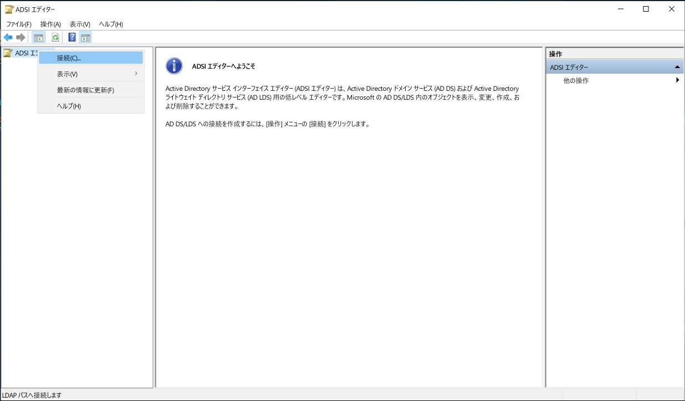

接続ポイントとして、「識別名または名前付けコンテキストを選択または入力する」を選択し、CN=Configuration,DC=fabrikam,DC=com (ドメイン名が fabrikan.com である場合) 左記のように設定し「OK」ボタンをクリックします。


[CN=Services]→[CN=Device Registration Configuration] の中にある「CN=62a0ff2e-97b9-4513-943f-0d221bd30080」が SCP オブジェクトの実態になります。


また、 Azure AD Connect で構成した SCP が正しく構成されているかについては、以下のコマンドレットで確認することができます。

```powershell
$scp = New-Object System.DirectoryServices.DirectoryEntry;
$scp.Path = "LDAP://CN=62a0ff2e-97b9-4513-943f-0d221bd30080,CN=Device Registration Configuration,CN=Services,CN=Configuration,DC=xxx,DC=work";
$scp.Keywords;
```

※ドメイン名は適宜実環境に置き換えて実行してください。

実行結果は下記のとおりとなります。
正しく、デバイス登録先の Azure AD のテナント名となっていることが確認できます。
AzureADId は、 Azure ポータルの「プロパティ」画面で確認できる、「ディレクトリ ID」となります。


## Hybrid Azure AD Join 構成までの流れ

まずは、オンプレミス AD に Windows 10 コンピューターが登録されてから、 Azure AD から PRT (Primary Refresh Token) を取得し、 Azure AD に連携した Office 365 などのアプリケーションにシングル サインオンできるまでの流れを記します。

1. Windows 10 コンピューターを、オンプレミス AD に参加します。

2. オンプレミス AD 上のコンピューター オブジェクトの userCertificate 属性に Windows 10 コンピューターを認証するための証明書が当該コンピューターにより、追加されます。
3. オンプレミス AD 上のコンピューター オブジェクトの userCertificate 属性値に証明書が追加されると、Azure AD Connect がコンピューター オブジェクトを Azure AD に同期します。 (通常は 30 分間隔)
4. 当該コンピューター上のタスク スケジューラにより証明書を使用して、 Azure Active Directory 上にデバイスが登録します。 
 (このタイミングで  dsregcmd /status のコマンドレットをたたくと AzureADJoined の値が YES になります)

5. オンプレミス AD と Azure AD 間で同期しているユーザーで当該の Windows 10 コンピューターにサインインしたとき、Azure AD による認証後、サインインしたユーザーの PRT (Primary Refresh Token) が発行され、Hybrid Azure AD Join として Azure AD (Office 365) にサインインできます。  
(このタイミングで dsregcmd /status のコマンドレットをたたくと AzureADPrt の値が YES になります)

## userCertificate 属性について

userCertificate 属性に証明書が設定されるまでのプロセスは以下のとおりです。

1. まず、自己署名ユーザー証明書を持つコンピューターオブジェクトのみが Azure AD と同期されます。つまり userCertificare 属性に証明書セットされている Windows 10 コンピューターのみが、 Azure AD と同期されます。
2. 動作としては、ユーザー証明書の生成プロセスを管理する、スケジュールされたタスクがあります。タスクが開始されると、プロセスは Azure AD Connect で構成した、 SCP を確認します。
3. デバイスは SCP を検出し、 Hybrid Azure AD Join (正確には Azure AD Join) を試みます。
4. デバイスは、Azure デバイス登録サービス (DRS) を確認して、参加できるかどうかを確認します。
5. 成功した場合、ユーザー証明書が生成され、オンプレミスの AD に userCertificate 属性が設定されます。

userCertificate 属性が設定されているかは、オンプレミス AD で Active Directory ユーザーとコンピューターの MMC スナップインで対象のコンピューター オブジェクトのプロパティを開き、[属性エディター] タブ内の「userCertificate」属性を確認します。

なお、属性エディター タブは、既定のプロパティ画面では表示されないので、「Active Directory ユーザーとコンピューター」より、[表示] → [拡張機能]をクリックし、拡張機能を有効にした状態の後、コンピューターのプロパティ画面を開くことで、確認することが可能となります。

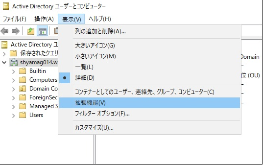

下記は証明書が追加されていない状態。(この状態では Azure AD Connect によるデバイス同期は行われません)


下記は証明書が追加されている状態。(この状態で Azure AD Connect は 30 分間隔でチェックを行い、 Azure AD にデバイスが登録されます)
Start-ADSyncSyncCycle -PolicyType Delta コマンドレットで手動同期することも可能です。


下記は証明書の実態 (一部) です。


 Azure AD Connect の同期ルールを見てみると、 userCertificate 属性が ISNOTNULL (証明書がセットされていることが必須) であることが分かります。
[Synchronization Rules Editor] から Direction を「Outbound」を選択し、[Out to AAD - Device Join SOAInAD]を選択後に「View」をクリックします。


Scoping Filter をクリックすると、 userCertificate が ISNOTNULL であることがわかります。


## Azure AD へのデバイス同期の確認

直接 Azure ポータル (portal.azure.com ) の「デバイス」を参照することで、対象の Windows 10 コンピューターが同期されているか確認できますが、下記手順では、 Azure AD Connect を使い、実際に同期が行われているかどうかについて確認を行います。
Azure AD Connect の「Synchronization Service」にて確認を行います。

「Windows アイコン」→「Synchronization Service」の順に選択すると、「Synchronization Service Manager」が起動します。
Start Time を見ると、19:51 の次に 20:21 に実行されておりますので、 30 分間隔で同期が行われていることが分かります。


20 : 21 の Export の Adds がデバイスが追加されたことを意味しますので、選択後、「Properties」をクリックします。


すると、 userCertificate を含む、 Windows 10 コンピューターの属性が、 Azure AD に同期されていることが確認できます。


このタイミングで、 Windows 10 コンピューター上のコマンド プロンプトで dsregcmd /status のコマンドレットをたたくと下記のとおり、 AzureADJoined の値が 「YES」 になっていることが分かります。

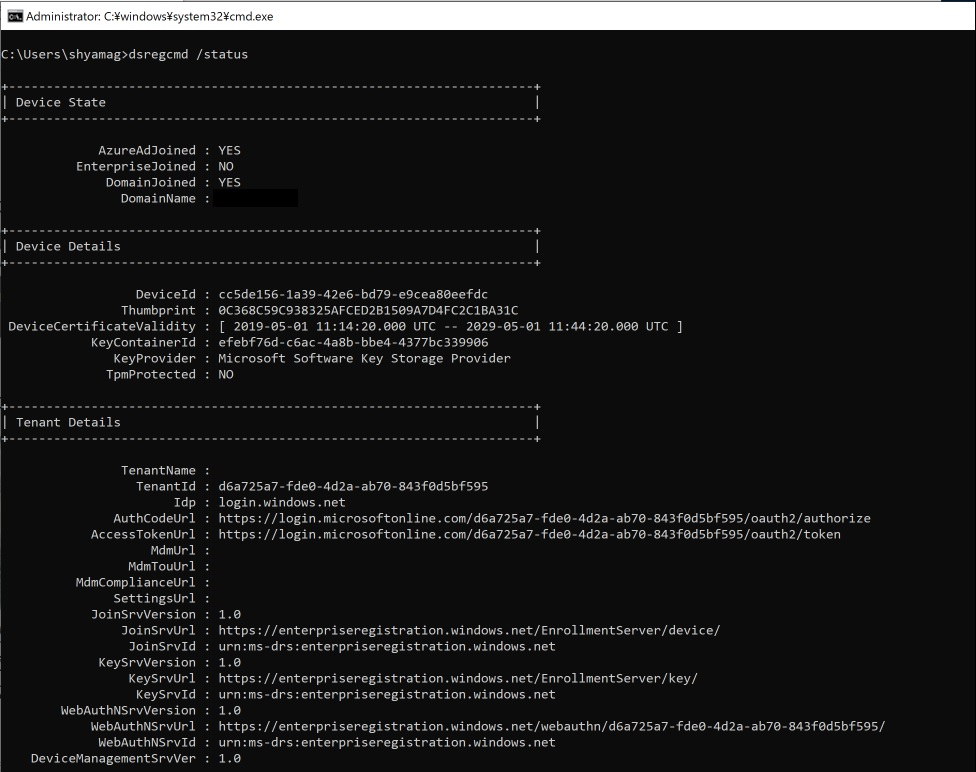

## PRT (Primary Refresh Token) の取得

現在、目次の「1. ～ 6.」までの作業が完了しています。
Azure AD にデバイスは登録されましたが、まだ Hybrid Azure AD Join の構成は完了してません。
最後の工程として、 Azure AD に同期済みの Azure AD ユーザーにて、対象の Windows 10 コンピューターにサインインし認証が成功したあとに、 Azure AD から PRT (Primary Refresh Token) を取得する必要があります。

オンプレミス AD から Azure AD に同期済みの test001 から test003 のユーザーがいますので、対象の Windows 10 コンピューターに test001@xxx.work ユーザーでサインインします。


資格情報を入力し、サインインします。


コマンドプロンプトを起動し、このタイミングで dsregcmd /status のコマンドレットをたたくと AzureADPrt の値が YES になることが確認できます。


## おわりに

Azure AD Connect を使うことで、比較的容易に Hybrid Azure AD Join の構成を行うことができるようになっています。反面、容易に構成できるようになったがために、構成がうまくいかなかった場合に、どこを確認すれば良いかが判断が難しくなっているかと思います。

本 Blog で言及しましたとおり、 以下のポイントをおさえることで、構成が失敗してしまった場合のトラブルシュートをスムースに行えるのではないかと思います。

- SCP の構成が正しく行われているか
- Hybrid Azure AD Join する Windows 10 コンピューターにて、 userCertificate 属性に証明書が追加されているかどうか
- Azure AD Connect により、正常に同期が行われているかどうか
- PRT が正しく取得できているかどうか

少しでも本 Blog が参考になれば幸いです。ご不明な点等ございましたら、是非弊社サポート サービスをご利用ください。

※本情報の内容 (リンク先などを含む) は、作成日時点でのものであり、予告なく変更される場合があります。
