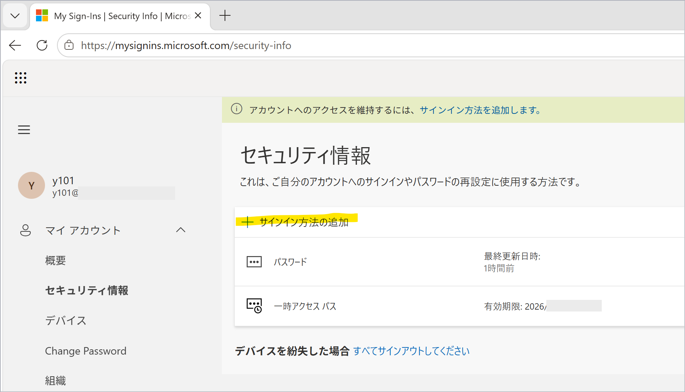
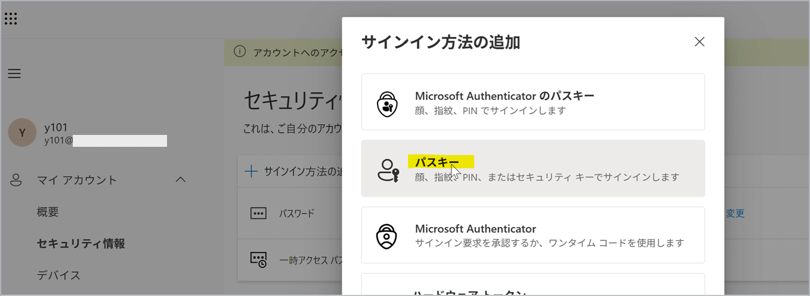
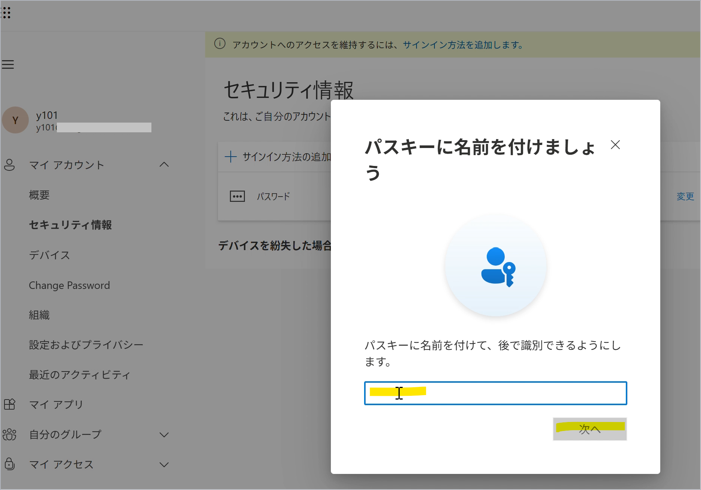
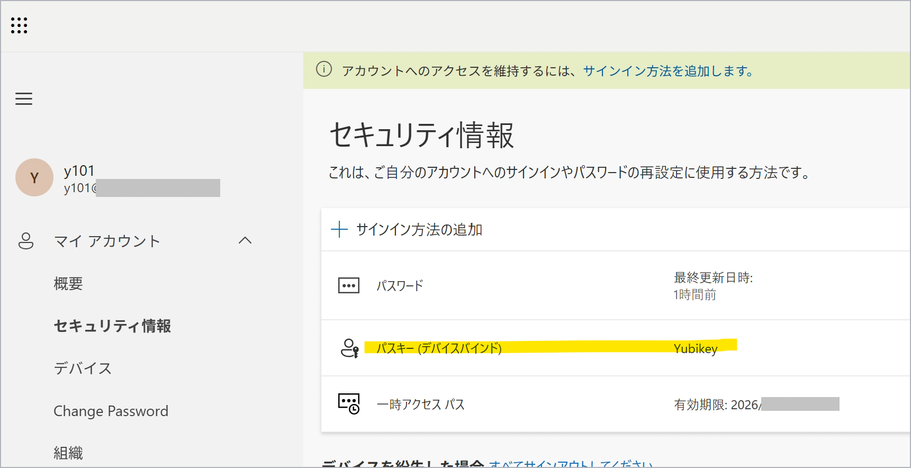

# 認証方法にパスキー (セキュリティ キーを利用) をセットアップする手順

こんにちは、Azure Identity サポート チームの長谷川です。

Microsoft Entra ID の認証方法にパスキーを利用する方が増え始めていると思います。パスキーは従来の電話網を利用した認証方法 (SMS や音声通話) などよりもセキュリティ レベルの高い認証方法になるため、多くのお客様にご利用いただきたい認証方法です。しかしながら、ユーザーにパスキーを展開するにあたり、セットアップ手順に不安があるとの声をいただいています。
このため、この記事では、セキュリティ キーを利用したパスキーをセットアップする手順を紹介します。ステップごとにスクリーン ショットを使ったセットアップ手順になっていますので、パスキー展開にご活用いただければと思います。

## 想定シナリオ
この記事では、MFA に利用できる認証方法が何もセットアップされていないユーザーにおいて、PC でセキュリティ キーを利用したパスキーをセットアップするシナリオを想定して記載いたします(このために一時アクセス パスを利用する手順になっています)。
もし MFA に利用できる認証方法 (たとえば Microsoft Authenticator アプリのプッシュ通知) をすでにセットアップ済みのユーザーの場合は、後述の「1. サインインしてセキュリティ情報ページへアクセス」の手順をスキップして「2. セットアップ手順」から実施してください。
なお、セキュリティ キーのモデルによっては、利用前にそのセキュリティ キー自体を利用するための事前作業 (暗証番号 (PIN) の設定など) が必要な場合があります。必要な事前準備などについてはご利用のセキュリティ キーのベンダーへご確認ください。この記事はセキュリティ キーに事前作業済みの YubiKey 5Ci を利用して作成しています。
なお、本手順内ではブラウザーに Microsoft Edge を利用して作成しています。他のブラウザーを利用した場合は一部ポップアップなどの表示が異なる可能性があります。

## 1. サインインしてセキュリティ情報ページへアクセス
1-1. 管理者にて対象ユーザーに [一時アクセス パスを発行](https://learn.microsoft.com/ja-jp/entra/identity/authentication/howto-authentication-temporary-access-pass) して提供します。

1-2. 対象ユーザーにて PC で https://aka.ms/mysecurityinfo にアクセスし、一時アクセス パスを使用してサインインします。

## 2. セットアップ手順
2-1. セキュリティ キーを PC に接続しておきます。セキュリティ キーのモデルによっては利用前に事前準備が必要な場合があります。必要な事前準備などについてはご利用のセキュリティ キーのベンダーへご確認ください。

2-2. [サインイン方法の追加] を選択します。

2-3. [パスキー] を選択します。

2-4. [次へ] を選択します。

2-5. ブラウザーに Microsoft Edge を利用している場合、以下のように Microsoft パスワード マネージャーにパスキーを保存するかの確認ポップアップが表示される可能性があります。[別の方法で保存する] を選択します。

2-6. [Windows Hello または外部のセキュリティ キー] を選択します。

2-7. 赤枠に表示されている文言を確認します。下図のように [これはセキュリティ キー に保存されます] と表示されている場合は [これはセキュリティ キー に保存されます] をクリックします。

下図のように [これはセキュリティ キー に保存されます] **以外** が表示されている場合は [変更] を選択し、次の画面で [セキュリティ キー] を選択します。

2-8. セキュリティ キーの暗証番号 (PIN) の入力を求められた場合は入力して [OK] を選択します。

2-9. セキュリティ キーへの接触を求められた場合はタッチします。

2-10. 登録したパスキー (セキュリティ キー) をセキュリティ情報のページ上で識別できるように任意の名前を付けて [次へ] を選択します。

2-11. 「パスキーが作成されました」と表示されたら [完了] を選択します。

2-12. セキュリティ情報のページ上でもパスキーが追加されたことを確認できればセットアップ完了です。

## 3. セットアップしたセキュリティ キーのパスキーを利用したサインイン手順 (パスワードレス)

3-1. パスキーをセットアップしたセキュリティ キーを PC に接続しておきます。

3-2. サインインが発生したら Entra アカウントの UPN を入力して [次へ] を選択します。

3-3. パスワードの入力画面が表示された場合はパスワードを入力せずに [代わりに顔、指紋、PIN、またはセキュリティキーを使用する] を選択します。

3-4. パスキーの選択画面が表示されるので [セキュリティ キー] を選択します。

3-5. セキュリティ キーの暗証番号 (PIN) の入力を求められた場合は入力して [OK] を選択します。

3-6. セキュリティ キーへの接触を求められた場合はタッチします。

3-7. サインインが完了します。

## おわりに

以上、認証方法にパスキー (セキュリティ キーを利用) をセットアップする手順を紹介しました。パスキーはフィッシング攻撃に耐性があり、今後 MFA の認証方法の中心となると想定される認証方法です。これまで中心となっていた Microsoft Authenticator アプリのプッシュ通知はスマートフォンを用意する必要があったため、特に BYOD を利用しない組織ではコスト面で負担が大きいものでした。一方でセキュリティ キーはスマートフォンよりもコスト少なく導入できるため、様々な組織で取り入れやすい仕組みと考えられています。本記事を活用して多くの方にパスキーをご利用いただき組織のセキュリティ向上の一役を担えれば嬉しく思います。
製品動作に関する正式な見解や回答については、お客様環境などを十分に把握したうえでサポート部門より提供しますので、ぜひ弊社サポート サービスをご利用ください。