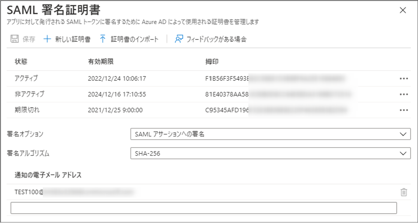
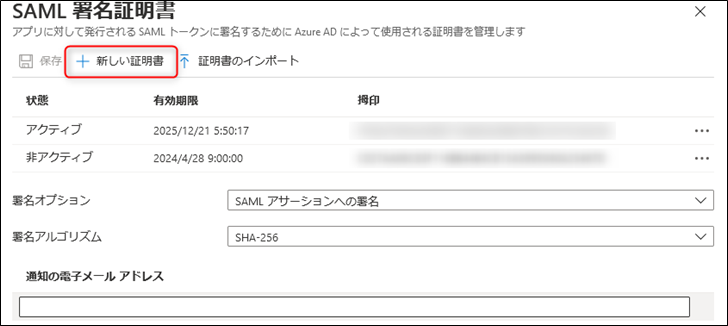
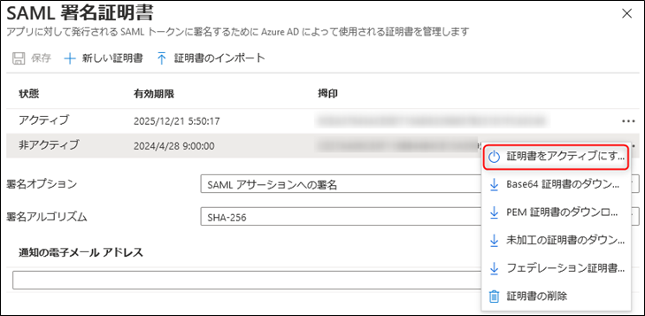
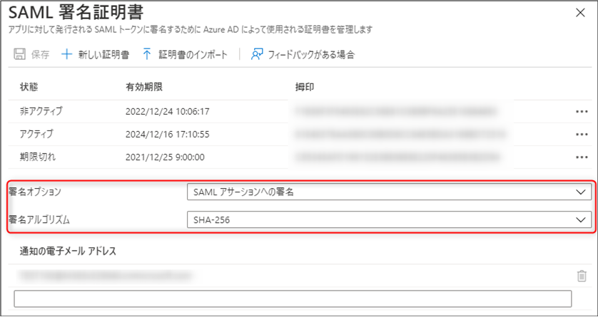
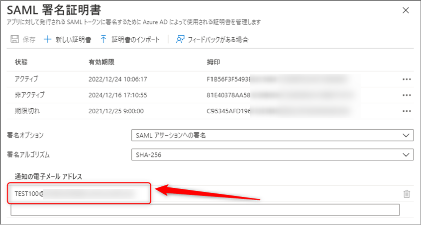
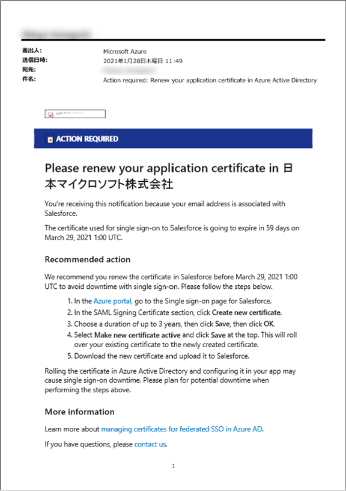

こんにちは！ Azure & Identity サポート チームの三浦 大です。

Azure AD (IDP) とアプリケーション (SP) を、SAML 連携させた (させたい) といったお客様もいらっしゃるかと思います。
今回は、Azure AD (IDP) とアプリケーション (SP) を SAML 連携した際に利用する、SAML 署名証明書についてご紹介いたします。
更新手順についても記載しておりますので、今後 SAML 署名証明書の更新を検討しているお客様もご一読いただければと思います！

# 1. Azure AD における SAML 署名証明書とは
SAML は、アプリケーションとのシングルサインオンを可能とする便利なフレームワークですが、
SAML 連携した際には、SAML 署名証明書を管理いただく必要がでてきます。

Azure AD において、具体的にどういった場面で SAML 署名証明書が利用されるかというと、Azure AD がアプリケーションに対して SAML レスポンスを返す際です。
Azure AD は、SAML レスポンスに SAML 署名証明書を利用して署名をします。
アプリケーションは、受け取った SAML レスポンスを検証し、問題がなければ、信頼している IdP である Azure AD から送られていることが証明され、アプリケーションへのアクセスを許可する動作となります。
以下シーケンスでいうところの、5 から 6 の処理となります。


- [シングル サインオンの SAML プロトコル | Microsoft Docs](https://docs.microsoft.com/ja-jp/azure/active-directory/develop/single-sign-on-saml-protocol)

以上が、SAML 署名証明書が利用されるシナリオの概要となります。  
それでは、実際の SAML 署名証明書を確認してみましょう。  
Azure AD が利用する SAML 署名証明書は、以下の画面で確認することが可能です。

[Azure ポータル] - [Azure Active Directory] - [エンタープライズアプリケーション] - [<ご利用の SAML アプリケーション>] - [シングルサインオン]


右上にある "編集" をクリックすることで、証明書の一覧を確認することもできます。


"状態" が "アクティブ" である SAML 署名証明書が、現在署名に利用されている証明書です。  
また、画像からも確認できるように、有効期限があることがわかります。  
有効期限がきれると、"状態" が "期限切れ" と表示されます。  
有効期限が切れた場合、アプリケーションへアクセスできなくなる可能性がございますので、事前に更新いただく必要がございます。


# 2. SAML 署名証明書を更新する
以下では SAML 署名証明書を更新するための手順をご紹介します。

### (1) Azure AD に新しい証明書を追加します
[Azure ポータル] – [Azure Active Directory] – [エンタープライズ アプリケーション] – [<ご利用の SAML アプリケーション>] – [シングル サインオン] - [SAML 署名証明書] の [編集] をクリックし、[新しい証明書] を選択することで新しい証明書が追加されます。  
ここで追加した証明書のデータはフェデレーション メタデータ XML に追加されます。  
この作業の結果、新しく追加した証明書は、非アクティブとして追加され、いきなり新しい証明書を利用した署名が行われるわけではないため、この 1 の手順によるダウンタイム (利用中のアプリケーションへの影響) はありませんのでご安心ください。



### (2) アプリケーションに新しい SAML 署名証明書をインポートする
具体的にはアプリケーション側の実装となるため、事前にアプリケーションベンダー様へご確認いただく必要がございます。  
例として、アプリケーション側の SAML 署名証明書 を更新する方法は、以下のいずれかが一般的かと存じます。  

(i) Azure AD のフェデレーションメタデータ XML より SAML 署名証明書をインポートする  
(ii) Azure AD より SAML 署名証明書をダウンロードしてインポートする  

ここで注意いただきたいのが、
アプリケーションにSAML 署名証明書をインポートするにあたり、複数の証明書がインポートできるかという点です。  
理由として、SAML 署名証明書を更新する際に、ダウンタイム (利用中のアプリケーションへの影響) が発生するか否かに影響があるためです。  
管理者にとっては、 SAML 署名証明書の更新においても、ダウンタイムが発生しないことが理想だと思います。  
アプリケーション側で複数の SAML 署名証明書をインポート、その情報を反映でき、新旧どちらの SAML 署名証明書で署名されても検証ができるアプリケーションであれば、ダウンタイムは発生しないと考えられます。  
しかし、アプリケーション側で複数の SAML 署名証明書をインポートできない場合は、新しい SAML 署名証明書へ更新するタイミングでダウンタイムが発生することが想定されるため、場合によっては、事前に利用ユーザーへの周知が必要です。  
繰り返しとなりますが、どういった実装になっているか、手順やダウンタイムが発生するかという点については、事前にアプリケーションベンダーへ確認ください。  

### (3) Azure AD 側のアクティブな証明書を更新する
新しい SAML 署名証明書をアプリケーションにインポートできたら、Azure AD が署名に利用する SAML 署名証明書を切り替えます。  
新しい証明書で署名するには、Azure ポータルで新しい証明書を右クリックし、[証明書をアクティブにする] を選択します。  
これにより、新しい証明書がアクティブになり、古い証明書が非アクティブになります。


### (4) SAML 認証ができるかを確認する
アプリケーションに問題なく SAML 認証ができるかをご確認ください。  
問題なく成功する場合は、SAML 署名証明書の更新完了です。  
古い SAML 署名証明書は不要ですので、削除しても問題ありません。  
もしも、SAML 認証に失敗するようになったという場合は、
我々 Microsoft サポート窓口にて問題解決のご支援をしますので、お気兼ねなく、お問い合わせを発行いただけますと幸いです。

# 3. SAML 署名証明書についてよくある質問
### <span style="color: blue; ">Q:</span> SAML 署名証明書の有効期限が切れたけど、認証できるんだけど。。   
<span style="color: red; ">A:</span> アプリケーションに依存して有効期限が切れても認証できる可能性があります。  
現時点での Azure AD の実装として、SAML 署名証明書の有効期限が経過した場合でも、その証明書を利用した署名を行い、 SAML レスポンスを返す動作となります。ご利用のアプリケーション側で、 署名の検証の際に証明書の有効期限をチェックしていない場合などは、引き続きアクセスできます。  
ただし、アプリケーション次第でもありますし、有効期限が経過する前に SAML 署名証明書の更新を実施するよう、ご検討ください。  

### <span style="color: blue; ">Q:</span> SAML リクエストをアプリケーション側で署名しているが、Azure AD で検証用の証明書は管理しているのか？  
<span style="color: red; ">A:</span> 管理していません。  
Azure AD は SAML リクエスト時の署名は検証せずに無視をする動作となります。  
仮にアプリケーション側で証明書の更新が発生しても、Azure AD ではアプリケーション側からの SAML リクエストの署名を検証するための証明書を管理していないため、Azure AD 側での更新は考慮する必要はありません。

- [署名 | Microsoft Docs](https://docs.microsoft.com/ja-jp/azure/active-directory/develop/single-sign-on-saml-protocol#signature)

### <span style="color: blue; ">Q:</span> SAML 署名証明書の期間は？長くできるの？  
<span style="color: red; ">A:</span> Azure AD が発行する SAML 署名証明書は、最大で 3 年の有効期限です。  
3 年以上の有効期限を持った証明書は作成することができず、期限を延長するといったこともできません。  
もしも、3 年以上の有効期限をもった証明書を登録したい場合は、独自に発行した自己署名証明書などを利用ください。  
例えば、以下の手順では 10 年の有効期限の証明書を使用可能です。  

(1) 管理者権限で PowerShell を起動します。  
(2) 以下のコマンドを順に実行します ($dnsName はどのような値でも結構です)。

```powershell
$dnsName="contoso.onmicrosoft.com"
$lifetime=Get-Date
New-SelfSignedCertificate -Subject *.$dnsName -NotAfter $lifetime.AddYears(10) -KeyUsage DigitalSignature, KeyEncipherment -DnsName *.$dnsName, $dnsName
```
(3) 以下のように表示されることを確認します (Thumbprint は環境によって異なる値となります)。  

```powershell
PSParentPath: Microsoft.PowerShell.Security\Certificate::LocalMachine\MY

Thumbprint                                Subject
----------                                -------
832A24298E691642AB05A6056A6EF6C7EF8BC531  CN=*.contoso.onmicrosoft.com
```

(4) 証明書を PFX ファイルとしてエクスポートするために以下のコマンドを実行します。Thumbprint には 3 の結果、password には任意の文字列を指定ください。  
```powershell
$mypwd = ConvertTo-SecureString -String "P@ssw0rd" -Force -AsPlainText
Get-ChildItem -Path cert:\localMachine\my\832A24298E691642AB05A6056A6EF6C7EF8BC531 | Export-PfxCertificate -FilePath C:\mypfx.pfx -Password $mypwd
```
(5) C:\mypfx.pfx としてエクスポートされますので、これを SAML 署名証明書の構成画面よりインポートします。  

### <span style="color: blue; ">Q:</span> "署名オプション" や "署名アルゴリズム" はなにを設定すればいいの？  
<span style="color: red; ">A:</span> アプリケーションの実装に依存するため、アプリケーションベンダーへご確認ください。  
"署名オプション" は、Azure AD が返す SAML レスポンスのどこに署名するかを決める設定となります。  
"署名アルゴリズム" は、署名に用いるアルゴリズムを決める設定となります。  


- [SAML トークンの詳細な証明書署名オプション | Microsoft Docs](https://docs.microsoft.com/ja-jp/azure/active-directory/manage-apps/certificate-signing-options)


### <span style="color: blue; ">Q:</span> SAML 署名証明書がきれる前に通知できますか？  
<span style="color: red; ">A:</span> 可能です。
SAML 証明書の有効期限が切れる 60 日前、30 日前、7 日前に、登録したメールアドレスへ、通知メールが送信されます。  
メールアドレスは複数登録することも可能です。
メールアドレスの登録は以下の画面で実施できます。  

[Azure ポータル] - [Azure Active Directory] - [エンタープライズ アプリケーション] - [<ご利用の SAML アプリケーション>] - [シングルサインオン] - [SAML 署名証明書 の “編集” をクリック]  
該当のメールアドレスを登録して “保存” をクリック  


送信されるメールのサンプルはこちらになります。  


- [証明書の有効期限のメール通知アドレスの追加 | Microsoft Docs](https://docs.microsoft.com/ja-jp/azure/active-directory/manage-apps/manage-certificates-for-federated-single-sign-on#add-email-notification-addresses-for-certificate-expiration)

