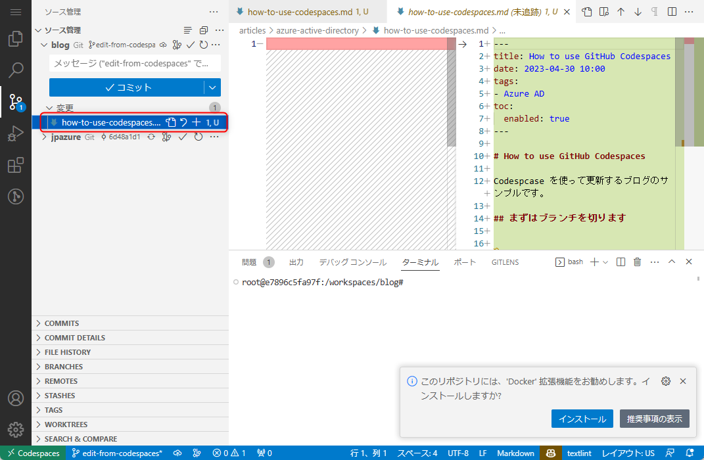

# How to use GitHub Codespaces

Codespcase を使って更新するブログのサンプルです。

## まずはブランチを切ります

....

## プレビューします

プレビュー

## コミットします

コミットします。

## プレビューの確認

デバッグツールを選択し "run local server" を選択します。するとブログのビルドが実行され、右下にブラウザーで開くボタンが表示されます。
