# Graph Explorer の使用法

こんにちは、 Azure Identity サポート チームの三輪です。


Entra ID テナントやユーザーなどのオブジェクトを管理する方法には、各管理センター (Microsoft Entra 管理センターなど) の画面上で操作する以外にも、Microsoft Graph API を使う方法があります。
Microsoft Graph API は PowerShell コマンドとして呼び出せる Microsoft Graph PowerShell SDK も提供しております。  
API やコマンドは、一括処理のためのスクリプトなどで活用するシナリオが一般的ですが、Microsoft Graph API を手軽に実行できるツールとして、Graph Explorer というツールがあります。  
本記事では、Graph Explorer を初めて使用される方向けに使用方法について順を追ってご紹介します。

## [GET] リクエストの実行
まずは、[GET] リクエストを行う例をご紹介します。GET リクエストは、テナントやユーザーの情報を「取得」するために利用します。

題材として『contoso.com がどのテナントに紐づいているか』を確認する以下の Graph API を使用します。
```
https://graph.microsoft.com/v1.0/tenantRelationships/findTenantInformationByDomainName(domainName='contoso.com')
```

特定のドメインが紐づいているテナントを確認する Graph API の公開情報は以下が該当します。  
  [tenantRelationship: findTenantInformationByDomainName - Microsoft Graph v1.0 | Microsoft Learn](https://learn.microsoft.com/ja-jp/graph/api/tenantrelationship-findtenantinformationbydomainname?view=graph-rest-1.0&tabs=http)


### 操作手順例
1\. Graph Explorer ( https://developer.microsoft.com/en-us/graph/graph-explorer ) を開きます。  
2\. 右上の人型アイコンをクリックし、サインインします。
自身で管理者の同意が必要なアクセス許可に同意する必要がある場合には、管理者（グローバル管理者、クラウドアプリケーション管理者、特権ロール管理者 等）のロール権限のあるユーザーにてサインインします。  
（※予めアクセス許可を付与しておきたい場合にはこちら([Microsoft Graph PowerShell アクセス許可の付与 | Japan Azure Identity Support Blog](https://jpazureid.github.io/blog/azure-active-directory/microsoft-graph-powershell-grant-permissions/))の記事をご参照ください）
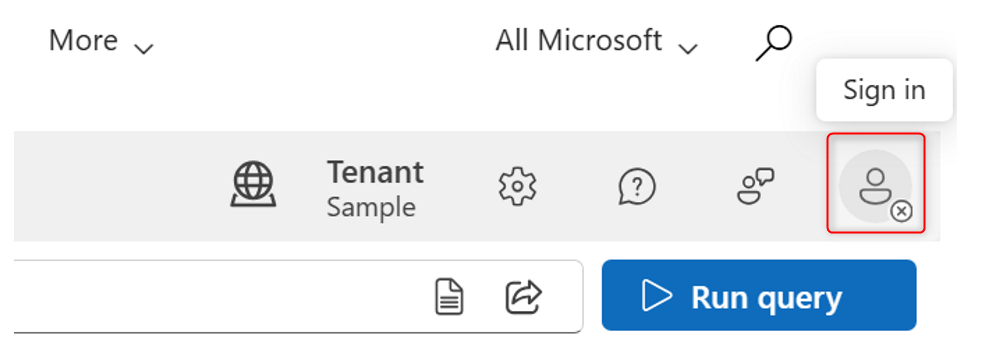  
※サインイン時に [要求されているアクセス許可] のポップアップが表示された場合には承諾をクリックします。  
※[組織の代理として同意する] はオフのままで問題ございません。  
アイコンとテナント名が自身のものに変更されたことを確認します。


3\. 以下のクエリを入力し、[Run query] をクリックします。
```
https://graph.microsoft.com/v1.0/tenantRelationships/findTenantInformationByDomainName(domainName='contoso.com')  
```
※ contoso.com を検索する際のクエリです。
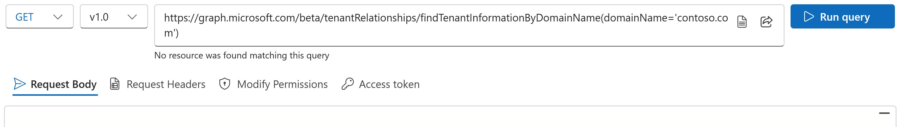
 
4\. 以下のエラーは、必要な権限が足りていない場合に表示されるエラーです。  
クエリの実行に必要なロール権限を持つユーザーで操作を実行してこのエラーとなる場合には、必要なアクセス許可が不足していることが疑われますので、5-1. 以降の対応をします。  
エラーが発生しなかった場合は 7. を参照します。
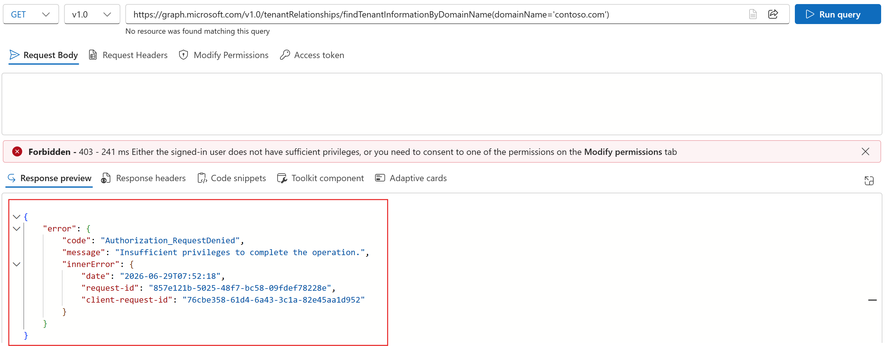


5-1. [Modify Permissions] をクリックし、必要なアクセス許可の候補が表示された場合には、必要なアクセス許可（今回の場合は、必要なアクセス許可は CrossTenantInformation.ReadBasic.All）の [Consent] をクリックしてアクセス許可を承諾します。  
※『 要求されているアクセス許可 』のポップアップが表示された場合には承諾をクリックします。  
※『組織の代理として同意する』のチェックボックスがある場合、こちらにチェックを入れる必要はありません。

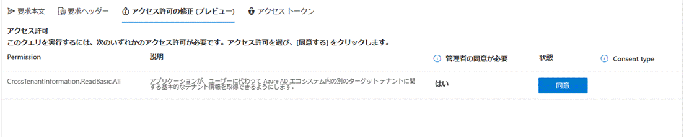


5-2. [Modify Permissions] にて必要なアクセス許可が表示されなかった場合で、 [Open the permissions panel] のリンクが表示されている場合には、このリンクをクリックします。
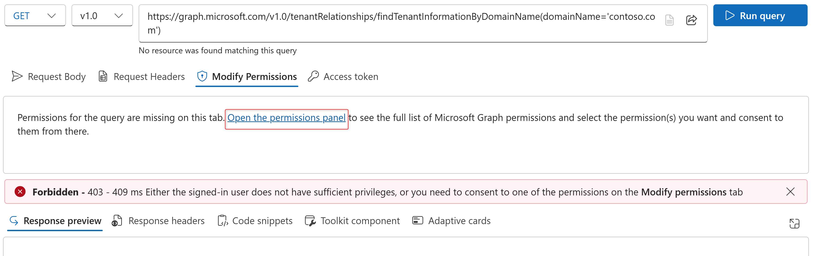
 
その他、(ユーザー アイコンのクリック) > [Consent to permissions] からも Permissions panel を開くことができます。
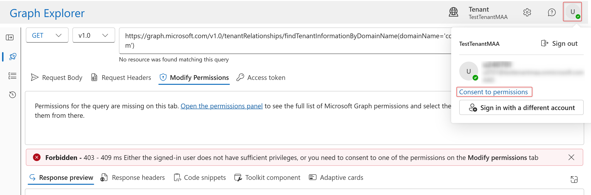

必要なアクセス許可（今回は CrossTenantInformation.ReadBasic.All ）を検索し、[Consent] をクリックしてアクセス許可を承諾します。  
※『 要求されているアクセス許可 』のポップアップが表示された場合には承諾をクリックします。  
※『組織の代理として同意する』のチェックボックスがある場合、こちらにチェックを入れる必要はありません。

 
6\. 再度 [ Run query ] をクリックします。
	 
7\. 表示された結果から確認可能です。  
本例では、contoso.com が contoso18839.onmicrosoft.com というイニシャル ドメインを保有するテナント上にカスタムドメインとして登録済みであることが確認できます。
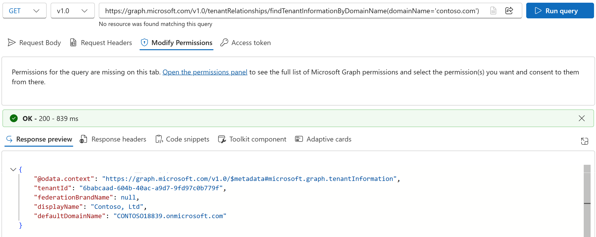


## [PATCH] リクエストの実行
次に [PATCH] リクエストを行う例をご紹介します。PATCH リクエストは、テナントやユーザーの情報を部分的に「更新」するために利用します。

題材として『特定のユーザーの携帯電話と拡張属性を更新する』こととします。  
ユーザー情報の更新についての公開情報は以下が該当いたします。  
[ユーザーを更新する - Microsoft Graph v1.0 | Microsoft Learn](https://learn.microsoft.com/ja-jp/graph/api/user-update?view=graph-rest-1.0&tabs=http#example-3-update-the-passwordprofile-of-a-user-and-reset-their-password)  

※ユーザーの携帯電話の更新は機密性の高いアクションにあたり、対象ユーザーがロール権限を持つ場合や Microsoft Entra ロール割り当て可能なグループのメンバーまたは所有者である場合には、操作者により強いロール権限が必要となります。詳しくは以下公開情報をご参照ください。  
[Microsoft Graph でのユーザーの操作 - Microsoft Graph v1.0 | Microsoft Learn](https://learn.microsoft.com/ja-jp/graph/api/resources/users?view=graph-rest-1.0#sensitive-actions)

### 操作手順例
1\. Graph Explorer ( https://developer.microsoft.com/en-us/graph/graph-explorer ) を開きます。  
2\. 右上の人型アイコンをクリックし、サインインします。  
グローバル管理者などの対象ユーザーのユーザー情報を更新する権限のある管理者かつ、必要なアクセス許可のある（もしくは自身でアクセス許可に同意できる管理者）ユーザーでサインインします。  
（※予めアクセス許可を付与しておきたい場合にはこちら([Microsoft Graph PowerShell アクセス許可の付与 | Japan Azure Identity Support Blog](https://jpazureid.github.io/blog/azure-active-directory/microsoft-graph-powershell-grant-permissions/))の記事をご参照ください）
  
※サインイン時に [要求されているアクセス許可] のポップアップが表示された場合には承諾をクリックします。  
※[組織の代理として同意する] はオフのままで問題ございません。
アイコンとテナント名が自身のものに変更されたことを確認します。


3\. 以下のクエリを入力します。
```
https://graph.microsoft.com/v1.0/users/<対象ユーザーのオブジェクト ID または UPN>
```

4\. プルダウンから PATCH を選択します。
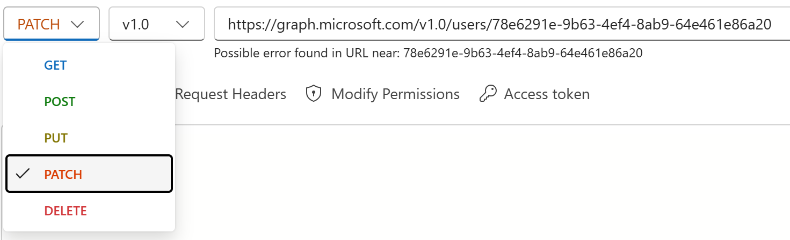

5\. Request Body に更新したい内容を JSON 形式で記載します。
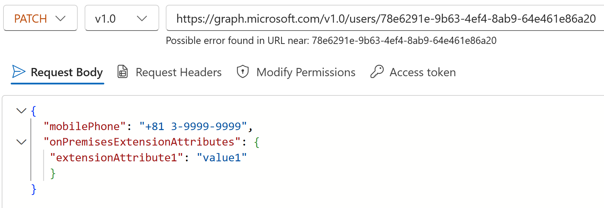

例: 
```
{
  "mobilePhone": "+81 3-9999-9999",
  "onPremisesExtensionAttributes": {
   "extensionAttribute1": "value1"
   }
}
```

6\. Request Headers に Key として Content-Type 、Value として application/json を入力し、[Add] します。
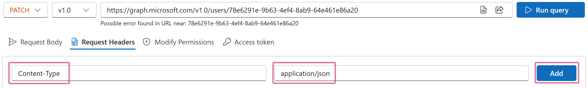

7\. [Run query] をクリックします。
8\. 対象ユーザーの属性を変更する Microsoft Entra ロール権限を持つユーザーで操作しているにも関わらず、403 の権限が足りないことを示すエラーとなる場合には、アクセス許可が不足していることが疑われます。
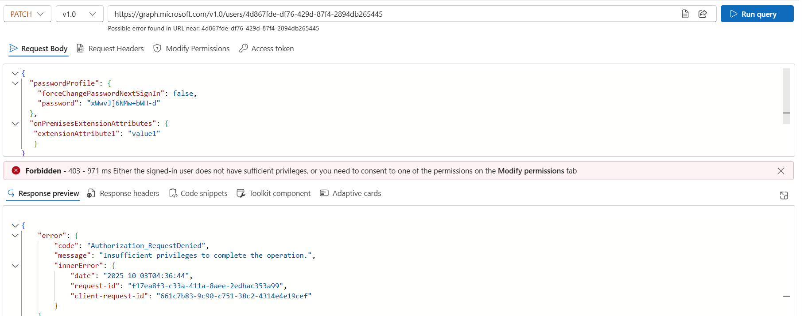


9-1. [Modify Permissions] をクリックし、必要なアクセス許可の候補が表示された場合には、必要なアクセス許可（今回の場合は、必要なアクセス許可は User.ReadWrite.All ）の [Consent] をクリックしてアクセス許可を承諾します。  
 ※『 要求されているアクセス許可 』のポップアップが表示された場合には承諾をクリックします。  
 ※『組織の代理として同意する』のチェックボックスがある場合、こちらにチェックを入れる必要はありません。
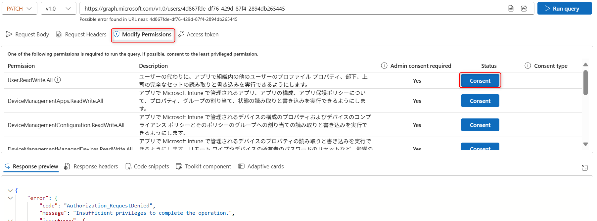

9-2. アクセス許可の承諾については、(ユーザー アイコンのクリック) > [Consent to permissions] から Permissions panel を開き、必要なアクセス許可を検索して付与しても構いません。    
ユーザーの mobilePhone だけ更新する場合には User-Phone.ReadWrite.All が最小のアクセス許可となりますので、以下では、User-Phone.ReadWrite.All を例に操作した画面をご紹介します。  
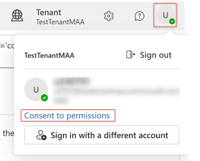   
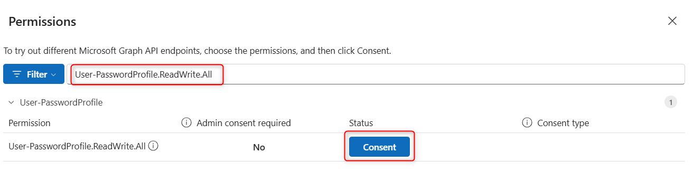  

10\. 再び [Run query] を実行し、クエリの実行に成功するかを確認します。  
クエリの実行に成功した例:
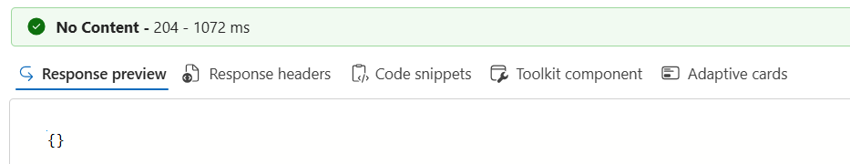  


## 実行するクエリとアクセス許可について 
どのようなクエリを実行すればよいか、どのようなアクセス許可が必要かについては、まずは対象とするオブジェクトおよび操作の Graph API の公開情報を確認します。
Graph API の公開情報の例: [ユーザーを取得する - Microsoft Graph v1.0 | Microsoft Learn](https://learn.microsoft.com/ja-jp/graph/api/user-get?view=graph-rest-1.0&tabs=http)
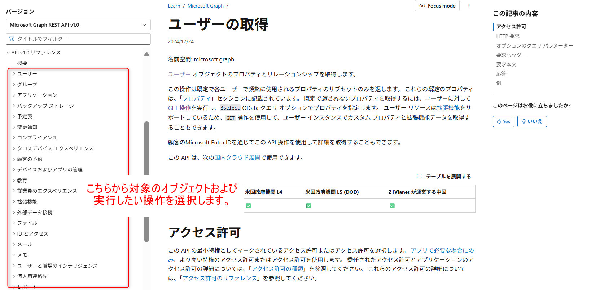  

必要なアクセス許可は例えば以下のような形で記述があります。
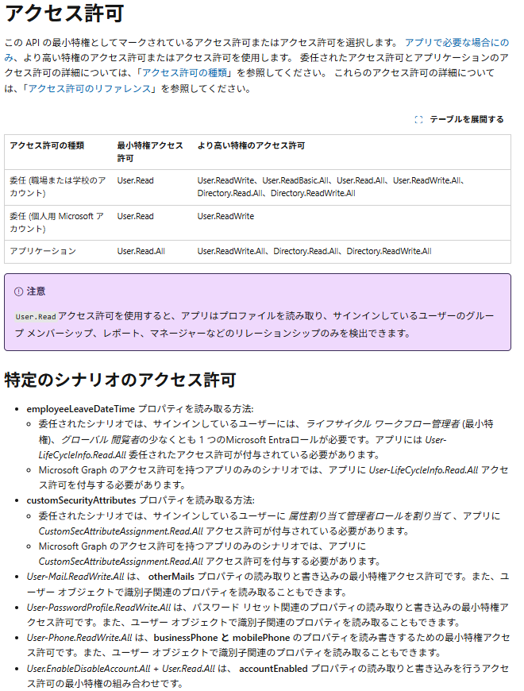  


クエリの記述例は以下のような形で例示してあります。  
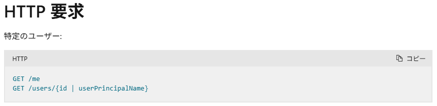  
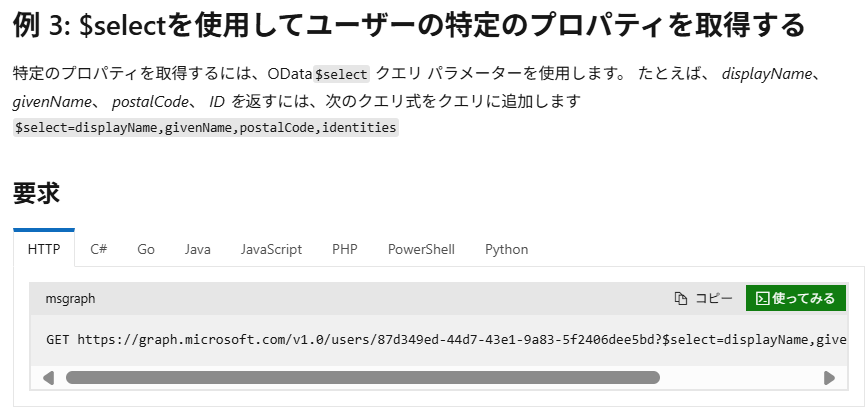  


その他、具体的なクエリ パラメーターの使用方法・フィルターの使い方等については、以下公開情報を参考にしてください。  
[クエリ パラメーターを使用して Microsoft Graph 応答をカスタマイズする - Microsoft Graph | Microsoft Learn](https://learn.microsoft.com/ja-jp/graph/query-parameters?tabs=http)  
[$filter クエリ パラメーターを使用してオブジェクトのコレクションをフィルター処理する - Microsoft Graph | Microsoft Learn](https://learn.microsoft.com/ja-jp/graph/filter-query-parameter?tabs=http)  
[Microsoft Graph API でクエリ パラメーター$search使用する - Microsoft Graph | Microsoft Learn](https://learn.microsoft.com/ja-jp/graph/search-query-parameter?tabs=http)  
[Microsoft Entra ID オブジェクトの高度なクエリ機能 - Microsoft Graph | Microsoft Learn](https://learn.microsoft.com/ja-jp/graph/aad-advanced-queries?tabs=http)


## 自身が外部ゲストとして登録されているテナントにサインインする方法
自身が外部ゲストとして登録されているテナントにサインインする必要がある場合には Graph Explorer を開く際に以下のようにテナントのドメインもしくはテナント ID を指定します。
```
https://developer.microsoft.com/en-us/graph/graph-explorer?tenant=<サインインしたいテナントのテナント ID もしくは ドメイン名>
```

```
例: https://developer.microsoft.com/en-us/graph/graph-explorer?tenant=contoso.com
```

ユーザー アイコンをクリックして、ゲスト ユーザーにてサインインします。
サインインしたいテナントと異なるテナントが表示されている場合、サインインしなおして、以下のようにサインインしたいテナントが表示されることを確認します。
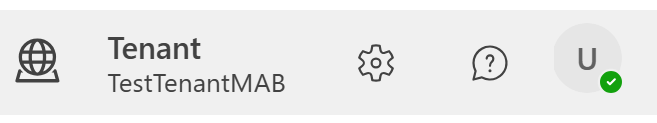  

