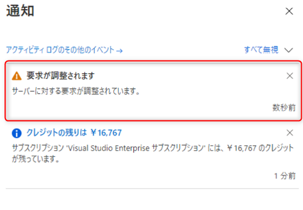
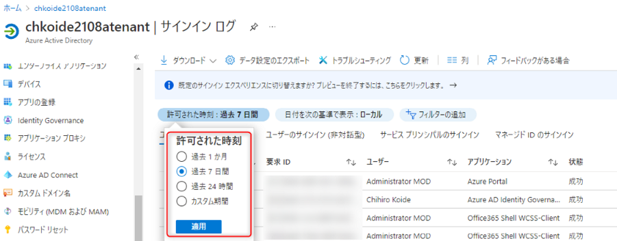

こんにちは、 Azure ID チームの小出です。  
今回は、サインイン ログや監査ログを大量にダウンロードしようとした際に発生する、 "要求が調整されます" というエラー メッセージの原因と対策についてご案内します。

## 事象について
Azure AD のサインイン ログや監査ログをダウンロードしようとした際に、しばらくの間ダウンロード中の画面が表示された後、エラーになってしまう事象です。  
同時に、下記のように "要求が調整されます" や "サーバーに対する要求が調整されています。" とのメッセージが表示されます。  

## なぜメッセージが表示されてしまうのか
発生しているエラーは、一般的には多くの Graph API リクエストを送付したことによって発生するエラーです。  

サインイン ログや監査ログは、 Graph API を使用してログを収集します。  
Graph API には大量の要求が行われた際、要求調整のため、しばらくの間リクエストを待つようリクエスト元に返す “スロットリング” という機能が用意されています。  
Azure は、多くの企業様がご利用いただくパブリック クラウドです。 1 つのテナントで発生した大量の要求により、ほかのテナントの動作に影響が出ないよう、大量の要求には制限がかかるような動作となっています。  
 
"要求が調整されています" のメッセージが表示される場合、このスロットリングの影響でダウンロードに失敗していることが推測されます。  
スロットリングはリクエスト数が増えることで発生するため、たとえば 1 ヶ月などの長い期間でログを取得しようとした場合、ログの数が多くスロットリングに抵触する可能性があります。  

## どのように対処すればよいか（暫定策）
Azure ポータルからのダウンロードの要求とスロットリングの関連性を示した具体的なしきい値は公開されておりませんが、基本的にはダウンロード対象となるログの対象日時を小さくする、その他の要素でフィルターを行うなどの対応を実施する必要があります。

たとえば 1.2 週間ずつログをダウンロードするなど、ダウンロードの対象期間を短く設定したうえでのダウンロードをまずはご検討ください。  
フィルターは、 Azure ポータルからログをダウンロードする前に、サインイン ログの画面から設定いただけます。  
たとえば、下記の [許可された時刻] のフィルターをご利用いただくと、時間に基づいたフィルター設定を行うことが可能です。  

なお、 お客様のご利用状況によっては、24 時間以内のログのみをダウンロードしてもエラーになってしまう場合があります。  
この場合は、ユーザーやアプリケーションをはじめとするその他のフィルターを活用いただき、一度にダウンロードするログの件数を減らしたうえでダウンロードを実施ください。

## どのように対処すればよいか（恒久策）
定期的にログを収集されたい場合には、 Log Analytics や Azure Storage にサインイン ログを転送する手法もございます。  
この方法であれば Graph API は用いていないため、スロットリングに抵触することなくログを収集できます。  
Azure AD のサインイン・監査ログの保存期限（最大 30 日）を超えてログをお客様の環境に保管できるメリットもあります。  
加えて、Log Analytics に転送した場合は、 Log Analytics のクエリを使って、特定のログを絞り込むなどの操作も可能です。  

別途サブスクリプションの用意などが必要とはなりますため、コスト面などの調整が必要なものと存じておりますが、下記公開情報に記載の方法も併せてご検討ください。  
[ストレージ アカウントへのアーカイブ方法](https://docs.microsoft.com/ja-jp/azure/active-directory/reports-monitoring/quickstart-azure-monitor-route-logs-to-storage-account)  
[Log Analytics と Azure AD ログの連携方法](https://docs.microsoft.com/ja-jp/azure/active-directory/reports-monitoring/howto-integrate-activity-logs-with-log-analytics)  

