こんにちは、 Azure ID チームの小出です。  
今回は、 Microsoft Entra ID Protection の通知機能のうち、 User at risk detected のメールを受け取ったときの対応についてご案内します。  

## はじめに
Entra ID Premium P2 ライセンスをご利用いただいている多くの企業では、不審なサインインやリスクを監視するために Identity Protection を活用していることと思います。  
Identity Protection を活用する中で、以下のメールを受信したことがある方も多いのではないでしょうか。  

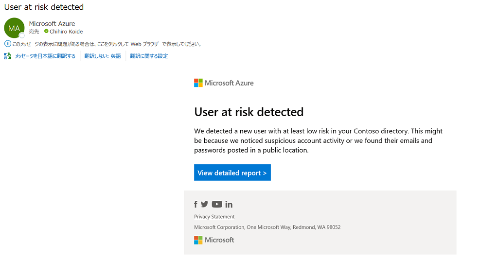

日々お問い合わせいただくなかでも、上記のメールを受け取ったものの、どういった理由でメールが送られたのか知りたい、どのように対応していいかわからない、といったお問い合わせを多く頂戴していますので、今回は以下 3 点についてご紹介します。  

<!-- more -->

## 目次

A. User at risk detected のメールはなぜ届くのか  
B. メールが届いたら、どのように対応したらよいか  
C. 補足情報  

## A. User at risk detected のメールはなぜ届くのか

User at risk detected という件名のメールは、Identity Protection 機能がユーザーのリスクを検出した旨を通知しています。  
Identity Protection では、機械学習機能を用いて、テナント上に存在するユーザーに関するオンライン リスク (サインイン時のリスク)、オフライン リスク (非サインイン時に計算処理によって検出されるリスク) を検出することが可能です。  
これらのリスク検出の結果、リスク レベル (低・中・高) が、事前に設定した通知の閾値 (たとえば高を通知) に達した際に、メールが送信されます。  

実際に、メールのリンクから Identity Protection の画面にアクセスして確認してみると、たとえば以下のように、何人かのユーザーが "危険なユーザー" として検知されていることが分かります。  
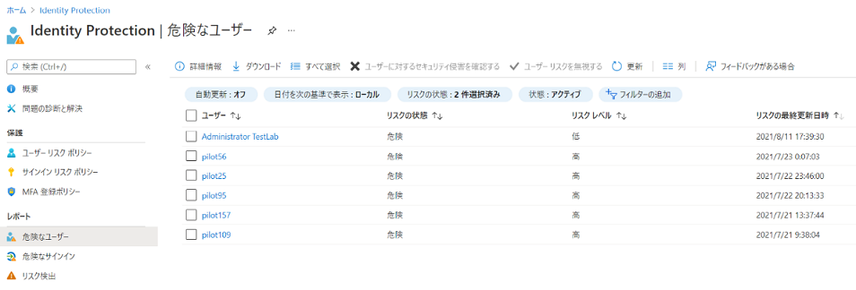

リスクの詳細は、 Identity Protection の "リスク検出" 画面にて確認いただくことも可能です。  
以下のように [IP アドレス] の列を確認いただくことで、アクセス元のグローバル IP アドレスを確認いただくこともできます。  
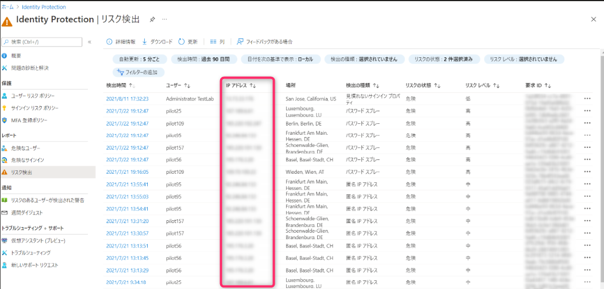

## B. メールが届いたら、どのように対応したらよいか  
Microsoft では、ユーザーのリスクがしきい値以上になった場合に、ユーザー リスク ポリシーなどを活用して、自動的にリスクを修復することを推奨しています。
推奨されている方法は、ユーザー リスク ポリシーのしきい値を [高] に設定し、サインイン リスク ポリシーを [中以上] に設定して、自己修復オプションを許可することです。
詳細は [こちらの公開情報](https://learn.microsoft.com/ja-jp/entra/id-protection/howto-identity-protection-configure-risk-policies#microsofts-recommendation) も併せてご覧ください。

> - ユーザー リスクのポリシー
>    - ユーザーのリスク レベルが高のときは、セキュリティで保護されたパスワード変更を要求します。 ユーザーがパスワード ライトバックで新しいパスワードを作成してリスクを修復できるためには、その前に Microsoft Entra 多要素認証が必要です。
>    - リスク レベルに関係なく、ユーザー リスクを自己修復する唯一の方法は、セルフサービス パスワード リセットを使用したセキュリティで保護されたパスワード変更です。

> - サインインのリスク ポリシー
>    - サインイン リスク レベルが中または高のときは Microsoft Entra 多要素認証を要求し、ユーザーが登録済みの認証方法のいずれかを使って証明し、サインイン リスクを修復できるようにします。
>    - リスク レベルに関係なく、サインイン リスクを自己修復する唯一の方法は、多要素認証の成功させることです。

そのため、ユーザー リスク ポリシーやサインイン リスク ポリシーをすでに利用されている場合は、本フローを実施する必要は通常ございません。  
しかしながら、リスク ポリシーをまだ利用されていない環境や、長期にわたりリスクが修復されていないユーザーがいる環境などでは、管理者がリスクを修復・無視することで対処を行うことが可能です。  

以下はユーザーのリスクが高として検出され、管理者に User at risk detected メールが送付された時の管理者の対応フローです。こちらを参考に、管理者は検知されたリスクへの対処を速やかに実施ください。
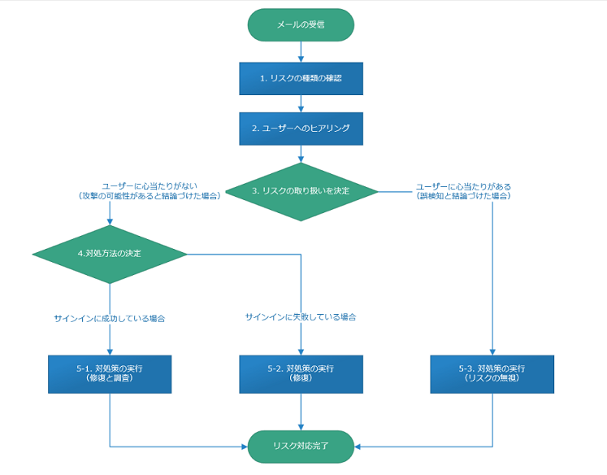  

それぞれのフローについて下記で詳細に説明します。  

> [!TIP]  
> 下記フローでは、Microsoft Entra ID Protection でリスクを検出した際の一般的な対処方法について記載しています。
> すでに被害が発生しているなど緊急の場合は、このフローを 1 から順に実施する必要はありません。
> 被害の拡大を防ぐために、まずは本フローの 5-1 を確認し、パスワードのリセットやアカウントのブロックなどを実施してください。（その後ヒアリングや調査を行います。）

### 1．リスク種類の確認  

まず、発生したリスクがどのような理由で発生したかを確認します。
[検出の種類] という項目を確認すると、そのリスクがなぜ発生したのか、理由を確認することができます。
リスクの種類につきましては、以下の公開情報も併せてご確認ください。
https://docs.microsoft.com/ja-jp/azure/active-directory/identity-protection/concept-identity-protection-risks#risk-types-and-detection

リスクがあると判断される理由は複数ありますが、一般的によくあるものとしては、たとえば実行するクライアントの IP アドレスが普段と違う、匿名 IP アドレスからアクセスしている、いつもと違う国からアクセスしている、といったリスクが考えられます。  
一方、パスワード スプレーなど、実際に攻撃が行われている可能性がある重大なリスクも存在します。  
もし実際に攻撃が行われ、すでに被害が出ている場合など緊急の場合は、まずステップ 5-1 でパスワードのリセットやアカウントのブロックを実施してください。

### 2. 該当ユーザーへのヒアリング
ステップ 1 でリスクの種類について確認したら、リスクが発生したユーザーにヒアリングを行います。  
このヒアリングは、発生したリスクが悪意ある攻撃者を検知したのか、正規ユーザーの正しい操作を誤検知したのかを確認するフローです。  
具体的には、以下のような項目をユーザーにヒアリングいただければと思います。  

- 「リスク検出日時に実際のサインインを行ったか」
- 「リスク検出日時に出張などで大幅な移動を行っていないか」
- 「リスク検出日時に端末周辺環境 (デバイス交換、ネットワーク機器) に大きな変化 (グローバル IP アドレスが変わるなど) はなかったか 」
- 「リスク検出日時に海外にホストされた VM 上などから該当ユーザーでの操作を行っていないか」
- 「リスク検出日時に端末上で特殊なアプリケーションを起動したうえで Azure にアクセスをしていないか」
- 「リスク検出日時に普段の業務と異なるオペレーションはあったか」

たとえば、出張などでいつもと異なる場所、国からアクセスしていたり、クライアント端末を変更したりしている事実が確認できれば、このリスクは侵害ではなく、誤検知であることを確認できます。

### 3. リスクの取り扱いを決定  
リスクを無視するかどうか、取り扱いを決定します。
たとえば上記のヒアリングにて、発生したリスクが問題ないもの (誤検知) であると確認できたら、発生したリスクを手動でクローズし、無視しても問題ないと判断することができます。(この場合は 5-3 へ)

それ以外の場合は、実際にサインインに成功しているか失敗しているかをもとに、どのような対処方法を行うか検討します。
具体的な対処方法の詳細は、次のステップで決定します。 (この場合は 4 へ)

### 4. 具体的な対処方法の決定  
ユーザーにリスクの心当たりがなく攻撃の可能性がある場合、まずは、怪しいサインインの試行が成功しているか、失敗しているかを確認し、それをもとに対処方法を決定します。
サインインに成功している場合は、すでにアカウントが侵害されている可能性が考えられるため、緊急度を上げてリスクへの対応を行います。（この場合は 5-1 へ）

サインイン試行に失敗している場合は、実際にアカウントが侵害されている状況ではないため、順次対応を検討します。（この場合は 5-2 へ）

### 5. リスクのクロージング
このステップでは、これまでに検討・決定した内容をもとに、リスクへの対応を行います。各シナリオごとに、それぞれ手順を以下に記載します。  

**5-1 サインインに成功しており攻撃が疑われる場合、すでに被害が出ている場合**

このシナリオの場合、アカウントがすでに侵害されている可能性があるため、まずは被害が広がらないよう緊急度を高めて対応します。  

まずは、Identity Protection 上で、ユーザーに対するセキュリティ侵害が発生したことをマークします。  
同時に、管理者側から、まずは暫定策としてそのユーザーのパスワードをリセットします。  

攻撃者がアカウントを侵害して、たとえばすでに迷惑メールやなりすましのメールを送っているなどの被害がある場合、パスワードをリセットすることで、被害がそれ以上拡大することを防ぐ効果があります。  
ユーザーのパスワード リセットは、侵害されているアカウントのロール保有状況にもよるものの、一般的にはグローバル管理者だけでなく、ユーザー管理者やパスワード管理者でも実行できるため、まずはできるだけ早くパスワードのリセット行い、現在のパスワードでサインインできない状態にします。  
管理者がパスワードをリセットすると一時的なパスワードが生成されるため、十分な強度を持った新しいパスワードに変更するようユーザーに依頼してください。  
また、MFA などの登録も依頼し、パスワードが漏洩したのみではサインインできないように構成することも検討します。  

**▼ 発生したリスクが侵害であることを確認する手順**

1. Azure ポータルにサインインします。
2. [Microsoft Entra ID Protection] （[Microsoft Enra ID 保護]）を選択します。
3. [危険なユーザー] を選択します。
4. 該当するユーザーを選択し、 [ユーザーに対するセキュリティ侵害を確認する] を選択します。

    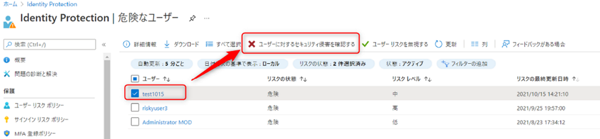  

5. 以下のように警告画面が表示されるので、 [はい] をクリックします。  
    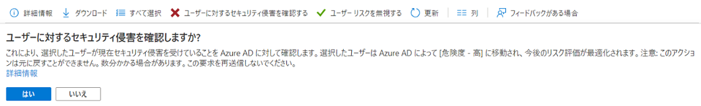  

6. 以下のように、正常に処理が完了することを確認します。  
      

7. リスクの状態に [セキュリティ侵害を確認しました] と表示され、リスク レベルが "高" になることを確認します。
      

> [!TIP]  
> リスクレベルが中だった場合は、このように明示的にセキュリティ侵害を確認した旨をマークすることで、リスクレベルを最上位の高に変更することが可能です。  
> リスクレベルが高だった場合もマークを行うことで監査ログに対処記録が残りますので、この意味でも本オペレーションは必ず実施します。  

**▼ 管理者がユーザーのパスワードをリセットする手順**

1. Azure ポータルにサインインします。
2. [Microsoft Entra ID Protection]] - [危険なユーザー] にアクセスし、リスクをクローズしたいユーザーを確認します。  
  

3. Microsoft Entra ID] – [ユーザー] をクリックし、ユーザー一覧を開きます。  
4. リスクを解消させたいユーザーを選択します。  
5. 画面上部の [パスワードのリセット] をクリックします。  
  

6. 以下のように表示されるので、 [パスワードのリセット] をクリックします。  
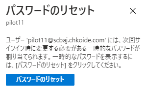  

7. 一時パスワードが表示されるので、内容を控え、安全な方法でユーザー通知します。
8. 一時パスワードを使用して、ユーザーがサインインすると、新しいパスワードへの変更画面が表示されるので、新しいパスワードを設定します。
9. [危険なユーザー] や [リスク検出] の画面から、ユーザーの記載が消えることを確認します。以下のようにフィルターですべてを選択すると、管理者がパスワードをリセットしたことで、ユーザー リスクが修復されたことが確認できます。
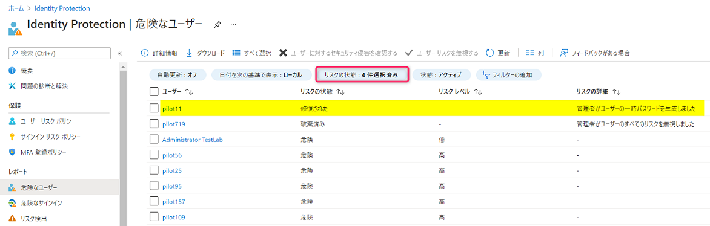  

**▼ ユーザーからのサインインをブロックする方法**

実際に攻撃を受けている可能性がある場合など、一時的にアカウントへのサインイン自体をブロックしたい場合には、以下の手順でサインインを行えないようにすることも可能です。  
ただし、この設定を行うと、攻撃者・本来のユーザーを問わずサインインができなくなる点にご留意ください。  
  
  
1. Azure ポータルにサインインします。
2. [Microsoft Entra ID] - [ユーザー] を開き、該当のユーザーをクリックします。
3. [編集] をクリックし、 [サインインのブロック] を [はい] に設定します。
4. [保存] をクリックします。

その後、実際の被害状況 (メールの送受信履歴やアクセスしたファイルなどの調査) や、いつどこからのアクセスによって侵害されたかなど、詳しい調査を実施します。  
サインイン ログの調査や、侵害されたアカウントでどのような操作が行われたかなどを確認する必要がある場合は、お問い合わせいただくことで弊社側での支援も可能です。  

**5-2 ユーザーにリスクの心当たりはなく、サインインに失敗している場合**

このシナリオの場合、サインインには成功していないため、緊急度を上げる必要はありませんが、リスクの修復は必要です。  
5-1 のシナリオと同様に、管理者がパスワードをリセットすることで、リスクをクローズすることが可能ですが、SSPR の設定が完了しているユーザーであれば、管理者がリセットすることなく、ユーザーが自身のパスワードをリセットすることもできます。  

SSPR を使用するメリットは、以下の通りです。  

- 管理者が生成させた一時パスワードを、ユーザーに通知する必要がないため、メールなどでパスワードの平文を記載する必要がない
- ユーザーに SSPR の実施を依頼するのみのため、管理者の負担が軽減される
- 即座にパスワードをリセットする必要はないため、ユーザーが自身の任意タイミングで、パスワードをリセットすることができる

特に 3 点目に記載の、ユーザーが任意のタイミングでパスワードリセットを実施できる点は、管理者の手動リセットによってユーザーの業務 (Outlook や Teams といった Office 365 アプリケーションを使った重要な業務) が急に停止されることを抑止しています。そのため、積極的に本方式を活用いただければと思います。  

**▼ SSPR を使用して、ユーザーが自身でパスワードをリセットする手順**

1. 管理者は、リスクの発生しているユーザーを確認し、 SSPR を使用してパスワードをリセットするよう依頼します。

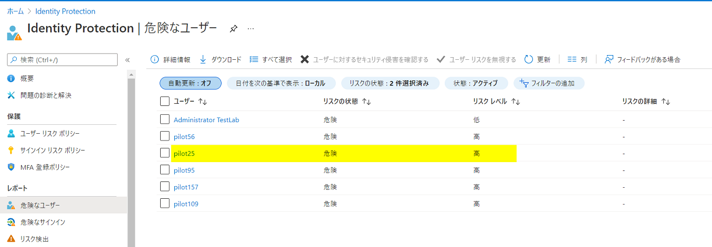  

2. パスワードをリセットするよう依頼されたユーザーは、パスワード リセット ポータルからリセットを実施します。
   最も簡単な方法は、aka.ms/sspr にアクセスする方法です。サインインの際に [パスワードを忘れた場合] をクリックすることでもリセットが可能です。
   
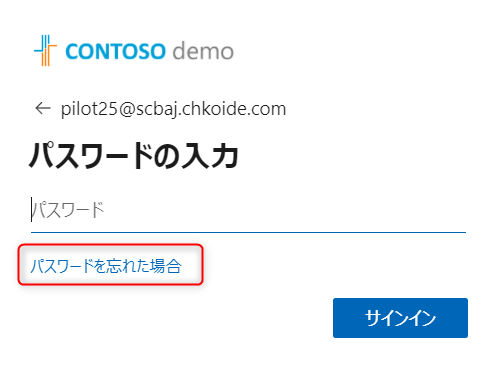  

> [!WARNING]
> パスワード変更ではなく、明示的に SSPR を実行する必要がある点にご留意ください。

3. 以下のような画面が表示されるので、必要事項を入力して次へ進みます。次の画面では、電話番号やメール アドレスなどを使用した認証を行います。

  

4. 本人確認が完了すると、新しいパスワードを設定できます。以下のように表示されれば、正常にパスワードがリセットされています。
   
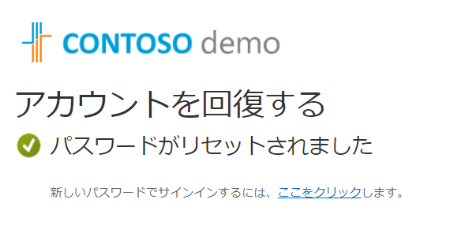

5. [危険なユーザー] や [リスク検出] の画面から、ユーザーの記載が消えることを確認します。以下のようにフィルターですべて選択すると、ユーザー リスクが修復されたことが確認できます。
   

なお、"パスワードの末尾を 1 から 2 に変更した" など、リセット後に再度推測されやすいパスワードを設定した場合などは、  
検出されたリスクは表面上解消され、Identity Protection の画面からはリスクが表示されなくなるものの、外部からの攻撃に対し潜在的なリスクが引き続き残ります。  
リスクを下げる観点での暫定的な対処策では、パスワードをリセットいただく方法で問題ありませんが、より安全にアカウントを利用するために、MFA を利用するなどの恒久的な対策もご検討ください。  

**5-3 ユーザーにリスクの心当たりがあり、リスクが誤検知であったことが判明した場合** 

ユーザーにヒアリングを行い、リスク検出が誤検知であると判断できた場合 (例:「あり得ない移動」というリスクが検出されたが、ユーザーは当日出張で長距離移動を行っていた場合など) に、発生しているリスクに対し "問題ない" 旨を手動で設定し、リスクをクローズする方法となります。  
こちらの方法は上記と異なり、ユーザーがパスワードをリセットする必要はなく、リスクをそのままクローズすることが可能です。

▼ 発生しているユーザー リスクを無視する手順

1. Azure ポータルにサインインします。
2. [Microsoft Entra ID Protection]] を選択します。
3. [危険なユーザー] を選択します。
4. 該当するユーザーを選択し、 [ユーザー リスクを無視する] を選択します。
5. 

6. 以下のように警告が表示されるので、[はい] をクリックします。
7. 
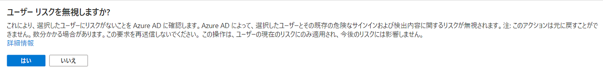

8. リスクがクローズされるまでに、数分程度かかるので待機します。
9. [危険なユーザー] や [リスク検出] の画面からユーザーの記載が消えることを確認します。以下のようにフィルターですべて選択すると、ユーザー リスクが破棄されたことが確認できます。
10. 
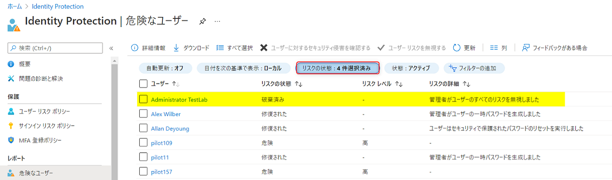

## C. 補足情報について

最後に、 以下補足情報についてご案内します。  

### 1. メール通知の設定方法

冒頭に紹介したメールは、特定の管理者ロールを持つユーザーにのみ送信されるメールです。
グローバル管理者、セキュリティ管理者、セキュリティ閲覧者をもつユーザーのうち、各ロールごとに最大 20 人（3 ロール併せて最大 60 人）のみに送付されています。  

通知が行われるタイミングは、おおよそ以下の 3 種類となります。  
- リスクのあるユーザーが新規に発生し、[危険なユーザー] に新しいユーザーが追加されたとき
- リスク レベルが更新され、メール通知の閾値を超えたとき
- 過去すでにリスクが発生し通知が行われたユーザーに対し、新たなリスクが発生したとき

メール通知は、あらかじめ設定したレベル以上のリスクが発生した時に、管理者にメールを送信しています。  
そのため、"リスク レベル中" 以上で通知を行う設定としている場合、リスク レベル低のユーザーが発生しても通知は行われません。  
しかしながら、リスク レベル低が発生した後、同じユーザーに新たなリスクが発生しリスク レベルが中に更新されると、そのタイミングで通知が行われます。

また、すでに中程度のリスクが発生しているユーザーに対し新たなリスクが発生した場合も、改めての通知が行われます。  
この時、ユーザーのリスク レベルが更新されない（中のままとなった）場合であっても、通知設定の閾値が "リスク レベル中" となっていれば、通知が行われます。  

[危険な状態のユーザーが検出された電子メール] の動作の詳細につきましては、以下の公開情報もご確認ください。  
https://docs.microsoft.com/ja-jp/azure/active-directory/identity-protection/howto-identity-protection-configure-notifications#users-at-risk-detected-email

もし通知を受け取りたくない管理者がいる場合や、逆に通知を行いたいメールアドレスがある場合は、以下の手順で設定が可能です。

**▼ メール通知の設定手順**

1. Azure ポータルにサインインします。
2. [Microsoft Entra ID Protection]] を開きます。
3. [リスクのあるユーザーが検出された警告] をクリックします。
4. メール通知が設定されているユーザー一覧が表示されることを確認します。  
5. 一覧の各ユーザーごとに記載がございます、右側の [アクション] にて、該当するユーザーへの通知設定を変更いただくことが可能です。通知が不要なユーザーの場合は [無効] に設定します。
    また、このページに表示されていないユーザーに通知を送信したい場合は、[カスタム メールをこちらに追加してください] の枠にメールアドレスを入力します。  
6. [選択したユーザー リスクレベル以上でアラートを生成する] の項目にて、通知が発生するリスク レベルの閾値を指定します。
7. [保存] をクリックして設定を保存します。

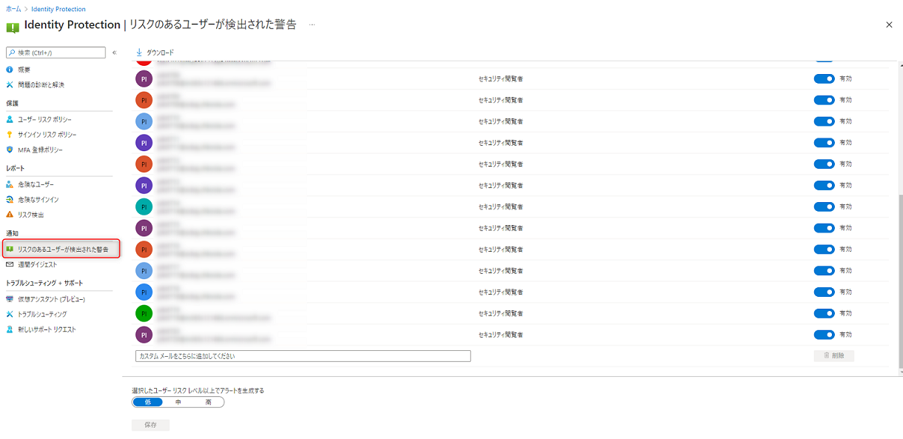

> [!TIP]  
> グローバル管理者、セキュリティ管理者、セキュリティ閲覧者 のロールのいずれかが割り当てられているユーザーは、メール アドレスが登録されていれば、ロールごとに最大 20 人まで自動的に表示されます。
> メール アドレスが登録されているにもかかわらず表示されない場合は、ロールの割り当てが "アクティブ" な状態であるかを確認してください。

### 2. ユーザー リスク ポリシー、サインイン リスク ポリシーの紹介

ユーザー リスク ポリシーやサインイン リスク ポリシーを使用すると、一定以上のリスクのあるユーザーがサインインしようとした際などに、たとえばパスワードの変更や MFA を強制したり、アクセスをブロックしたりすることができるようになります。
実際にリスクが発生した際には、先に記載した手順でリスクへの手動対応も可能ですが、こうした機能を利用することで、上述した管理者が行うリスク検出時の煩雑な確認・修復作業を自動化し管理者の負担を大きく軽減することが可能です。

たとえば、以下のようにユーザー リスク ポリシーを構成した際の動作について、簡単に紹介します。

上記のポリシーでは、リスク レベルが高のユーザーがサインインしようとした際に、パスワードの変更を求めるよう設定しています。

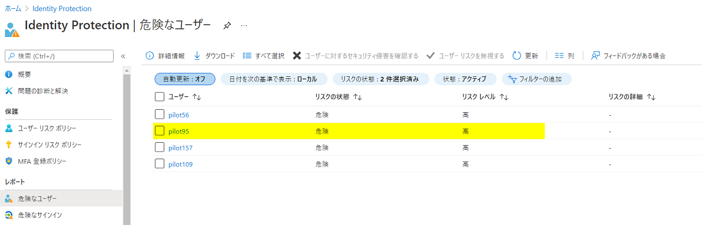

本人確認を実施すると、パスワードの変更画面が表示されます。この画面からパスワードを変更することで、リスクを自動で修復することが可能です。
（本フロー以外からパスワードを変更した際は、リスクが修復されないためご留意ください。）

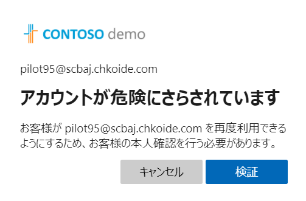

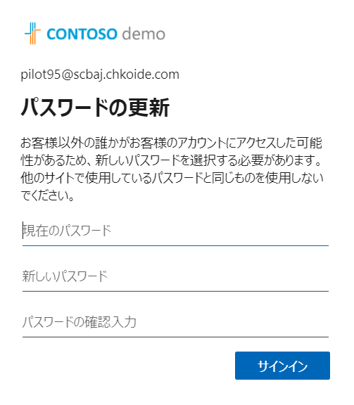

再度 [危険なユーザー] の画面を確認すると、パスワードを変更したことでリスクが修復されたことが確認できます。

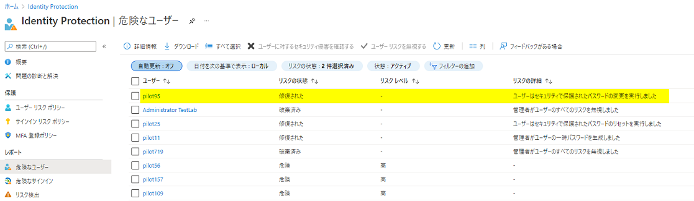

なお、SSPR と MFA の登録が完了していない場合は、上記のポリシーが構成されていても、以下のようにブロックされます。
この場合は、上記に記載のステップ 5-1 と同様、管理者側でリスクに対応する必要があります。

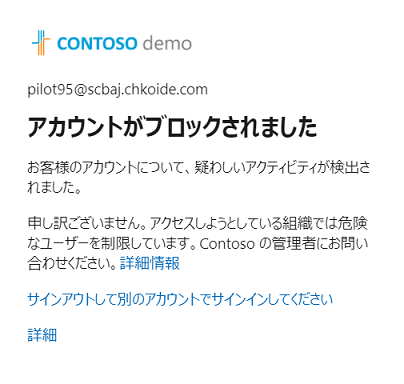  

ユーザー リスク ポリシーやサインイン リスク ポリシーの活用方法につきましては、以下の弊社ブログにて詳細にご案内しています。
本記事に記載のリスク対応方法と併せて、ポリシーでの制御方法につきましてもご確認ください。

[Identity Protection 2 つのリスク ポリシーの導入メリットについて](https://jpazureid.github.io/blog/azure-active-directory/identity-protection-riskpolicy-introduction/)

Identity Protection とリスクに関する以下の公開情報も、併せてご確認ください。  

https://docs.microsoft.com/ja-jp/azure/active-directory/identity-protection/concept-identity-protection-risks  
https://docs.microsoft.com/ja-jp/azure/active-directory/identity-protection/howto-identity-protection-remediate-unblock#manual-password-reset  
https://docs.microsoft.com/ja-jp/azure/active-directory/identity-protection/howto-identity-protection-configure-notifications#users-at-risk-detected-email  
