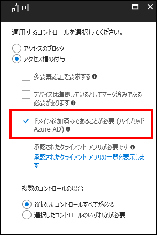
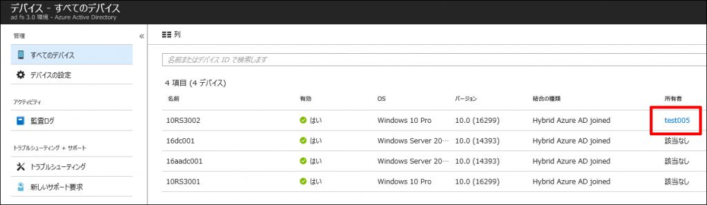
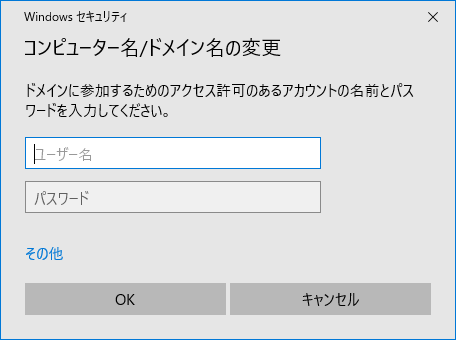

> 本記事は Technet Blog の更新停止に伴い https://blogs.technet.microsoft.com/jpazureid/2018/04/03/device-management-hybrid-azuread-joined-devices-setup/ の内容を移行したものです。
> 元の記事の最新の更新情報については、本内容をご参照ください。

# ハイブリッド Azure Active Directory 参加済みデバイスの構成について

いつもお世話になります。Azure & Identity サポート チームの加藤です。

本記事では「ハイブリッド Azure Active Directory 参加済みデバイスの構成」についてご案内します。

本記事がみなさまの一助になれば幸いです。

1. 本記事の目的
2. ハイブリッド Azure Active Directory 参加済みデバイスの構成とは
3. 手順 1 : サービス接続ポイントの構成」についての補足  
4. 手順 2 : 要求の発行のセットアップ」についての補足  
5. Windows 10 のデバイス登録の流れについて
6. Windows 10 のデバイス登録について注意事項  
7. ダウンレベルの Windows (Windows 7、Windows 8.1) のデバイス登録の流れ  
8. ダウンレベルの Windows (Windows 7、Windows 8.1) のデバイス登録について注意事項  

## 本記事の目的

本記事の目的は、以下の弊社公開情報を補足することです。

[ハイブリッド Azure Active Directory 参加済みデバイスの構成方法](https://docs.microsoft.com/ja-jp/azure/active-directory/device-management-hybrid-azuread-joined-devices-setup)

補足のポイントは私たちサポート サービスに最もお問い合わせの多いシナリオである「"AD FS がある場合の" ハイブリッド Azure Active Directory 参加済みデバイスの構成方法」です。

!!!! 注意 !!!!
本記事は要所についての補足となります。
**全ての手順の確認は必ず上記ページをご確認ください。**

## ハイブリッド Azure Active Directory 参加済みデバイスの構成とは

ハイブリッド Azure Active Directory 参加済みデバイスの構成とは、以下を実現するための構成です。

- オンプレミス AD にデバイスが参加している
- 同時に Azure AD にも同デバイスを登録する

この構成を実現することで、該当のデバイスに対して、条件付きアクセスで「ドメイン参加済みであることが必要」によるアクセスの制御が行えるようになります。



条件付きアクセスで「ドメイン参加済みであることが必要」を使用することで、以下のアクセス制御を行えます。

- オンプレミス AD に参加しているデバイスであれば、アクセスを許可する

つまり、「社給デバイスのみアクセスを許可したい」などの要件に対応することができます。

そのための前提となる構成がハイブリッド Azure Active Directory 参加済みデバイスの構成です。

## 「手順 1 : サービス接続ポイントの構成」についての補足

以下ページの「手順 1: サービス接続ポイントの構成」について、AD FS が存在している環境を前提に補足します。

[ハイブリッド Azure Active Directory 参加済みデバイスの構成方法](https://docs.microsoft.com/ja-jp/azure/active-directory/device-management-hybrid-azuread-joined-devices-setup)

### サービス接続ポイント (SCP) は何に使用されるか

ハイブリッド Azure AD 参加では、オンプレミスのドメインに参加しているデバイスは Azure AD に対して自身を登録する必要があります。

この登録処理において各デバイスが参照する先がサービス接続ポイント (SCP) です。

サービス接続ポイント (SCP) が登録されていない場合、デバイス登録時に適切に AD FS への認証が行われません。

結果、デバイス登録に失敗します。
サービス接続ポイント (SCP) の実体は以下に登録されます。

- CN=62a0ff2e-97b9-4513-943f-0d221bd30080,CN=Device Registration Configuration,CN=Services,CN=Configuration,DC=contoso,DC=local (「DC=contoso,DC=local」部分は環境に合わせて読み替えてください) の keywords 属性の値

この keywords 属性の値として登録される以下 2 つがサービス接続ポイント (SCP) の実体です。

- azureADId: <該当 Azure AD のテナント ID>
- azureADName: <該当 Azure AD のいずれかの Federated ドメイン>

azureADName に設定される Federated ドメインは、登録先の Azure AD に関連付けられた Federated ドメインが設定されます。

複数の Federated ドメインがある場合にも、サービス接続ポイント (SCP) を複数作ったり、すべての Federated ドメインを追加する必要はありません。

いずれかの 1 つの Federated ドメインがサービス接続ポイント (SCP) に設定されていれば問題ありません。

各デバイスは、 SCP に登録されている情報を元に Azure AD から AD FS の情報を参照し、 AD FS への認証が行われます。

このサービス接続ポイント (SCP) を構成するコマンドが以下になります。

- Initialize-ADSyncDomainJoinedComputerSync

#### Initialize-ADSyncDomainJoinedComputerSync を使用してサービス接続ポイント (SCP) を構成する

上記の通り、Initialize-ADSyncDomainJoinedComputerSync コマンドはサービス接続ポイント (SCP) を構成します。

該当環境のドメイン コントローラーの OS が Windows 2008 より新しいバージョンの場合に使用できるコマンドです。

このコマンドの使用方法は以下になります。

1. エンタープライズ管理者で Azure AD Connect サーバーにサインインする
2. PowerShell を管理者として起動する
3. 以下のコマンドを実行して Active Directory PowerShell モジュールと AD DS ツールをインストールする

   Add-WindowsFeature RSAT-AD-PowerShell,RSAT-AD-AdminCenter

4. 以下の弊社公開情報に沿って MSOnline (Azure AD v1) をインストールする

   [Azure Active Directory の PowerShell モジュール](file:///C:/2017/12/04/aad-powershell/index.html)

5. PowerShell を閉じる
6. 再度、PowerShell を管理者として起動する
7. 以下のコマンドを実行してサービス接続ポイント (SCP) オブジェクトを構成する

    ```powershell
    Import-Module -Name "C:\Program Files\Microsoft Azure Active Directory Connect\AdPrep\AdSyncPrep.psm1";
   $aadAdminCred = Get-Credential;
    ```

   ※ 認証画面が表示されるので対象の Azure AD の管理者の資格情報を入力します

   ```powershell
   Initialize-ADSyncDomainJoinedComputerSync -AdConnectorAccount "xxxx" -AzureADCredentials $aadAdminCred;
   ```

   ※ xxxx 部分はオンプレミス AD の管理者のユーザー名を domain\user の形式で入力します

この手順が正常に行えない場合、または該当環境のドメイン コントローラーの OS が Windows 2008 以前のバージョンの場合は、手動でサービス接続ポイント (SCP) を構成します。

#### 手動でサービス接続ポイント (SCP) を構成する

Initialize-ADSyncDomainJoinedComputerSync を使用した登録ができない場合 (ドメイン コントローラーの OS が Windows 2008 以前のバージョンの場合を含む)、手動でサービス接続ポイント (SCP) を構成します。

その方法は以下になります。

1. 以下の公開情報に沿ってテナント ID を確認する

   [Office 365 テナント ID を検索する](https://support.office.com/ja-jp/article/6891b561-a52d-4ade-9f39-b492285e2c9b)

2. エンタープライズ管理者でドメイン コントローラーにサインインする
3. PowerShell を管理者として起動する
4. 以下のコマンドを実行してサービス接続ポイント (SCP) オブジェクトを構成する

    ```powershell
    $verifiedDomain = "contoso.com"
    ```

    ※ 該当 Azure AD に登録されているいずれかの Federated ドメインを指定します。

    ```powershell
    $tenantID = "xxxxxx"
    ```

    ※ 「xxxxxx」部分に上記で確認したテナント ID を指定します。

    ```powershell
    $configNC = "CN=Configuration,DC=corp,DC=contoso,DC=com"
    $de = New-Object System.DirectoryServices.DirectoryEntry
    $de.Path = "LDAP://CN=Services," + $configNC
    $deDRC = $de.Children.Add("CN=Device Registration Configuration", "container")
    $deDRC.CommitChanges()
    $deSCP = $deDRC.Children.Add("CN=62a0ff2e-97b9-4513-943f-0d221bd30080", "serviceConnectionPoint")
    $deSCP.Properties["keywords"].Add("azureADName:" + $verifiedDomain)
    $deSCP.Properties["keywords"].Add("azureADId:" + $tenantID)
    $deSCP.CommitChanges()
    ```

### **4. 「手順 2 : 要求の発行のセットアップ」についての補足**

以下ページの「手順 2: 要求の発行のセットアップ」について、AD FS が存在している環境を前提に補足します。

[ハイブリッド Azure Active Directory 参加済みデバイスの構成方法](https://docs.microsoft.com/ja-jp/azure/active-directory/device-management-hybrid-azuread-joined-devices-setup)

なお、AD FS でフェデレーションを行っていない環境では、この「手順 2: 要求の発行のセットアップ」の作業は不要です。

#### クレーム ルールは何に使用されるか

この手順ではクレーム ルールを設定します。

AD FS でデバイスの認証が行われると AD FS よりトークンが発行されます。

それをデバイスが Azure AD のデバイス登録を管理しているサービス (Azure AD DRS) に提示することでハイブリッド Azure AD 参加のデバイス登録が行われます。

ここで設定するクレーム ルールは、その AD FS から発行されるトークンにデバイス登録に必要なクレームを含めるためのものです。

これらのクレーム ルールが適切に設定されていない場合、 AD FS から発行されるトークン内に Azure AD DRS が求めるクレームが含まれない状態となるため、デバイス登録に失敗します。

#### ヘルパースクリプトの使い方

これらのクレーム ルールの登録方法として「手順 2: 要求の発行のセットアップ」内で記載されているヘルパースクリプトがあります。

このヘルパースクリプトの使い方について補足します。

ヘルパースクリプトのはじめの 3 行は、環境に合わせて設定をします。

```powershell
$multipleVerifiedDomainNames = $false
$immutableIDAlreadyIssuedforUsers = $false
$oneOfVerifiedDomainNames = 'example.com'
```

それぞれの行について説明します。

#### $multipleVerifiedDomainNames = $false

ここで指定をする値は以下のいずれかです。

- $false
- $true

1 つの Federated ドメインのみの場合は $false を指定します。

複数の Federated ドメインがある場合は $true を指定します。

1 つか複数かというのは、より正確にいうと以下になります。

AD FS を構成する際に Federated ドメインの設定をする際に以下のコマンドを実行している場合は $false を指定します。

```powershell
Convert-MsolDomainToFederated -DomainName xxx
```

Federated ドメインの設定をする際に以下のコマンドを実行している場合は $true を指定します。

```powershell
Convert-MsolDomainToFederated -DomainName xxx -SupportMultipleDomain
```

厳密に $false と $true のどちらを指定するかの確認方法を以下に記載します。
(Federated ドメインが 1 つの場合も、-SupportMultipleDomain を指定して作成されている場合があるためです)

1. 以下の弊社公開情報に沿って MSOnline (Azure AD v1) をインストールする

   [Azure Active Directory の PowerShell モジュール](file:///C:/2017/12/04/aad-powershell/index.html)

2. 以下のコマンドを実行して対象の Azure AD に接続する

   ```powershell
   Connect-MsolService
   ```

   ※ 認証が発生するので対象の Azure AD の全体管理者の資格情報を入力します。

3. 以下のコマンドを実行してドメイン情報を取得する

   ```powershell
   Get-MsolDomain
   ```

4. 以下のコマンドを実行して IssuerUri を取得する

   ```powershell
   Get-MsolDomainFederationSettings -DomainName xxxx | select IssuerUri
   ```

   ※「xxxx」部分は、上記 3. で取得したドメイン情報の中から Federated ドメインを 1 つ選んで指定してください。

   Federated ドメインが 1 つのみの場合は、それを指定してください。

   Federated ドメインが複数ある場合は、どれでも結構です。

5. 取得した以下の IssuerUri の値から $false と $true のどちらを指定するかを判断する

   ```powershell
   IssuerUri
   ---------
   http://xxxx/adfs/services/trust/
   ```

   ※「xxxx」部分が AD FS のフェデレーション サービス名と一致する場合は、$false を指定します。

   「xxxx」部分が AD FS のフェデレーション サービス名と一致しない場合は、$true を指定します。

#### $immutableIDAlreadyIssuedforUsers = $false

ここで指定をする値は以下のいずれかです。

- $false
- $true

Windows 10 のデバイス登録時、そのコンピューターオブジェクトによる AD FS での認証が発生します。

この際に、ImmutableID がトークン内に含まれる場合は $false を指定します。

この際に、ImmutableID がトークン内に含まれない場合は $true を指定します。

厳密に $false と $true のどちらを指定するかの確認方法を以下に記載します。

1. プライマリ AD FS サーバーに管理者でサインインする
2. AD FS の管理コンソールを起動する
3. 画面左のツリーから以下をクリックする

   Windows Server 2012 R2 の AD FS の場合 : [AD FS] - [信頼関係] - [証明書利用者信頼]

   Windows Server 2016 の AD FS の場合 : [AD FS] - [証明書利用者信頼]

4. 画面中央から [Microsoft Office 365 Identity Platform] を右クリックして以下をクリックする

    Windows Server 2012 R2 の AD FS の場合 : [要求規則の編集]

    Windows Server 2016 の AD FS の場合 : [要求発行ポリシーの編集]
5. [発行変換規則] タブをクリックする
6. 1 つ目の規則をダブルクリックする
7. 以下の赤字部分の属性名を確認する (既定では objectGUID になっています。)

    c:[Type == "http://schemas.microsoft.com/ws/2008/06/identity/claims/windowsaccountname"]
=> issue(store = "Active Directory", types = ("http://schemas.xmlsoap.org/claims/UPN", "http://schemas.microsoft.com/LiveID/Federation/2008/05/ImmutableID"), query = "samAccountName={0};userPrincipalName,xxxxxxxxx;{1}", param = regexreplace(c.Value, "(?[^\\]+)\\(?.+)", "${user}"), param = c.Value);
8. 確認した属性名から $false と $true のどちらを指定するかを判断する

    属性名がコンピューターオブジェクトにも存在していて、かつ、既定で値が設定される属性の場合は、$false を指定します。

    属性名がコンピューターオブジェクトに存在しない、または、存在するけど既定で値が設定されない属性の場合は、$true を指定します。

#### $oneOfVerifiedDomainNames = 'example.com'

ここで指定をする値は対象の Azure AD に登録されている Federated ドメインのいずれかです。

Federated ドメインが 1 つのみの場合は、それを指定してください。

Federated ドメインが複数ある場合は、どれでも結構です。

以上を設定した上で、ヘルパースクリプトをご利用ください。

## Windows 10 のデバイス登録の流れについて

Windows 10 のデバイス登録の流れについて説明します。

”AD FS がある場合の” ハイブリッド Azure Active Directory 参加済みデバイスの構成が正しく構築できている場合、Windows 10 を新規にオンプレミスのドメインに参加させると、以下の流れで Azure AD へのデバイス登録がされます。

(実際には様々な処理が並列して行われているはずですので、前後する部分もあります)

1. Workgroup の Windows 10 にローカルユーザーでサインインする
2. Windows 10 をドメインに参加させる

    

3. オンプレミス AD に Windows 10 のコンピューター オブジェクトが作成される
4. Windows 10 からサービス接続ポイント (SCP) を参照する
5. Windows 10 のコンピューター オブジェクトで AD FS の認証をする
6. AD FS から Windows 10 にトークンが発行される
7. Windows 10 から Azure AD にデバイス登録をする
8. Windows 10 に「xxxx ドメインへようこそ。」のメッセージボックスが表示される

    

9. 再起動後、ドメインのアカウントでサインインします。サインインが完了するとタスクが実行され Azure AD 側にもデバイスが登録される

    

    ※ この時点では、[所有者] が [該当なし] になります。

10. 以降、Azure AD Connect で同期が実行されると、オンプレミス AD 上のコンピューターオブジェクトの情報が、Azure AD 上のデバイスに上書きされる

    

    ※ この時点で [所有者] が登録されます。

## Windows 10 のデバイス登録について注意事項

WorkGroup の Windows 10 をオンプレミス AD のドメインに参加させる際に以下のダイアログが表示され、ここでオンプレミス AD のユーザー資格情報を入力します。



ここに入力をしたユーザー Azure AD 上に登録されるデバイスの所有者になります。

仮にここで入力をするユーザーが Azure AD には同期されておらず、オンプレミス AD 上だけに存在するユーザーであった場合、以降ずっと Azure AD 上でそのデバイスの所有者は [該当なし] のままになります。

このデバイスの所有者情報については、 他ユーザーでこの Windows 10 にサインインしても変わらず、これを変更するためには、一旦 Workgroup に戻して再度オンプレミス AD へ、所有者にしたいユーザーの資格情報を利用しての参加が必要になります (もちろん所有者にしたいユーザーは Azure AD に同期済み / 同期予定のユーザーである必要があります)。

## ダウンレベルの Windows (Windows 7、Windows 8.1) のデバイス登録の流れ

ダウンレベルの Windows (Windows 7、Windows 8.1) のデバイス登録の流れについて説明します。

”AD FS がある場合の” ハイブリッド Azure Active Directory 参加済みデバイスの構成が正しく構築できている場合、ダウンレベルの Windows は以下の流れでデバイス登録されます。

Windows 7 で説明をしますが、Windows 8.1 でも同様です。
(実際には様々な処理が並列して行われているはずですので、前後する部分もあります)

1. WorkGroup の Windows 7 にローカルユーザーでサインインする
2. Windows 7 をドメインに参加させる
3. オンプレミス AD に Windows 7 のコンピューター オブジェクトが作成される
4. Windows 7 の再起動を求められるので再起動する
5. Windows 7 にドメインユーザーでサインインする
6. Windows 7 からサービス接続ポイント (SCP) を参照する
7. Windows 7 にサインインしたドメインユーザーで AD FS の認証をする
8. AD FS から Windows 7 にトークンが発行される
9. Windows 7 から Azure AD にデバイス登録をする
10. この時点ではじめて Azure AD 側にデバイスが登録される

    

    ※ この時点で [所有者] も登録されています。

## ダウンレベルの Windows (Windows 7、Windows 8.1) のデバイス登録について注意事項

ダウンレベルの Windows をオンプレミス AD のドメインに参加させる際に表示される以下のダイアログに入力した資格情報は Windows 10 の場合とは異なり所有者になりません。


ダウンレベルの Windows はドメイン参加後にサインインを行ったドメインユーザーで Azure AD へのデバイス登録が行われます。

ダウンレベルの Windows に別のドメインユーザーでサインインを行うと、同様にその別ユーザーにてデバイス登録が行われ、Azure AD 上に複数のデバイスが登録されることになります。


本記事がみなさまの一助になれば幸いです。

引き続きよろしくお願いします。

## 更新履歴

- 2018/04/03:  
  新規作成  
  $immutableIDAlreadyIssuedforUsers の記載を修正

- 2018/04/04:
  注意事項を追記
