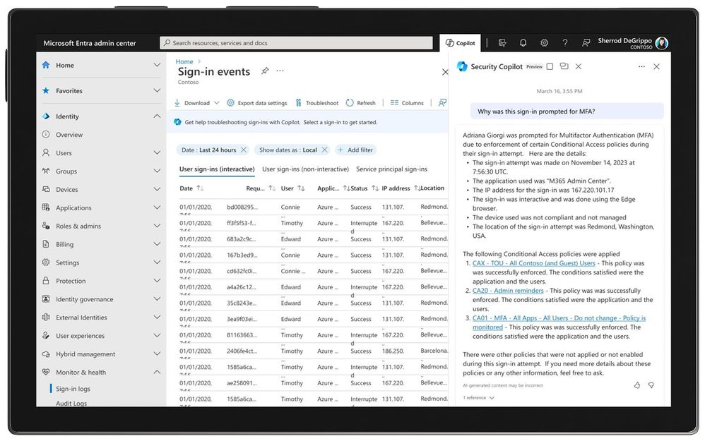

# Microsoft Ignite の ID: AI 時代におけるアクセスのセキュリティ保護

こんにちは、Azure Identity サポート チームの 五十嵐 です。

本記事は、2023 年 11 月 15 日に米国の Microsoft Entra (Azure AD) Blog で公開された [Identity at Microsoft Ignite: Securing access in the era of AI](https://techcommunity.microsoft.com/t5/microsoft-entra-azure-ad-blog/identity-at-microsoft-ignite-securing-access-in-the-era-of-ai/ba-p/2747279) の抄訳です。ご不明点等ございましたらサポート チームまでお問い合わせください。

---

デジタルの世界が拡大し続けるにつれ、サイバーセキュリティのリスクと課題も拡大しています。サイバー攻撃のスペシャリストを抱える悪意ある組織が、国家や犯罪組織から資金提供を受ける一方、我々が守るべき ID、エンドポイント、アプリ、データは増え続けています。また、AI の新時代では、悪意のある行為者 (内部犯を含む) が組織に損害を与える方法は数えきれないぐらい存在するでしょう。

弊社が [Microsoft Entra](https://www.microsoft.com/ja-jp/security/business/microsoft-entra?rtc=1) に追加する機能はすべて、進化する脅威の状況を先取りできるようにするためのものです。すべては、お客様が自身の環境をより容易に安全に保てるようにするという 1 つの原則に帰着します。攻撃からの防御を担当するチームを擁する大企業であれ、IT 部門をまったく持たない中小企業であれ、適切なツールを導入し、適切なポリシーを設定するお手伝いをしたいと考えています。[Microsoft Ignite 2023](https://ignite.microsoft.com/en-US/home) では、Microsoft Entra の新機能と機能強化を発表しました:

### 発表:

- Microsoft Entra + Security Copilot
- Security Service Edge - Microsoft Entra Internet Access および Microsoft Entra Private Access ですべてのアプリケーションとリソースへのアクセスを保護
- Microsoft マネージド条件付きアクセス ポリシーの自動展開
- より強固な権限管理のための機能の統合

## Microsoft Entra + Security Copilot

アクセスを保護するには、テクノロジーだけでなく、ビジネス ポリシーや規制についても深く理解する必要があります。この度、[Microsoft Security Copilot](https://www.microsoft.com/ja-jp/security/business/ai-machine-learning/microsoft-security-copilot?rtc=1) が Microsoft Entra に追加され、一般的なタスクの自動化、迅速なトラブルシューティング、複雑なポリシーの解釈、ワークフローの設計を支援します。

Microsoft Entra 管理センターでは、Security Copilot に対し、その条件付きアクセス ポリシーが何を行うものなのか、なぜ MFA がトリガーされたのかを、簡単な会話形式で説明してもらうことができます。Security Copilot を使用して、ユーザーがサインインできなかった理由など、ID 関連のトラブルシューティングを行うこともできます。また、組み込みの Security Copilot エクスペリエンスでは、リスクのある各 ID について、リスクの概要、修復手順、推奨ガイダンスが表示され、ID のリスクに迅速に対応できます。ワークフローの作成支援機能を使用して、新入社員のオンボーディングなど、入社、異動、退職のシナリオで ID ガバナンスのライフサイクル ワークフローを構築する際に、より効率的に操作が可能となります。

セキュリティ インシデントを調査する場合、関連するサインイン ログと監査ログについて Security Copilot に尋ねることで、文脈に基づいた分析情報を得ることができます。そして、特定のユーザー、グループ、ワークロード、サインイン、ロール、セキュリティ アラートなどの詳細を取得できます。Security Copilot の [プライベート プレビュー](https://forms.office.com/pages/responsepage.aspx?id=v4j5cvGGr0GRqy180BHbR2sE-_D9S11Ir8rACvMiWdVUREM4TUg1TzNNS0MzNlNBOVQxVEdQV1VLRi4u) に今すぐ登録し、[サインアップ](https://info.microsoft.com/ww-landing-security-ai-interest-form.html?LCID=EN-US) することで今後のすべての開発に関する最新情報を入手ください。さらに、Microsoft Security Copilot を自社のソリューションで使用したいと考えているセキュリティ パートナーの方は、[Security Copilot パートナー エコシステム](https://forms.microsoft.com/pages/responsepage.aspx?id=v4j5cvGGr0GRqy180BHbR7GkZxmcvGdGql1aVgLqRR1UNEk0MTVPVjg1VjhPMUJHVTZETlRXSk1RQy4u) にご登録ください。

## Security Service Edge ですべてのアプリケーションとリソースへのアクセスを保護

マイクロソフトの Security Service Edge (SSE) ソリューションは [現在プレビュー中](https://entra.microsoft.com/#view/Microsoft_Azure_Network_Access/Welcome.ReactView) で、Microsoft Entra Internet Access と Microsoft Entra Private Access により、ユーザーとデバイスがどこにいようと、あらゆるアプリケーションやリソースへのアクセスを保護します。

マイクロソフトの SSE ソリューションと Microsoft Entra ポートフォリオの統合により、あらゆるアプリケーションや Web サイトへのアクセスを許可する前に、ID、デバイス、アプリケーション、およびネットワークの条件を考慮した統合された条件付きアクセス ポリシーを適用することが可能になります。これは、アプリケーションがどの ID プロバイダーを使用しているかに関係なく、さらに、アプリケーションに変更を加えることなく機能します。

皆様の多くが既にお試しの [Microsoft Entra Internet Access](https://www.microsoft.com/ja-jp/security/business/identity-access/microsoft-entra-internet-access?rtc=2) は、Microsoft 365 トラフィックを安全に保つための ID 中心のセキュア Web ゲートウェイ (SWG) です。弊社は、2023 年末までにすべてのインターネット アプリとリソースを含むようにパブリック プレビューを拡張し、次のような新しいコア機能を追加する予定です:

- **アクセスの文脈を考慮した SWG** : Web コンテンツフィルタリング機能を備えたもので、エンド ユーザーによる安全でないコンテンツやコンプライアンス違反のコンテンツへのアクセスを制限します。
- **ユニバーサル条件付きアクセス** : 外部 Web サイトや非フェデレーション型 SaaS アプリケーションなど、あらゆるネットワークの宛先に適応型のアクセス制御を拡張します。
- **準拠済みネットワークのチェック機能** : これは条件付きアクセスにて利用できる、管理のしやすい追加機能です。この機能により、Microsoft Entra に統合された統合クラウド アプリケーションをトークンの盗難から保護し、ユーザーを重要なクラウド サービスにアクセスさせつつ、テナント固有のネットワーク セキュリティ ポリシーを確実に適用できるようにします。
- **アクセス元 IP の復元機能** が ID Protection と条件付きアクセスのロケーション ポリシーで利用可能となります。これにより、各ユーザーの元のアクセス元 IP を維持し、信頼できる場所のチェックと継続的なアクセス評価、ID リスクの検出、およびログ記録の下位互換性が可能となります。

[Microsoft Entra Private Access](https://www.microsoft.com/ja-jp/security/business/identity-access/microsoft-entra-private-access?rtc=1) は、あらゆる社内アプリケーションやリソースのための、ID を中心としたゼロ トラスト ネットワーク アクセス (ZTNA) です。プライベート プレビューの新機能は以下のとおりです:

- TCP に加えて、UDP やプライベート DNS などより多くのプロトコルをサポートします。これにより、従来の仮想プライベート ネットワーク (VPN) から最新の ZTNA ソリューションに移行することができます。
- 条件付きアクセス制御に加え、多要素認証 (MFA) などの最新の認証方式により、リモート ユーザーとオンプレミス ユーザーによるすべての社内アプリケーションおよびリソースへのアクセスを保護します。

当社の SSE ソリューションは、マイクロソフトのセキュリティ スタックおよびオープン パートナー エコシステム全体にわたる統合を通じて、お客様の既存のセキュリティおよびネットワーク ソリューションと連携が可能です。弊社では、[Netskope](https://docs.netskope.com/en/netskope-help/integrations-439794/solution-guides/microsoft-security-and-netskope-integration-solution-guide/microsoft-and-netskope-sse-coexistence/) を始めとするこの分野の他のベンダーと提携し、同じ環境でのシームレスな相互運用を実証中です。お客様の環境のネットワーク トラフィックに対し、最適な SSE ソリューションを柔軟に選択できるようにすることをお約束します。Internet Access と Private Access の両方について、パブリック プレビューでは Windows と Android、プライベート プレビューでは MacOS と iOS のクロス OS クライアント サポートも発表済みです。SSE ソリューションは現在、中国とロシアを除く全世界で利用可能であり、将来的には SSE のエッジ ロケーションも提供される予定です。

近日開催予定の [Tech Accelerator Ask Microsoft Anything (AMA) セッション](https://techcommunity.microsoft.com/t5/tech-community-live/microsoft-security-tech-accelerator/ec-p/3968748#M20) に是非参加し、マイクロソフトの SSE ソリューションに関するあらゆる疑問について製品エキスパートにご相談ください。

## Microsoft マネージド条件付きアクセス ポリシーの自動ロールアウトなど

昨年、弊社では約 700 万の既存テナントに対して Microsoft Entra ID (旧 [Azure Active Directory](https://learn.microsoft.com/ja-jp/entra/fundamentals/new-name)) のセキュリティの既定値群を有効にし、これらのテナントにおける侵害の件数を 80% 削減しました。お客様からの好意的なフィードバックに基づき、弊社ではさらに、お客様のリスク情報、現在の使用状況、およびライセンスに基づいて、対象となるテナントに条件付きアクセス ポリシーを自動的に作成することで、より多くの Microsoft Entra ID のお客様が自身を保護できるよう支援してまいります。**Microsoft マネージド条件付きアクセス ポリシー** が展開されると、リスクが高いと想定されるシナリオにて多要素認証 (MFA) を実施する 3 つのポリシーが作成されます。詳細については、Alex Weinert の最近のブログ記事 [Automatic Conditional Access policies in Microsoft Entra streamline identity protection](https://www.microsoft.com/en-us/security/blog/2023/11/06/automatic-conditional-access-policies-in-microsoft-entra-streamline-identity-protection/) をご覧ください。

しかし、すべての MFA 方式が同等にユーザーを保護するわけではありません。FIDO2 セキュリティ キー、Windows Hello、**Microsoft Entra 証明書ベース認証 (CBA)**、パスキーなど、より効果的な MFA 方式では暗号技術が使用されており、認証にフィッシング耐性を付与します。Microsoft Entra CBA のプレビューでは、証明書、リソースの種類、ユーザーおよびグループごとに認証ポリシーを調整することができます。これらのフィッシングに強い認証方式により、パスワードを完全に排除することが可能になり、パスワードの推測、傍受、フィッシングを防ぐことが可能となります。

マイクロソフトは、Windows 11 を皮切りに、エコシステム全体でパスキーのサポートに取り組んでいます。Windows Hello を使用して Web サイト、アプリケーション、またはサービスのパスキーを作成すると、顔、指紋、またはデバイスの PIN を使用してデバイスからサインイン可能となります。これにより、企業や政府機関のお客様は、物理的な FIDO2 セキュリティ キーに代わる、フィッシングに強い新たな選択肢を得ることができます。Microsoft Entra ID ユーザーは、まもなく **Microsoft Authenticator アプリ** にて管理されるパスキーを使用してサインインできるようになります。

最後に、[Microsoft Entra ID Protection](https://www.microsoft.com/ja-jp/security/business/identity-access/microsoft-entra-id-protection?rtc=1) では、トークンの有効期間が異常に長い場合や、なじみのない場所からトークンが再生された場合などの異常を検出するようになりました。アラートが上がると、条件付きアクセスは直ちにトークンを失効させ、パスワードのリセットやステップアップ MFA などの他の対策とともに、管理者による手動での介入を必要とせずに再認証を強制することができます。また、ユーザーがオンプレミスでパスワードを変更した場合に、Entra ID Protection は [自動的にリスクを修復](https://jpazureid.github.io/blog/azure-active-directory/Remediate-User-Risks-in-Microsoft-Entra-ID-Protection-Through-On-premises-Password-Changes/) できるようになりました。これにより、ハイブリッド組織はユーザー リスク ポリシーをより簡単に利用できるようになります。

## より強固な権限管理のための機能の統合

[Microsoft Entra Permissions Management](https://www.microsoft.com/ja-jp/security/business/identity-access/microsoft-entra-permissions-management?rtc=1) は、このたび権限リスクに関する分析情報を提供する 2 つの重要な統合機能を備えました。これにより、お客様はよりセキュリティ態勢を改善できるようになります。

[Microsoft Defender for Cloud (MDC) 統合](https://learn.microsoft.com/ja-jp/entra/permissions-management/permissions-management-for-defender-for-cloud) プレビューは、ID とアクセス許可に関する分析情報を他のクラウド セキュリティ情報と統合し、単一のインターフェイスで表示します。このビューでは、権限リスクに対処するための実用的な推奨事項やアクセス許可のクリープ インデックスが表示され、Azure、Amazon Web Services (AWS)、Google Cloud のクラウド リソースに対して最小権限でのアクセスを簡単に実施できるようになります。

このたび一般提供が開始された [2 つ目の統合](https://learn.microsoft.com/ja-jp/entra/permissions-management/how-to-configure-servicenow-application) により、ServiceNow のお客様は、ServiceNow ポータルを介してマルチクラウド環境 (Azure、AWS、Google Cloud) に対し、期限付きのオンデマンド許可を要求できるようになりました。IT サービス管理 (ITSM) ソリューションは多くのお客様で利用されているため、ServiceNow の既存の承認ワークフローにアクセス許可要求を追加することで、ゼロ トラストの体制より強化することが可能となります。ユーザがアクセス承認を要求すると、ServiceNow のプラグインが Permissions Management から最新のデータを取得し、要求されたユーザー権限を要求者のロールに基づく期限付きの承認とともに ServiceNow に送り返します。

## 進化するセキュアな ID とネットワーク アクセス

包括的な機能を備えた Microsoft Entra という単一の統合ソリューションを採用することで、管理者のアクセス セキュリティを簡素化し、エンドユーザにより良い体験を提供することができます。

Microsoft Entra の製品群は互いに連携し、お客様の ID、デバイス、ネットワーク、およびワークロードのセキュリティを保護してまいります。これは、特定のユーザーの種類に限らず、お客様、パートナー、デジタル ワークロードなど、あらゆる種類に対応が可能です。そして今、Microsoft Entra は SSE ソリューションによって、ID とネットワークのアクセス制御を単一のポリシー エンジンに統合させようと取り組んでいます。

Microsoft Entra の最新のイノベーションにより、すべての人のあらゆるものへのアクセスを簡単に保護できるようになることを願っています。

最近の発表の詳細については、Ignite 2023 での私のセッション [Secure access in the AI era: What’s new in Microsoft Entra](https://ignite.microsoft.com/en-US/sessions/07952ef8-8603-4a94-8185-975ae95e53bb?source=sessions) をご覧ください。

## 詳細はこちら

マイクロソフトのセキュリティ・ソリューションの詳細については、[当社の Web サイト](https://www.microsoft.com/ja-jp/security/?rtc=1) をご覧ください。[セキュリティ ブログ](https://www.microsoft.com/en-us/security/blog/) をブックマークしておくと、セキュリティに関する最新情報をチェックできます。また、[@MSFTSecurity](https://twitter.com/MSFTSecurity) でサイバーセキュリティに関する最新ニュースや最新情報をフォローください。
