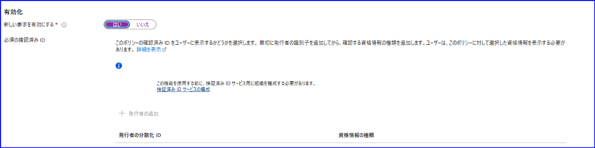
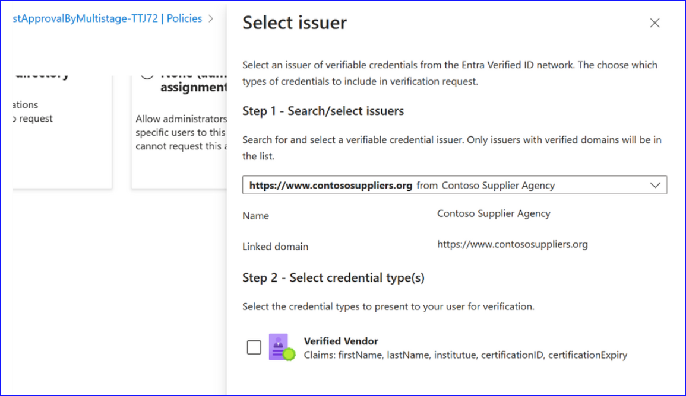
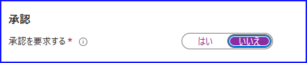
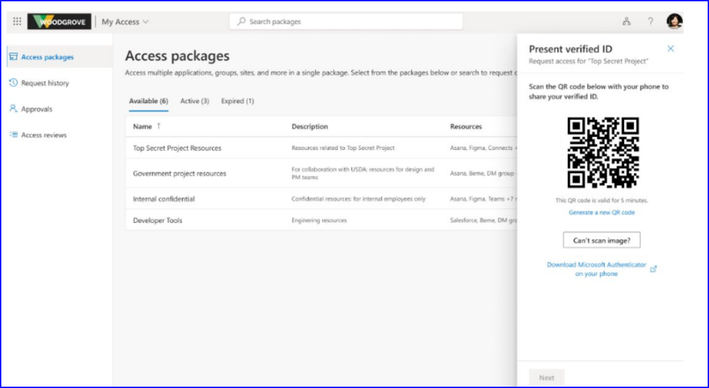
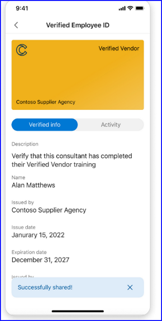
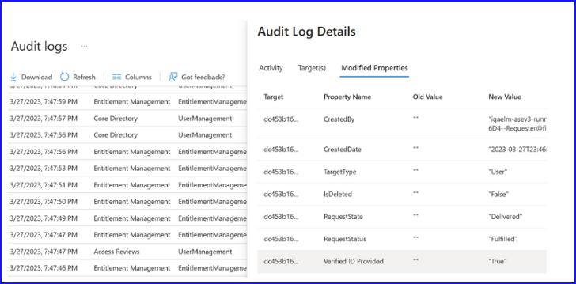

こんにちは。 Azure ID チームの小出です。

本記事は、2023 年 4 月 7 日に公開されました  [Entra Identity Governance with Entra Verified ID – Higher Fidelity Access Rights + Faster Onboarding](https://techcommunity.microsoft.com/t5/microsoft-entra-azure-ad-blog/entra-identity-governance-with-entra-verified-id-higher-fidelity/ba-p/2466934) の記事を日本語に意訳した内容になります。ご不明点などございましたらお気軽にサポートまでお問い合わせください。

---

この度、Entra Identity Governance エンタイトルメント管理と、先日ご紹介した非常に素晴らしい技術である Microsoft Entra Verified ID の統合を発表できることを嬉しく思います！
 
従業員、請負業者、パートナー、その他のビジネス ゲストを含む新しいユーザーをオンボードするために何が必要かを考えてみると、多くの場合、ID 情報や資格情報の確認が必要となります。このプロセスは面倒で時間がかかり、ユーザーは冗長なオンライン フォームに記入したり事務作業をしたりする必要があるため、最終的に採用スケジュールや立ち上げ期間に遅れが生じることになります。
 
この負担を緩和するために、弊社では以前、[新しい Azure AD エンタイトルメント管理機能でパートナー (外部ユーザー) との連携をより簡単に](https://jpazureid.github.io/blog/azure-active-directory/onboard-partners-more-easily-with-new-azure-ad-entitlement/) の記事で案内したようにカスタム質問と属性収集の機能を導入しました。エンタイトルメント管理における Microsoft Entra Verified ID のチェック機能の統合により、このオンボーディング処理がさらに簡単になりました。

この新機能の詳細を以下にご紹介しますので、アクセス要求の管理の流れにおいてどのように本機能が作用するかをご覧いただければ幸いです。 

## シナリオ: 独自に検証された資格情報を要求して機密リソースへのアクセスを承認する

新規顧客のプロジェクトで、外部のマーケティング会社と協力しているとします。あなたの組織は、コンサルタントが新しいプロジェクトに参加する前に、ベンダーとしての認定を取得する必要があります。このため、コンサルタントは、オンボーディングの手続きを開始する前に、証明書のコピーを電子メールで送信する必要があります。これでは大変不便ですし、時間もかかってしまいます。

この必要な認定ベンダーの証明書を発行する機関が、Verified ID の発行を開始したことを最近知りました。現在、あなたはプロジェクトに必要なリソースを含むアクセス パッケージ（[エンタイトルメント管理とは](https://learn.microsoft.com/ja-jp/azure/active-directory/governance/entitlement-management-overview#what-are-access-packages-and-what-resources-can-i-manage-with-them)）を利用しています。このため、コンサルタントがアクセス パッケージへのアクセスを要求する際に、すでにあるオンボーディング プロセスに Verified ID のチェックを組み込むことにしました。

その方法は次のとおりです。

## わずか 3 ステップで Verified ID を使用したアクセス パッケージへの自動アクセスを設定する！ 

1. 検証済み ID をアクセス パッケージの要件として追加します: https://entra.microsoft.com/#view/Microsoft_AAD_ERM/DashboardBlade/~/elmEntitlement  にアクセスして、保護したいアクセス パッケージを選択します。「ポリシー」セクションに行き、「+ポリシーの追加」をクリックして新しいポリシーを追加する流れです。「要求」タブで、「必須の確認済み ID」セクションを確認します。

 

	
	
[+ Add issuer] をクリックします。ドロップダウンを使用して Entra Verified ID ネットワークで Contoso Supplier Agency を検索し、Verified Vendor の資格情報の種類を選択します。
 

 

 

 

2. 手動での承認を削除する: Verified Vendor の資格情報は、信頼された発行元によるユーザー認定の証明として検証されたものであるため、承認者が手動で承認する必要はありません。これにより、オンボーディングが一層スムーズになります。

 

プロジェクトに参加するコンサルタントが My Access ポータル（https://myaccess.microsoft.com/）からアクセス パッケージへのアクセスを要求する際、Microsoft Authenticator から Verified Vendor の資格情報の提示が求められます。

 

 

必要なのは、画面に表示された QR コードをスキャンすることだけです。これにより、資格証明書を提示することができ、アクセス パッケージ ポリシーでは承認者による手動レビューが必要ないため、発行機関により資格情報が確認されたら、コンサルタントは自動的にアクセスを得ることができます。例えば、このような感じです：

 

3. 要求アクティビティについて監査ログを確認する: https://entra.microsoft.com/#view/Microsoft_AAD_ERM/DashboardBlade/~/Audit%20logs に移動し、Verified ID が提示された際に、アクセス パッケージへのアクセスが許可されていることを確認できます。

 

## お客様の声  
 
Swiss IT はマイクロソフトのパートナーであり、ユーザーが機密データにアクセスする必要がある場合に、対面での作業により ID の証明を行っている顧客を支援する業務を行っています。Swiss ITは、必要なデジタル証明書を含む Verified ID を発行しています。この統合により、Swiss IT は、ユーザーがアクセス要求を提出する際に、そのユーザーの市民権の有無を自動的に検証することができるようになります。
  
> "Entra Verified ID を Entra Identity Governance に統合することで、エンタイトルメント管理のフローにおいて ID の検証や承認を自動化することができるようになります。これにより、企業の規制や契約上の義務を遵守しながら、医薬品開発のような機密性の高いデータのコラボレーション環境を安全に保つことができるようになりました。"  - Jens Lorenz (Swiss IT 社 戦略コンサルタント、CISSP、CCSP、CIPT) 
 
同様に、一部のお客様は、強い権限を持たない生産性アプリケーションであっても、外部ユーザーのアクセスについて手動でレビュープロセスを実施しているばあ尾も多く見られます。このようなお客様は、必要な Verified ID を提供すればゲストに自動的に割り当てることができるスコープ付きのアクセスパッケージを設定することで、組織外の人々とコラボレーションを行うことも可能となります。 
  
> "多くの大企業では、複数のサービス プロバイダーと連携しており、個人としてどのような人が作業に来るのかは必ずしも把握しておらず、むしろその人がどの企業に所属しているかという雇用主の方を信頼しているはずです。そのような場合、長時間の事前オンボーディングは不可能です。Verified ID とエンタイトルメント管理を組み合わせることで、アクセス要求プロセスの中で本人確認を行い、すぐその場でアクセス要求を行うことができるようになりました。" - Erik Siebler（IAM リード、DXC）  

## Entra Identity Governance のエンタイトルメント管理でリソースへのアクセスを保護してアクセス要求のフローに Entra Verified ID を組み込みましょう！

Entra Identity Governanceのエンタイトルメント管理を始めるには、https://learn.microsoft.com/en-us/azure/active-directory/governance/entitlement-management-access-package-first をクリックし、アクセス パッケージをセットアップする方法についてステップバイステップのガイドをご覧ください。アクセス パッケージを設定したら、Verified ID を要件にしてアクセス パッケージを設定する方法について、[このガイド](https://learn.microsoft.com/en-us/azure/active-directory/governance/entitlement-management-verified-id-settings) を参照ください。

エンタイトルメント管理の要求の流れで Verified ID を利用するには、テナントを Verified ID サービスにオンボードする必要があります。Microsoft Entra Verified ID を使用するためにテナントを設定する方法については、[このチュートリアル](https://learn.microsoft.com/en-us/azure/active-directory/verifiable-credentials/verifiable-credentials-configure-tenant) を参照ください。

この機能を試すために、ぜひ今日からユーザーに Verified ID を発行し、Verified ID を要件とするアクセス パッケージを構成ください！

お客様のご意見をお聞かせいただき、ユーザー ID を一緒に進化させていきたいと思います！

Joseph Dadzie, Partner Director of Product Management  
LinkedIn: @joedadzie  
Twitter: @joe_dadzie
